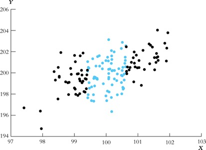

<!-- Code to enable scroll right for printing of data frames -->
<style>
pre code, pre, code {
  white-space: pre !important;
  overflow-x: auto !important;
  word-break: keep-all !important;
  word-wrap: initial !important;
}
</style>


```{r, echo=FALSE, include=FALSE}
knitr::opts_chunk$set(collapse = TRUE, comment = "#>", highlight = TRUE, warning = FALSE, message = FALSE)
  #comment = "#>" makes it so results from a code chunk start with "#>"; default is "##"
#options(scipen=999)
options(tibble.width = Inf, width = 10000) # Code necessary to enable scroll right for printing of data frames

# remove scientific notation
options(scipen=999)

# add commas to big numbers
#knitr::kable(d, digits = 3, format.args = list(big.mark = ",", scientific = FALSE))
```

# Introduction

"Bivariate regression" refers to regression models with two variables, a $Y$ variable ("dependent variable" or "outcome") and a single $X$ variable ("independent variable")

<br>

"Multivariate regression" refers to regression models with a $Y$ variable and two or more $X$ variables

<br>

This lecture -- which we will teach over several weeks -- teaches the fundamental concepts of bivariate regression. All of these concepts will be the same when we move on to multivariate regression in the subsequent lecture


## Libraries, data, functions


<details><summary><b>CLICK HERE FOR OZAN'S NOTES TO SELF ON WHICH YEAR OF IPEDS TUITION PRICE DATA TO MERGE TO WHICH YEAR OF SCORECARD DATA</b></summary>

 SCORECARD DATA
 
 - df_debt_earn_panel_labelled, field_ay=='2017-18' refers to "FieldOfStudyData1617_1718"
 - terms scorecard uses to refer to year/time period
   - Acad yr	Academic Year; differs by institution, but generally the period from September to June (e.g., AcadYr 2013-14 = 9/1/2013 - 5/31/2014)
   - AY	Award Year (e.g. AY 2013-14 = 7/1/2013-6/30/2014)
   - CY	Calendar Year (e.g. CY 2014 = 1/1/14-12/31/14)
   - DCY	IPEDS Data Collection Year (e.g., DCY2013-14 = the 2013-14 IPEDS collection)
- variables
  - ipedscount1 = Number of awards to all students in year 1 of the pooled debt cohort
    - for scorecard "FieldOfStudyData1617_1718" data, this refers to degrees granted in AY 2016-17 reported in IPEDS DCY2017-18
  - ipedscount2 = number of awards to all students in year 2 of the pooled debt cohort
    - for scorecard "FieldOfStudyData1617_1718" data, this refers to degrees granted in AY 2017-18 reported in IPEDS DCY2018-19
- assumptions about relationship between MA degree awards and when students started MA program
  - Most (full-time) MA programs take one or two academic years to complete
  - Assuming two years for MA degree completion:
    - students awarded MA degrees in AY 2016-17 (e.g., May 2017) initially enrolled in Fall 2015 of 2015-16 academic year (year 1 = 2015-16; year 2 = 2016-17)
      - first paid tuition in fall 2015
    - students awarded MA degrees in AY 2017-18 (e.g., May 2018) initially enrolled in Fall 2016 of 2016-17 academic year (year 1 = 2016-17; year 2 = 2017-18)
      - first paid tuition in fall 2016

IPEDS DATA

- if you are matching IPEDS tuition price to ipedscount1 of "FieldOfStudyData1617_1718" data
  - choose tuition price from fall 2015 of 2015-16 academic year
    - file ic2015 provides tuition price for 2015-16 academic year
    - in df_ipeds_panel data frame, this is associated with year==2015
- if you are matching IPEDS tuition price to ipedscount2  of "FieldOfStudyData1617_1718" data
  - choose tuition price from fall 2016 of 2016-17 academic year
    - file ic2016 provides tuition price for 2016-17 academic year
    - in df_ipeds_panel data frame, this is associated with year==2016

DECISION

- assume we are matching IPEDS tuition price to ipedscount2  of "FieldOfStudyData1617_1718" data
- therefore: filter(year==2016)

</details> 


```{r}
# uncomment below line to remove all objects
  #rm(list = ls())

# Libraries
  #install.packages('tidyverse') # if you haven't installed already
  #install.packages('labelled') # if you haven't installed already
  #install.packages('patchwork') # if you haven't installed already

library(tidyverse) # load tidyverse package
library(labelled) # load labelled package package
library(patchwork)

##########
########## TENNESSEE STAR DATA
##########

# load star data
load(file = url('https://github.com/anyone-can-cook/educ152/raw/main/data/star/star_panel_data.RData'))

#df_star_panel %>% glimpse()

# create data frame for STAR experiment, keeping only kindergarten
df_stark <- df_star_panel %>% 
  # keep only kindergarten year
  filter(grade ==1) %>% 
  # keep only observations with non-missing value for reading score
  filter(!is.na(read)) %>%
  # keep only observations with non-missing values for treatment assignment
  filter(!is.na(star)) %>%
  # drop observations where treatment status is regular+aide
  filter(star !=3) %>%
  # keep selected variables
  select(id,grade,star,read,gender,ethnicity,lunch,school,degree,experience) %>%
  # create a variable "treatment" that equals 1 if student receives treatment (small class) and equals 0 otherwise
  mutate(
    treatment = if_else(star==2,1,0)
  )

df_stark %>% glimpse()

rm(df_star_panel) # comment this line out if you want to keep data frame df_star_panel

##########
########## IPEDS
##########

# Load ipeds dataset from course website url
load(file = url('https://github.com/anyone-can-cook/educ152/raw/main/data/ipeds/output_data/panel_data.RData'))

# Create ipeds data frame with fewer variables/observations
df_ipeds_pop <- panel_data %>%
  # keep IPEDS tuition data from fall of which year (e.g., fall 2016 is price for programs in 2016-17 academic year)
  filter(year == 2016) %>%
  # which universities to keep:
    # 2015 carnegie classification: keep research universities (15,16,17) and master's universities (18,19,20)
  filter(c15basic %in% c(15,16,17,18,19,20)) %>%
  # which variables to keep
  select(instnm,unitid,opeid6,opeid,control,c15basic,stabbr,city,zip,locale,obereg, # basic institutional characteristics
         tuition6,fee6,tuition7,fee7, # avg tuition and fees for full-time grad, in-state and out-of-state
         isprof3,ispfee3,osprof3,ospfee3, # avg tuition and fees for MD, in-state and out-of-state
         isprof9,ispfee9,osprof9,ospfee9, # avg tuition and fees for Law, in-state and out-of-state
         chg4ay3,chg7ay3,chg8ay3) %>% # [undergraduate] books+supplies; off-campus (not with family) room and board; off-campus (not with family) other expenses
  # rename variables; syntax <new_name> = <old_name>
  rename(region = obereg, # revion
         tuit_grad_res = tuition6, fee_grad_res = fee6, tuit_grad_nres = tuition7, fee_grad_nres = fee7, # grad
         tuit_md_res = isprof3, fee_md_res = ispfee3, tuit_md_nres = osprof3, fee_md_nres = ospfee3, # md
         tuit_law_res = isprof9, fee_law_res = ispfee9, tuit_law_nres = osprof9, fee_law_nres = ospfee9, # law
         books_supplies = chg4ay3, roomboard_off = chg7ay3, oth_expense_off = chg8ay3) %>% # [undergraduate] expenses
  # create measures of tuition+fees
  mutate(
    tuitfee_grad_res = tuit_grad_res + fee_grad_res, # graduate, state resident
    tuitfee_grad_nres = tuit_grad_nres + fee_grad_nres, # graduate, non-resident
    tuitfee_md_res = tuit_md_res + fee_md_res, # MD, state resident
    tuitfee_md_nres = tuit_md_nres + fee_md_nres, # MD, non-resident
    tuitfee_law_res = tuit_law_res + fee_law_res, # Law, state resident
    tuitfee_law_nres = tuit_law_nres + fee_law_nres) %>% # Law, non-resident  
  # create measures of cost-of-attendance (COA) as the sum of tuition, fees, book, living expenses
  mutate(
    coa_grad_res = tuit_grad_res + fee_grad_res + books_supplies + roomboard_off + oth_expense_off, # graduate, state resident
    coa_grad_nres = tuit_grad_nres + fee_grad_nres + books_supplies + roomboard_off + oth_expense_off, # graduate, non-resident
    coa_md_res = tuit_md_res + fee_md_res + books_supplies + roomboard_off + oth_expense_off, # MD, state resident
    coa_md_nres = tuit_md_nres + fee_md_nres + books_supplies + roomboard_off + oth_expense_off, # MD, non-resident
    coa_law_res = tuit_law_res + fee_law_res + books_supplies + roomboard_off + oth_expense_off, # Law, state resident
    coa_law_nres = tuit_law_nres + fee_law_nres + books_supplies + roomboard_off + oth_expense_off) # %>% # Law, non-resident    
  # [COMMENTED THIS OUT] keep only observations that have non-missing values for the variable coa_grad_res
    # this does cause us to lose some interesting universities, but doing this will eliminate some needless complications with respect to learning core concepts about statistical inference
  #filter(!is.na(coa_grad_res))

# Add variable labels to the tuit+fees variables and coa variables
  # tuition + fees variables
    var_label(df_ipeds_pop[['tuitfee_grad_res']]) <- 'graduate, full-time, resident; avg tuition + required fees'
    var_label(df_ipeds_pop[['tuitfee_grad_nres']]) <- 'graduate, full-time, non-resident; avg tuition + required fees'
    var_label(df_ipeds_pop[['tuitfee_md_res']]) <- 'MD, full-time, state resident; avg tuition + required fees'
    var_label(df_ipeds_pop[['tuitfee_md_nres']]) <- 'MD, full-time, non-resident; avg tuition + required fees'
    var_label(df_ipeds_pop[['tuitfee_law_res']]) <- 'Law, full-time, state resident; avg tuition + required fees'
    var_label(df_ipeds_pop[['tuitfee_law_nres']]) <- 'Law, full-time, non-resident; avg tuition + required fees'
    
  # COA variables
    var_label(df_ipeds_pop[['coa_grad_res']]) <- 'graduate, full-time, state resident COA; == tuition + fees + (ug) books/supplies + (ug) off-campus room and board + (ug) off-campus other expenses'
    var_label(df_ipeds_pop[['coa_grad_nres']]) <- 'graduate, full-time, non-resident COA; == tuition + fees + (ug) books/supplies + (ug) off-campus room and board + (ug) off-campus other expenses'
    var_label(df_ipeds_pop[['coa_md_res']]) <- 'MD, full-time, state resident COA; == tuition + fees + (ug) books/supplies + (ug) off-campus room and board + (ug) off-campus other expenses'
    var_label(df_ipeds_pop[['coa_md_nres']]) <- 'MD, full-time, non-resident COA; == tuition + fees + (ug) books/supplies + (ug) off-campus room and board + (ug) off-campus other expenses'
    var_label(df_ipeds_pop[['coa_law_res']]) <- 'Law, full-time, state resident COA; == tuition + fees + (ug) books/supplies + (ug) off-campus room and board + (ug) off-campus other expenses'
    var_label(df_ipeds_pop[['coa_law_nres']]) <- 'Law, full-time, non-resident COA; == tuition + fees + (ug) books/supplies + (ug) off-campus room and board + (ug) off-campus other expenses'

  #df_ipeds_pop %>% glimpse()

rm(panel_data) # comment this line out if you want to keep data frame panel_data

##########
########## SCORECARD DATA ON DEBT AND EARNINGS
##########

# load scorecard dataset from course website url

load(file = url('https://github.com/anyone-can-cook/educ152/raw/main/data/college_scorecard/output_data/df_debt_earn_panel_labelled.RData'))

df_scorecard <- df_debt_earn_panel_labelled %>%
    # keep most recent year of data
    filter(field_ay == '2017-18') %>%
    # keep master's degrees
    filter(credlev == 5) %>%
    # carnegie categories to keep: 15 = Doctoral Universities: Very High Research Activity; 16 = Doctoral Universities: High Research Activity
      # note: variable ccbasic from scorecard data is 2015 carnegie classification
    filter(ccbasic %in% c(15,16,17,18,19,20)) %>%
    # drop "parent plus" loan variables and other vars we won't use in this lecture
    select(-contains('_pp'),-contains('_any'),-field_ay,-st_fips,-zip,-longitude,-latitude,-locale2,-highdeg,-accredagency,-relaffil,-hbcu,-annhi,-tribal,-aanapii,-hsi,-nanti,-main,-numbranch,-control) %>%
    # create variable for broad field of degree (e.g., education, business)
    mutate(cipdig2 = str_sub(string = cipcode, start = 1, end = 2)) %>%
    # shorten variable cipdesc to make it more suitable for printing
    mutate(cipdesc = str_sub(string = cipdesc, start = 1, end = 50)) %>%
    # re-order variables
    relocate(opeid6,unitid,instnm,ccbasic,stabbr,city,cipdig2)

  #df_scorecard %>% glimpse()

# For debt and earnings variables, convert from character to numeric variables (which replaces "PrivacySuppressed" values with NA values)
df_scorecard <- df_scorecard %>%
  mutate(
    debt_all_stgp_eval_n = as.numeric(debt_all_stgp_eval_n),
    debt_all_stgp_eval_mean = as.numeric(debt_all_stgp_eval_mean),
    debt_all_stgp_eval_mdn = as.numeric(debt_all_stgp_eval_mdn),
    debt_all_stgp_eval_mdn10yrpay = as.numeric(debt_all_stgp_eval_mdn10yrpay),
    earn_count_wne_hi_1yr = as.numeric(earn_count_wne_hi_1yr),
    earn_mdn_hi_1yr = as.numeric(earn_mdn_hi_1yr),
    earn_count_wne_hi_2yr = as.numeric(earn_count_wne_hi_2yr),
    earn_mdn_hi_2yr = as.numeric(earn_mdn_hi_2yr),
    ipedscount1 = as.numeric(ipedscount1),
    ipedscount2 = as.numeric(ipedscount2)
  ) 

# add variable label to variable cipdig2
  attr(df_scorecard[['cipdig2']], which = 'label') <- 'broad degree field code = 2-digit classification of instructional programs (CIP) degree code'

# add variable label attribute back to debt and earnings variables
  for(v in c('debt_all_stgp_eval_n','debt_all_stgp_eval_mean','debt_all_stgp_eval_mdn','debt_all_stgp_eval_mdn10yrpay','earn_count_wne_hi_1yr','earn_mdn_hi_1yr','earn_count_wne_hi_2yr','earn_mdn_hi_2yr','cipdesc','ipedscount1','ipedscount2')) {
    
    #writeLines(str_c('object v=', v))
    #writeLines(attr(df_debt_earn_panel_labelled[[v]], which = 'label'))
    
    attr(df_scorecard[[v]], which = 'label') <- attr(df_debt_earn_panel_labelled[[v]], which = 'label')
  }

#df_scorecard %>% glimpse()

rm(df_debt_earn_panel_labelled) # comment this line out if you want to keep data frame df_debt_earn_panel_labelled
#earn_mdn_hi_2yr

##########
########## LEFT JOIN SCORECARD AND IPEDS DATA
##########

# investigate data structure

  # df_scorecard; these vars uniquely identify observations
    df_scorecard %>% group_by(opeid6,cipcode) %>% summarise(n_per_key=n()) %>% ungroup() %>% count(n_per_key)

  # df_ipeds_pop: these vars uniquely identify observations
    df_ipeds_pop %>% group_by(unitid) %>% summarise(n_per_key=n()) %>% ungroup() %>% count(n_per_key)
    
# join
  # start with df_ipeds_pop, keep selected variables; then do do a right_join (i.e., keep obs in y table)
    
  df_score_ipeds <- df_ipeds_pop %>% 
    select(-instnm,-opeid6,-opeid,-c15basic,-region,-locale,-city,-stabbr,-zip) %>% mutate(one=1) %>%
    right_join(y=df_scorecard, by = 'unitid')
     #df_score_ipeds %>% glimpse()
  
  # 52 unitids from scorecard that don't have a match in ipeds
    # could be due to differences in year; decision: drop thiese
    df_score_ipeds %>% filter(is.na(one)) %>% count(unitid) # 52 unitids from scorecard data with missing IPEDS data
    df_score_ipeds %>% filter(is.na(one)) %>% count(instnm) # 52 unitids from scorecard data with missing IPEDS data
  

  df_score_ipeds <- df_score_ipeds %>% 
    # drop unitids from scorecard that don't merge to ipeds data (on tuition)
    filter(!is.na(one)) %>% 
    # drop observations that don't have mean debt data
    filter(!is.na(debt_all_stgp_eval_mean)) %>% 
    # drop for-profits
    filter(control !=3) %>%
    # drop tuition/coa vars for law and md
    select(-one,-contains('law'),-contains('md_')) %>% 
    # create measure of urbanization from locale
    mutate(
      urban = case_when(
        locale %in% c(11) ~ 1, # city
        locale %in% c(12,13) ~ 2, # city
        locale %in% c(21,22,23) ~ 3, # suburb
        locale %in% c(31,32,33,41,42,43) ~ 4 # town/rural
        )
      ) %>% 
    # create value labels for level of urbanization
    set_value_labels(
      urban = c(
        'large city (250k+)' = 1,
        'med/small city' = 2,
        'suburb' = 3,
        'town/rural' = 4
        )
      ) %>%
    # change variable order
    relocate(opeid6,unitid,instnm,control,ccbasic,stabbr,region,city,locale,urban,cipdig2,cipcode,cipdesc,credlev,creddesc,
      contains('ipeds'),starts_with('debt'),starts_with('earn'))

# create variable label 
var_label(df_score_ipeds[['urban']]) <- 'four-category variable of level of urbanization (large city, small/med city, suburb, town/rural) created from locale'
# %>% count(urban, locale) # crosscheck

      
  df_score_ipeds %>% glimpse()

rm(df_ipeds_pop) # comment this line out if you want to keep ipeds data frame
rm(df_scorecard) # comment this line out if you want to keep scorecard data frame

# Investigate analysis data frame `df_score_ipeds`  

  # data structure: variables that uniquely identify obs
    df_score_ipeds %>% group_by(opeid6,cipcode) %>% summarise(n_per_key=n()) %>% ungroup() %>% count(n_per_key)
  
  # number of observations (universities) for each 4-digit cip code (degree code)
    #df_score_ipeds %>% count(cipcode)
    df_score_ipeds %>% filter(cipcode=='4407') %>% count(cipcode) # social work
  
##### create data frame that only contains observations for MAs in social work;     
    #filter(cipcode=='4407')
    
  df_socialwork <- df_score_ipeds %>% 
    filter(cipcode=='4407') %>%
    # remove observations with missing values of cost of attendance (better for teaching concepts)
    filter(!is.na(coa_grad_res))

  df_socialwork %>% glimpse()

  # investigate data structure  
    # one observation per opeid6
    df_socialwork %>% group_by(opeid6) %>% summarise(n_per_key=n()) %>% ungroup() %>% count(n_per_key)
    
    # also, one observation per unitid
    df_socialwork %>% group_by(unitid) %>% summarise(n_per_key=n()) %>% ungroup() %>% count(n_per_key)

    
##### create data frame that only contains observations for MAs in business
  
  #particularly the degree "Business Administration, Management and Operations", which is associated with general MBA programs
    
#df_score_ipeds %>% filter(cipdig2=="52") %>% count(cipcode)
#df_score_ipeds %>% filter(cipdig2=="52") %>% count(cipdesc)

  df_mba <- df_score_ipeds %>% 
    filter(cipcode=='5202') %>%
    # remove observations with missing values of cost of attendance (better for teaching concepts)
    filter(!is.na(coa_grad_res))    

df_mba %>% glimpse()

# create version of data frame df_mba that turns class=labelled variables to factor variables
  df_mba_fac <- as_factor(df_mba, only_labelled = TRUE) %>% glimpse()

# save as RDS
  #save(df_mba_fac, file = "../../data/college_scorecard/output_data/df_debt_earn_mba.Rdata")
##########
########## RUN SCRIPT THAT CREATES USER DEFINED FUNCTIONS
##########

source(file = url('https://github.com/anyone-can-cook/educ152/raw/main/scripts/user_defined_functions/create_inference_functions.R'))
  
  
```


## Example research question

### Cost of attendance (X) and student debt (Y), MA in social work

<br>

**Data**

- We will use the data frame `df_socialwork`, which includes debt/earnings data from College Scorecard and tuition/cost of attendance data from IPEDS
- each observation $i$ represents a postsecondary institution, so this is "institution level" data (or you could say university level data)
- sample includes public and private non-profit universities that:
  - (A) offer an MA in social work
  - (B) we know institution-level (average) student debt accrued from MA programs in social work
- Population our sample is meant to represent
  - Our population of interest is all public and private non-profit universities that offer an MA in social work
  - Pretend our sample is a random sample from this population
  - (In reality, our sample is not a random sample because our sample consists of universities with social work MA programs with large enough enrollment that College Scorecard did not suppress student debt data because of privacy concerns)
    
__Variables of interest__

- $X$ (independent variable) = `coa_grad_res` = annual full-time graduate resident cost of attendance (tuition+fees+books+living expenses)
  - *note.* at private institutions, tuition price does not differ for state residents vs. nonresidents
- $Y$ (dependent variable) = `debt_all_stgp_eval_mean` = institution-level student debt from federal Direct Loans and Grad Plus loans
  - This is the average (mean) student debt from students who completed an MA program in social work at that institution
  - *note.* In the lecture, I call this variable  "institution-level student debt" rather than "average student debt" or "mean student debt" because the latter two names will be confusing when we calculate the mean of this variable and when apply concepts like sampling distribution to this variable

__Research question (RQ) of interest__

- What is the effect of (annual) cost of attendance for MA in social work programs ($X$) on institution-level student debt ($Y$) for graduates of MA programs in social work?
  - think of it as, what is the causal effect of an increase in cost of attendance on the amount of student debt typically accrued by students who graduate from MA in social work programs
  - We are answering this question using institution-level data, but if we had access to student-level data, we would answer this question using student-level data
  

<br>

Some descriptive statistics about our variables of interest and other interesting variables

- show variable labels for variables
- show mean values
```{r}
# show labels for variables
  df_socialwork %>% select(tuitfee_grad_res,tuit_grad_nres,coa_grad_res,coa_grad_nres,debt_all_stgp_eval_mean,debt_all_stgp_eval_mdn,debt_all_stgp_eval_mdn10yrpay,earn_mdn_hi_2yr) %>% var_label()

# mean values for interesting variables
  df_socialwork %>% 
    summarize(
      n = n(),
      tuitfee_grad_res = mean(tuitfee_grad_res, na.rm = TRUE),
      tuitfee_grad_nres = mean(tuitfee_grad_nres, na.rm = TRUE),
      coa_grad_res = mean(coa_grad_res, na.rm = TRUE),
      coa_grad_nres = mean(coa_grad_nres, na.rm = TRUE),
      debt = mean(debt_all_stgp_eval_mean, na.rm = TRUE),  # institution-level mean debt
      debt_mdn = mean(debt_all_stgp_eval_mdn, na.rm = TRUE), # institution-level median debt
      debt_per_mth = mean(debt_all_stgp_eval_mdn10yrpay, na.rm = TRUE),
      earn_2yr = mean(earn_mdn_hi_2yr, na.rm = TRUE),
    ) 

# mean values separately by public vs. private
  df_socialwork %>% group_by(control) %>%
    summarize(
      n = n(),
      tuitfee_grad_res = mean(tuitfee_grad_res, na.rm = TRUE),
      tuitfee_grad_nres = mean(tuitfee_grad_nres, na.rm = TRUE),
      coa_grad_res = mean(coa_grad_res, na.rm = TRUE),
      coa_grad_nres = mean(coa_grad_nres, na.rm = TRUE),
      debt = mean(debt_all_stgp_eval_mean, na.rm = TRUE),  # institution-level mean debt
      debt_mdn = mean(debt_all_stgp_eval_mdn, na.rm = TRUE), # institution-level median debt
      debt_per_mth = mean(debt_all_stgp_eval_mdn10yrpay, na.rm = TRUE),
      earn_2yr = mean(earn_mdn_hi_2yr, na.rm = TRUE),
    ) 
```

- show sample sizes
```{r}
# sample sizes for interesting variables
  df_socialwork %>% 
    summarize(
      n = n(),
      tuitfee_grad_res_n = sum(!is.na(tuitfee_grad_res)),
      tuitfee_grad_nres_n = sum(!is.na(tuitfee_grad_nres)),
      coa_grad_res_n = sum(!is.na(coa_grad_res)),
      coa_grad_nres_n = sum(!is.na(coa_grad_nres)),
      debt_n = sum(!is.na(debt_all_stgp_eval_mean)),  # institution-level mean debt
      debt_mdn_n = sum(!is.na(debt_all_stgp_eval_mean)), # institution-level median debt
      debt_mth_n = sum(!is.na(debt_all_stgp_eval_mdn10yrpay)),
      earn_2yr_n = sum(!is.na(earn_mdn_hi_2yr)),
    )  

  # separately bt public vs. private
  df_socialwork %>% group_by(control) %>%
    summarize(
      n = n(),
      tuitfee_grad_res_n = sum(!is.na(tuitfee_grad_res)),
      tuitfee_grad_nres_n = sum(!is.na(tuitfee_grad_nres)),
      coa_grad_res_n = sum(!is.na(coa_grad_res)),
      coa_grad_nres_n = sum(!is.na(coa_grad_nres)),
      debt_n = sum(!is.na(debt_all_stgp_eval_mean)),  # institution-level mean debt
      debt_mdn_n = sum(!is.na(debt_all_stgp_eval_mean)), # institution-level median debt
      debt_mth_n = sum(!is.na(debt_all_stgp_eval_mdn10yrpay)),
      earn_2yr_n = sum(!is.na(earn_mdn_hi_2yr)),
    )
```

<br> 

List of individual observations (each observation is a university)
```{r}
#df_socialwork %>% glimpse()
df_socialwork %>% select(instnm,control,coa_grad_res,debt_all_stgp_eval_mean,debt_all_stgp_eval_mdn10yrpay,earn_mdn_hi_2yr) %>% var_label()
df_socialwork %>% select(instnm,control,coa_grad_res,debt_all_stgp_eval_mean,debt_all_stgp_eval_mdn10yrpay,earn_mdn_hi_2yr)
```


# Review: scatterplot, covariance, correlation

__Relationships between two continuous variables__

Postive relationship, negative relationship, and no relationships

<br>

Relationship between X and Y is positive

- when X is "high", Y tend to be "high"
- when X is "low", Y tends to be "low"
- e.g., number of hours (X) studying and GPA (Y)
- e.g., cost of attendance (X) and student debt (Y)

<br>

Relationship between X and Y is negative

- when X is "high", Y tend to be "low"
- when X is "low", Y tends to be "high"
- e.g., number of school absences and GPA

<br>

No relationship between X and Y

- knowing the value of X gives you does not tell you much about the value of Y
- e.g., amount of ice cream consumed and GPA


  (defined as "research" or "master's" universities by the Carnegie Classification that are 
  
we will use the data frame `df_socialwork` (which combines debt/earnings data from College Scorecard and tuition/cost of attendance data from IPEDS) to run regression models of the relationship between measures of tuition/COA (X variable) and debt/earnings (Y variable) for MA programs in social work


<br>


<br>

Ways to investigate this relationship between X and Y:

- Graphically: scatterplots
- Numerically: covariance (less used), correlation


## Scatterplots

Scatterplots will plot individual observations on an X and Y axis

<br>

Draw scatterplot of X (`coa_grad_res`) and Y (`debt_all_stgp_eval_mean`)
```{r}
df_socialwork %>%  ggplot(aes(x=coa_grad_res, y=debt_all_stgp_eval_mean)) + geom_point()
```

<br>

Create scatterplot with "prediction" line
```{r}
df_socialwork %>%  ggplot(aes(x=coa_grad_res, y=debt_all_stgp_eval_mean)) + geom_point() + stat_smooth(method = 'lm')
```


- Residual
  - Difference between actual observed value of Y and predicted value of Y (given X)
  - predicted value of Y for a given value of X is represented by the "prediction line" above


## Covariance

Covariance measures the extent to which two variables move together....

- If debt is "high" when cost of attendance is "high", then covariance is positive
  - ("high" means a value that is higher than the mean value for the variable)
- If debt is "low" when cost of attendance is "high", then covariance is negative
  - (low" means a value that is lower than the mean value for the variable)

<br>

Population covariance, denoted $cov(X, Y)$ or $\sigma_{XY}$

- As with all population parameters, we don't know this!

<br>

Sample covariance, $s_{XY}$ or $\hat{\sigma}_{XY}$

- Estimator of population covariance

- $s_{XY}= \hat{\sigma}_{XY}=\frac{\sum_{i=1}^{n}\left(X_{i}-\bar{X} \right)  \left( Y_{i}-\bar{Y} \right)}{n-1}$


<br>

Example: Imagine we have 20 obs; $\bar{X}=40; \bar{Y}=30$

<br>

Observation 1: $X_1=50; Y_1=60$

- $(X_{i}-\bar{X})( Y_{i}-\bar{Y})=(50-40)(60-30)=10*30=300$
- $X_i >  \bar{X}$ and $Y_i > \bar{Y}$; so $(X_{i}-\bar{X})( Y_{i}-\bar{Y})$ is positive


Observation 2: $X_1=45; Y_1=25$

- $(X_{i}-\bar{X})( Y_{i}-\bar{Y})=(45-40)(25-30)=5*-5=-25$
- $X_i >  \bar{X}$ and $Y_i < \bar{Y}$; so $(X_{i}-\bar{X})( Y_{i}-\bar{Y})$ is positive


<br>

$\hat{\sigma}_{XY}=s_{XY}$ is the sum of these 20 calculations divided by 19 (n-1)


$\hat{\sigma}_{XY}=s_{XY}$ is positive when X and Y move in the same direction

- $X_i >  \bar{X}$ usually coupled with $Y_i > \bar{Y}$
- $X_i <  \bar{X}$ usually coupled with $Y_i < \bar{Y}$

<br>

$\hat{\sigma}_{XY}=s_{XY}$ is negative when X and Y move in the same direction

- $X_i >  \bar{X}$ usually coupled with $Y_i < \bar{Y}$
- $X_i <  \bar{X}$ usually coupled with $Y_i > \bar{Y}$


```{r}
cov(df_socialwork$coa_grad_res, df_socialwork$debt_all_stgp_eval_mean, use = 'complete.obs') # positive covariance
```


## Correlation

Problem with sample covariance, $s_{XY}$

- The value of covariance dependes on the units of measurement of the underlying variable
- We can't compare the covaraince of X and Y vs covariance of X and Z

which covariance is larger?

- covariance between cost of attendance and debt? or covariance between between cost of attendance and earnings
- not clear!
```{r}
cov(df_socialwork$coa_grad_res, df_socialwork$debt_all_stgp_eval_mean, use = 'complete.obs')
cov(df_socialwork$coa_grad_res, df_socialwork$earn_mdn_hi_2yr, use = 'complete.obs')
```

<br>

Sample Correlation of Z and Y, $r_{XY}$

- Unitless measure of relationship between X and Y
- Equals sample covariance, $s_{XY}$, divided by the product of their individual sample standard deviations

<br>

__Sample Correlation Formula__
$r_{XY}=\frac{s_{XY}}{s_X*s_Y}  = \frac{\hat{\sigma}_{XY}}{\hat{\sigma}_X \hat{\sigma}_Y}$


__Sample Correlation__

$r_{XY}=\frac{s_{XY}}{s_X*s_Y}  = \frac{\hat{\sigma}_{XY}}{\hat{\sigma}_X \hat{\sigma}_Y}$

<br>

Correlations result in measures between -1 and 1

<br>

"Type" of relationship

- $r_{XY}$ = 0 means there is no relationship between X and Y
- $r_{XY}$ > 0 means a positive correlation between X and Y
  - in other words, the variables move together
- $r_{XY}$ < 0 means a negative correlation
  - in other words, the variables move in opposite directions
  
<br>

"Strength" of relationship

- $r_{XY}$ = |0.1| to |0.3| = weak relationship
- $r_{XY}$ = |0.3| to |0.6| = moderate relationship
- $r_{XY}$ = |0.6| to |1| = strong relationship

<br>

Calculate correlations in R...

- correlation between cost of attendance and debt is stronger than correlation between cost of attendance and earnings
```{r}
cor(df_socialwork$coa_grad_res, df_socialwork$debt_all_stgp_eval_mean, use = 'complete.obs')
cor(df_socialwork$coa_grad_res, df_socialwork$earn_mdn_hi_2yr, use = 'complete.obs')
```


## Linear vs Non-Linear Relationships

Problem with covariance and correlation:

- Both measure linear relationships, defined as relationships between two variables that are captured by a straight line;
- These measures do not detect non-linear relationships, defined as relationships between two variables that are not captured by a straight line

<br>

Below, scatterplot of relationship between cost of attendance (X) and debt (Y) with a linear prediction line fitted

- this is the relationship captureD by covariance and correlation
```{r}
df_socialwork %>%  ggplot(aes(x=coa_grad_res, y=debt_all_stgp_eval_mean)) + geom_point() + stat_smooth(method = 'lm', formula = y ~ x + I(x^2), size = 1)
```
Scatterplot of relationship between cost of attendance (X) and debt (Y) with a prediction line that includes X1= cost of attendance and X2 = cost of attendance squared
```{r}
df_socialwork %>%  ggplot(aes(x=coa_grad_res, y=earn_mdn_hi_2yr)) + geom_point() + stat_smooth(method = 'lm', formula = y ~ x + I(x^2), size = 1)
```


# Population linear regression model

## Purpose of Regression

- Regression analysis is a statistical method that helps us analyze and understand the relationship between 2+ variables
- What is the purpose of regression in __descriptive research__ (sometimes called "observational studies" or "predictive" studies)?

  - To understand __relationship(s)__ between one dependent variable (Y) to one or more indepedent variable (X, Z, etc.)
  - Not concerned with "direction" or "cause": Does X cause Y? Does Y cause X? 
  - Interested in "prediction"
  - Example: predict poverty status based on having a cell phone

<br>

- What is the purpose of regression in __econometrics research__ (sometimes called "causal studies")?

  - To estimate the __causal__ effect of an independent variable (X) on a dependent variable (Y)
  - Very concerned with "direction" or "cause": Does X cause Y?  
  - Interested in recreating experimental conditions or what would have happened under a randomized control trial 
  - Example: What is the effect of class size on student learning?

<br>

- Most of my research is descriptive; but I teach this class in a "causal" way... why?
  - One type of research is not better than the other; it's just really important to understand the difference. _Ex: Lack of a cell phone doesn’t cause poverty!_
  - Causal research forces you to be very purposeful about your models!
  - Policy makers/decision makers don't just care if there is a relationship between class size and student learning; they want to know if we decrease class size by two students what is the causal effect on student achievement


__Regression: Models, Variables, Relationships__

- __Linear Regression Model vs Non-Linear Regression Models__
  - Linear regression model (general linear model)
    - the dependent variable is continuous
    - e.g., GPA, test scores, income
    - __the focus of this class!__
  - Non-linear regression models (logit, ordinal, probit, poisson, negative binomial)
    - the dependent variable is non-continuous (i.e., categorical, binary, counts)
    - e.g., persistence, likert scales, type of major

<br>
    

- __Bivariate vs Multivariate Regression__
  - Bivariate regression (sometimes also called univariate, simple regression)
    - One dependent variable (Y) and one independent variable of interest ($X_1$)
  - Multivariate regression (for econometrics/causal inference)

    - One dependent variable (Y) and one independent variable of interest ($X_1$); __and__ multiple control variables ($X_2$,$X_3$,$X_4$,etc.)
    
<br>

- __Linear Relationship vs Non-Linear Relationship between X and Y__
  - We will focus on modeling linear relationship between X and Y
  - we will cover non-linear relationships at end of quarter if we have time


## Population Linear Regression Model


__Population__ Linear Regression Model

- $Y_i = \beta_0 + \beta_1X_i + u_i$

<br>

Where:

- subscript $i$ refers to "units"; in our example, each unit $i$ is a university
- $Y_i$ = depenent variable of interest for unit $i$; institution-level student debt at university i
- $X_i$ = independent variable for unit $i$; cost of attendance at university i
- $\beta_0$ ("population intercept") = represents average value of $Y$ (institution-level student debt) at a university with X=0 (cost of attendance = 0)
- $\beta_1$ ("population regression coefficient") = average effect of a one-unit increase in X on the value of Y
- $u_1$ ("error term" or "residual") 
  - as "residual", difference between predicted value and observed value
  - as "error term", all other variables not included in your model that affect the value of Y

<br>

Draw Picture
```{r}
df_socialwork %>%  ggplot(aes(x=coa_grad_res, y=debt_all_stgp_eval_mean)) + geom_point() + stat_smooth(method = 'lm')
```


__Population__ Linear Regression Model

$Y_i = \beta_0 + \beta_1X_i + u_i$

<br>
Called the "population" linear regression model because the model uses population parameters (which we usually do not know)

In particular, above model contains two population parameters

- $\beta_0$ ("population intercept") = average value of $Y$ when  $X=0$
- $\beta_1$ ("population regression coefficient") = average effect of a one-unit increase in X on the value of Y

<br>

- How do we know these are population parameters? 
  - because they use greek letters without a "hat" symbol
- Do we usually know the value of $\beta_0$ or $\beta_1$?
  - no. we estimate these population parameters using data from a sample

### Population regression coefficient, $\beta_1$

When using regression to estimate causal relationship between $X$ and $Y$, the primary thing we are interested in estimating is $\beta_1$, which can be thought of the "slope" of the relationship between X and Y

<br>
__"Slope" Measures relationship between X and Y__
<br>

- Research Question
  - What is the effect of cost of attendance (X) on institution-level student debt (Y)

- What do we want to measure?
  - The relationship between cost of attendance (X) and institution-level student debt (Y)
  - If we increase the number of cost of attendance per week by $1,000, how much do we expect institution-level student debt to change?

- We want to measure $\beta$
  - $\beta = \frac{(Y_2 - Y_1)}{(X_2 - X_1)} = \frac{\Delta Y}{\Delta X}$
  - In other words, the slope of the relationship between X and Y 
  - Under the assumption of a linear relationship
  


<br>

What is the population regression coefficient, $\beta_1$?

- $\beta_1$ measures the average change in Y for a one-unit increase in X

- In the below graph, think of $\beta_1$ as measuring the slope of the "prediction line"

- $\beta_1 = \frac{\Delta Y}{\Delta X} = \frac{\Delta student\_debt}{\Delta cost\_of\_attendance}$

- Hypothetical Example: 
  - $\beta_1$ = $\frac{\$1,500 \Delta student\_debt}{\$1,000 \Delta cost\_of\_attendance}$ = 1.5

```{r}
df_socialwork %>%  ggplot(aes(x=coa_grad_res, y=debt_all_stgp_eval_mean)) + geom_point() + stat_smooth(method = 'lm')
```

<br>

Interpretation of $\beta_1$ (we will use this all semester!)

- General interpretation $\beta_1$:
  - On average, a one-unit increase in X is associated with a $\beta_1$ increase (or decrease) in the value of Y
  - (*note*. this works if $X$ is a continuous variable and if $X$ is dichotomous (2-category) variable like treatment vs. control)
- Interpretation from example above $\beta_1=1.5$:
  - On average, a \$1 increase in cost of attendance (X) is associated with a \$1.5 increase in institution-level student debt (Y)


Some important things to remember:

- If $\beta_1$ (i.e., the relationship between X and Y) is linear, then the average change in Y for a one-unit increase in X is the same no matter the starting value of X
  - Like plot example from earlier

- $\beta_1$ measures the **average** effect on Y for a one-unit increase in X; this effect on an individual observation may be different than this average effect! 

- $\beta_1$  is a population parameter. We hardly ever know population parameters. So we **estimate** $\beta_1$  using sample data!

### Population Intercept, $\beta_0$

Population linear regression model

  - $Y_i = \beta_0 + \beta_1X_i + u_i$

<br>

$\beta_0$ is the "population intercept"

- $\beta_0$ = the average value of Y when X=0
- Here, $\beta_0$, is the average value of institution-level student debt at a university where cost of attendance equals $0 (X=0)
- Usually, we are not substantively interested in $\beta_0$, but we need the intercept to draw a regression line
- Sometimes $\beta_0$ is non-sensical or there's too few observations at X=0 to calculate a precise estimate 
  - for our research question and data, there are no universities where grad school cost of attendance is zero, so we can't really make any predictions (based on real data) about what institution-level student debt would be if cost of attendance is zero

<br>
In the below graph, the line represents the "prediction line" and the population intercept $\beta_0$ is where the prediction line would cross the Y-intercept

- note: not to scale
```{r}
df_socialwork %>%  ggplot(aes(x=coa_grad_res, y=debt_all_stgp_eval_mean)) + geom_point() + stat_smooth(method = 'lm')
```

### Population Linear Regression Line

__Population__ Linear Regression Model

- $Y_i = \beta_0 + \beta_1X_i + u_i$

<br> 

We sometimes deconstruct the Population Linear Regression Model into two parts:

(1) __Population__ Linear Regression *LINE*: $Y_i = \beta_0 + \beta_1X_i$
    - sometimes called population linear regression function
(2) __Population__ "Error" or "Residual" Term: $u_i$

<br> 

- Population regression line: just a linear prediction line, like the one in the scatterplot *if* the scatterplot contained all observation in the population

<br> 

- Population regression line measures the "average" or "expected" relationship between X and Y, ignoring variables that we excluded from the model (i.e., $u_i$)

```{r}
df_socialwork %>%  ggplot(aes(x=coa_grad_res, y=debt_all_stgp_eval_mean)) + geom_point() + stat_smooth(method = 'lm')
```


__Population regression line and Expected Value, E(Y)__

- Expected value of Y (one variable)
  - $E(Y) = \mu_Y$
  - in words: expected value of variable $Y$ equals the population mean value of variable $Y$
  
<br>

- Expected value of Y, given the value of X (conditional expectation; relationship between two variables)
  - $E(Y|X) = \beta_0 + \beta_1X_i$
  - the population regression line is expected value of Y for a given value of X

<br>
  
- Population regression line and prediction
  - If we know value of parameters, $\beta_0$ and $\beta_1$, we can predict value of Y
  - Example: imagine $\beta_0=\$10,000$ and $\beta_1=\$1.5$
  - (1) Predict the value of Y (institution-level student debt) for university where cost of attendance is $20K
    - $E(Y|X) = \beta_0 + \beta_1X_i= 10,000 + 1.5 \times 20,000= 40,000$
  - (2) Predict the value of Y (institution-level student debt) for university where cost of attendance is $40K
    - $E(Y|X) = \beta_0 + \beta_1X_i= 10,000 + 1.5 \times 40,000= 40,000 = 70,000$
  
  
### $u_i$

__$u_i$ as "Error Term" or "unobserved variables"__

- Population linear regression model
  - $Y_i = \beta_0 + \beta_1X_i + u_i$
  - Y= institution-level student debt; $X_i$= cost of attendance

<br>

- In causal inference research:
  - Error term $u_i$ represents (consists of) *all other variables besides X that are not included in your model* that affect the dependent variable
  - In other words, the error term consists of all other factors (i.e., variables), aside from $X$= cost of attendance, responsible for the difference between the actual institution-level student debt at university $i$ and the value for university $i$ that is predicted by the regression line
  - This interpretation will become *super* important down the road!
  
<br>

- Example of Y= institution-level student debt; $X_i$= cost of attendance; the error term $u_i$ would consist of other factors besides cost of attendance that have an effect on institution-level student debt
  - cost of healthcare; whether students can rely on parents to pay for graduate school; how much grant aid students are awarded
  

<br> 

- In other social science based statistics classes (outside of the discipline of economics)
  - Interpret the $u_i$ as the overall error in the prediction of Y due to *random variation*


**Thinking about $u_i$ as "Residual"**

- Population linear regression model
  - $Y_i = \beta_0 + \beta_1X_i + u_i$
  - Y= institution-level student debt; $X_i$= cost of attendance
  
<br> 

- $u_i$ as the residual
  - Population regression line represents the predicted value $\hat{Y}$ of the outcome (institution-level student debt) for each value of X (cost of attendance)
  - Residual = the predicted value of Y (for a given value of X) minus the observed value of Y

<br>

- Easier to conceptually think about $u_i$ in terms of each observation, i

  - $Y_i$ = actual value of institution-level student debt for person i
  - $\hat{Y}_i = \beta_0 + \beta_1X_i$ = Population Regression line 
    -  The predicted value of institution-level student debt for university i with cost of attendance = $X_i$
  - Residual, $u_i$
    - The difference between actual value, $Y_i$, and predicted value from the population regression line for observation i
    - $u_i = Y_i - (\beta_0 + \beta_1X_i) = Y_i - \hat{Y}_i$
    - $u_i = Y_i - \hat{Y}_i$
    

# Regression in R 

Conceptually, the next step in learning about regression is understanding how we choose estimates of $\beta_0$ and $\beta_1$ using sample data? This step is called "estimation"

<br>

Before providing a conceptual explanation of estimation, we will teach you about running regression in *R*. Then, we'll use output from these regression models to aid our conceptual explanation of estimation

## run models using `lm()`

We use the `lm()` function to run linear regression models

<br>

`lm()` function

- Description
  - "`lm` is used to fit linear models"
- syntax (including default values)
  - `lm(formula, data, subset, weights, na.action, method = "qr", model = TRUE, x = FALSE, y = FALSE, qr = TRUE, singular.ok = TRUE, contrasts = NULL, offset, ...)`
- selected arguments
  - `formula`: "an object of class 'formula'" that provides "a symbolic description of the model to be fitted."
    - follows form `formula = y_var ~ x_var1 + x_var2+ x_var3`
    - where `y_var` is the outcome variable and `x_var`s are independent variables
  - `data`: data frame that contains variables named in `formula`
  - `subset`: "an optional vector specifying a subset of observations to be used in the fitting process."
  - `na.action`: "a function which indicates what should happen when the data contain NAs"
    - by default, an observation will be excluded from the model if itcontains missing values for any variable used in the model
- Value (object created or "returned" by the `lm()` function)
  - "lm returns an object of class 'lm'"
  - "An object of class 'lm' is a list containing at least the following components"

<br>

Run model of the relationship between cost of attendance (X) and institution-level student debt (Y)

- However, the output printed just by running the `lm()` function usually doesn't contain everything we need
```{r}
lm(formula = debt_all_stgp_eval_mean ~ coa_grad_res, data = df_socialwork)
```

<br>

When you run the `lm()` function, *R* creates an object that contains lots of information about the model we run. We can store this object by assigning it a name using `<-`

- let's store the object

```{r}
# create object
mod1 <- lm(formula = debt_all_stgp_eval_mean ~ coa_grad_res, data = df_socialwork)

# simple print of mod1 object
mod1
```

<br>

Let's investigate the contents of the `mod1` object using the `str()` function

- Below output looks rather nasty! let me highlight a few points:
- the underlying data type of `mod1` is a "list"; data frames are also list
- `mod1` is a list of 13 elements
  - each of these 13 elements has a "name", so `mod1` is a "named list"
- we can refer to elements the object `mod1` using the syntax: `object_name$element_name`
  - this is the same as when we referred to variables in a data frame using the syntax: `dataframe_name$variable_name`!
- The first element of `mod1` is named "coefficients", so we could refer to this element by typing `mod1$coefficients`:
  - `r mod1$coefficients`

```{r}
# investigate contents of mod1 object using str() function
mod1 %>% str() 
```

Let's play around with the element named `coefficients` within the object `mod1` using the syntax `object_name$element_name`
```{r}
# names of elements in object mod1
names(mod1)

# mod1$coefficients

  #print element
    mod1$coefficients
    
  #investigate structure of element
    # a (named) numeric vector
    mod1$coefficients %>% str()
    str(mod1$coefficients) # same same

  # names of element  
    mod1$coefficients %>% names()
    names(mod1$coefficients) # same same  

  # length of element
    mod1$coefficients %>% length()
    length(mod1$coefficients) # same same  

# so the mod1$coefficients is an object itself; it is a numeric vector of length=2
  
  # print the first element of mod1$coefficients
  mod1$coefficients[1]
  
  # print the second element of mod1$coefficients
  mod1$coefficients[2]
```
<br>

A key takeaway from above code chunk

- Population linear regression model
  - $Y_i = \beta_0 + \beta_1X_i + u_i$
- Our estimate of $\beta_0$ can be found by typing `mod1$coefficients[1]`
  - `r mod1$coefficients[1]`
- Our estimate of $\beta_1$ can be found by typing `mod1$coefficients[2]`
  - `r mod1$coefficients[2]`


##  `summary()` function


Use the `summary()` after use running `lm()` to produce easier-to-read summary of regression results


<br>

`summary()` function

- Description
  - "summary is a generic function used to produce result summaries of the results of various model fitting functions. The function invokes particular methods which depend on the class of the first argumen"
- syntax
  - `summary(object, ...)`
  - examples (these give the same result)
    - `summary(object = mod1)`
    - `summary(mod1)`
- Value (object created or "returned" by the `summary()` function)
  - object returned by the summary function is different depending on the kind of model you are summarizing
  

Run `summary()` function after running regression using `lm()`
```{r}
mod1 <- lm(formula = debt_all_stgp_eval_mean ~ coa_grad_res, data = df_socialwork)

# priting output from summary(mod1)
  #summary(object = mod1)
  summary(mod1)
```


<br>

Using `str()` to investigate object created by `summary()` function

- again, the Below output looks rather nasty! let me highlight a few points:
- the underlying data type of the object created by `summary(mod1)` is a "list"; 
  - data frames are also list; `mod1` is also a list
- `summary(mod1)` is a list of 12 elements
  - each of these 13 elements has a "name", so `summary(mod1)` is a "named list"
- we can refer to elements the object `summary(mod1)` using the syntax: `object_name$element_name`
  - e.g., `summary(mod1)$coefficients`
```{r}
# investigating object created by summary(mod1)
summary(mod1) %>% str()

summary(mod1)$coefficients

summary(mod1)$coefficients %>% str()
```

<br>

Grabbing individual elements from `summary(mod1)$coefficients`

- the element "coefficients" created by summary() is a "matrix"
- more specifically, it is a 2 X 4 matrix, that is a matrix with 2 rows and 4 columns
- we can grab an individual cell within the matrix using this syntax: `summary(mod1)$coefficients[<row_num>,<col_num]`
  - e.g., type `summary(mod1)$coefficients[2,1]` to print estimate of $\beta_1$
  - like this: `r summary(mod1)$coefficients[2,1]`
```{r}
# the element "coefficients" created by summary() is a "matrix"
summary(mod1)$coefficients %>% class()

# more specifically, it is a 2 X 4 matrix, that is a matrix with 2 rows and 4 columns
summary(mod1)$coefficients %>% str()

# we can grab an individual cell within the matrix using this syntax: 
  # summary(mod1)$coefficients[<row_num>,<col_num]
  summary(mod1)$coefficients[2,1] # this is the estimate for Beta_1

```


# Estimation


__General things we do in regression analysis__

1. __Estimation__ [Today]
    - How do we choose estimates of $\beta_0$ and $\beta_1$ using sample data?

<br>

2. __Prediction__ [Next Week]
    - What is the predicted value of Y for someone with a particular value of X?
  
<br>
  
3. __Hypothesis testing__ [focus of the rest of the semester]
    - Hypothesis testing and confidence intervals about $\beta_1$
  

<br>

Step 1 of regression is to estimate parameters of the population linear regression model

  - $Y_i = \beta_0 + \beta_1X_i + u_i$

<br>

__Goal of estimation: use sample data to estimate population parameters__:

  - Previous lecture: we used sample data on variable $Y$ to estimate population mean, $\mu_Y$
    - $\bar{Y}$ (sample mean of $Y$) is an estimate of $\mu_Y$
  - This lecture: use sample data to estimate the population intercept, $\beta_0$, and the population regression coefficient, $\beta_1$
    - $\hat{\beta_0}$ is an estimate of $\beta_0$
    - $\hat{\beta_1}$ is an estimate of $\beta_1$


<br>

__Review of terms__

- *point estimate (also called "estimate")*:
  - a single value that is our guess of the value of the population parameter
  - e.g., sample mean institution-level student debt $\bar{Y}=$ `r round(mean(df_socialwork$debt_all_stgp_eval_mean),digits=0)` is our best guess of population mean institution-level student debt $\mu_Y$
- *estimator*:
  - a method or formula for calculating an estimate of a population parameter based on sample data
  - e.g., $\bar{Y} = \frac{\sum_{i=1}^{n} Y_i}{n}$ is estimator (formula) for calculating an estimate of population mean, $\mu_Y$
- *estimation*:
  - the process of using an estimator to calculate point estimates of population parameters, based on sample data

<br>

__Estimation problem__:

- we write out the population linear regression model, $Y_i = \beta_0 + \beta_1X_i + u_i$
- Need to develop a method for choosing values of $\hat{\beta_0}$ and $\hat{\beta_1}$ 
  - that is we need to develop an estimator that yields the "best" point estimates of $\hat{\beta_0}$ and $\hat{\beta_1}$

## Estimation (population mean)

We faced a similar estimation problem when we were trying to estimate population mean, $\mu_Y$!

- Using sample data, we want to calculate the "best" estimate of the population mean, $\mu_Y$
- We decided sample mean, $\bar{Y}= \frac{\sum_{i=1}^{n} Y_i}{n}$, was the "best" estimate

<br>

__How did statisticians decide that $\bar{Y}= \frac{\sum_{i=1}^{n} Y_i}{n}$ was "best" estimate of $\mu_Y$? What criteria to make this decision?:__

imagine that $m$ is all potential estimates for $\mu_Y$

- e.g., $\bar{Y}$ is one potential estimate of $\mu_Y$; the sample median is another potential estimate
  
Criteria statisticians used to decide which $m$ is the "best" estimate of $\mu_Y$:

- choose the value, $m$ , that minimizes the "sum of squares"
- Sum of squares = $\sum_{i=1}^{n}(Y_i-m)^2$
- Sum of squares in words
  - for each observation: measures how far away an individual observation $Y_i$ is from estimate $m$; and then square this distance (to remove negative values)
  - then sum this squared distance across all observations, $Y_i$
- Conceptually, in choosing "minimize sum of squares" as our criteria for selecting the best estimate of $\mu_Y$, we are "how far off" in total (across all observations) if we can only use a single value to be our guess of the value of each individual observation

<br>

Below, we graph scatterplot of cost of attendance (X) and institution-level student debt (Y axis), and add a horizontal line for the mean value of institution-level student debt, $\bar{Y}=$ `r round(mean(df_socialwork$debt_all_stgp_eval_mean, na.rm = TRUE), digits=0)`

- let's say that $\bar{Y}=$ `r round(mean(df_socialwork$debt_all_stgp_eval_mean, na.rm = TRUE), digits=0)` is our "predicted value" for each observation in the scatterplot
- For each observation $i$, the "residual" $u_i = Y_i - \bar{Y}$ represents how far off our predicted value is from the actual value for that observation
- $\bar{Y}= \frac{\sum_{i=1}^{n} Y_i}{n}$ is the choice for $m$ that minimizes the sum of squared errors, $\sum_{i=1}^{n}(Y_i-m)^2$
- in other words, $\bar{Y}$ is the value that minimizes how far off our prediction is in total (across all observations)
```{r}
#df_socialwork %>%  ggplot(aes(x=coa_grad_res, y=debt_all_stgp_eval_mean)) + geom_point() + stat_smooth(method = 'lm')
df_socialwork %>%  ggplot(aes(x=coa_grad_res, y=debt_all_stgp_eval_mean)) + geom_point() + 
  geom_hline(yintercept=mean(df_socialwork$debt_all_stgp_eval_mean, na.rm = TRUE), linetype="dashed", color = "red")
```

## Estimation (regression)


Population linear regression model

  - $Y_i = \beta_0 + \beta_1X_i + u_i$
  
  
The estimation problem in regression

- Need to develop method for selecting the "best" estimate of $\hat{\beta_0}$ and $\hat{\beta_1}$
- Solution: do the same thing we did for population mean! Choose the estimates $\hat{\beta_0}$ and $\hat{\beta_1}$ that minimize the sum of squares


<br>

```{r, eval = FALSE, include = FALSE}
df_socialwork %>% select(unitid,instnm,coa_grad_res,debt_all_stgp_eval_mean)
```

First some terminology:

- $Y_i$ is the actual observed value of $Y$ for observation $i$
- $\hat{\beta_0}$ is an estimate of $\beta_0$, population average value of $Y$ when $X=0$
- $\hat{\beta_1}$ is an estimate of $\beta_1$, the average change in the value of $Y$ associated with a one-unit increase in $X$
- $\hat{Y_i}$ is the predicted value of $Y_i$, based on sample data!
  - $\hat{Y_i} = \hat{\beta_0} + \hat{\beta_1}X_i$
  - Example: $\hat{\beta_0}=10,000$ and $\hat{\beta_1}=.75$, then for a university with cost of attendance = $30,000$
    - $\hat{Y_i} = \hat{\beta_0} + \hat{\beta_1}X_i = 10,000 + .75 \times30,000=32,500$
- Estimated residual, $\hat{u}_i$ is the difference between actual $Y_i$ and predicted $\hat{Y_i}$
  - $Y_i - \hat{Y_i}$ = $\hat{u_i}$
  - $Y_i - (\hat{\beta_0} + \hat{\beta_1}X_i)$ = $\hat{u_i}$
  - Residuals are often called "errors"
  

Criteria for choosing "best" estimate of $\hat{\beta_0}$ and $\hat{\beta_1}$

- Select values that minimize "sum of squared residuals"
- that is, the "best" estimates of  $\hat{\beta_0}$ and $\hat{\beta_1}$ are those that any other alternatives would result in a higher sum of squared residuals

<br>

Sum of squared residuals (or sometimes called "sum of squared errors"):

- $\sum_{i=1}^{n}$ $(Y_i - \hat{Y_i})^2$

- $\sum_{i=1}^{n}$ $(Y_i - (\hat{\beta_0} + \hat{\beta_1}X_i))^2$

- $\sum_{i=1}^{n}$ $(u_i)^2$


<br>

Conceptual explanation for use "sum of squared residuals" as the criteria for choosing values for $\hat{\beta_0}$ and $\hat{\beta_1}$

- Having a y-intercept ($\hat{\beta_0}$) and a slope ($\hat{\beta_1}$) allows us to draw a straight line, our "prediction line"
- by choosing the values of $\hat{\beta_0}$ and $\hat{\beta_1}$ that minimize the sum of squared residuals, we are creating a linear prediction line that minimizes how far away (in total, across all observations) the predicted values are from the actual values 

Scatterplot of cost of attendance (X) and institution-level student debt (Y)

- red dotted horizontal line for mean of institution-level student debt
- blue line is the OLS prediction line, associated with values of $\hat{\beta_0}$ and $\hat{\beta_1}$ calculated by *R*
- visually you can see that sum of squared errors would be much larger if we used the mean of institution-level student debt (red line) as the predicted value for every observation
```{r}
df_socialwork %>%  ggplot(aes(x=coa_grad_res, y=debt_all_stgp_eval_mean)) + geom_point() + 
  stat_smooth(method = 'lm') +
  geom_hline(yintercept=mean(df_socialwork$debt_all_stgp_eval_mean, na.rm = TRUE), linetype="dashed", color = "red")
```  


__Ordinary Least Squares (OLS) Estimator__ is a linear method for estimating parameters in a linear regression model based on the sum of squared errors criterion

- Method draws a line through the sample data points that minimizes the sum of squared residuals, or in other words, the differences between the observed values and the corresponding fitted values
- Minimization is achieved via calculus (derivatives). R will calculate this for you (phew!)
- $\hat{\beta_0}$ and $\hat{\beta_1}$, respectively, are the symbols for the OLS estimates of population parameters $\beta_0$ and $\beta_1$

<br>

### OLS Prediction Line

RQ: What is the effect of cost of attendance (X) on institution-level student debt (Y)? 

__Population Linear Regression Model__

 - $Y_i = \beta_0 + \beta_1X_i + u_i$
 
<br>

__OLS Prediction Line or "OLS Regression Line" (based on sample data)__

 - $\hat{Y_i} = \hat{\beta_0} + \hat{\beta_1}X_i$ 
 
<br>

Let's run regression in R using `lm()` to calculate values for point estimates $\hat{\beta_0}$ and $\hat{\beta_1}$

- $\hat{\beta_0}=$ `r round(summary(mod1)$coefficients[1,1], digits =2)`
- $\hat{\beta_1}=$ `r round(summary(mod1)$coefficients[2,1], digits =2)`
```{r}
mod1 <- lm(formula = debt_all_stgp_eval_mean ~ coa_grad_res, data = df_socialwork)

summary(mod1)

summary(mod1)$coefficients %>% class()

# more specifically, it is a 2 X 4 matrix, that is a matrix with 2 rows and 4 columns
summary(mod1)$coefficients %>% str()

# we can grab an individual cell within the matrix using this syntax: 
  # summary(mod1)$coefficients[<row_num>,<col_num]
  summary(mod1)$coefficients[1,1] # row 1, column 1; this is the estimate for Beta_0
  summary(mod1)$coefficients[2,1] # row 2, column 1; this is the estimate for Beta_1
```
<br>

## Writing out models

<br>

When we run a regression model, write out regression models like this (we will be doing this the rest of the quarter):


- Write out the population linear regression model
  - Label symbols; label what the variables $X$ and $Y$ actually represent
- OLS prediction line 
  - write out OLS prediction line without estimate values
  - write out OLS prediction line with estimate values
- And usually a good idea to:
  - write out interpretation of$\hat{\beta_0}$ in words
  - write out interpretation of$\hat{\beta_1}$ in words
 
<br>

- __Population Linear Regression Model__
  - $Y_i = \beta_0 + \beta_1X_i + u_i$
  - where:
    - subscript $i$ refers to universities
    - $Y_i$: institution-level student debt (in dollars) at university $i$
    - $X_i$: annual cost of attendance (in dollars) for full-time resident graduate students at university $i$
    - $\beta_0$: population intercept, average value of $Y$ when $X=0$    
    - $\beta_1$: population regression coefficient, the average change in the value of $Y$ associated with a one-unit increase in $X$
  - __OLS Prediction Line or "OLS Regression Line" (based on sample data)__
   - $\hat{Y_i} = \hat{\beta_0} + \hat{\beta_1}X_i$   
   - $\hat{Y_i} =$  `r round(summary(mod1)$coefficients[1,1], digits =2)` + `r round(summary(mod1)$coefficients[2,1], digits =2)` $\times X_i$

<br>

Once you write it out like this, easy to answer questions about your regression model

- Predict the the expected value institution-level student debt at a university where annual cost of attendance is \$20,000? That is, what is $E(\hat{Y_i}|X=20,000)$?

  - $E(\hat{Y_i}|X=20,000) = \hat{Y_i} = \hat{\beta_0} + \hat{\beta_1}X_i=$ `r round(summary(mod1)$coefficients[1,1], digits =2)` + `r round(summary(mod1)$coefficients[2,1], digits =2)` $\times 20,000$ = `r round(summary(mod1)$coefficients[1,1] + summary(mod1)$coefficients[2,1]*20000, digits=0)`
- Predict the the expected value value of institution-level student debt at a university where annual cost of attendance is \$50,000? That is, what is $E(\hat{Y_i}|X=50,000)$?
  - $E(\hat{Y_i}|X=50,000) = \hat{Y_i} = \hat{\beta_0} + \hat{\beta_1}X_i=$ `r round(summary(mod1)$coefficients[1,1], digits =2)` + `r round(summary(mod1)$coefficients[2,1], digits =2)` $\times 50,000$ = `r round(summary(mod1)$coefficients[1,1] + summary(mod1)$coefficients[2,1]*50000, digits=0)`
  
<br>

Interpreting $\hat{\beta_0}$ and $\hat{\beta_1}$ in words

- $\hat{\beta_0}=$ `r round(summary(mod1)$coefficients[1,1], digits =2)` is the OLS estimate of the population intercept $\beta_0$, which represents average value of $Y$ (institution-level student debt) at a university with X=0 (cost of attendance = 0)
  - interpretation of $\hat{\beta_0}=$ `r round(summary(mod1)$coefficients[1,1], digits =2)`: the predicted institution-level student debt at a university with annual cost of attendance equals `0` is `r round(summary(mod1)$coefficients[1,1], digits =2)`
- $\hat{\beta_1}=$ `r round(summary(mod1)$coefficients[2,1], digits =2)` is the OLS estimate of the population intercept $\beta_1$, which represents average effect of a one-unit increase in $X$ on the value of $Y$
  - General formula for interpretation of $\hat{\beta_1}$:
    - "On average, a one-unit increase in $X$ is associated with a $\hat{\beta_1}$ increase (or decrease) in the value of $Y$
    - when applying this formula replace "one unit increase in $X$" with "one dollar increase in annual cost of attendance"; do the same sort of thing for $Y$
  - interpretation of $\hat{\beta_1}=$ `r round(summary(mod1)$coefficients[2,1], digits =2)`: a one-dollar increase in annual cost of attendance is associated with a `r round(summary(mod1)$coefficients[2,1], digits =2)` dollar increase in institution-level student debt

<!-- 

## Exercise [NEED TO MODIFY; RAN OUT OF TIME!!!]

RQ: What is the effect of age on XXXX?? 
 MAYBE MODIFY THIS SO NOW THE DEPENDENT VARIABLE IS EARNINGS TWO YEARS AFTER GRADUATION INSTEAD OF DEBT

```{r}
mod2 <- lm(formula = earn_mdn_hi_2yr ~ coa_grad_res, data = df_socialwork)

summary(mod2)
```


<br>

Write out and label everything within the following

- Recommendation: Practice how to write out equations in Word; touch-screen devices share your screen via whiteboard


1. Population regression model
    - Label Y; Label X

2. OLS Prediction Line (without estimates)
    - Define $\hat{\beta_0}$?
    - Define $\hat{\beta_1}$?

3. OLS Prediction Line (with estimates)
    - Run regression in R and print to get estimates: 
      - `mod2 <-  lm(realrinc ~ age, data=gss)`
      - `summary(mod2)`
    - Interpret $\hat{\beta_0}$ given the estimate 
    - Interpret $\hat{\beta_1}$ given the estimate 

4. Predict the expected value of $\hat{Y}_i$ for someone that is 18 years old.


__In-Class Group Exercise [Solutions]__

RQ: What is the effect of age on annual income??  [CHANGE THIS]


1. Population regression model
    - $Y_i = \beta_0 + \beta_1X_i + u_i$
    - Y = annual income; X = age

2. OLS Prediction Line (without estimates)
    - $\hat{Y_i} = \hat{\beta_0} + \hat{\beta_1}X_i$
    - $\hat{\beta_0}$? = Sample population intercept
      - i.e., the average value of Y when X=0
    - $\hat{\beta_1}$ = Sample regression coefficient 
      - i.e., the average change in Y for one-unit increase in X

3. OLS Prediction Line (with estimates)
    - $\hat{Y_i} = \$8,620 + \$368X_i$
    - $\hat{\beta_0}$ = \$8,620
      - On average, someone who is age zero has an annual income of \$8,620 
      - Example of non-sensical $\hat{\beta_0}$
    - $\hat{\beta_1}$? = \$368
      - On average, a one-year increase in age is associated with a \$368 increase in annual income

4. Predict the expected value of $\hat{Y}_i$ for someone that is 18 years old.
    - $E(\hat{Y_i}|X=35)$ = $\hat{Y_i} = \$8,620 + \$368*18$
    - $E(\hat{Y_i}|X=35)$ = $\hat{Y_i} = \$8,620 + \$6,624$
    - $E(\hat{Y_i}|X=35)$ = \$15,244


your comment -->

# Model Fit


## $R^2$


Introducing, $R^2$, "the coefficient of determination"

<br>

Reminder of where we left off:

- Research question
  - What is the relationship between cost of attendance ($X$) on institution-level student debt ($Y$)?
- Population Linear Regression Model
  - $Y_i = \beta_0 + \beta_1X_i + u_i$
  - where:
    - subscript $i$ refers to universities
    - $Y_i$: institution-level student debt (in dollars) at university $i$
    - $X_i$: annual cost of attendance (in dollars) for full-time resident graduate students at university $i$
    - $\beta_0$: population intercept, average value of $Y$ when $X=0$    
    - $\beta_1$: population regression coefficient, the average change in the value of $Y$ associated with a one-unit increase in $X$    
- OLS Prediction Line (based on sample data) $\hat{Y_i}$ is predicted value $Y_i$ for a given value of $X$
   - $\hat{Y_i} = \hat{\beta_0} + \hat{\beta_1}X_i$
   - $\hat{Y_i} =$  `r round(summary(mod1)$coefficients[1,1], digits =2)` + `r round(summary(mod1)$coefficients[2,1], digits =2)` $\times X_i$

<br>

In the summary of the regression output below, notice the following:

- "Multiple R-squared:" `r round(summary(mod1)$r.squared,digits =4)`
```{r}
mod1 <- lm(formula = debt_all_stgp_eval_mean ~ coa_grad_res, data = df_socialwork)

summary(mod1)

#summary(mod1) %>% str() # show structure of object created by summary(mod1)

# print r-squared using syntax object_name$element_name
summary(mod1)$r.squared
```
<br>

__What does $R^2$ measure?__

- $R^2$, "the coefficient of determination", measures the fraction of the variance in Y that is explained by X (and is not already explained by sample mean, $\bar{Y}$)
  - In other words, how much better is the regression model in predicting values of Y than $\bar{Y}$

<br>

Looking at the below scatterplot of cost of attendance ($X$) and institution-level debt($Y$); with mean value of debt as horizontal dotted line and OLS prediction line as solid blue line

- $R^2$, "the coefficient of determination", measures how much closer the predicted values of $\hat{Y_i}$ are to actual values $Y_i$ when we use OLS prediction line to predict $Y_i$ (i.e., $\hat{Y_i}=\hat{\beta_0} + \hat{\beta_1}X_i$), rather than using sample mean $\bar{Y}$ to predict $Y_i$ (i.e., $\hat{Y_i}=\bar{Y}$)
```{r}
df_socialwork %>%  ggplot(aes(x=coa_grad_res, y=debt_all_stgp_eval_mean)) + geom_point() + 
  stat_smooth(method = 'lm') +
  geom_hline(yintercept=mean(df_socialwork$debt_all_stgp_eval_mean, na.rm = TRUE), linetype="dashed", color = "red")
```  

<br>

__Interpreting $R^2$__

- $R^2$ ranges from 0 to 1
  - $R^2=0$: "the model does not explain any variation in Y" (that is not already explained by sample mean, $\bar{Y}$)
  - $R^2=1$: "the model explains 100% of the variation in Y" (that is not already explained by sample mean, $\bar{Y}$)
  - $R^2=0.135$: "the model explains 13.5% of the variation in Y" (that is not already explained by sample mean, $\bar{Y}$)
  
<br>
<br>

__Formula for $R^2$__

$R^2 = \frac{\text{variance in Y that is explained by X}}{\text{total variance in Y}} = \frac{\text{Explained Sum of Squares}}{\text{Total Sum of Squares}} =  \frac{ESS}{TSS}$

<br>

OR
<br>


$R^2 = 1- \frac{\text{variance in Y that not explained explained by X}}{\text{total variance in Y}} = 1-  \frac{\text{Sum of Squared Residuals}}{\text{Total Sum of Squares}} = 1-  \frac{SSR}{TSS}$


### Components of $R^2$


__Components of $R^2$__

- $\hat{Y_i} = \hat{\beta_0} + \hat{\beta_1}X_i$
  - predicted value of $Y_i$ for a given value of $X$

- $\hat{u_i} = Y_i - \hat{Y_i}$
  - residual or "error" for observation $i$; equals observed value $Y_i$ minus predicted value $\hat{Y_i}$

<br>

- Total Sum of Squares (TSS) = $\sum_{i=1}^{n} (Y_i-\bar{Y})^2$
  - A measure of the total variance in Y, relative to $\bar{Y}$
  
- Explained Sum of Squares (ESS) = $\sum_{i=1}^{n} (\hat{Y_i}-\bar{Y})^2$
  - Difference between predicted values $\hat{Y_i}$ and sample mean $\bar{Y}$
  - Measures amount of variation in Y explained by X
  
- Sum of Squared Residuals (SSR) = $\sum_{i=1}^{n} (Y_i- \hat{Y_i})^2$
  - Difference between actual value observed and predicted value by our regression line
  - Measures amount of variation in Y not explained by X
  
<br>

$TSS = ESS + SSR$

- Total variation in Y (TSS) equals variation explained by the model (ESS) plus variation not explained by model (SSR)
- Use visual plot explain TSS, ESS, SSR


```{r}
df_socialwork %>%  ggplot(aes(x=coa_grad_res, y=debt_all_stgp_eval_mean)) + geom_point() + 
  stat_smooth(method = 'lm') +
  geom_hline(yintercept=mean(df_socialwork$debt_all_stgp_eval_mean, na.rm = TRUE), linetype="dashed", color = "red")
```  

<br>


### Calculating $R^2$

<br>

#### Calculating $R^2$ by hand

__Calculating $\bar{Y}$, $\hat{Y}_i$, and $\hat{u}_i$__

- Predicted value for each $i$: 
  - $\hat{Y_i} = \hat{\beta_0} + \hat{\beta_1}X_i=$  `r round(summary(mod1)$coefficients[1,1], digits =2)` + `r round(summary(mod1)$coefficients[2,1], digits =2)` $\times X_i$
- Residual (or "error") for each $i$: 
  - $\hat{u_i} = Y_i - \hat{Y}_i =  Y_i - (\hat{\beta_0} + \hat{\beta_1}X_i) = Y_i -$  (`r round(summary(mod1)$coefficients[1,1], digits =2)` + `r round(summary(mod1)$coefficients[2,1], digits =2)` $\times X_i$)

```{r}
#summary(mod1) %>% str()

# mean value of y for each i
ybar <- mean(df_socialwork$debt_all_stgp_eval_mean, na.rm = TRUE)
ybar

# predicted values for each y_i
yhat_i <- summary(mod1)$coefficients[1,1] + summary(mod1)$coefficients[2,1]*df_socialwork$coa_grad_res

# residual for each Y_i
u_i <- df_socialwork$debt_all_stgp_eval_mean - yhat_i
```

<br>

__Calculating TSS, ESS, and SSR__

- Total Sum of Squares (TSS) = $\sum_{i=1}^{n} (Y_i-\bar{Y})^2$
  - A measure of the total variance in Y, relative to $\bar{Y}$
  - total sum of squares = `r format(round(sum((df_socialwork$debt_all_stgp_eval_mean - ybar)^2, na.rm = TRUE), digits=0),big.mark = ',')`
- Explained Sum of Squares (ESS) = $\sum_{i=1}^{n} (\hat{Y_i}-\bar{Y})^2$
  - Difference between predicted values $\hat{Y_i}$ and sample mean $\bar{Y}$
  - Measures amount of variation in Y explained by X
  - explained sum of squares = `r format(round(sum((yhat_i - ybar)^2, na.rm = TRUE), digits=0),big.mark = ',')`
- Sum of Squared Residuals (SSR) = $\sum_{i=1}^{n} (Y_i- \hat{Y_i})^2$
  - Difference between actual value observed and predicted value by our regression line
  - Measures amount of variation in Y not explained by X
  - sum of squared residuals = `r format(round(sum((df_socialwork$debt_all_stgp_eval_mean - yhat_i)^2, na.rm = TRUE), digits=0),big.mark = ',')`
  - or calculate SSR as $\sum_{i=1}^{n} (\hat{u_i})^2=$ `r format(round(sum((u_i)^2, na.rm = TRUE), digits=0),big.mark = ',')`
  
```{r}
# total sum of squares (TSS)
tss <- sum((df_socialwork$debt_all_stgp_eval_mean - ybar)^2, na.rm = TRUE)
tss

# Explained sum of squares (ESS)
ess <- sum((yhat_i - ybar)^2, na.rm = TRUE)
ess

# Sum of squared residuals (SSR)
ssr <- sum((df_socialwork$debt_all_stgp_eval_mean - yhat_i)^2, na.rm = TRUE)
ssr

  # or calculate this way, based on u_i
  sum(u_i^2)
```
<br>

__Calculating $R^2$__

$R^2$ as ESS/TSS

- $R^2 = \frac{\text{variance in Y that is explained by X}}{\text{total variance in Y}} =  \frac{ESS}{TSS}=$ (`r format(round(sum((yhat_i - ybar)^2, na.rm = TRUE), digits=0),big.mark = ',')`)/(`r format(round(sum((df_socialwork$debt_all_stgp_eval_mean - ybar)^2, na.rm = TRUE), digits=0),big.mark = ',')`) = `r format(round(sum((yhat_i - ybar)^2, na.rm = TRUE)/sum((df_socialwork$debt_all_stgp_eval_mean - ybar)^2, na.rm = TRUE), digits=4),big.mark = ',')`


```{r}
# calculating R^2 as ESS/TSS
  #sum((yhat_i - ybar)^2, na.rm = TRUE)/sum((df_socialwork$debt_all_stgp_eval_mean - ybar)^2, na.rm = TRUE)
  ess/tss

```

<br>

OR

<br>

$R^2$ as 1 - SSR/TSS

- $R^2 = 1- \frac{\text{variance in Y that not explained explained by X}}{\text{total variance in Y}} =  1-  \frac{SSR}{TSS}=1-$ (`r format(round(sum((u_i)^2, na.rm = TRUE), digits=0),big.mark = ',')`)/(`r format(round(sum((df_socialwork$debt_all_stgp_eval_mean - ybar)^2, na.rm = TRUE), digits=0),big.mark = ',')`) = `r format(round(1 - sum((df_socialwork$debt_all_stgp_eval_mean - yhat_i)^2, na.rm = TRUE)/sum((df_socialwork$debt_all_stgp_eval_mean - ybar)^2, na.rm = TRUE), digits=4),big.mark = ',')`


```{r}
# calculating R^2 as (1- SSR/TSS)
  #1 - sum((df_socialwork$debt_all_stgp_eval_mean - yhat_i)^2, na.rm = TRUE)/sum((df_socialwork$debt_all_stgp_eval_mean - ybar)^2, na.rm = TRUE)
  1 - ssr/tss

```
<br>
<br>

#### Calculating $R^2$ in *R*

<br>

$R^2 = \frac{\text{variance in Y that is explained by X}}{\text{total variance in Y}} =  \frac{ESS}{TSS}=$


- Note that in R:

  - `summary()` will only give you the $R^2$
  - `anova()` will give you ESS and SSR (but not TSS)

<br>
<br>

Using `summary()` to calculate $R^2$

- "Multiple R-squared:" `r round(summary(mod1)$r.squared,digits =4)`
```{r}
summary(mod1)
```
<br>
<br>

Using `anova()` to calculate $R^2$

- Estimated sum of squares (ESS) = `r format(round(anova(mod1)$"Sum Sq"[1], digits=4),big.mark = ',')`
- Sum of Squared Residuals (SSR) = `r format(round(anova(mod1)$"Sum Sq"[2], digits=4),big.mark = ',')`
- Total Sum of Squares (TSS) = ESS + SSR = `r format(round(anova(mod1)$"Sum Sq"[1] +anova(mod1)$"Sum Sq"[2], digits=4),big.mark = ',')`
- $R^2 = \frac{ESS}{TSS}=$ (`r format(round(anova(mod1)$"Sum Sq"[1], digits=4),big.mark = ',')`)/(`r format(round(anova(mod1)$"Sum Sq"[1] +anova(mod1)$"Sum Sq"[2], digits=4),big.mark = ',')`) = `r format(round(anova(mod1)$"Sum Sq"[1]/(anova(mod1)$"Sum Sq"[1] + anova(mod1)$"Sum Sq"[2]), digits=4),big.mark = ',')`

```{r}
anova(mod1)

anova(mod1) %>% str()

# this 2-element vector contains ESS and SSR
anova(mod1)$"Sum Sq"

# ESS
anova(mod1)$"Sum Sq"[1]

# SSR
anova(mod1)$"Sum Sq"[2]

# TSS
anova(mod1)$"Sum Sq"[1] + anova(mod1)$"Sum Sq"[2]

# R squared
anova(mod1)$"Sum Sq"[1]/(anova(mod1)$"Sum Sq"[1] + anova(mod1)$"Sum Sq"[2])
```

### Student exercise about $R^2$ 

__Student Exercise #1__  

RQ1: What is the relationship between cost of attendance (X) and earnings (Y) (2 year after graduation)?


- X= `coa_grad_res`
- Y= `earn_mdn_hi_2yr`


1. Run the regression in R (assign to object `mod2`)
2. Using `summary(mod2)`: 
      - What is $R^2$? Interpret $R^2$.
3. Using `anova(mod2)`:
      - Show that $R^2$ = ESS/TSS

<br>


      
<details><summary><b>Student Exercise #1 [SOLUTIONS]</b></summary>

<br>


RQ1: What is the relationship between cost of attendance (X) and earnings (Y) (2 year after graduation)?

1. Run regression in R (assign to object `mod2`)
2. Using `summary(mod2)`: 
      - What is $R^2$? _Measures the fraction of the variance in Y that is explained by X (and is not already explained by sample mean)_
      - $R^2$ = 0.01851; _Cost of attendance at a university explains 1.8% of the variation in earnings two years after graduation_ 
3. Using `anova(mod2)`:
      - ESS= 166755675
      - SSR = 8840224276
      - TSS = 166755675 + 8840224276 = 9006979951
      - $R^2$ = 166755675/9006979951 = 0.01851405

```{r}
mod2 <- lm(formula = earn_mdn_hi_2yr ~ coa_grad_res, data = df_socialwork)

summary(mod2)

anova(mod2)

anova(mod2)$"Sum Sq"[1] / (anova(mod2)$"Sum Sq"[1] + anova(mod2)$"Sum Sq"[2])
```

<br>

</details> 

## Standard Error of the Regression (SER)

__Sample standard Error of the Regression (SER)__, denoted SER or $\hat{\sigma}_{\hat{u}}$ or $s_{\hat{u}}$

- SER an estimate of the standard deviation of the residuals $\hat{u_i}$
- Definition
  - Sample standard error of the regression (SER) is an estimate of how far away, on average, an actual observed value of $Y_i$ is from the predicted value $\hat{Y}_i$ of $Y_i$ for a random observation, $i$


<br>
<br>

__Comparison of sample standard deviation $\hat{\sigma}_{Y}$ and SER__

- Sample standard deviation of $Y$, denoted $\hat{\sigma}_{Y}$ or $s_{Y}$
  - Average distance between a random observation $Y_i$ an the sample mean $\bar{Y}$
  - $\hat{\sigma_{Y}} = s_{Y} =  \sqrt{ \frac {\sum_{i=1}^{n} ({Y_{i} -\overline{Y})^2}} {n-1} }$
  
<br>

- Standard error of the regression, denoted SER or $\hat{\sigma}_{\hat{u}}$ or $s_{\hat{u}}$
  - Average distance between a random observation $Y_i$ and the value predicted by the OLS regression, $\hat{Y_i}$
  - where, $\hat{Y_i} = \hat{\beta_0} + \hat{\beta_1}X_i$
  
<br>

__Formula for SER__

- $SER = \sqrt{\frac{SSR}{n-2}}= \sqrt{ \frac {\sum_{i=1}^{n} ({Y_{i} -\hat{Y})^2}} {n-2} } = \sqrt{ \frac {\sum_{i=1}^{n} (\hat{u_{i}})^2} {n-2}}$
- where, SSR = sum of squared residuals
- Why is denominator (n-2)? 
  - Because we lose one "degree of freedom" for calculating sample mean $\bar{Y}$ and another for the independent variable $X$
  

<br>
__SER is called "Residual Standard Error" in output of `summary()`__

- "Residual Standard Error": `r summary(mod1)$sigma`
- using the syntax `object_name$element_name`, SER can be referenced by: `summary(mod1)$sigma`

```{r}
mod1 <- lm(formula = debt_all_stgp_eval_mean ~ coa_grad_res, data = df_socialwork)

summary(mod1)

# this syntax references SER
summary(mod1)$sigma
```
<br>

__Calculating SER__

$SER = \sqrt{\frac{SSR}{n-2}}= \sqrt{ \frac {\sum_{i=1}^{n} ({Y_{i} -\hat{Y}_i)^2}} {n-2} } = \sqrt{ \frac {\sum_{i=1}^{n} (\hat{u_{i}})^2} {n-2}}$

can calculate SER using output from `anova()` function, which provides SSR

- Sum of Squared Residuals (SSR)
  - syntax to find SSR in R: `anova(mod1)$"Sum Sq"[2]`
  - SSR = `r format(round(anova(mod1)$"Sum Sq"[2], digits=4),big.mark = ',')`
- denominator of SER is $n-2$, which is the "degrees of freedom" of the model
  - syntax to find degrees of freedom: `anova(mod1)$Df[2]`
  - degrees of freedom: `r anova(mod1)$Df[2]`
- $SER = \sqrt{\frac{SSR}{n-2}}=$ `sqrt(` (`r format(round(anova(mod1)$"Sum Sq"[2], digits=4),big.mark = ',')`)/(`r anova(mod1)$Df[2]`) `)` = `r sqrt(anova(mod1)$"Sum Sq"[2]/anova(mod1)$Df[2])`
```{r}
anova(mod1)

# Sum of squared residuals
anova(mod1)$"Sum Sq"[2]

# denominator of SER is DF of sum of squared residuals
anova(mod1)$Df[2]

# SER
sqrt(anova(mod1)$"Sum Sq"[2]/anova(mod1)$Df[2])

#format(round(sqrt(anova(mod1)$"Sum Sq"[2]/anova(mod1)$Df[2]), digits=4),big.mark = ',')
```

__Interpreting SER__

<br>

Recall we have:

- Research question
  - What is the relationship between cost of attendance ($X$) on institution-level student debt ($Y$)?
- Population Linear Regression Model
  - $Y_i = \beta_0 + \beta_1X_i + u_i$
  - where:
    - subscript $i$ refers to universities
    - $Y_i$ = institution-level student debt (in dollars) at university $i$
    - $X_i$ = annual cost of attendance (in dollars) for full-time resident graduate students at university $i$
- OLS Prediction Line (based on sample data) $\hat{Y_i}$ is predicted value $Y_i$ for a given value of $X$
   - $\hat{Y_i} = \hat{\beta_0} + \hat{\beta_1}X_i$
   - $\hat{Y_i} =$  `r round(summary(mod1)$coefficients[1,1], digits =2)` + `r round(summary(mod1)$coefficients[2,1], digits =2)` $\times X_i$


$SER = \sqrt{\frac{SSR}{n-2}}=$ `r format(round(summary(mod1)$sigma, digits=0),big.mark = ',')`

- general definition of SER:
  - Sample standard error of the regression (SER) is an estimate of how far away, on average, an actual observed value of $Y_i$ is from the predicted value $\hat{Y}_i$ of $Y_i$ for a random observation, $i$
- Interpretation of SER = `r format(round(summary(mod1)$sigma, digits=0),big.mark = ',')`
  - On average, observed values of institution-level student debt ($Y_i$) are `r format(round(summary(mod1)$sigma, digits=0),big.mark = ',')` dollars away from predicted values of institution-level student debt $\hat{Y}_i$
- in general, higher values of SER mean that our predicted OLS line is off by a lot
  
  
<br>

Comparison of SER to sample standard deviation of $Y$, $\hat{\sigma}_Y$

- sample standard deviation: $\hat{\sigma}_Y=$ `r format(round(sd(df_socialwork$debt_all_stgp_eval_mean, na.rm = TRUE), digits=0),big.mark = ',')`
  - On average, observations of $Y_i$ are `r format(round(sd(df_socialwork$debt_all_stgp_eval_mean, na.rm = TRUE), digits=0),big.mark = ',')` dollars away from the sample mean $\bar{Y}$ of $Y$
- Sample standard error of the regression: $SER =$ `r format(round(summary(mod1)$sigma, digits=0),big.mark = ',')`
  - On average, observed values of $Y_i$ are `r format(round(summary(mod1)$sigma, digits=0),big.mark = ',')` dollars away from predicted values $\hat{Y}_i$
- so it seems like our regression model is doing a substantially better job of predicting values of institution-level student debt than the mean value of institution-level student debt
```{r}
# standard deviation of Y
sd(df_socialwork$debt_all_stgp_eval_mean, na.rm = TRUE)

# Standard error of the regression
summary(mod1)$sigma
```


__Comments on SER and $R^2$__

$R^2$

- Low $R^2$ tell us that the model does not explain much of the variation in the dependent variable; there are other factors (not included in the model) that explain most of the variation in the dependent variable
- Low $R^2$ is not necessarily bad and a high $R^2$ is not necessarily good (e.g., predicting provery from having a cell phone has a very high $R^2$)

<br>

$SER$

- High SER tells us  that our predictions will often be wrong by a lot; but that does not necessarily mean our model is bad given some things are hard to predict and we often are interested in "averages"!

<br>

Econometrics Research & Model Fit

- Usually we're most concerned with estimating $\beta_1$, which is the "causal effect" of X on Y
- Models with high $R^2$ and low SER may still be wrong about $\beta_1$ 


### SER student exercise 


__Student Exercise #2__

RQ1: What is the relationship between cost of attendance (X) and earnings (Y) (2 year after graduation)?


- X= `coa_grad_res`
- Y= `earn_mdn_hi_2yr`


1. Run regression in R (did this already in exercise #1; `mod2`)
2. Using `summary(mod2)`: 
      - What is SER? Interpret SER.
3. Using `anova(mod2)`:
      - Show that SER = $\sqrt{\frac{SSR}{n-2}}$

<br>

<details><summary><b>Student Exercise #2 [SOLUTIONS]</b></summary>

<br>


RQ1: What is the relationship between cost of attendance (X) and earnings (Y) (2 year after graduation)?

2. Using `summary(mod2)`: 
      - What is SER? __SER is on average how far away an actual observed value of Y is from the predicted value of Y for a random observation__
      - Interpret SER. __6186; Average distance between earnings 2 years after graduation for a random university and earnings 2 years after graduation predicted by the OLS regression is 6186__
3. Using `anova(mod2)`:
      - Show that SER = $\sqrt{\frac{SSR}{n-2}}$ = $\sqrt{\frac{8840224276}{231}}$ = $\sqrt{38269369}$ =6186.224

```{r}
mod2 <- lm(formula = earn_mdn_hi_2yr ~ coa_grad_res, data = df_socialwork)

summary(mod2)

anova(mod2)

#square root of sum of squared residuals divided by degress of freedom
sqrt(anova(mod2)$"Sum Sq"[2]/anova(mod2)$Df[2])

#or 
summary(mod2)$sigma
```

</details>


# Hypothesis testing about $\beta_1$

This section teaches how to test hypotheses about $\beta_1$ using the point estimate $\hat{\beta_1}$, which you calculate from *R*

```{r}
mod1 <- lm(formula = debt_all_stgp_eval_mean ~ coa_grad_res, data = df_socialwork)

summary(mod1)
```
<br>

Research question and models

- Research question
  - posed in a correlational way:
    - What is the relationship between cost of attendance ($X$) and institution-level student debt ($Y$)?
  - posed in a causal effects way:
    - What is the effect of cost of attendance ($X$) on institution-level student debt ($Y$)?
- Population Linear Regression Model
  - $Y_i = \beta_0 + \beta_1X_i + u_i$
  - where:
    - $Y_i$: institution-level student debt (in dollars) at university $i$
    - $X_i$: annual cost of attendance (in dollars) for full-time resident graduate students at university $i$
    - $\beta_1$: population regression coefficient, is the average change in the value of $Y$ associated with a one-unit increase in $X$
- OLS Prediction Line
   - $\hat{Y_i} = \hat{\beta_0} + \hat{\beta_1}X_i$
   - $\hat{Y_i} =$  `r round(summary(mod1)$coefficients[1,1], digits =2)` + `r round(summary(mod1)$coefficients[2,1], digits =2)` $\times X_i$


<br>
Looking above, it seems like the interpretation of $\beta_1$ -- "the average change in the value of $Y$ associated with a one-unit increase in $X$" -- *is* the answer to our primary research question

- that's because it is!

<br>
The fundamental goal of causal inference research is to make statements about $\beta_1$

- in causal inference research we specify our research question using the form "What is the effect of $X$ on $Y$; 
- and $\beta_1$ represents the relationship between (a one-unit change in) $X$ and $Y$

<br>
But $\beta_1$ is a population parameter. We usually don't know it. For two reasons:

1. We usually have data from a single random sample, not the entire population
1. If we are trying to estimate causal relationships then $\beta_1$ represents the *causal effect* of a one-unit increase in $X$ on the value of $Y$, not the correlational/associational relationship between $X$ and $Y$
  - formally, $\beta_1$ is the relationship between $X$ and $Y$ if values of $X$ were randomly assigned (i.e., an experiment)
  - We usually don't have experimental data, so we use regression (or other methods) as an attempt to "recreate" experimental conditions

<br>
Let's put aside the causal/experimental concern for now and focus on the first problem: we want to make statements about $\beta_1$ but $\beta_1$ is a population parameter and we only have data from a single random sample. so what do we do?:

- calculate OLS estimate $\hat{\beta_1}$
- Use $\hat{\beta_1}$ to test hypotheses about $\beta_1$

__We always test the same hypothesis about $\beta_1$__

- $H_0: \beta_1 =0$ 
  - Means that the slope of the relationship between $X$ and $Y$ is `0`; that is, there is no relationship $X$ and $Y$
- $H_a: \beta_1 \ne 0$
  - there is a relationship $X$ and $Y$)

Why this hypothesis? 

- In causal research, the research question is "What is the effect of $X$ on $Y$"
- If we cannot reject $H_0: \beta_1 =0$, then this answers our research question
  
<br>

## Overview

<br>
Recall that we followed these five steps when testing hypotheses about $\mu_Y$ and when testing hypotheses about whether the population means of two groups are equal to one another (e.g., $\mu_{treatment}=\mu_{control}$):

1. Assumptions
1. Specify null and alternative hypotheses
1. Test statistic
1. P-value
1. Conclusion


<br>

When testing hypotheses about $\beta_1$, we follow these same five steps!

1. Assumptions
1. Specify null and alternative hypotheses
    - $H_0: \beta_1 =0$ 
    - $H_a: \beta_1 \ne 0$
1. Test statistic
    - calculate test statistic under the assumption that $H_0: \beta_1 =0$ is true
    - Draw the sampling distribution of $\hat{\beta}_1$ centered at $\beta_1 =0$
    - Plot your point estimate $\hat{\beta}_1$ from your single random sample
    - test statistic $t$ calculates the distance between $H_0: \beta_1 =0$ and $\hat{\beta}_1$ in terms of standard errors, so that we can assign probabilities to this distance
1. P-value
    - if the probability (p-value) of observing a $\hat{\beta}_1$ as far away from $H_0: \beta_1 =0$ as the one we observed is small, then we reason it is unlikely that $H_0$ is true, and then we reject $H_0$
1. Conclusion

## Assumptions

For now, we'll state the following assumptions as necessary to test hypotheses about $\beta_1$:

- Draw random sample
- sample size is large enough to assume that sampling distribution of $\hat{\beta_1}$ is normally distributed (central limit theorem)

<br>
Testing hypotheses about $\beta_1$ requires more assumptions; we'll introduce these later

<br>
Note: in our example, relationship between cost of attendance ($X$) and student debt ($Y$) for MA in social work programs, we our pretending that our sample is a random sample from the population of all MA in social work programs. But we definitely don't have a random sample because systematically drop MA in social programs with modest enrollment

## Specify hypotheses

RQ: What is the relationship between cost of attendance ($X$) on institution-level student debt ($Y$)?

<br>

- Null hypothesis, $H_0$
  - $H_0: \beta_1 =0$
  - in words: there is no relationship between cost of attendance ($X$) and institution-level student debt ($Y$)?
- $H_a: \beta_1 \ne 0$
  - in words: there is a relationship between cost of attendance ($X$) and institution-level student debt ($Y$)?
  
<br>
Good to set alpha level (rejection region) at the same time we specify null and alternative hypotheses

- let's choose $\alpha$ of `.05`

<br>

Note: We almost always test two-sided hypotheses about regression coefficients

- Why? Because we can be wrong about the direction of $\beta_1$!
- Some policies can cause more harm than good! In fact, it is quite common to find policies that affect the outcome in the opposite direction than is intended!
  
<br>

## Test statistic and p-value

<br>

After calculating the OLS estimate $\hat{\beta}_1$, we can calculate a test statistic, $t$, that will provide evidence necessary to make a decision about rejecting $H_0$ or not


<br>

Recall the general formula for (any) test statistic

- $test\_statistic = \frac{(\text{sample estimate}) - (\text{value hypothesized by } H_0)}{(\text{sample standard error})}$
- When testing hypothesis $H_0: \beta_1 =0$ about a regression coefficient:
  - "sample estimate" is: $\hat{\beta}_1$
  - "value hypothesized by $H_0$" is: $\beta_{1,H_0}=0$
  - "sample standard error" is: $SE(\hat{\beta}_1)$, the sample standard error of the regression coefficient, $\hat{\beta}_1$

<br>
Test statistic for testing hypothesis about $\beta_1$

- $t = \frac{\hat{\beta}_1 - \beta_{1,H_0}}{SE(\hat{\beta}_1)} = \frac{\hat{\beta}_1 - 0}{SE(\hat{\beta}_1)} =  \frac{\hat{\beta}_1}{SE(\hat{\beta}_1)}$

<br>

Calculating $t$ for our RQ: relationship between cost of attendance ($X$) and institution-level debt ($Y$)

- $t = \frac{\hat{\beta}_1}{SE(\hat{\beta}_1)} = \frac{0.9687}{0.0607} = 15.96$

<br>

Based on output from below regression model

- $\hat{\beta}_1$: `r round(summary(mod1)$coefficients[2,1], digits = 4)`
- $SE(\hat{\beta}_1)$: `r round(summary(mod1)$coefficients[2,2], digits = 4)`
- $t$: `r round(summary(mod1)$coefficients[2,3], digits = 4)`
- p-value associated with $t$: `r round(summary(mod1)$coefficients[2,4], digits = 4)`

```{r}
mod1 <- lm(formula = debt_all_stgp_eval_mean ~ coa_grad_res, data = df_socialwork)

summary(mod1)

# printing output from the element named coefficients
summary(mod1)$coefficients
```

### Conceptual understanding of test statistic

Conceptually, test statistic for $H_0: \beta_1 =0$ is the same as test statistic about the value of a single population mean, $\mu_Y$, and is as follows:

<br>

We calculate the test statistic under the assumption that $H_0: \beta_1 =0$ is true

<br>

We draw the hypothetical sampling distribution of $\hat{\beta}_1$ centered at $H_0: \beta_1 =0$

- Imagine we take a random sample from the population and calculate $\hat{\beta}_1$; then do that 1,000 times, 10,000 times
- Each observation in the sampling distribution is an estimate $\hat{\beta}_1$ from a single random sample
- Drawing from the central limit theorem, the sampling distribution is normally distributed
- $SE(\hat{\beta}_1)$, the sample standard error of $\hat{\beta}_1$ is an estimate of how far away, on average, the value of $\hat{\beta}_1$ from a single random sample is from the value of the expected value $E(\hat{\beta}_1)$, which  is the mean value of $\hat{\beta}_1$ from an infinite number of random samples
  - recall the "standard error" is also called "standard deviation of the sampling distribution"

<br>

We plot our point estimate $\hat{\beta}_1$ from our single random sample on the sampling distribution of $\hat{\beta}_1$ centered at $H_0: \beta_1 =0$

- the test statistic $t$ calculates the distance between $H_0: \beta_1 =0$ and $\hat{\beta}_1$, and converts this distance in terms of standard errors, $SE(\hat{\beta}_1)$
- Because the sampling distribution is normally distributed, we know that approximately 68% of observations fall within one standard error of the mean, 95% of observations fall within two standard errors of the mean, 99% of observations fall within three standard errors of the mean, etc.
  - the value of $t$ for our regression was: `r round(summary(mod1)$coefficients[2,3], digits = 4)`!!!
- if the probability (p-value) of observing a $\hat{\beta}_1$ as far away from $H_0: \beta_1 =0$ as the one we observed is small, then we reason it is unlikely that $H_0$ is true, and then we reject $H_0$

<br>
Below, we plot the sampling distribution associated with $H_0: \beta_1 =0$ using the function we created named `plot_t_distribution()`

```{r}
mod1 <- lm(formula = debt_all_stgp_eval_mean ~ coa_grad_res, data = df_socialwork)
summary(mod1)

plot_t_distribution(beta_y = 'debt_all_stgp_eval_mean', beta_x = 'coa_grad_res', data_df = df_socialwork)
```
<br>
<br>

__p-value__

Above, we chose an alpha level of $\alpha= 0.05$; so if our observed p-value is less than .05, then we reject $H_0: \beta_1 = 0$

- from above, our t-statistic of `r round(summary(mod1)$coefficients[2,3], digits = 4)` is associated with a p-value of `r round(summary(mod1)$coefficients[2,4], digits = 4)`
- Decision:
  - we reject $H_0: \beta_1 = 0$
  - we accept $H_a: \beta_1 \ne 0$

<br>

And because two-sided alternative hypotheses are at least as conservative as one-sided alternative hypotheses, we can also conclude that $\beta_1 \gt 0$

- that is, we can conclude there is a positive relationship between cost of attendance ($X$) and institution-level student debt ($Y$)

<br>
Our estimate $\hat{\beta}_1$ = `r round(summary(mod1)$coefficients[2,1], digits = 2)` can be interpreted as follows:

- we estimate that a one-dollar increase in annual cost of attendance is associated with a `r round(summary(mod1)$coefficients[2,1], digits = 2)` dollar increase in the institution-level student debt of students who graduate with an MA in social work


### Understanding $SE(\hat{\beta_1})$

Anytime we talk about hypothesis testing, we are using estimates from one random sample to make statements about population parameters 

- But our estimates differ from population parameters due to random sampling

<br>

Standard error (SE) tells us how far away (on average) an estimate is likely to be from population parameter

- The lower our SE, the closer we are to the population parameter! 

<br>

When is SE($\hat{\beta_1}$) likely to be low?

- When standard error of the regression (SER) is also low (i.e., our predictions are good!)
- When sample size is big [estimates become more precise as sample size increases]
- When the variance of X is high
    

Below, the number of black and blue dots is the same. Using which sample would you get a more accurate regression line?

- Answer: the black dots (which have greater variance), because it would be more obvious how to draw a line of the linear relationship between $X$ and $Y$

{width=250px}

### Student Exercise about hypothesis testing with ${\beta_1}$ 


RQ1: What is the relationship between cost of attendance (X) and earnings (Y) (2 year after graduation)?


1. Write out the null and alternative hypotheses for $\beta_1$

2. Run regression in R
    - X= `coa_grad_res`
    - Y= `earn_mdn_hi_2yr`
  
3. Based on regression output in Q2 and t-statistic formula, show why t=2.087 for $\hat{\beta_1}$

4. Draw sampling distribution of $\hat{\beta_1}$ assuming $H_0$ is true. Label the following:
    - Population regression coefficient associated with $H_0$
    - $\hat{\beta_1}$ and observed t-value
    - Shade in regions for Pr(t<-2.087) and Pr(t>2.087)
    - P-values for regions Pr(t<-2.087) and Pr(t>2.087)

<details><summary><b>Student Exercise #3 [SOLUTIONS]</b></summary>

<br>

1. Write out the null and alternative hypotheses for $\beta_1$
    - $H_0: \beta_1 = 0$
    - $H_a: \beta_1 \ne 0$

<br>

2. `mod2 <- lm(formula = earn_mdn_hi_2yr ~ coa_grad_res, data = df_socialwork)`
   `summary(mod2)`
```{r}
mod2 <- lm(formula = earn_mdn_hi_2yr ~ coa_grad_res, data = df_socialwork)

summary(mod2)$coefficients
```
   

<br>
    
3. t = $\frac {\hat{\beta_1}- \beta_1,0} {SE(\hat{\beta_1})}$ =$\frac {0.08524904 - 0} {0.04083898}$ = 2.087443

4.


</details>

# Factor variables

This section briefly introduces a class of variables called "factor" variables; When running regression in *R* with a categorical $X$ variable (e.g., marital status), the $X$ variable must be factor variable

- For a more thorough introduction, see the lecture [Attributes and Class](https://anyone-can-cook.github.io/rclass1/lectures/attributes_and_class/attributes_and_class.pdf) from the course [EDUC 260A: Introduction to programming and data management](https://anyone-can-cook.github.io/rclass1/)

<br><br>
For this section, we will use the dataframes `df_mba` and `df_mba_fac`. These data frmes have tuition, earnings, and debt data associated with master's in business administration (MBA) programs. The two data frames are exactly the same except:

- `df_mba`: categorical variables (e.g., `locale`,`urban`) are stored as `labelled` class
- `df_mba_factor`: categorical variables (e.g., `locale`,`urban`) are stored as `factor` class

```{r}
# df_mba
df_mba %>% glimpse()

# df_mba_fac
df_mba_fac %>% glimpse()
```

<br><br>

## Attributes

Consider Variables within data frames (e.g., `df_mba$coa_grad_res`). With respect to their underlying data structure, variables are "atomic vectors"

- I think of atomic vectors as "just the data"
- we can use the base R function `type` to investigate the underlying data structure of an object
```{r}
# variable df_mba$coa_grad_res has "double" type, which refers to a numeric atomic vactor
typeof(df_mba$coa_grad_res)

# variable df_mba$city has "character" type, which refers to a character atomic vector
typeof(df_mba$city)
```
<br><br>

__Augmented vectors__

- Augmented vectors are atomic vectors with additional __attributes__ attached

<br>

__Attributes__

- Attributes are additional “metadata” that can be attached to any object (e.g., atomic vector, list)
- examples of attributes include:
  - variable labels
  - value labels attached to the value of each variable
  
<br><br>

Functions to identify and modify attributes

- `attributes()` function to describe all attributes of an object
  - syntax: `attributes(x)`
  - where:
    - `x`: any R object
- `attr()` to see individual attribute of an object or set/change an individual attribute of an object
  - syntax (for getting attributes): `attr(x, which, exact = FALSE)`
  - syntax (for setting attributes): `attr(x, which) <- value`
  - where:
    - `x`: an object whose attributes are to be accessed.
    - `which`: a non-empty character string specifying which attribute is to be accessed.
    - `exact`: logical: should which be matched exactly? [Default is `FALSE`]
    - `value`: an object, the new value of the attribute, or NULL to remove the attribute.  

<br>
Let's investigate attributes of variables in the data frame `df_mba`
```{r}
# attributes of the variable region
attributes(df_mba$region)

# use attr() to isolate attributes of the variable region
  # variable label
  attr(df_mba$region, which = 'label')
  
  # value labels
  attr(df_mba$region, which = 'labels')
  
  # variable class
  attr(df_mba$region, which = 'class')
```

## Object class

Every object in R has a __class__

- Class is an __attribute__ of an object
- Object class controls how functions work and defines the rules for how objects can be treated by object oriented programming language
    - E.g., which functions you can apply to object of a particular class
    - E.g., what the function does to one object class, what it does to another object class
    


<br>
Because __class__ is an __attribute__, __class___ is additional "meta data" we put on top of the "just the data" part of an object

- consider the variable `df_mba$region`
  - this variable is a "double" (i.e., numeric) atomic vector (this is the "just the data" part)
  - the variable has additional attributes (metadata); "class" is one of these attributes
  - The "class" of `df_mba$region` is `haven_labelled` (more on this later)
- You can use the `class()` function to identify object class. 
- When I encounter a new object I often investigate object by applying `typeof()`, `class()`, and `attributes()` functions    

```{r}
typeof(df_mba$region)

attributes(df_mba$region)

class(df_mba$region)
```
__Why is object class important?__

- Functions care about object __class__, not object __type__
- Specific functions usually work with only particular __classes__ of objects
- "Date" functions usually only work on objects with a date class
- "String" functions usually only work on objects with a character class
- Functions that do mathematical computation usually work on objects with a numeric class

<br>

### `labelled` object class

__Variable labels__ are labels attached to a specific variable (e.g., marital status)
__Value labels__ [in Stata] are labels attached to specific values of a variable, e.g.:

- Var value `1` attached to value label "married", `2`="single", `3`="divorced"

<br>

`labelled` is object class for importing vars with __value labels__ from SAS/SPSS/Stata

- `labelled` object class created by `haven` package 
- Characteristics of variables in R data frame with `class==labelled`:
    - Data `type` can be numeric(double) or character
    - To see `value labels` associated with each value:
        - `attr(df_name$var_name,"labels")`
        - E.g., `attr(df_mba$region,"labels")`
        

Working with `labelled` class variables (e.g., `df_mba$s3region`)

- underlying data type: numeric or character atomic vector
- name of value label attribute: `labels`
- refer to values of `labelled` class variable using: variable values (not values of `labels` attribute)
```{r, results="hide"}
typeof(df_mba$region)
class(df_mba$region)
attributes(df_mba$region)
attr(df_mba$region,"label")


# frequency count
df_mba %>% count(region)
df_mba %>% count(region) %>% as_factor()

# filter based on underlying values of the variable
  # rocky mountains area
  df_mba %>% filter(region==7) %>% count(stabbr)

```


### `factor` object class

__Factors__ are an object _class_ used to display categorical data (e.g., marital status)

- A factor is an __augmented vector__ built by attaching a __levels__ attribute to an (atomic) integer vectors
- Usually, we would prefer a categorical variable (e.g., race, school type) to be a factor variable rather than a character variable
- when running regression in *R*, categorical variables must be factor class variables

<br>

glimpse data frame with factor variables
```{r}
df_mba_fac %>% glimpse()
```

<br>
Can create factor version of a variable using `as_factor()` function

- we will do this for you; because this isn't a class on programming/data management


Working with `factor` class variables (e.g., `df_mba_fac$s3region`)

- underlying data type: integer atomic vector
- class: `factor`
- name of value label attribute: `levels`
- Underlying data are integers, but the values of the __levels__ attribute is what's displayed in *R* output:
- refer to values of `labelled` class variable: 
  - using variable values (not values of `labels` attribute)
  - or by wrapping factor variable in `as.integer()` to refer to underlying variable values
    
```{r}
# printing a few observations
df_mba_fac$region[1:5]

df_mba_fac$control[1:5]

typeof(df_mba_fac$region)
class(df_mba_fac$region)
attributes(df_mba_fac$region)
attr(df_mba_fac$region,"levels")


# frequency count
df_mba_fac %>% count(region)

# filter based on underlying values of the variable
  # rocky mountains area
  df_mba_fac %>% filter(region=="Rocky Mountains (CO, ID, MT, UT, WY)") %>% count(stabbr)
  df_mba_fac %>% filter(as.integer(region)==8) %>% count(stabbr)
```
    
# Interpretation of $\hat{\beta}$, continuous $X$


In order to practice interpretation of $\hat{\beta}_1$ when $X$ is continuous, we'll investigate the relationship between annual cost of attendance ($X$) and institution-level student earnings ($Y$) for graduates of MBA programs using the data frame `df_mba_fac`

- $X$ annual cost of attendance, measured by the variable `coa_grad_res`; variable label: `r df_mba_fac$coa_grad_res %>% var_label()`
- $Y$ earnings, measured by the variable `earn_mdn_hi_2yr`, which is median earnings two years after graduation of students who graduated from the program


<br><br>

Investigate the dataset
```{r}
#df_mba_fac %>% glimpse()

# characteristics of universities offering MBA programs in our dataset
df_mba_fac %>% count(control)

df_mba_fac %>% count(ccbasic) # carnegie classification

df_mba_fac %>% count(urban) # level of urbanization


# mean values for interesting variables
  df_mba_fac %>% 
    summarize(
      n = n(),
      tuitfee_grad_res = mean(tuitfee_grad_res, na.rm = TRUE),
      tuitfee_grad_nres = mean(tuitfee_grad_nres, na.rm = TRUE),
      coa_grad_res = mean(coa_grad_res, na.rm = TRUE),
      coa_grad_nres = mean(coa_grad_nres, na.rm = TRUE),
      debt = mean(debt_all_stgp_eval_mean, na.rm = TRUE),  # institution-level mean debt
      earn_2yr = mean(earn_mdn_hi_2yr, na.rm = TRUE),
    ) 

```
<br>

Graphically visualize the relationship between annual cost of attendance ($X$) and earnings ($Y$)

- the blue prediction line is just the OLS prediction line
```{r}
df_mba_fac %>%  ggplot(aes(x=coa_grad_res, y=earn_mdn_hi_2yr)) + geom_point() + stat_smooth(method = 'lm')
```
<br>

Visually, the relationship between annual COA and earnings for MBA programs seems to be much stronger than the relationship between COA and earnings for social work programs (below)
```{r}
df_socialwork %>%  ggplot(aes(x=coa_grad_res, y=earn_mdn_hi_2yr)) + geom_point() + stat_smooth(method = 'lm')
```

<br><br>
Run OLS regression model of relationship between annual cost of attendance ($X$) and earnings ($Y$); and summarize model results
```{r}
mbamod1 <- lm(formula = earn_mdn_hi_2yr ~ coa_grad_res, data = df_mba_fac)

summary(mbamod1)
```

<br><br>

__Present research question and models__

- Research question
  - posed in a correlational way:
    - What is the relationship between annual cost of attendance ($X$) and institution-level student earnings ($Y$) for graduates of MBA programs?
  - posed in a causal effects way:
    - What is the effect of cost of attendance ($X$) on institution-level student earnings ($Y$) for graduates of MBA programs?
  - truly answering the causal question would require an experiment (randomly assigning MBA students to programs with different levels of cost of attenance), so we'll answer the correlational research question
- Population Linear Regression Model
  - $Y_i = \beta_0 + \beta_1X_i + u_i$
  - where:
    - $Y_i$: institution-level student earnings (in dollars) at university $i$
      - measured by the variable `earn_mdn_hi_2yr`, which is median earnings two years after graduation of students who graduated from the program
    - $X_i$: annual cost of attendance (in dollars) for full-time resident graduate students at university $i$
      - measured by the variable `coa_grad_res`; variable label: `r df_mba_fac$coa_grad_res %>% var_label()`
        - note: this variable is based on average graduate tuition price; price of MBA programs may be different (e.g., higher at very fancy MBA programs)
    - $\beta_1$: population regression coefficient, is the average change in the value of $Y$ associated with a one-unit increase in $X$
    - $\beta_0$: population intercept; average value of $Y$ when $X=0$ 
- OLS Prediction Line (without estimates)
   - $\hat{Y_i} = \hat{\beta_0} + \hat{\beta_1}X_i$
- OLS Prediction Line (with estimates)   
   - $\hat{Y_i} =$  `r format(round(summary(mbamod1)$coefficients[1,1], digits =2),big.mark = ',')` + `r round(summary(mbamod1)$coefficients[2,1], digits =2)` $\times X_i$

<br><br>

__Interpretation of $\hat{\beta_1}$__

- General interpretation of $\hat{\beta_1}$ [always true!]
  - (we estimate that) one-unit increase in $X$ is associated with a $\hat{\beta_1}$ unit change (negative = "decrease" or positive = "increase") in $Y$
- When interpreting value of $\hat{\beta_1}$ obtained after running regression model, modify the general interpretation to include:
  - the name of the $X$ variable; what unit $X$ is measured in (e.g., dollars); name of the $Y$ variable; what unit $Y$ is measured in; other relevant information (e.g., the sample you are studying)
- Interpretation of $\hat{\beta_1}=$ `r round(summary(mbamod1)$coefficients[2,1], digits =2)`
  - barely passable interpretation: "a one-unit increase in $X$ is associated with a `r round(summary(mbamod1)$coefficients[2,1], digits =2)` unit increase in $Y$"
  - better interpretation: "a one-dollar increase in annual cost of attendance is associated with a `r round(summary(mbamod1)$coefficients[2,1], digits =2)` dollar increase in institution-level student earnings"

<br><br>

## Change $\Delta$ in $Y$ associated with $\Delta$ in $X$

Questions that might arise about $\hat{\beta_1}$

- Does the expected change in $Y$ associated with a one-unit change in $X$ depend on the starting value of $X$?
- If $X$ changes by more than one unit or by less than one unit, how much would we expect $Y$ to change?

<br><br>
Recall that our OLS model is estimating the **linear** relationship between $X$ and $Y$

- linear relationship can be seen visually in the below graph of the OLS prediction line

```{r}
df_mba_fac %>%  ggplot(aes(x=coa_grad_res, y=earn_mdn_hi_2yr)) + geom_point() + stat_smooth(method = 'lm')
```

<br><br>

__Does the expected change in $Y$ associated with a one-unit change in $X$ depend on the starting value of $X$? ANSWER: NO!__

- Think of $\hat{\beta_1}$ as measuring the slope of our prediction line
  - $\hat{\beta_1} = \frac{\Delta Y}{\Delta X}$
  - in a straight (linear) line, slope is constant
  - that is, the expected $\Delta Y$ associated with a one-unit increase in $X$ does not depend on the starting value of $X$
- Therefore, a one-unit change in $X$ is associated with a $\hat{\beta_1}$ change in $Y$ no matter the starting value of $X$, for example:
  - going from $X=20,000$ to $X=20,001$ is associated with a $\hat{\beta_1}=$ `r round(summary(mbamod1)$coefficients[2,1], digits =2)` increase in $Y$
  - going from $X=40,000$ to $X=40,001$ is associated with a $\hat{\beta_1}=$ `r round(summary(mbamod1)$coefficients[2,1], digits =2)` increase in $Y$

<br><br>

__What is the predicted change $\Delta$ in $Y$ associated with a $\Delta$ in $X$ that is not a one-unit increase in $X$? ANSWER: $\hat{\beta_1}*\Delta X$__


- let's define $\Delta X$ as the number of units that $X$ changes by, for example:
  - $\Delta X = 5,000$: this is a $5,000$ unit increase in $X$; or (said different) a $5,000$ dollar increase in cost of attendance
  - $\Delta X = -200$: this is a $200$ unit decrease in $X$; or (said different) a $200$ dollar decrease in cost of attendance
- Expected $\Delta$ in $Y$ for a $\Delta X$-unit change in $X$ is a $\hat{\beta_1}*\Delta X$ unit change in $Y$
- Example:
  - $\Delta X = 5,000$: a $5,000$ dollar increase in annual cost of attendance is associated with a $\hat{\beta_1}*\Delta X=$ `r round(summary(mbamod1)$coefficients[2,1]*5000, digits =2)` increase in predicted institution-level student earinings
  - $\Delta X = -200$: a $200$ dollar decrease in annual cost of attendance is associated with a $\hat{\beta_1}*\Delta X=$ `r round(summary(mbamod1)$coefficients[2,1]*-200, digits =2)` decrease in predicted institution-level student earinings

# Interpretation of $\hat{\beta}$, categorical $X$

<br>
Many independent variables of interest are categorical rather than continous. This section focuses on interpreting $\hat{\beta_1}$ associated with a categorical $X$ variable

<br>

How to distinguish between continuous and categorical variables when running regression?

- Continous variables:
  - Difference between one value and another is quantitative
  - e.g., SAT score of 900 vs. 1000; income of $40k vs $45k, GPA of 2.0 vs. 2.1
- Categorical variables: 
  - Difference between one value and another cannot be measured quantitatively
  - e.g., race/ethnicity, parent education is B.A. vs M.D., political ideology
    
<br>

Many program evaluation questions involve a categorical independent variable of interest

  - What is the effect of receiving a pell grant on on-time college completion? 
  - What is the effect of participating in Mexican American Studies program on high school graduation?
  - What is the effect of Head Start pre-k on Kindergarten reading levels? 
  - What is the effect of class size (small vs large) on student learning? 

<br>

__General Steps for Regression with Categorical $X$__

- Identify categories of $X$ and choose a "reference" group
  - the “reference group” or “base level” is the group that all other groups will be compared to
- Create separate 0/1 variables for each category of $X$
  - (Instead of doing this, we will just include the factor class independent variable in our regression model, and *R* will create the 0/1 variables for each category "on the fly"
- Write out population model and OLS regression line
- Run regression in R
- Interpret estimates

<br>

How we will teach interpretation of $\hat{\beta_1}$ with categorical $X$ variable

- we'll start with a two-category $X$ variable (sometimes called a "dichotomous" variable or a "0/1" variable or a "dummy" variable)
  - all the key ideas we explain when $X$ is a two-category variable will also be true when $X$ has more than two categories
- then we'll discuss interpretation when the categorical variable has more than two categories


## Two-category $X$ variable

In order to practice interpretation of $\hat{\beta}_1$ when $X$ is is a two-category independent variable, we'll investigate the relationship between institutional control ($X$) and institution-level student earnings ($Y$) for graduates of MBA programs using the data frame `df_mba_fac`

- $X_i$: is institutional control (public university; or private non-profit university), measured by the variable `control`
- $Y$ earnings, measured by the variable `earn_mdn_hi_2yr`, which is median earnings two years after graduation of students who graduated from the program

<br>

Investigate variables in the model
```{r}
# these two vars in the model
df_mba_fac %>% select(control,earn_mdn_hi_2yr) %>% glimpse()

# control is a factor variable
  # which means its underlying "type" is an integer; and its "class" is factor
df_mba_fac$control %>% typeof()
df_mba_fac$control %>% class()

# levels attribute; these are the labels attached to the underlying integer data
df_mba_fac$control %>% attributes()
attr(x= df_mba_fac$control, which = 'levels')

# frequency count
df_mba_fac %>% count(control)
df_mba_fac %>% count(as.integer(control))
  # so in the underlying data: 2 refers to public universities, 3 refers to private non profit universities

# average earnings, separately for public vs. private
df_mba_fac %>% group_by(control) %>% summarize(
  avg_earn = mean(earn_mdn_hi_2yr, na.rm = TRUE)
)
```


<br>

Run regression model
```{r}
mbamod2 <- lm(formula = earn_mdn_hi_2yr ~ control, data = df_mba_fac)

summary(mbamod2)
```


<br>

__Present research question and models__

- Research question
  - posed in a correlational way:
    - What is the relationship between attending a private university ($X=1$) vs. attending a public university ($X=0$) and institution-level student earnings ($Y$) for graduates of MBA programs?
  - posed in a causal effects way:
    - What is the effect of attending a private university ($X=1$) vs. attending a public university ($X=0$) on institution-level student earnings ($Y$) for graduates of MBA programs?
- Population Linear Regression Model
  - $Y_i = \beta_0 + \beta_1X_i + u_i$
  - where:
    - $Y_i$: institution-level student earnings (in dollars) at university $i$ (measured by variable `earn_mdn_hi_2yr`)
    - $X_i$: is institutional control, measured by the factor variable `control`, where:
      - underlying value `2` is associated with "public"
      - underlying value `3` is associated with "private not-for profit"
      - **note**: R will automatically assign the lowest value of X as your "reference" category!
        - "public" universities are the "reference category"
        - "private not-for-profit" universities are the "non-reference category"
    - $\beta_1$: population regression coefficient associated with being the non-reference category as opposed to the reference category
    - $\beta_0$: population intercept; average value of $Y$ when $X=0$ 
      - this is the average value of $Y$ when $X$ is the reference group category
- OLS Prediction Line (without estimates)
   - $\hat{Y_i} = \hat{\beta_0} + \hat{\beta_1}X_i$
- OLS Prediction Line (with estimates)   
   - $\hat{Y_i} =$  `r format(round(summary(mbamod2)$coefficients[1,1], digits =2),big.mark = ',')` + `r format(round(summary(mbamod2)$coefficients[2,1], digits =2),big.mark = ',')` $\times X_i$

<br>

__Interpretation of $\hat{\beta_1}$ for categorical X__

- **Generic interpretation**
  - being [specific non-reference category] as opposed to [reference category] is, on average, associated with a $\hat{\beta_1}$ change in $Y$
- Specific interpretation of $\hat{\beta_1}=$ `r format(round(summary(mbamod2)$coefficients[2,1], digits =2),big.mark = ',')`
  - "Being a private not-for-profit university as opposed to a public university is, on average, associated with a `r format(round(summary(mbamod2)$coefficients[2,1], digits =2),big.mark = ',')` dollar change in institution-level student earnings for graduates of MBA programs"
  
<br><br>

__Hypothesis testing about $\hat{\beta_1}$ when $X$ is categorical__

- **EXACTLY** the same as hypothesis testing about $\hat{\beta_1}$ when $X$ is continuous!
- $H_0: \beta_1 =0; H_a: \beta_1 \ne 0$
- let's choose an alpha-level of `0.05` (reject $H_0$ if p-value is less than `0.05`)
- calculate t-statistic
  - $\hat{\beta}_1$: `r round(summary(mbamod2)$coefficients[2,1], digits = 4)`
  - $SE(\hat{\beta}_1)$: `r round(summary(mbamod2)$coefficients[2,2], digits = 4)`
  - $t = \frac{\hat{\beta}_1}{SE(\hat{\beta}_1)}=$ (`r round(summary(mbamod2)$coefficients[2,1], digits = 4)`)/(`r round(summary(mbamod2)$coefficients[2,2], digits = 4)`) = `r round(summary(mbamod2)$coefficients[2,3], digits = 4)`
- p-value associated with $t$: `r round(summary(mbamod2)$coefficients[2,4], digits = 4)`
  - interpretation: Under the assumption that $H_0: \beta_1 =0$ is true, there is a `r round(summary(mbamod2)$coefficients[2,4]*100, digits = 1)` percent chance of obtaining a point estimate $\hat{\beta_1}$ as far away from the hypothesized value ($\beta_1 =0$) as the one we observed
  - so, if the true value of the population parameter $\beta_1$ equals `0`, we wouldn't be surprised to observe the $\hat{\beta_1}$ we observed from our single random sample
- conclusion
  - p-value of `r round(summary(mbamod2)$coefficients[2,4], digits = 4)` is greater than the alpha-level of `0.05`, so we do not reject $H_0$
  
  
<br>
Note: failure to reject $H_0: \beta_1 =0$ does not change our interpretation of $\hat{\beta_1}=$ `r format(round(summary(mbamod2)$coefficients[2,1], digits =2),big.mark = ',')`; but we just note that the relationship between $X$ and $Y$ is "not statistically significant"


<br><br>

### Comparing interpretation of $\hat{\beta_1}$ when $X$ is continuous vs. categorical

<br>

Categorical variables that take on two categories are often called "0/1 variables"

- Below, we create a variable named `private` that equals `1` if the institution is private and equals `0` if the institution is public

```{r}
df_mba_fac %>% count(control)
df_mba_fac %>% count(as.integer(control))

# create new variable named "private" that equals 1 if private, 0 if public; and assign it to existing data frame df_mba_fac
df_mba_fac <- df_mba_fac %>% mutate(
  private = as.factor(if_else(as.integer(control)==3,1,0)) # if control == 3, private ==1, otherwise private ==0; wrap it in as.factor() to make it a factor class variable
) 

# glimpse the output variable and the input variable (variable we used to created it) control
df_mba_fac %>% select(control,private) %>% glimpse()

# frequency count of private
df_mba_fac %>% count(private)


# cross-check private against input variable 
df_mba_fac %>% count(control, private)
```

<br>

Imagine that `private` is now the $X$ variable in our regression

- A "one-unit increase" in $X$ for this variable means going from public ($X=0$) to private ($X=1$)
- 0/1 variables like `private` can **only** increase by one unit


<br>
Now let's compare `private` to the variable `control` (which we used to create `private`)

- `control` is a factor class variable
  - factor "levels": level "Public" associated with underlying value `2` and level "Private not-for-profit" associated with underlying value `3`
  - in our sample, the variable `control` can only have two values; so we can think of `control` as a 0/1 variable though the underlying values are not `0` and `1`
  - so a "one-unit increase" in `control` means going from the **reference category** (public) to the **non-reference group category** (private)
    - by default, *R* chooses the reference group category to be the category with the lowest underlying value; but we can manually choose which category to be the reference group using the function `relevel()`, as we will explain below.
  
<br>

Comparing the output from regression model where $X$ is `control` to model where $X$ is `private`

- output essentially identical
```{r}
# x = control
summary(lm(formula = earn_mdn_hi_2yr ~ control, data = df_mba_fac))

# x = private
summary(lm(formula = earn_mdn_hi_2yr ~ private, data = df_mba_fac))

# remove the variable private from data frame df_mba_fac
df_mba_fac$private <- NULL
```

<br><br>
__Comparing interpretation of $\hat{\beta_1}$ when $X$ is continuous vs. categorical__

- Generic interpretation of $\hat{\beta_1}$ when X=continuous
  - On average, a one-unit increase in $X$ is associated with a $\hat{\beta_1}$ unit change in the value of $Y$
- Generic interpretation of $\hat{\beta_1}$ when X=categorical
  - X; 0= reference group; 1= non-reference group
  - being [specific non-reference category] as opposed to [reference category] is, on average, associated with a $\hat{\beta_1}$ change in $Y$
    - In other words: a one-unit increase in X (from X=0 to X=1) is associated with $\hat{\beta_1}$ change in Y
    

So interpretation of $\hat{\beta_1}$ for categorical X is the same as for continuous X

- In both cases $\hat{\beta_1}$ is the effect of a one unit increase in X
- But in categorical, X can only increase one unit (from X=0 to X=1)


<br>

### Changing the reference group of categorical $X$

<br>
In the regressions we have run so far, "public" is the reference group and "private" is the non-reference group. What if we wanted to change the reference group?

- we can do this using the function `relevel()`

<br>

`relevel()` function

- description
  - "The levels of a factor are re-ordered so that the level specified by ref is first and the others are moved down"
- syntax
  - `relevel(x, ref)`
- arguments
  - `x`: an factor class object (e.g., a variable with class equals `factor`)
  - `ref`: "the reference level, typically a string"
- object returned
  - a factor class object of the same length as object `x` but reference level becomes argument value you chose for `ref`

<br>
Create new factor class variable `control_v2` that has "Private not-for-profit" as the reference group
```{r}
# first investigate original factor variable
attributes(df_mba_fac$control)

df_mba_fac %>% count(control) # frequency count, showing factor levels
df_mba_fac %>% count(as.integer(control)) # frequency count, showing underlying variable values
  # public has underlying value of 2
  # private non-profit has underlying value of 3


# create new variable control_v2, where "private not-for-profit" becomes the reference group; and assign this variable to existing data frame df_mba_fac
df_mba_fac <- df_mba_fac %>% mutate(
  control_v2 = relevel(x=control, ref = "Private not-for-profit")
)

# investigate new factor variable
attributes(df_mba_fac$control_v2)

df_mba_fac %>% count(control_v2) # frequency count, showing factor levels
df_mba_fac %>% count(as.integer(control_v2)) # frequency count, showing underlying variable values
  # note: private non-profit now has underlying value of 1
  # public now has underlying value of 3

#Run regression where $X$ is `control_v2` (reference group is "Private not-for-profit")
  # we will interpret results a bit later
  mbamod3 <- lm(formula = earn_mdn_hi_2yr ~ control_v2, data = df_mba_fac)
```


<br>

Show output for original regression where $X$ is `control` (reference group is "public") and interpret $\hat{\beta_1}$ 

- generic interpretation of $\hat{\beta_1}$ for categorical $X$
  - being [specific non-reference category] as opposed to [reference category] is, on average, associated with a $\hat{\beta_1}$ change in $Y$
- Interpretation of $\hat{\beta_1}=$ `r format(round(summary(mbamod2)$coefficients[2,1], digits =2),big.mark = ',')`
  - "Being a private not-for-profit university (non reference group) as opposed to a public university (reference group) is, on average, associated with a `r format(round(summary(mbamod2)$coefficients[2,1], digits =2),big.mark = ',')` dollar change in institution-level student earnings for graduates of MBA programs"
```{r}
summary(mbamod2)
```
<br>

Show output for regression where $X$ is `control_v2` (reference group is "Private not-for-profit") and interpret $\hat{\beta_1}$ 

- generic interpretation of $\hat{\beta_1}$ for categorical $X$
  - being [specific non-reference category] as opposed to [reference category] is, on average, associated with a $\hat{\beta_1}$ change in $Y$
- Interpretation of $\hat{\beta_1}=$ `r format(round(summary(mbamod3)$coefficients[2,1], digits =2),big.mark = ',')`
  - "Being a public university (non reference group) as opposed to a private non-profit university (reference group) is, on average, associated with a `r format(round(summary(mbamod3)$coefficients[2,1], digits =2),big.mark = ',')` dollar change in institution-level student earnings for graduates of MBA programs"
```{r}
summary(mbamod3)
```
```{r}
#remove the variable control_v2
df_mba_fac$control_v2 <- NULL
```


## Categorical $X$ with more than two categories

<br>

Everything we explained with a two-category $X$ is true when $X$ has more than two categories. 

<br>

We will examine the relationship between level of urbanization associated with where the university is located ($X$) and institution-level student earnings ($Y$) for MBA program graduates

- Our $X$ variable is `urban`, which has four categories. let's investigate this variable.


```{r}
# urban is a factor variable
df_mba_fac %>% select(urban) %>% glimpse()

# look at the levels attribute
attr(x=df_mba_fac$urban, which = 'levels')

# frequency count of variable

  df_mba_fac %>% count(urban) # showing factor levels
  df_mba_fac %>% count(as.integer(urban)) # showing underlying values associated with factor levels
```


<br>

Key to understanding regression when $X$ has more than two categories:

- Choose one of the categories to be your reference group
- Write out the population linear regression model
  - There will be a $\beta$ for each category of $X$ **except** the reference group category
- Run the regression model in *R*
  - There will be a $\hat{\beta}$ for each category of $X$ **except** the reference group category
  - Generic interpretation of $\hat{\beta}$ for a particular non-reference group category:
    - "being [specific non-reference category] as opposed to [reference category] is, on average, associated with a $\hat{\beta_1}$ change in $Y$"
    - *note*. this is the exact same generic interpretation as when $X$ only contained two categories

<br>
Relationship between number of categories in $X$ and number of $\beta$ associated with this variable in your regression model

- If your $X$ variable has $k$ categories, then this variable will be associated with  $k-1$ $\beta$ in your regression model (i.e., $\beta_1, \beta_2,\beta_3,\ldots,\beta_{k-1}$)
  - why: there is one $\beta$ for each category of $X$ except for the reference group category (which is the reference group for each non-reference-group category)
- for example, if $X$ has four categories, population linear regression model is:
  - $Y_i = \beta_0 + \beta_1X_{1i} + \beta_2X_{2i} + \beta_3X_{3i} + u_i$
  - (four category $X$ associated with three different $\beta$ because one category excluded to become the reference group)
- If $X$ has two categories, population linear regression model is:
  - $Y_i = \beta_0 + \beta_1X_{1i} + u_i$
  - (two category $X$ associated with one $\beta$ because one category excluded to become the reference group)
  - so think of the two-category $X$ we introduced above is a specific type of the more general $k$ category $X$!


<br>
Run regression model (we'll interpret these results later) with `urban` as our $X$

- note that by default the category "large city (250k+)" will be the reference category in our regression because this category is associated with the lowest underlying value of the variable (underlying value is `1`)
  - but we could manually change the reference group using `relel()` function if we wanted to
```{r}
mbamod4 <- lm(formula = earn_mdn_hi_2yr ~ urban, data = df_mba_fac)
summary(mbamod4)
```
__Write out research question and models__

- Research question (posed in a correlational way)
  - What is the relationship between university level of urbanization ($X$) and institution-level student earnings ($Y$) for graduates of MBA programs?
- Population Linear Regression Model
  - $Y_i = \beta_0 + \beta_1X_{1i} + \beta_2X_{2i}+ \beta_3X_{3i} + u_i$, where:
  - $Y_i$: institution-level student earnings (in dollars) at university $i$ (measured by variable `earn_mdn_hi_2yr`)
  - $X$: level of urbanization (measured by `urban`), has the following four categories: large city (250k+) [refrence group]; med/small city; suburb; town/rural
    - $X_{1i}$: 0/1 "med/small city"
    - $X_{2i}$: 0/1 "suburb"
    - $X_{3i}$: 0/1 "town/rural"
  - $\beta_0$: population intercept; average value of $Y$ when $X$ is the reference group category (that is $X_{1i}=0,X_{2i}=0,X_{3i}=0$
    - this is predicted average earnings for students who graduate from a university located in a "large city (250K+)"
  - $\beta_1$: population regression coefficient associated with being a "med/small city" rather than reference group
  - $\beta_2$: population regression coefficient associated with being a "suburb" rather than reference group
  - $\beta_2$: population regression coefficient associated with being a "town/rural" rather than reference group
- OLS Prediction Line (without estimates)
   - $\hat{Y_i} = \hat{\beta_0} + \hat{\beta_1}X_{1i} + \hat{\beta_2}X_{2i}+ \hat{\beta_3}X_{3i}$
- OLS Prediction Line (with estimates)   
   - $\hat{Y_i} =$  `r format(round(summary(mbamod4)$coefficients[1,1], digits =2),big.mark = ',')` + `r format(round(summary(mbamod4)$coefficients[2,1], digits =2),big.mark = ',')` $\times X_{1i}$ + `r format(round(summary(mbamod4)$coefficients[3,1], digits =2),big.mark = ',')` $\times X_{2i}$ + `r format(round(summary(mbamod4)$coefficients[4,1], digits =2),big.mark = ',')` $\times X_{3i}$

<br>
<br>
Interpreting $\hat{\beta}$ associated with $X_{1i},X_{2i},X_{3i}$

- Generic interpretation 
  - "being [specific non-reference category] as opposed to [reference category] is, on average, associated with a $\hat{\beta_1}$ change in $Y$"
- Interpretation of $\hat{\beta_1}=$ `r format(round(summary(mbamod4)$coefficients[2,1], digits =2),big.mark = ',')` (med/small city)
  - "being located in a medium/small city as opposed to large city is, on average, associated with a `r format(round(summary(mbamod4)$coefficients[2,1], digits =2),big.mark = ',')` dollar change in institution-level student earnings for MBA program graduates"
- Interpretation of $\hat{\beta_2}=$ `r format(round(summary(mbamod4)$coefficients[3,1], digits =2),big.mark = ',')` (suburb)
  - "being located in a suburb as opposed to large city is, on average, associated with a `r format(round(summary(mbamod4)$coefficients[3,1], digits =2),big.mark = ',')` dollar change in institution-level student earnings for MBA program graduates"
- Interpretation of $\hat{\beta_3}=$ `r format(round(summary(mbamod4)$coefficients[4,1], digits =2),big.mark = ',')` (town/rural)
  - "being located in a town/rural area as opposed to large city is, on average, associated with a `r format(round(summary(mbamod4)$coefficients[4,1], digits =2),big.mark = ',')` dollar change in institution-level student earnings for MBA program graduates"

<br>
<br>
Interpreting $\hat{\beta}_0$

- $\hat{\beta}_0$ is the predicted value of $Y$ when all independent variables in the model ($X_1,X_2,\ldots X_k$) are equal to `0`
- in a model with no continuous dependent variables, $\hat{\beta}_0$ is the predicted value of $Y$ when our categorical $X$ variable is equal to the reference group
- so in our model, $\hat{\beta}_0=$ `r format(round(summary(mbamod4)$coefficients[1,1], digits =2),big.mark = ',')` is the predicted institution-level student earnings for MBA graduates who attended a university located in a large city

<br>

### Choosing reference groups

<br>

Which category of $X$ should you choose as a reference group?

- It doesn't really matter
- Substantively, results are **exactly** the same regardless of which reference group you choose, although choice of reference group often change how a reader interprets results (especially a reader who does not know statistics)
- General rule of thumb: choose a reference group that does not have a small number of observations
- But you don't need to choose reference group as the group with the largest number of observations
  - For example, if you have student-level data no need to choose "white" as the reference group for a variable `race`
- Why not choose a reference group that has a very small number of observations
  - we are trying to make inferences about populations based on sample data
  - for category of $X$ where we have very few observations, this is like taken a tiny sample from the population
  - when our sample is tiny our estimates from this sample are very imprecise
  - if we choose a group with has very few observations as our reference group, our interpretation of each non reference group $\beta_{k}$ is made with reference to a group that we have very imprecise knowledge about due to small sample size

<br>

# Confidence intervals

<br>

Recall that the fundamental goal of inferential statistics is to make statements about population parameters

- we take a (random) sample from the population
- Using sample data, we calculate point estimates
- these point estimates are our best guess of the value of population parameters


<br>
So far, we have focused on using point estimates to test hypotheses about the value of a population parameter

<br> 
Instead of testing hypotheses about whether a population paremter equals a *specific value*, we can use point estimates to make a statement about some *interval* within which we believe the population parameter lies

<br> 

__[Confidence interval](https://www.simplypsychology.org/confidence-interval.html)__

> A confidence interval (CI) is a range of values that’s likely to include a population value with a certain degree of confidence

- for example (hypothetical), "we are 95% sure that President Biden's approval rating amongst adults in the US lies somewhere between 45% and 49%"
  - in this statement, "President Biden's approval rating" is a population parameter based all adults in the US
  - we don't know the population parameter unless we have data on the entire population
  - we take a sample of adults from the US population; calculate sample mean approval rating, and this point estimate is the basis for the confidence interval we calcualte
  
## Calculating confidence intervals

Re-introduce some previous concepts

- Recall the z-score, $z_i$, of an observation $i$ is the number of standard deviations away from the mean
- Recall the "empirical rule" for any approximately normal distribution
  - About 68% of obs fall within one std. dev of mean  
    - i.e., between $x - z$ and $x + z$
  - About 95% of obs fall within two std. dev of mean  
    - i.e., between $x - 2z$ and $x + 2z$
  - About 99% of obs fall within three std. dev of mean  
    - i.e., between $x - 3z$ and $x + 3z$

<br>

__General formula for confidence intervals__

- $\text{point estimate} \pm z*SE(\text{point estimate})$, where:
  - $SE(\text{point estimate})$: the sample standard error associated with the point estimate 
  - $z=$: z-score associated with desired confidence interval


Confidence Interval | Z-Score
-------|-------
90% |  1.645
95% | 1.96
99% | 2.576


<br>

__Formula for confidence interval about $\mu_Y$__

- $\bar{Y} \pm z*SE(\bar{Y})$
- Formulas for 95% confidence interval:
  - $\bar{Y} \pm 1.96*SE(\bar{Y})$
- general interpretation of 95% confidence interval:
  - We are 95% confident that the population mean $\mu_Y$ lies somewhere between [lower bound] and [upper bound]
  
<br>

__Formula for confidence interval about $\beta_k$__

- $\hat{\beta}_k \pm z*SE(\hat{\beta}_k)$
- Formulas for 95% confidence interval:
  - $\hat{\beta}_k \pm 1.96*SE(\hat{\beta}_k)$
- general interpretation of 95% confidence interval:
  - We are 95% confident that the population parameter $\beta_k$ lies somewhere between [lower bound] and [upper bound]

<br><br>

## Calculating confidence interval about $\beta_k$ in *R*


<br>

__Present research question and models__

- Research question (posed in a correlational way)
  - What is the relationship between annual cost of attendance ($X$) and institution-level student earnings ($Y$) for graduates of MBA programs?
- Population Linear Regression Model
  - $Y_i = \beta_0 + \beta_1X_i + u_i$
  - where:
    - $Y_i$: institution-level student earnings (in dollars) at university $i$ (measured using variable `earn_mdn_hi_2yr`)
    - $X_i$: annual cost of attendance (in dollars) for full-time resident graduate students at university $i$ (measured using variable `coa_grad_res`)
- OLS Prediction Line (without estimates)
   - $\hat{Y_i} = \hat{\beta_0} + \hat{\beta_1}X_i$
- OLS Prediction Line (with estimates)   
   - $\hat{Y_i} =$  `r format(round(summary(mbamod1)$coefficients[1,1], digits =2),big.mark = ',')` + `r round(summary(mbamod1)$coefficients[2,1], digits =2)` $\times X_i$

<br>
Run regression in *R*
```{r}
mbamod1 <- lm(formula = earn_mdn_hi_2yr ~ coa_grad_res, data = df_mba_fac)

summary(mbamod1)
```
<br>

Calculate 95% CI using $\hat{\beta_1}$ and SE($\hat{\beta_1}$)

- Formula: $\hat{\beta}_k \pm 1.96*SE(\hat{\beta}_k)$
  - $\hat{\beta_1}=$ `r round(summary(mbamod1)$coefficients[2,1], digits =4)`
  - $SE(\hat{\beta_1})=$ `r round(summary(mbamod1)$coefficients[2,2], digits =4)`
  - lower bound: = $\hat{\beta}_k - 1.96*SE(\hat{\beta}_k)=$  `r round(summary(mbamod1)$coefficients[2,1]-1.96*summary(mbamod1)$coefficients[2,2], digits =2)`
  - upper bound: = $\hat{\beta}_k + 1.96*SE(\hat{\beta}_k)=$ `r round(summary(mbamod1)$coefficients[2,1]+1.96*summary(mbamod1)$coefficients[2,2], digits =2)`
- Interpretation:
  - We are 95% confident that the population parameter $\beta_1$ lies somewhere between `r round(summary(mbamod1)$coefficients[2,1]-1.96*summary(mbamod1)$coefficients[2,2], digits =2)` and `r round(summary(mbamod1)$coefficients[2,1]+1.96*summary(mbamod1)$coefficients[2,2], digits =2)`


Calculate 99% CI using $\hat{\beta_1}$ and SE($\hat{\beta_1}$)

- Formula: $\hat{\beta}_k \pm 2.576*SE(\hat{\beta}_k)$
  - $\hat{\beta_1}=$ `r round(summary(mbamod1)$coefficients[2,1], digits =4)`
  - $SE(\hat{\beta_1})=$ `r round(summary(mbamod1)$coefficients[2,2], digits =4)`
  - lower bound: = $\hat{\beta}_k - 2.576*SE(\hat{\beta}_k)=$  `r round(summary(mbamod1)$coefficients[2,1]-2.576*summary(mbamod1)$coefficients[2,2], digits =2)`
  - upper bound: = $\hat{\beta}_k + 2.576*SE(\hat{\beta}_k)=$ `r round(summary(mbamod1)$coefficients[2,1]+2.576*summary(mbamod1)$coefficients[2,2], digits =2)`
- Interpretation:
  - We are 99% confident that the population parameter $\beta_1$ lies somewhere between `r round(summary(mbamod1)$coefficients[2,1]-2.576*summary(mbamod1)$coefficients[2,2], digits =2)` and `r round(summary(mbamod1)$coefficients[2,1]+2.576*summary(mbamod1)$coefficients[2,2], digits =2)`
  

<br>
Calculating confidence intervals in *R* using `confint()` function

```{r}
#?confint # to get help file for the functon

# 95 percent confidence interval
confint(mbamod1, level = 0.95)

# 99 percent confidence interval
confint(mbamod1, level = 0.99)
```

  
# References