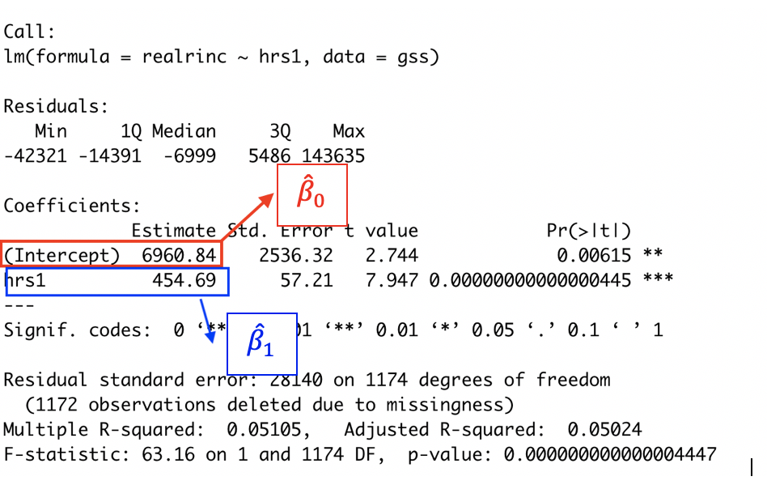

<!-- Code to enable scroll right for printing of data frames -->
<style>
pre code, pre, code {
  white-space: pre !important;
  overflow-x: auto !important;
  word-break: keep-all !important;
  word-wrap: initial !important;
}
</style>


```{r, echo=FALSE, include=FALSE}
knitr::opts_chunk$set(collapse = TRUE, comment = "#>", highlight = TRUE, warning = FALSE, message = FALSE)
  #comment = "#>" makes it so results from a code chunk start with "#>"; default is "##"
options(scipen=999)
options(tibble.width = Inf, width = 10000) # Code necessary to enable scroll right for printing of data frames
```

# Introduction


## Libraries, data, functions

messing around w/ ipeds panel data to merge right stuff w/ scorecard data

TO DO NEXT:

- MERGE SCORECARD DATA WITH PANEL DATA TO CREATE ANALYSIS DATASET FOR LECTURE
- THEN WORK THROUGH LECTURE, REPLACING GSS EXAMPLES WITH YOUR EXAMPLES
- ADD CODE CHUNKS WHERE RELEVANT (RATHER THAN ONLY AT THE END)
- LOOK AT KARINA'S R SCRIPT FOR CODE TO USE
```{r}
load(file = url('https://github.com/anyone-can-cook/educ152/raw/main/data/ipeds/output_data/panel_data.RData'))

panel_data %>% count(year)

panel_data %>% glimpse()
```


```{r}
# uncomment below line to remove all objects
  #rm(list = ls())

# Libraries
  #install.packages('tidyverse') # if you haven't installed already
  #install.packages('labelled') # if you haven't installed already
  #install.packages('patchwork') # if you haven't installed already

library(tidyverse) # load tidyverse package
library(labelled) # load labelled package package
library(patchwork)

##########
########## RUN SCRIPT THAT CREATES USER DEFINED FUNCTIONS
##########

source(file = url('https://github.com/anyone-can-cook/educ152/raw/main/scripts/user_defined_functions/create_inference_functions.R'))


##########
########## SCORECARD DATA ON DEBT AND EARNINGS
##########

# load scorecard dataset from course website url

load(file = url('https://github.com/anyone-can-cook/educ152/raw/main/data/college_scorecard/output_data/df_debt_earn_panel_labelled.RData'))

df_debt_earn_panel_labelled %>% glimpse()
  
df_scorecard <- df_debt_earn_panel_labelled %>%
    # keep most recent year of data
    filter(field_ay == '2017-18') %>%
    # keep master's degrees
    filter(credlev == 5) %>%
    # carnegie categories to keep: 15 = Doctoral Universities: Very High Research Activity; 16 = Doctoral Universities: High Research Activity
    filter(c15basic %in% c(15,16,17,18,19,20)) %>%
    # drop "parent plus" loan variables and other vars we won't use in this lecture
    select(-contains('_pp'),-contains('_any'),-field_ay,-st_fips,-zip,-longitude,-latitude,-locale2,-highdeg,-accredagency,-relaffil,-hbcu,-annhi,-tribal,-aanapii,-hsi,-nanti,-main,-numbranch) %>%
    # create variable for broad field of degree (e.g., education, business)
    mutate(cipdig2 = str_sub(string = cipcode, start = 1, end = 2)) %>%
    # shorten variable cipdesc to make it more suitable for printing
    mutate(cipdesc = str_sub(string = cipdesc, start = 1, end = 50)) %>%
    # re-order variables
    relocate(opeid6,unitid,instnm,control,ccbasic,stabbr,city,cipdig2)

# "glimpse" data frame
df_scorecard %>% glimpse()

# For debt and earnings variables, convert from character to numeric variables (which replaces "PrivacySuppressed" values with NA values)
df_scorecard <- df_scorecard %>%
  mutate(
    debt_all_stgp_eval_n = as.numeric(debt_all_stgp_eval_n),
    debt_all_stgp_eval_mean = as.numeric(debt_all_stgp_eval_mean),
    debt_all_stgp_eval_mdn = as.numeric(debt_all_stgp_eval_mdn),
    debt_all_stgp_eval_mdn10yrpay = as.numeric(debt_all_stgp_eval_mdn10yrpay),
    earn_count_wne_hi_1yr = as.numeric(earn_count_wne_hi_1yr),
    earn_mdn_hi_1yr = as.numeric(earn_mdn_hi_1yr),
    earn_count_wne_hi_2yr = as.numeric(earn_count_wne_hi_2yr),
    earn_mdn_hi_2yr = as.numeric(earn_mdn_hi_2yr)
  ) 

# add variable label to variable cipdig2
  attr(df_scorecard[['cipdig2']], which = 'label') <- 'broad degree field code = 2-digit classification of instructional programs (CIP) degree code'

# add variable label attribute back to debt and earnings variables
  for(v in c('debt_all_stgp_eval_n','debt_all_stgp_eval_mean','debt_all_stgp_eval_mdn','debt_all_stgp_eval_mdn10yrpay','earn_count_wne_hi_1yr','earn_mdn_hi_1yr','earn_count_wne_hi_2yr','earn_mdn_hi_2yr','cipdesc')) {
    
    #writeLines(str_c('object v=', v))
    #writeLines(attr(df_debt_earn_panel_labelled[[v]], which = 'label'))
    
    attr(df_scorecard[[v]], which = 'label') <- attr(df_debt_earn_panel_labelled[[v]], which = 'label')
  }

df_scorecard %>% glimpse()


##########
########## IPEDS
##########

# Load ipeds dataset from course website url
load(file = url('https://github.com/anyone-can-cook/educ152/raw/main/data/ipeds/output_data/panel_data.RData'))

panel_data %>% count(year)

# Create ipeds data frame with fewer variables/observations
df_ipeds_pop <- panel_data %>%
  # keep data from fall 2019
  filter(year == 2019) %>%
  # which universities to keep:
    # 2015 carnegie classification: keep research universities (15,16,17) and master's universities (18,19,20)
  filter(c15basic %in% c(15,16,17,18,19,20)) %>%
  # which variables to keep
  select(instnm,unitid,opeid6,opeid,control,c15basic,stabbr,city,zip,locale,obereg, # basic institutional characteristics
         tuition6,fee6,tuition7,fee7, # avg tuition and fees for full-time grad, in-state and out-of-state
         isprof3,ispfee3,osprof3,ospfee3, # avg tuition and fees for MD, in-state and out-of-state
         isprof9,ispfee9,osprof9,ospfee9, # avg tuition and fees for Law, in-state and out-of-state
         chg4ay3,chg7ay3,chg8ay3) %>% # [undergraduate] books+supplies; off-campus (not with family) room and board; off-campus (not with family) other expenses
  # rename variables; syntax <new_name> = <old_name>
  rename(region = obereg, # revion
         tuit_grad_res = tuition6, fee_grad_res = fee6, tuit_grad_nres = tuition7, fee_grad_nres = fee7, # grad
         tuit_md_res = isprof3, fee_md_res = ispfee3, tuit_md_nres = osprof3, fee_md_nres = ospfee3, # md
         tuit_law_res = isprof9, fee_law_res = ispfee9, tuit_law_nres = osprof9, fee_law_nres = ospfee9, # law
         books_supplies = chg4ay3, roomboard_off = chg7ay3, oth_expense_off = chg8ay3) %>% # [undergraduate] expenses
  # create measures of tuition+fees
  mutate(
    tuitfee_grad_res = tuit_grad_res + fee_grad_res, # graduate, state resident
    tuitfee_grad_nres = tuit_grad_nres + fee_grad_nres, # graduate, non-resident
    tuitfee_md_res = tuit_md_res + fee_md_res, # MD, state resident
    tuitfee_md_nres = tuit_md_nres + fee_md_nres, # MD, non-resident
    tuitfee_law_res = tuit_law_res + fee_law_res, # Law, state resident
    tuitfee_law_nres = tuit_law_nres + fee_law_nres) %>% # Law, non-resident  
  # create measures of cost-of-attendance (COA) as the sum of tuition, fees, book, living expenses
  mutate(
    coa_grad_res = tuit_grad_res + fee_grad_res + books_supplies + roomboard_off + oth_expense_off, # graduate, state resident
    coa_grad_nres = tuit_grad_nres + fee_grad_nres + books_supplies + roomboard_off + oth_expense_off, # graduate, non-resident
    coa_md_res = tuit_md_res + fee_md_res + books_supplies + roomboard_off + oth_expense_off, # MD, state resident
    coa_md_nres = tuit_md_nres + fee_md_nres + books_supplies + roomboard_off + oth_expense_off, # MD, non-resident
    coa_law_res = tuit_law_res + fee_law_res + books_supplies + roomboard_off + oth_expense_off, # Law, state resident
    coa_law_nres = tuit_law_nres + fee_law_nres + books_supplies + roomboard_off + oth_expense_off) %>% # Law, non-resident    
  # keep only observations that have non-missing values for the variable coa_grad_res
    # this does cause us to lose some interesting universities, but doing this will eliminate some needless complications with respect to learning core concepts about statistical inference
  filter(!is.na(coa_grad_res))

# Add variable labels to the tuit+fees variables and coa variables
  # tuition + fees variables
    var_label(df_ipeds_pop[['tuitfee_grad_res']]) <- 'graduate, full-time, resident; avg tuition + required fees'
    var_label(df_ipeds_pop[['tuitfee_grad_nres']]) <- 'graduate, full-time, non-resident; avg tuition + required fees'
    var_label(df_ipeds_pop[['tuitfee_md_res']]) <- 'MD, full-time, state resident; avg tuition + required fees'
    var_label(df_ipeds_pop[['tuitfee_md_nres']]) <- 'MD, full-time, non-resident; avg tuition + required fees'
    var_label(df_ipeds_pop[['tuitfee_law_res']]) <- 'Law, full-time, state resident; avg tuition + required fees'
    var_label(df_ipeds_pop[['tuitfee_law_nres']]) <- 'Law, full-time, non-resident; avg tuition + required fees'
    
  # COA variables
    var_label(df_ipeds_pop[['coa_grad_res']]) <- 'graduate, full-time, state resident COA; == tuition + fees + (ug) books/supplies + (ug) off-campus room and board + (ug) off-campus other expenses'
    var_label(df_ipeds_pop[['coa_grad_nres']]) <- 'graduate, full-time, non-resident COA; == tuition + fees + (ug) books/supplies + (ug) off-campus room and board + (ug) off-campus other expenses'
    var_label(df_ipeds_pop[['coa_md_res']]) <- 'MD, full-time, state resident COA; == tuition + fees + (ug) books/supplies + (ug) off-campus room and board + (ug) off-campus other expenses'
    var_label(df_ipeds_pop[['coa_md_nres']]) <- 'MD, full-time, non-resident COA; == tuition + fees + (ug) books/supplies + (ug) off-campus room and board + (ug) off-campus other expenses'
    var_label(df_ipeds_pop[['coa_law_res']]) <- 'Law, full-time, state resident COA; == tuition + fees + (ug) books/supplies + (ug) off-campus room and board + (ug) off-campus other expenses'
    var_label(df_ipeds_pop[['coa_law_nres']]) <- 'Law, full-time, non-resident COA; == tuition + fees + (ug) books/supplies + (ug) off-campus room and board + (ug) off-campus other expenses'

df_ipeds_pop %>% glimpse()


##########
########## Create data frame of generated variables, with each variable meant to represent the entire population
##########


num_obs <- 10000

# Generate normal distribution w/ custom mean and sd
set.seed(124)
norm_dist <- rnorm(n = num_obs, mean = 50, sd = 5)

# Generate right-skewed distribution
set.seed(124)
rskew_dist <- rbeta(n = num_obs, shape1 = 2, shape2 = 5)

# Generate left-skewed distribution
set.seed(124)
lskew_dist <- rbeta(n = num_obs, shape1 = 5, shape2 = 2)

# Generate standard normal distribution (default is mean = 0 and sd = 1)
set.seed(124)
stdnorm_dist <- rnorm(n = num_obs, mean = 0, sd = 1)  # equivalent to rnorm(10)

# Create dataframe
df_generated_pop <- data.frame(norm_dist, rskew_dist, lskew_dist, stdnorm_dist)

# drop individual objects associated with each variable
rm(norm_dist,rskew_dist,lskew_dist,stdnorm_dist)
rm(num_obs)


##########
########## Create sample versions of generated population data frame and IPEDS population data frame
##########

# create sample version of our generated data
  set.seed(124) # set seed so that everyone ends up with the same random sample
  
  df_generated_sample <- df_generated_pop %>% sample_n(size = 200)
  df_generated_sample %>% glimpse()


# create sample version of our ipeds data

  set.seed(124) # set seed so that everyone ends up with the same random sample
  
  df_ipeds_sample <- df_ipeds_pop %>% sample_n(size = 200) 

##########
########## STAR DATA
##########

# load star data
load(file = url('https://github.com/anyone-can-cook/educ152/raw/main/data/star/star_panel_data.RData'))

#df_star_panel %>% glimpse()

# create data frame for STAR experiment, keeping only kindergarten
df_stark <- df_star_panel %>% 
  # keep only kindergarten year
  filter(grade ==1) %>% 
  # keep only observations with non-missing value for reading score
  filter(!is.na(read)) %>%
  # keep only observations with non-missing values for treatment assignment
  filter(!is.na(star)) %>%
  # drop observations where treatment status is regular+aide
  filter(star !=3) %>%
  # keep selected variables
  select(id,grade,star,read,gender,ethnicity,lunch,school,degree,experience) %>%
  # create a variable "treatment" that equals 1 if student receives treatment (small class) and equals 0 otherwise
  mutate(
    treatment = if_else(star==2,1,0)
  )


df_stark %>% glimpse()
```

Investigate STAR data

- basically, we want to know if Kindergarten students randomly assigned to "small" class size (variable `treatment` equals `1`) have higher values of reading test score than students randomly assigned to "large" class size (variable `treatment` equals `0`)
```{r}
# frequency count of treatment variable
  #df_stark %>% count(star)
  #df_stark %>% count(star) %>% as_factor()
df_stark %>% count(treatment)

# calculate mean value of reading score separately for treated and nontreated
df_stark %>% group_by(treatment) %>% summarize(
  mean_read = mean(read, na.rm = TRUE),
  sd_read = sd(read, na.rm = TRUE)
)

# t.test
#t.test(formula = read ~ treatment, mu = 0, data = df_stark)
```


# Review: scatterplot, covariance, correlation

__Relationships between two continuous variables__

Postive relationship, negative relationship, and no relationships

\medskip

1. Relationship between X and Y is positive
- when X is "high", Y tend to be "high"
- when X is "low", Y tends to be "low"
- e.g., number of hours studying and GPA

\medskip

2. Relationship between X and Y is negative
- when X is "high", Y tend to be "low"
- when X is "low", Y tends to be "high"
- e.g., number of school abscences and GPA

\medskip

3. No relationship between X and Y
- knowing the value of X gives you does not tell you much about the value of Y
- e.g., amount of ice cream consumed and GPA


__Today's Example__

Using the General Social Survey 2018 [sidebar: Data Goals for this Class]:

- Nationally representative survey of adults in the United States conducted since 1972
- Collects data on contemporary American society in order to monitor and explain trends in opinions, attitudes and behaviors
  - Demographic, behavioral, and attitudinal questions
  - Covers topics like civil liberties, crime and violence, intergroup tolerance, morality, national spending priorities, psychological well-being, social mobility, etc.
- [GSS Website Link](https://gss.norc.org/)

\medskip

We have two variables X and Y:

- X (independent variable) = hours worked per week
- Y (dependent variable) = income

\medskip
Ways to investigate this relationship between X and Y:

- Graphically: scatterplots
- Numerically: covariance (less used), correlation


## Scatterplots

- Scatterplots will plot individual observations on an X and Y axis

\medskip
- Draw scatterplot of X (hours worked) and Y (income) by hand 
  - Add a prediction line

\medskip
- Residual
  - Difference between actual observed value of Y and predicted value of Y (given X)

\medskip
- Relationship between X and Y is not perfect!

\medskip
Generate a scatteplot using `ggplot` in R script

## Covariance

Covariance measures the extent to which two variables move together....

- If income is "high" when hours is worked is "high", then covariance is positive
- If income is "low" when hours is worked is "high", then covariance is negative

\medskip
Population covariance, cov(X, Y)

- As with all population parameters, we don't know this!

\medskip
Population covariance, $s_{XY}$ or $\hat{\sigma}_{XY}$

- Estimator of population covariance

- $s_{XY}= \hat{\sigma}_{XY}=\frac{\sum_{i=1}^{n}\left(X_{i}-\bar{X} \right)  \left( Y_{i}-\bar{Y} \right)}{n-1}$


__Sample Covariance__

__Formula__
$s_{XY}= \hat{\sigma}_{XY}=\frac{\sum_{i=1}^{n}\left(X_{i}-\bar{X} \right)  \left( Y_{i}-\bar{Y} \right)}{n-1}$

\medskip
Example: Imagine we have 20 obs; $\bar{X}=40; \bar{Y}=30$

\medskip
Observation 1: $X_1=50; Y_1=60$

- $(X_{i}-\bar{X})( Y_{i}-\bar{Y})=(50-40)(60-30)=10*30=300$
- $X_i >  \bar{X}$ and $Y_i > \bar{Y}$; so $(X_{i}-\bar{X})( Y_{i}-\bar{Y})$ is positive


Observation 2: $X_1=45; Y_1=25$
- $(X_{i}-\bar{X})( Y_{i}-\bar{Y})=(45-40)(25-30)=5*-5=-25$
- $X_i >  \bar{X}$ and $Y_i < \bar{Y}$; so $(X_{i}-\bar{X})( Y_{i}-\bar{Y})$ is positive


\medskip
$s_{XY}$ is the sum of these 20 calculations divided by 19 (n-1)


$s_{XY}$ is positive when X and Y move in the same direction

- $X_i >  \bar{X}$ usually coupled with $Y_i > \bar{Y}$
- $X_i <  \bar{X}$ usually coupled with $Y_i < \bar{Y}$

\medskip

$s_{XY}$ is negative when X and Y move in the same direction

- $X_i >  \bar{X}$ usually coupled with $Y_i < \bar{Y}$
- $X_i <  \bar{X}$ usually coupled with $Y_i > \bar{Y}$


## Correlation

Problem with sample covariance, $s_{XY}$

- Covariance (like variance) dependes on the units of measurement
- We can't compare the covaraince of X and Y vs covariance of X and Z

\medskip
Sample Correlation of Z and Y, $r_{XY}$

- Unitless measure of relationship between X and Y
- Equals sample covariance, $s_{XY}$, divided by the product of their individual sample standard deviations

\medskip

__Sample Correlation Formula__
$r_{XY}=\frac{s_{XY}}{s_X*s_Y}  = \frac{\hat{\sigma}_{XY}}{\hat{\sigma}_X \hat{\sigma}_Y}$


__Sample Correlation__

$r_{XY}=\frac{s_{XY}}{s_X*s_Y}  = \frac{\hat{\sigma}_{XY}}{\hat{\sigma}_X \hat{\sigma}_Y}$

\medskip
Correlations result in measures between -1 and 1

\medskip
"Type" of relationship

- $r_{XY}$ = 0 means there is no relationship between X and Y
- $r_{XY}$ > 0 means a positive correlation between X and Y
  - in other words, the variables move together
- $r_{XY}$ < 0 means a negative correlation
  - in other words, the variables move in opposite directions
  
\medskip
"Strength" of relationship

- $r_{XY}$ = |0.1| to |0.3| = weak relationship
- $r_{XY}$ = |0.3| to |0.6| = moderate relationship
- $r_{XY}$ = |0.6| to |1| = strong relationship

\medskip
Calculate correlations in R...


## Linear vs Non-Linear Relationships

Problem with covariance and correlation:

- Both measure linear relationships; these measures do not detect non-linear relationships

\medskip
See R script:

- Run correlation of income and age for respondents that identified as Black
- Run Scatterplots 

# Population linear regression model

## Purpose of Regression

- Regression analysis is a statistical method that helps us analyze and understand the relationship between 2+ variables
- What is the purpose of regression in __descriptive research__ (sometimes called "observational studies" or "predictive" studies)?

  - To understand __relationship(s)__ between one dependent variable (Y) to one or more indepedent variable (X, Z, etc.)
  - Not concerned with "direction" or "cause": Does X cause Y? Does Y cause X? 
  - Interested in "prediction"
  - Example: predict poverty status based on having a cell phone

\medskip

- What is the purpose of regression in __econometrics research__ (sometimes called "causal studies")?

  - To estimate the __causal__ effect of an independent variable (X) on a dependent variable (Y)
  - Very concerned with "direction" or "cause": Does X cause Y?  
  - Interested in recreating experimental conditions or what would have happened under a randomized control trial 
  - Example: What is the effect of class size on student learning?

\medskip
- Most of my research is descriptive; but I teach this class in a "causal" way... why?
  - One type of research is not better than the other; it's just really important to understand the difference. _Ex: Lack of a cell phone doesn’t cause poverty!_
  - Causal research forces you to be very purposeful about your models!
  - Policy makers/decision makers don't just care if there is a relationship between class size and student learning; they want to know if we decrease class size by two students what is the expected change in student test scores


__Regression: Models, Variables, Relationships__

- __Linear Regression Model vs Non-Linear Regression Models__
  - Linear regression model (general linear model)
    - the dependent variable is continuous
    - e.g., GPA, test scores, income
    - __the focus of this class!__
  - Non-linear regression models (logit, ordinal, probit, poisson, negative binomial)
    - the dependent variable is non-continuous (i.e., categorical, binary, counts)
    - e.g., persistence, likert scales, type of major
    - __focus of HED 613__ (Spring 2022/Maybe Fall 2021)
    
\medskip
    

- __Bivariate vs Multivariate Regression__
  - Bivariate regression (sometimes also called univariate, simple regression)
    - One dependent variable (Y) and one independent variable of interest ($X_1$)
  - Multivariate regression (for econometrics/causal inference)
    - One dependent variable (Y) and one independent variable of interest ($X_1$); __and__ multiple control variables ($X_2$,$X_3$,$X_4$,etc.)
    
\medskip

- __Linear Relationship vs Non-Linear Relationship between X and Y__
  - Draw linear vs non-linear relationship scatterplots; show in R
  - We will focus on modeling linear relationship between X and Y for first half of the course
  - Then we will cover non-linear relationships
  


__Slope Measures relationship between X and Y__

- Research Question
  - What is the effect of hours worked (X) on annual income (Y)
  
\medskip

- What do we want to measure?
  - The relationship between hours worked (X) and income (Y)
  - If we increase the number of hours worked per week by one additional hour, how much do we expect annual income to change?

\medskip
- We want to measure $\beta$
  - $\beta = \frac{(Y_2 - Y_1)}{(X_2 - X_1)} = \frac{\Delta Y}{\Delta X}$
  - In other words, the slope of the relationship between X and Y 
  - Under the assumption of a linear relationship
  
\medskip
- Draw line showing linear relationship between X and Y
  - $x_1 = 31, x_2 =32, y_1=\$30,000, Y_2=\$35,000$
  - Calculate slope at different points and for different $\Delta X$

## Population Linear Regression Model

__Population__ Linear Regression Model

- $Y_i = \beta_0 + \beta_1X_i + u_i$

\medskip
Where:

- $Y_i$ = income for person i
- $X_i$ = hours worked per week for person i
- $\beta_0$ ("population intercept") = average income for someone with X=0 
- $\beta_1$ ("population regression coefficient") = average effect of a one-unit increase in X on the value of Y
- $u_1$ ("error term" or "residual") = all other variables not included in your model that affect the value of Y

\medskip
Draw Picture

- Scatterplot of the population
- Population regression model line
- Label the following:
  - $\beta_0$
  - $\beta_1$
  - residual (predicted - value of $Y_i$)

## Population Regression Model

__Population__ Linear Regression Model
$Y_i = \beta_0 + \beta_1X_i + u_i$

\medskip
Contains two population parameters

- $\beta_0$ ("population intercept") = average income for someone with X=0 
- $\beta_1$ ("population regression coefficient") = average effect of a one-unit increase in X on the value of Y

\medskip
- How do we know these are population parameters? (hint: notation)
- Do we usually know the value of $\beta_0$ or $\beta_1$? 

### Population regression coefficient, $\beta_1$

What is the effect of hours worked per week (X) on income (Y)?

- Answer: population regression coefficient, $\beta_1$
- Estimating $\beta_1$ is the fundamental goal of causal inference/this course 

\medskip
What is the population regression coefficient, $\beta_1$?

- $\beta_1$ measures the average change in Y for a one-unit increase in X

- Think of $\beta_1$ as measuring the slope of our prediction line!

- $\beta_1 = \frac{\Delta Y}{\Delta X} = \frac{\Delta Income}{\Delta Hours Worked}$

- Example: $\beta_1$ = $\frac{\$5000 \Delta Income}{1hour \Delta HoursWorked}$ = $5,000 

\medskip
Interpretation (we will use this all semester!)

- General interpretation:
  - On average, a one unit-increase in X is associated with a $\beta_1$ increase (or decrease) in the value of Y
- Interpretation from example above:
  - On average, a one-hour increase in hours worked per week (X) is associated with a \$5,000 ($\beta_1$) increase in annual income (Y)
- Interpret if $\beta_1 = \$2,000$; or $\beta_1 = \$4,000$


Some important things to remember:

- If $\beta_1$ (i.e., the relationship between X and Y) is linear, then the average change in Y for a one-unit increase in X is the same no matter the starting value of X
  - Like plot example from earlier

- $\beta_1$ measures the **average** effect on Y for a one-unit increase in X; this effect on an individual observation may be different than this average effect! 

- $\beta_1$  is a population parameter. We hardly ever know population parameters. So we **estimate** $\beta_1$  using sample data!

### Population Intercept, $\beta_0$

What is the effect of hours worked per week (X) on annual income (Y)?

  - $Y_i = \beta_0 + \beta_1X_i + u_i$

\medskip
$\beta_0$ is the "population intercept"

- $\beta_0$ = the average value of Y when X=0
- Here, $\beta_0$, is the average annual income for someone that works zero hours per week (X=0)
- Usually, we are not substantively interested in $\beta_0$ 
- Sometimes $\beta_0$ is non-sensical or there's too few observations at X=0 to calculate a precise estimate (e.g., effect of age on income)


### Population Linear Regression Line

__Population__ Linear Regression Model
$Y_i = \beta_0 + \beta_1X_i + u_i$

\medskip 

We sometimes deconstruct the Population Linear Regression Model into two parts:

(1) __Population__ Linear Regression *LINE*/ Regression Function: $Y_i = \beta_0 + \beta_1X_i$
(2) __Population__ "Error" or "Residual" Term: $u_i$

\medskip 

- Population regression line: just a linear prediction line, like the one in the scatterplot *if* the scatterplot contained all observation in the population
- Population regression line measures the "average" or "expected" relationship between X and Y, ignoring variables that we excluded from the model (i.e., $u_i$)

Population regression line and Expected Value, E(Y)

- Expected value of Y (for a sample mean/ one variable)
  - $E(Y) = \mu_Y$
  
\medskip

- Expected value of Y, given the value of X (relationship between two variables)
  - $E(Y|X) = \beta_0 + \beta_1X_i$
  - the population regression line is expected value of Y for a given value of X

\medskip
  
- Population regression line and prediction
  - If we know value of parameters, $\beta_0$ and $\beta_1$, we can predict value of Y
  - Example: $\beta_0=\$5,000$ and $\beta_1=\$2,000$
  - (1) Predict the value of Y (annual income) for someone that works 20 hours per week
  - (2) Predict the value of Y (annual income) for someone that works 45 hours per week
  
  
### $u_i$, as "Error Term" or "unobserved variables"

- Population linear regression model
  - $Y_i = \beta_0 + \beta_1X_i + u_i$
  - Y= income; $X_i$= hours worked

\medskip
- In causal inference research:
  - Error term $u_i$ represents (consists of) *all other variables besides X that are not included in your model* that affect the dependent variable
  - In other words, the error term consists of all other factors (i.e., variables) responsible for the difference between the $i^{th}$ district's average test score and the value predicted by the regression line
  - This interpretation will become *super* important down the road!
  
\medskip

- Example of Y= income; $X_i$= hours worked; the error term $u_i$ would consist of other factors besides hours worked that have an effect on yearly income! 
  - Occupation: a hedge fund manager can 20 hours a week and make millions (maybe not last week tho!); an essential worker can 80+ hours and still only $40k
  - Race: BIPOC face discrimination in labor wages
  - Gender pay gap!   

\medskip 
- In other social science based statistics classes
  - Interpret the $u_i$ as the overall error in the prediction of Y due to *random variation*


### $u_i$ as "Residual"

- Population linear regression model
  - $Y_i = \beta_0 + \beta_1X_i + u_i$
  - Y= income; $X_i$= hours worked
  
\medskip 

- $u_i$ as the residual
  - Population regression line represents the predicted value of Y (income) for each value of X (hours worked)
  - Residual = the predicted value of Y - observed value of Y for any given value of X

\medskip

- Easier to conceptually think about $u_i$ in terms of each observation, i

  - $Y_i$ = actual value of income for person i
  - $Y_i = \beta_0 + \beta_1X_i$ = Population Regression line 
    -  The predicted value of income for person i with hours worked = $X_i$
  - Residual, $u_i$
    - The difference between actual value, $Y_i$, and predicted value from the population regression line for observation i
    - $u_i = Y_i - (\beta_0 + \beta_1X_i)$
    

# Estimation


__General things we do in regression analysis__

1. __Estimation__ [Today]
  - How do we choose estimates of $\beta_0$ and $\beta_1$ using sample data?

\medskip

2. __Prediction__ [Next Week]
  - What is the predicted value of Y for someone with a particular value of X?
  
\medskip
  
3. __Hypothesis testing__ [focus of the rest of the semester]
  - Hypothesis testing and confidence intervals about $\beta_1$
  

<br>

Step 1 of regression is to estimate parameters

Population linear regression model

  - $Y_i = \beta_0 + \beta_1X_i + u_i$

\medskip

__Goal of estimation is to__:

  - Use sample data to estimate the population intercept, $\beta_0$, and the population regression coefficient, $\beta_1$
  - $\hat{\beta_0}$ is an estimate of $\beta_0$
  - $\hat{\beta_1}$ is an estimate of $\beta_1$
    - How dow we know these estimates are based on sample data and not population parameters? (hint: notation!)
    
\medskip

__Estimation problem__:

Need to develop a method for choosing values of $\hat{\beta_0}$ and $\hat{\beta_1}$ 


## Estimation (population mean)

We faced a similar estimation problem in intro to stats!

- Use sample to calculate the "best" estimate of the population mean, $\mu_Y$
- We decided sample mean, $\bar{Y}$, was the "best" estimate!

\medskip

Criteria we used to determine $\bar{Y}$ was "best" estimate of $\mu_Y$

- $m$ is all potential estimates for $\mu_Y$
- Goal: choose the value, $m$ , that minimizes the "sum of squares"
  - Sum of squares = $\sum_{i=1}^{n}$ $(Y_i-m)^2$
  - $\bar{Y}$ is the value of $m$ that minimizes sum of squares
  - So $\bar{Y}$ is the "least squares" estimator 
  
\medskip

Draw scatterplot:

- (1) Horizontal line representing sample mean
  - Show formula for sum of square errors
  
## Estimation (regression)


Problem in regression:

- Need to develop method for selecting the "best" estimate of $\hat{\beta_0}$ and $\hat{\beta_1}$
- Solution: similar to what we do for population mean!

\medskip
First some terminology:

- $Y_i$ is the actual observed value of Y for individual i
- $\hat{Y_i}$ is the predicted value of $Y_i$, based on sample data!
  - $\hat{Y_i} = \hat{\beta_0} + \hat{\beta_1}X_i$
  
- Estimated residual, $\hat{u}_i$ is the difference between actual $Y_i$ and predicted $\hat{Y_i}$
  - $Y_i - \hat{Y_i}$ = $\hat{u_i}$
  - $Y_i - (\hat{\beta_0} + \hat{\beta_1}X_i)$ = $\hat{u_i}$
  - Residuals are sometimes called "errors"
  

Criteria for choosing "best" estimate of $\hat{\beta_0}$ and $\hat{\beta_1}$

- Select values that minimize "sum of squared residuals"

\medskip

Sum of squared residuals (or sometimes called "sum of squared errors"):

- $\sum_{i=1}^{n}$ $(Y_i - \hat{Y_i})^2$

- $\sum_{i=1}^{n}$ $(Y_i - (\hat{\beta_0} + \hat{\beta_1}X_i))^2$

- $\sum_{i=1}^{n}$ $(u_i)^2$


\medskip

__Ordinary Least Squares__ is a linear method for estimating parameters in a linear regression model

  - Method draws a line through the sample data points that minimizes the sum of squared residuals, or in other words, the differences between the observed values and the corresponding fitted values
  - Minimization is achieved via calculus (derivatives). R will calculate this for you (phew!)
  - Best estimates of  $\hat{\beta_0}$ and $\hat{\beta_1}$ are those that any other alternatives would result in a higher sum of squared residuals
  

### OLS Prediction Line

__Population Linear Regression Model__

 - $Y_i = \beta_0 + \beta_1X_i + u_i$
 
\medskip
__OLS Prediction Line or "OLS Regression Line" (based on sample data)__

 - $\hat{Y_i} = \hat{\beta_0} + \hat{\beta_1}X_i$ 
 
\medskip
- Our OLS prediction line chose the best estimates of  $\hat{\beta_0}$ and $\hat{\beta_1}$ as  those that any other alternatives would result in a higher sum of squared residuals
- Draw this out...


## Regression in R using `lm()`

Let's write run our first regression and write out our models!

<br>
  
RQ: What is the effect of hours worked per week on annual income? 

- Run regression in R
  - `mod1 <- lm(realrinc ~ hrs1, data=gss)`
  - `summary(mod1)`




RQ: What is the effect of hours worked per week on annual income? 

\medskip
Write out and label everything within the following: [we will be doing this all semester!]

1. Population regression model
    - Label Y; Label X

2. OLS Prediction Line (without estimates)
    - Define $\hat{\beta_0}$?
    - Define $\hat{\beta_1}$?

3. OLS Prediction Line (with estimates)
    - Interpret $\hat{\beta_0}$ given the estimate 
    - Interpret $\hat{\beta_1}$ given the estimate 

4. Predict the expected value of $\hat{Y}_i$ for someone that works 60 hours a week.


## In-Class Group Exercise 

RQ: What is the effect of age on annual income?? 

- hint! X = `age` and Y =`realrinc`

\medskip
Write out and label everything within the following

- Recommendation: Practice how to write out equations in Word; touch-screen devices share your screen via whiteboard


1. Population regression model
    - Label Y; Label X

2. OLS Prediction Line (without estimates)
    - Define $\hat{\beta_0}$?
    - Define $\hat{\beta_1}$?

3. OLS Prediction Line (with estimates)
    - Run regression in R and print to get estimates: 
      - `mod2 <-  lm(realrinc ~ age, data=gss)`
      - `summary(mod2)`
    - Interpret $\hat{\beta_0}$ given the estimate 
    - Interpret $\hat{\beta_1}$ given the estimate 

4. Predict the expected value of $\hat{Y}_i$ for someone that is 18 years old.


__In-Class Group Exercise [Solutions]__

RQ: What is the effect of age on annual income?? 


1. Population regression model
    - $Y_i = \beta_0 + \beta_1X_i + u_i$
    - Y = annual income; X = age

2. OLS Prediction Line (without estimates)
    - $\hat{Y_i} = \hat{\beta_0} + \hat{\beta_1}X_i$
    - $\hat{\beta_0}$? = Sample population intercept
      - i.e., the average value of Y when X=0
    - $\hat{\beta_1}$ = Sample regression coefficient 
      - i.e., the average change in Y for one-unit increase in X

3. OLS Prediction Line (with estimates)
    - $\hat{Y_i} = \$8,620 + \$368X_i$
    - $\hat{\beta_0}$ = \$8,620
      - On average, someone who is age zero has an annual income of \$8,620 
      - Example of non-sensical $\hat{\beta_0}$
    - $\hat{\beta_1}$? = \$368
      - On average, a one-year increase in age is associated with a \$368 increase in annual income

4. Predict the expected value of $\hat{Y}_i$ for someone that is 18 years old.
    - $E(\hat{Y_i}|X=35)$ = $\hat{Y_i} = \$8,620 + \$368*18$
    - $E(\hat{Y_i}|X=35)$ = $\hat{Y_i} = \$8,620 + \$6,624$
    - $E(\hat{Y_i}|X=35)$ = \$15,244


# Prediction

ADD TEXT

# Model Fit

ADD TEXT


# References