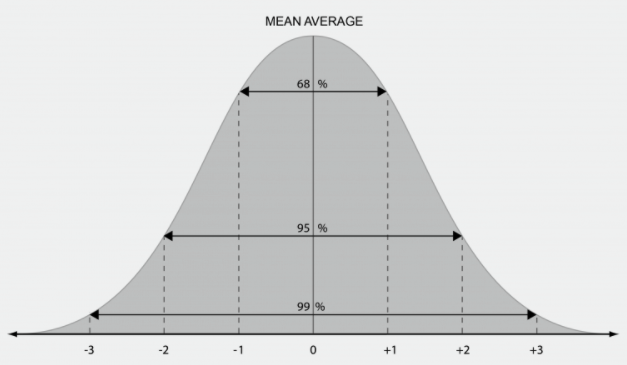
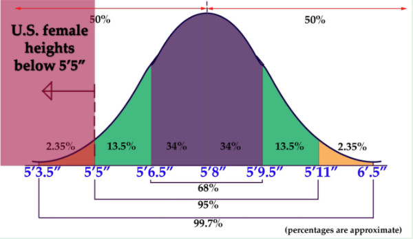
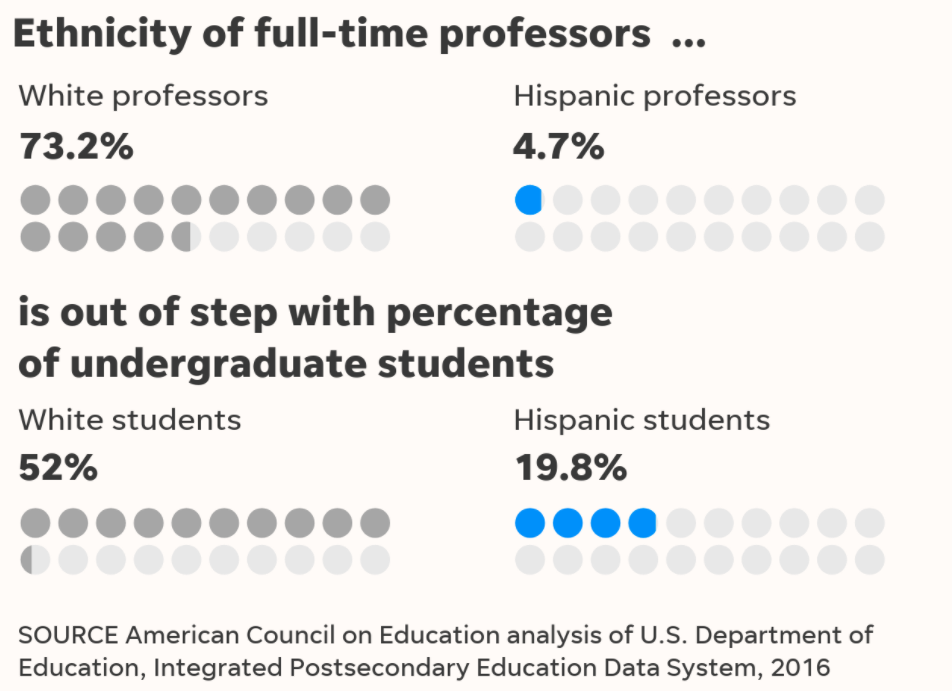
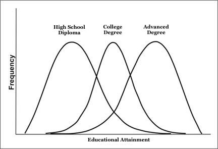

```{r, echo=FALSE}
knitr::opts_chunk$set(collapse = TRUE, comment = "#>", highlight = TRUE)
```


# Statistics 101


### What is "Statistics"?

__Statistics__: Often considered the science of uncertainty!

\medskip
The goal of statistics is to convert data (or samples!) into information that is usable to people! 

  - Weather forecasting 
  - Emergency preparedness 
  - Predicting disease outbreak
  - Political voting polls

\medskip

Education Research:

  - Do smaller classes improve learning?
  - Does offering students financial increase college completion?
  - Is online instruction as effective as in-class instruction?


### Statistics' One Big Idea: The Normal Curve

__The Normal Distribution or Normal Curve__: natural phenomenons (e.g., age, height, educational attainment) tend to have a similar distributions of values. 

- There are a few values that are small (outliers!)
- Lots of values around "the average" ("normal observations")
- And a few values that are large (outliers!)

Outliers: observations that deviate from the "normal" bell curve
  



### Statistics' One Big Idea: The Normal Curve

__Women's Height in the U.S.__


\medskip

- BIG TAKEAWAY: There's a higher probability of data following the "average" or the "norm"


### I am an outlier... (or maybe not!)




### Enrollment Management Research Program 

- Grew tired of mainstream access inequality policy discourse...
  - Onus  on students, families, and K-12 schools
  - Enrollments can only tell us so much

\medskip

- Do the enrollment management policies and practices of public universities undermine access for underserved student populations?
  - Universities say they care about low-income students, Students of Color
  - But who do they actually recruit? Use data science to collect recruiting events!

\medskip

- Policy implications
  - Too many policy decisions for increasing access attempt to "fix" student behavior
  - Assumption: doubling low-income, Students of Color applying to a university will double their enrollment


Examples:

- [The off-campus recruiting project](https://emraresearch.org/)
- [Dissertation Defense](https://ksalazar3.github.io/defense/#/title)


### Shift The Normal Distribution!

