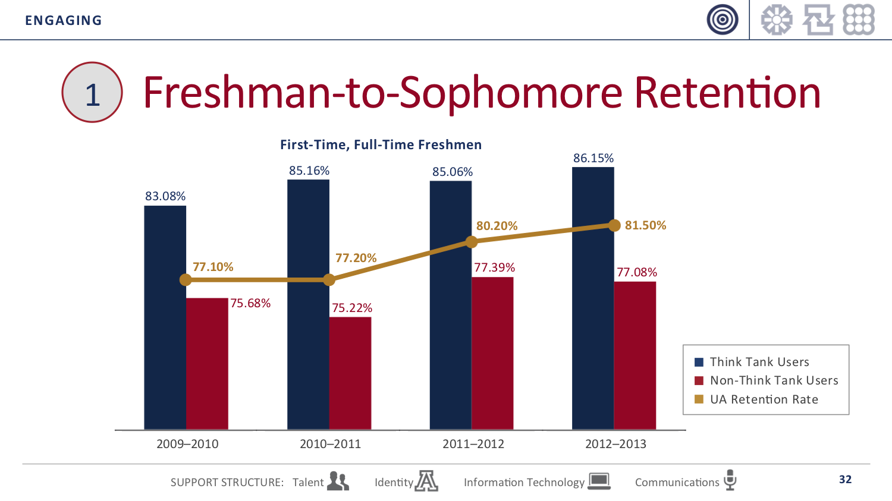

```{r, echo=FALSE}
knitr::opts_chunk$set(collapse = TRUE, comment = "#>", highlight = TRUE)
```


# Student Introductions 


## Student introductions

1. Preferred name
1. Preferred pronouns
1. Academic program (and how far along) 
1. GA, RA, TA, and/or job?
1. Why are you interested in this course?


# About your instructor

## Karina Salazar, instructor

My start in statistical analysis 

- Began taking quantitative methods courses as a Master's student
  - Material did not come easy to me! I took intro course twice!
  - Took statistics courses in sociology 
  - Causal inference courses at The University of Michigan
  
\medskip

- Developed strong data skills
  - Getting data ready for analysis is often very time and labor intensive!
  - Learned data management skills in SPSS and Stata
  - Learned data science skills in Python and R

\medskip

- Applied what I was learning in class.
  - Worked in assessment and institutional research offices; evaluated retention programs 
  - Research assistantship in sociology; worked with national datasets (IPEDS, Survey of Earned Doctorates, Higher Education R&D Survey)

\medskip

- Sought out teaching opportunities.
  - TA for HED regression and data management courses
  - Delivered practioner-based workshops
  


## Enrollment Management Research Program 

- Grew tired of mainstream access inequality policy discourse...
  - Onus on students, families, and K-12 schools
  - Enrollments can only tell us so much

\medskip

- Do the enrollment management policies and practices of public universities undermine access for underserved student populations?
  - Universities say they care about low-income students, Students of Color
  - But who do they actually recruit? Use data science to collect recruiting events!

\medskip

- Policy implications
  - Too many policy decisions for increasing access attempt to "fix" student behavior
  - Assumption: doubling low-income, Students of Color applying to a university will double their enrollment


Examples:

- [The off-campus recruiting project](https://emraresearch.org/)
- [Dissertation Defense](https://ksalazar3.github.io/defense/#/title)
    

# What is Econometrics?

## Econometrics (also "Program Evaluation", Causal Inference)

__Econometrics__ is the main methodological strategy used to assess the impact of programs, policies, and interventions.

\medskip
The goal of econometrics is to determine the __causal effect__ of the "program, policy, or treatment" (_the independent variable of interest_) on some educational outcome (_the dependent variable_) by inferring what would have happened in the absence of the "program, policy, or treatment" (_the counterfactual_). 

  - Do smaller classes improve learning?
  - Does offering students financial incentives increase college completion?
  - Is online instruction as effective as in-class instruction?

\medskip

Causal relationships vs. descriptive statistics

  - We often infer causality from correlation
  - Ice cream consumption causes drownings vs drownings rise when ice cream consumption increases
  - Smaller classes cause more learning vs. students in smaller classes have higher test scores


## Example 



## Econometrics & Regression

__Regression is used to answer both descriptive and causal questions__
 
 - One is not better than the other, they're just different types of research questions!
 - You can use the same skills to answer both types of ?s via regression

\medskip

__Why learn regression from an econometrics lens?__

_If you decide to pursue econometrics research_:

  - Using regression to overcome _selection bias_ in _the independent variable of interest_ is the first "tool" in a methodologist's causal inference toolkit.
  - Provides the foundation for more rigorous tools 
    - e.g., Difference-in-Difference, Propensity Score Matching, Regression Discontinuity
  
\medskip  

_If you decide not to pursue econometrics research_:

  - It's easier to learn the fundamentals of regression by focusing on __one__ relationship
  - Forces you to be thoughtful and intentional about what variables you include in regression models even when you're focusing on descriptive relationships
    - Avoid the "throwing everything but the kitchen sink" approach to regression modeling


# What is R

## What is R

According to the Inter-university consortium for political and social research [(ICPSR)](https://www.icpsr.umich.edu/icpsrweb/content/shared/ICPSR/faqs/what-is-r.html):

> R is "an alternative to traditional statistical packages such as SPSS, SAS, and Stata such that it is an extensible, open-source language and computing environment for Windows, Macintosh, UNIX, and Linux platforms. Such software allows for the user to freely distribute, study, change, and improve the software under the [Free Software Foundation's GNU General Public License](https://www.gnu.org/home.en.html)."

- For more info visit [R-project.org](https://www.r-project.org/about.html)

## Base R vs. R packages

There are "default" packages that come with [R](https://stat.ethz.ch/R-manual/R-devel/library/base/html/00Index.html). Some of these include:  

- `as.character`  
- `print`  
- `setwd`

And there are [R packages](http://r-pkgs.had.co.nz/intro.html) developed and shared by others. Some R packages include:  

- `tidyverse`  
- `stargazer`  
- `equiomatic`  

more about these in later weeks...

<!-- ## Installing and Loading R packages -->
<!-- You only need to install a package once. To install an R package use `install.package()` function. -->
<!-- ```{r warning=FALSE, message=FALSE} -->
<!-- #install.packages("tidyverse") -->
<!-- ``` -->

<!-- However, you need to load a package everytime you plan to use it. To load a package use the `library()` function.  -->
<!-- ```{r} -->
<!-- library(tidyverse) -->
<!-- ``` -->

## RStudio

"[RStudio](https://www.rstudio.com/products/rstudio/features/) is an integrated development environment (IDE) for R. It includes a console, syntax-highlighting editor that supports direct code execution, as well as tools for plotting, history, debugging and workspace management."


## R Markdown
[R Markdown](https://rmarkdown.rstudio.com/) produces dynamic output formats in html, pdf, MS Word, dashboards, Beamer presentations, etc.

## Why R? Capabilities of R
- [Modeling](http://r-statistics.co/Linear-Regression.html)
- [Graphs](https://ggplot2.tidyverse.org/)
- [Presentation](https://bookdown.org/yihui/rmarkdown/presentations.html)
- [Websites](https://bookdown.org/yihui/rmarkdown/websites.html)
- [Journals](https://bookdown.org/yihui/rmarkdown/journals.html) 
- [Interactive tutorials](https://rstudio.github.io/learnr/)
- [Web apps](http://shiny.rstudio.com/)
- [Dashbaords](https://rmarkdown.rstudio.com/flexdashboard/)
- [Books](https://bookdown.org/)  
- [Web scraping](https://www.analyticsvidhya.com/blog/2017/03/beginners-guide-on-web-scraping-in-r-using-rvest-with-hands-on-knowledge/)
- [Maps](http://pierreroudier.github.io/teaching/20170626-Pedometrics/20170626-soil-data.html)

For more info [visit](https://bookdown.org/yihui/rmarkdown/)


## Modeling

Run just about any modeling technique! This course will focus on linear regression...

\medskip

__Population Regression Model:__

 - $Y_{i} = \beta_{0} + \beta_{1}X_{i} + u_{1}$

__OLS Prediction Line:__

 - $\hat{Y_{i}} = \hat{\beta_{0}} + \hat{\beta_{1}}X_{i}$

__What is the effect of engine size (cylinder count) on mpg?__

  - $\hat{\text{mpg}} = \hat{\beta_{0}} + \hat{\beta_{1}}(\text{cyl})$

\medskip
```{r }
#remotes::install_github("datalorax/equatiomatic")
library(equatiomatic)
mod1 <- lm(mpg ~ cyl, mtcars)
```

```{r , results="asis"}
extract_eq(mod1, use_coefs = TRUE)
```


## Graphs 
- Create graphs with [ggplot2](https://ggplot2.tidyverse.org/) package 

```{r echo=FALSE, warning=FALSE}
# Source: http://r-statistics.co/Top50-Ggplot2-Visualizations-MasterList-R-Code.html
# install.packages("ggplot2")
# load package and data
options(scipen=999)  # turn-off scientific notation like 1e+48
library(ggplot2)
theme_set(theme_bw())  # pre-set the bw theme.
data("midwest", package = "ggplot2")
# midwest <- read.csv("http://goo.gl/G1K41K")  # bkup data source

# Scatterplot
gg <- ggplot(midwest, aes(x=area, y=poptotal)) + 
  geom_point(aes(col=state, size=popdensity)) + 
  geom_smooth(method="loess", se=F) + 
  xlim(c(0, 0.1)) + 
  ylim(c(0, 500000)) + 
  labs(subtitle="Area Vs Population", 
       y="Population", 
       x="Area", 
       title="Scatterplot", 
       caption = "Source: midwest")

plot(gg)
```

## Journal articles
- Journal articles with [rticles](https://github.com/rstudio/rticles) package


## Interactive web apps
- Interactive web apps with [shiny](http://shiny.rstudio.com/) package


## Mapping 
- Mapping with [sf](http://strimas.com/r/tidy-sf/) package & ggplot


# R Basics

## R as a calculator

```{r}
5
5+2
10*3
```

## Executing commands in R

```{r}
5
5+2
10*3
```

Three ways to execute commands in R

1. Type/copy commands directly into the "console"
1. `code chunks' in RMarkdown (.Rmd files)
    - Can execute one command at a time, one chunk at a time, or "knit" the entire document
1. R scripts (.R files)
    - This is just a text file full of R commands
    - Can execute one command at a time, several commands at a time, or the entire script

## Assignment

__Assignment__ means creating a variable -- or more generally, an "object" -- and assigning values to it

- `<-` is the assignment operator
    - in other languages `=` is the assignment operator
- good practice to put a space before and after assignment operator

```{r}
# Create an object and assign value
a <- 5
a

b <- "yay!"
b
```


# Directories and filepaths 

## Working directory

__(Current) Working directory__

- the folder/directory in which you are currently working
- this is where R looks for files
- Files located in your current working directory can be accessed without specifying a filepath because R automatically looks in this folder

Function `getwd()` shows current working directory
```{r}
getwd()
```
Command `list.files()` lists all files located in working directory
```{r}
getwd()
list.files()
```

<!-- ## Working directory, "Code chunks" vs. "console" and "R scripts" -->

<!-- When you run __code chunks__ in RMarkdown files (.Rmd), the working directory is set to the filepath where the .Rmd file is stored -->

<!-- ```{r} -->
<!-- getwd() -->
<!-- list.files() -->
<!-- ``` -->

<!-- When you run code from the __R Console__ or an __R Script__, the working directory is.... -->


<!-- Command `getwd()` shows current working directory -->
<!-- ```{r} -->
<!-- getwd() -->
<!-- ``` -->

## Absolute vs. relative filepath  
**Absolute file path**:  The absolute file path is the complete list of directories needed to locate a file or folder.  
`setwd("Users/Karina/rclass/lectures/lecture2")`


**Relative file path**:  The relative file path is the path relative to your current location/directory. Assuming your current working directory is in the "lecture2" folder and you want to change your directory to the data folder, your relative file path would look something like this:  
`setwd("../../data")`  

            File path shortcuts

| **Key** | **Description** |
| ------ | -------- |
| ~    | tilde is a shortcut for user's home directory (mine is my name)   |
| ../    | moves up a level   |
| ../../    | moves up two level   |


# Create "R project" and directory structure

## What is an R project? Why are you doing this?

What is an "R project"?

- helps you keep all files for a project in one place
- When you open an R project, the file-path of your current working directory is automatically set to the file-path of your R-project

Why am I asking you to create R project and download a specific directory structure?

- I want you to be able to run the .R scripts for each lecture on your own computer
- Sometimes these .R scripts point to certain sub-folders in order to open data
- If you create the R project and create directory structure I recommend, you will be able to run .R scripts from your own computer without making any changes to file-paths! 

## Follow these steps to create "R project" and directory structure

1. Download the zip folder on D2L: 
    - Unzip the folder: this is a shell of the file directory you should use for this class
    - Move it to your preferred location (e.g, documents, desktop, dropbox, etc)
2. In RStudio, click on "File" >> "New Project" >> "New Directory" >> "New Project"
    - In "Directory name", type "hed612_project" as the title of the Rproject for the course
    - In "Create project as subdirectory of", click browse and:
        - save the R Project within the hed612 folder (same general folder as data and lectures) 

## After you follow these steps

- You can add any additional sub-folders you want to the "HED612" folder
    - e.g., "syllabus", "homework"
- You can add any additional files you want to the sub-directory folders you unzipped
    - e.g., in "HED612/lectures/lecture1" you might add an additional document of notes you took


# Next Week

Next week will focus on reviewing intro statistics

__Reading__

- Heiss, pages 1-24 (stop at import/export of text files)
- Stock & Watson Chapter 3
  - Read/skim if you feel a bit rusty on some of the foundational concepts (t-tests, correlations, confidence intervals)


__Problem Set #1__

- Due next Wednesday 1/20/2021 at 4:15pm
- Just giving you some practice with working within an R script and changing "working directories" via relative/absolute filepath


  
  