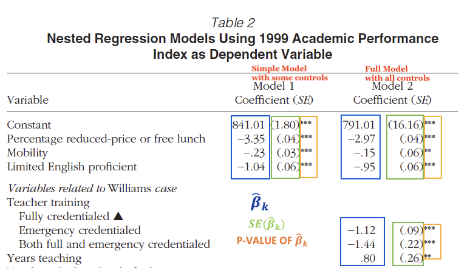

### Where are we going....

- This Lecture
  - Introduction to multivariate regression
  - Introduction to reading methods/results sections for empirical articles

- Homework and Reading
  - Problem Set #10 
  - Reading for next Lecture:
    - Powers, J. M. (2004). High-Stakes Accountability and Equity: Using Evidence From California’s Public Schools Accountability Act to Address the Issues in Williams v. State of California. _American Educational Research Journal_, 41(4), 763–795.

- Next Lecture
  - Other OLS assumptions
  - Graphing multivariate regression results
  - Creating publication quality tables
  
- Next Next Lecture
  - Introduction to non-linear relationships between X and Y
  - Mini lesson on what each section of manuscript should accomplish!
  

# Introduction to Multivariate Regression

### Population Regression Model

- Same as in "simple" (bivariate) regression; we just add more regressors (i.e., independent/control variables) into our model!

\medskip
Population Regression Model

- $Y_i = \beta_0 + \beta_1X_{1i} + \beta_2X_{2i} +$ ... $\beta_kX_{ki} + u_i$
- Where:
  - $Y_i$ = observation i of dependent variable
  - $X_{1i}$ = observation i of the __first regressor__, $X_1$
  - $X_{2i}$ = observation i of the __second regressor__, $X_2$
  - $X_{ki}$ = observation i of the __Kth regressor__, $X_k$
  - $\beta_1$ = population average effect of Y for "change" in $X_1$
    - if $X_1$ is continuous: average effect of Y for one-unit increase/decrease in $X_1$
    - if $X_1$ is categorical: population average effect of being in the non-reference group as opposed to the reference group
  - $\beta_2$ = population average effect of Y for "change" in $X_2$
  - $\beta_k$ = population average effect of Y for "change" $X_k$
  - $\beta_0$ = average value of Y when the value of _all independent variables ($X_1, X_2 ...X_k$) are equal to zero_
  - $u_i$ = all other variables that affect the value of $Y_i$ but are not included in the model 
  
### Things we do in regression; all work the same in multivariate! 

1. Estimation 
- Choose estimates for $\beta_0, \beta_1, \beta_2, ... \beta_k$ by selecting those that minimize the sum of squared errors (i.e., make the best prediction of Y), yielding an OLS line
  - $\hat{Y_i} = \hat{\beta_0} + \hat{\beta_1} X_{1i} + \hat{\beta_2} X_{2i} + ... \hat{\beta_k} X_{ki}$ 

2. Measures of model fit (e.g., $R^2$, SER) 
- But formulas change slightly to account for degrees of freedom!
- Once you introduce multiple independent variables, use adjusted R-squared
- Adjusted R-squared
  - Adjusted for the number of predictors in the model
  - Every independent variable we add to the model will increase our "normal" R-squared; but doesn't necessarily mean it's a better fit!
  - Adjusted R squared increases only if new variable improves the model more than would be expected by chance!

3. Prediction 
- Once you estimate OLS regression line, we can calculate predicted values for observations with particular values of all independent variables 
  - $\hat{Y_i} = \hat{\beta_0} + \hat{\beta_1} X_{1i} + \hat{\beta_2} X_{2i} + ... \hat{\beta_k} X_{ki}$ 
  
4. Hypothesis testing and confidence intervals about $\beta_1$
- Same as before but formulas for $\hat{\beta_1}$ and $SE(\hat{\beta_1})$ change slightly, but R calculates this for us!

### OLS Assumption 1: Conditional Independence Assumption

- OLS Assumption 1 (in words)
  - the independent variable $X_i$ is unrelated to the "other variables" not included in the model, $u_i$
- OLS Assumption 1 (mathematically)
  - $E(u_i|X_i)=0$; the expected value of $u_i$, given any value of $X_i$, equals zero
- Multivariate regression helps us meet the conditional independence assumption
  - In other words, we add variables into our model that if left out would violate the conditional independence assumption and bias our $\hat{\beta_1}$
- Example: What is the effect of participating in Mexican American Studies program (MAS) on academic achievement? 
  - We have to account for the fact that students choose to participate in MAS (self-selection bias); they were not randomly assigned to participate versus not participate in MAS!

### OLS Assumption 1: Conditional Independence Assumption

- What is the effect of participation in MAS on high school graduation?
- $Y_i = \beta_0 + \beta_1X_{1i} + \beta_2X_{2i} + \beta_3X_{3i} + u_i$
- Where: 
  - Y= GPA
  - X1 = 0/1 MAS participation [non-reference group]; Did not participate in MAS [reference group] 
  - X2= previous academic achievement
  - X3= socioeconomic status 
- __Conditional independence assumption__:
  - Once we include control variables, there are no longer any omitted variables, Z, that satisfy *both* of these two conditions:
    (1) Z affects value of Y *and*
    (2) Z has a relationship with X
- If we satisfy the conditional independence assumption through control variables, then multivariate regression is just as good as randomized assignment experiment! 
  - Warning: But we often don't have every single control variable we need, so we get as close as possible!
  
  
### Multivariate regression in Econometrics vs Social Science

- $Y_i = \beta_0 + \beta_1X_{1i} + \beta_2X_{2i} + \beta_3X_{3i} + u_i$
- Econometrics
  - We are only interested in estimating $\beta_1$ [the causal effect of $X_{1i}$ on Y]
  - The only reason we include other variables in the model besides X1 is to eliminate omitted variable bias
  - Therefore, we include all control variables that satisfy *both* conditions of omitted variable bias
  - Once we include control variables, and no other variables satisfy both conditions, then we satisfy the conditional independence assumption and we can estimate a causal effect!
- Traditional social science statistics [most of my research!]
  - Purpose of multiple regression is to add new variable to your model (e.g., $X_3$) to see the effect of $X_3$ on Y
  - Can lead to sloppy research if we take a "throw" everything and the kitchen sink into a model and see what's interesting!
  - We'll read some good examples of this type of research including our first empirical article next week:
    - Powers (2004)

### Multivariate regression in R

- Research question: What is the effect of student teacher ratio on student reading test scores?
- __Simple/Bivariate regression__
  - $Y_i = \beta_0 + \beta_1X_{1i} + u_i$
  - Where: 
    - Y= reading test scores
    - $X_1$ = student teacher ratio
  - General interpretation of $\hat{\beta_1}$: The average effect of a one-unit
increase in $X_1$ is associated with a $\hat{\beta_1}$ change in Y
    - The average effect of a one-unit
increase in student teacher ratio is associated with a 2.62 decrease in district average reading test scores
- __Multivariate regression__
  - $Y_i = \beta_0 + \beta_1X_{1i} + \beta_2X_{2i} + u_i$
  - Where: 
    - Y= student test scores
    - $X_1$ = student teacher ratio
    - $X_2$ = % ELL [from last week, established %ELL meets both conditions of omitted variable bias]
  - General interpretation of $\hat{\beta_1}$: The average effect of a one-unit increase in $X_1$ is associated with a $\hat{\beta_1}$ change in Y, __holding the value of $X_2$ constant__
    - The average effect of a one-unit increase in student teacher ratio is associated with a 1.29 decrease in district average reading test scores, __holding the value of %ELL students constant__

### What does "holding constant" mean?

- RQ: What is the effect of student teacher ratio on reading test scores?
  - $Y_i = \beta_0 + \beta_1X_{1i} + \beta_2X_{2i} + u_i$
  - Where: Y= student test scores, $X_1$ = student teacher ratio, $X_2$ = % ELL
- Setup:
  - We think student test scores go down if there's a greater percentage of ELL students in the classroom
    - First condition of omitted variable bias ( Z affects Y)
  - We think there is a negative relationship between percentage of ELL students in the classroom and student-teacher ratio
    - Second condition of omitted variable bias ( Z has a relationship with X)
- Problem:
  - We think student teacher ratio and percentage of ELL move together
  - We want to know the relationship between reading scores and student teacher ratio when "percent ELL" is not allowed to move!
- "Holding the value of $X_2$ constant"
  - Means to estimate the relationship between $X_1$ and Y when we don't allow the value of $X_2$ to vary
  - In other words, we analyze the relationship between student teacher ration ($X_1$) and reading test scores (Y) for applicants that have the same value of percent ELL ($X_2$) [calculus: partial derivatives!]
  
  
### What does "holding constant" mean? Another example....

- RQ: What is the relationship between years of education(X1) on income(Y), after controlling for years of work experience (X2)?
- General interpretation of $\hat{\beta_1}$:
  - The average effect of a one-unit increase in X1 is a $\hat{\beta_1}$ unit
increase in Y, holding the value of X2 constant
- Interpretation of $\hat{\beta_1}$, applied to example
  - The effect of having one additional year of education (X1) on income (Y), when we don't allow value of "years of experience" (X2) to change
  - Compare people with 2 years of college versus 3 years of college that have the same years experience to assess the "effect" of an additional year of education on income
- Said differently: analyze the effect of increasing years of education
on income for people who have same years of experience

### Interpreting $\hat{\beta_1}$ for continuous X

- RQ: What is the effect of student teacher ratio (X1) on average district reading test scores (X2)?
  - $Y_i = \beta_0 + \beta_1X_{1i} + \beta_2X_{2i} +  \beta_3X_{3i} + u_i$
  - Where: 
    - Y= reading test scores
    - $X_1$ = average district student teacher ratio
    - $X_2$ = 0/1 majority ELL district [greater than 50% ELL students= non-reference group; less than 50% ELL students=reference group]
    - $X_3$ = avg district income ($000s)
- General interpretation of $\hat{\beta_1}$ for continuous X [all are correct/same]
  - The average effect of a one unit increase in $X_1$ is a $\hat{\beta_1}$ unit change in Y, holding the values of $X_2$ and $X_3$ constant
  - OR The average effect of a one unit increase in $X_1$ is a $\hat{\beta_1}$ unit change in Y, after controlling for $X_2$ and $X_3$
  - The average effect of a one unit increase in $X_1$ is a $\hat{\beta_1}$ unit change in Y, holding the values of covariates constant
-  Run regression in R!
  - $\hat{Y_i} = \hat{\beta_0} + \hat{\beta_1} X_{1i} + \hat{\beta_2} X_{2i} +  \hat{\beta_3} X_{3i}$
  - $\hat{Y_i} = 646.2 - 0.8 X_{1i} -23.5 X_{2i} + 1.7 X_{3i}$
- Specific example interpretation [run regression in R]
  - The average effect of a one-unit increase in average district student teacher ratio (i.e., one additional student per teacher) is a 0.8 point decrease in average district reading score, holding the values of majority ELL and district average income constant

### Interpreting $\hat{\beta_1}$ for categorical X

- RQ: What is the effect of being a majority ELL district (X1) on average district reading test scores (X2)?
  - $Y_i = \beta_0 + \beta_1X_{1i} + \beta_2X_{2i} +  \beta_3X_{3i} + u_i$
  - Where: 
    - Y= reading test scores
    - $X_1$ = 0/1 majority ELL [non-reference group], $X_2$ = avg district student teacher ratio; $X_3$ = avg district income ($000s)
  - __Stylistic Note__: Your main independent variable of interest should always be $X_1$
- General interpretation of $\hat{\beta_1}$ for categorical X
  - Being [non-reference group] as opposed to [reference group] is associated with a $\hat{\beta_1}$ unit change in Y, holding the values of $X_2$ and $X_3$ constant
- Run regression in R [note: same coef values as previous model but in diff order!]
  - $\hat{Y_i} = \hat{\beta_0} + \hat{\beta_1} X_{1i} + \hat{\beta_2} X_{2i} +  \hat{\beta_3} X_{3i}$
  - $\hat{Y_i} = 646.2 - 23.5 X_{1i} -0.8 X_{2i} + 1.7 X_{3i}$
- Specific interpretation
  - Reference group vs non Reference group
    - 0 = non-ELL majority district [lowest value is automatically removed from regression as reference group]
    - 1 = majority ELL district [non-reference group is kept within regression; this is why the regression output coefficient says __`ell1`__]
  - Being a majority ELL district as opposed to a non-majority ELL district is associated with a 23.5 point decrease in average district reading scores, holding values of average student-teacher ratio and district average income constant

### Prediction still works the same way!
- RQ: What is the effect of being a majority ELL district (X1) on average district reading test scores (X2)?
  - $Y_i = \beta_0 + \beta_1X_{1i} + \beta_2X_{2i} +  \beta_3X_{3i} + u_i$
  - Where: 
    - Y= reading test scores
    - $X_1$ = 0/1 majority ELL district
    - $X_2$ = avg district student teacher ratio 
    - $X_3$ = avg district income ($000s)
- Run regression in R 
  - $\hat{Y_i} = \hat{\beta_0} + \hat{\beta_1} X_{1i} + \hat{\beta_2} X_{2i} +  \hat{\beta_3} X_{3i}$
  - $\hat{Y_i} = 646.2 - 23.5 X_{1i} -0.8 X_{2i} + 1.7 X_{3i}$
- What's the predicted average reading score for a district that is a non-ELL majority district, has a student teacher ratio of 25, and average district income of $22,000? 
  - $(Y| X_1=0, X_2=25, X_3=22)$ = 646.2 - (23.5 * 0) - (0.8 * 25) + (1.7 * 22)
  - $(Y| X_1=0, X_2=25, X_3=22)$ = 646.2 - (0) - (20) + (37.4)
  - $(Y| X_1=0, X_2=25, X_3=22)$ = 663.6
- What's the predicted average reading score for a district that is an ELL majority district, has a student teacher ratio of 19, and average district income of $26,000? 
  - $(Y| X_1=1, X_2=19, X_3=26)$ = 646.2 - (23.5 * 1) - (0.8 * 19) + (1.7 * 26)
  - $(Y| X_1=1, X_2=19, X_3=26)$ = 646.2 - (23.5) - (15.2) + (44.2)
  - $(Y| X_1=1, X_2=19, X_3=26)$ = 651.7
 
# Reading Empirical Regression Results

### Our first example of empirical regression results

Powers, J. M. (2004). High-Stakes Accountability and Equity: Using Evidence From California’s Public Schools Accountability Act to Address the Issues in Williams v. State of California. _American Educational Research Journal_, 41(4), 763–795.

\medskip

  - RQ: What is relationship between school resource variables and school-level academic performance index (API)?
  - Does not frame article as "causal inference" but Powers is doing exactly what we have learned in this lecture/class!
    - Attempts to analyze the effect of school resources (X) on the academic achievement of schools (Y) by controlling for variables that would be "systematically related" to the independent variables of interest and have an effect on the dependent variable
    - Does not have all possible controls to get to a "causal effect" equivalent to what we would estimate if the study was designed as an randomized control experiment. 

### How to read a methods section...

- The format of quantitative empirical research is pretty "standardized", which makes it easy to read as you get more experience...
- Methods section usually outlines the data used, sample, variables, and the methods used

\medskip
For Powers (2004):

- Data: uses data similar to our `caschools` (ours is district level; Powers uses school-level!)
- Sample: All CA schools that were assigned an API score 
  - 97% of full population of CA schools
- Variables: provides details on all the variables in the model!
  - Pay attention to how variables are constructed! 
  - Note that sometimes we don't have a variable we need, so we use a "proxy." It's the authors' responsibility to convince readers why the variable used is a good enough proxy for the unavailable variable needed
  - Empirical studies use a lot of variables in the model which are difficult to keep track of; so they are often "grouped" into categories (e.g., student characteristics, school resources, etc)
- Methodology: This section varies depending on the sophistication of the method. 
  - Sometimes they write out the full population regression model, sometimes they don't 
  - Linear regression is considered simple so in most cases they don't
  

### How to read results (descriptives)...
  
  
- Quantitative research studies __nearly always__ present the descriptive statistics of all variables used in a table
  - In most cases the mean and standard deviation is sufficient; if it's substantively important sometimes min and max (or can be covered within text of the variables sub-section of the methods section)
  - Sometimes authors dedicate space within text to explaining descriptive stats and sometimes they don't
    - Usually depends on how substantively important they are...
    - Most folks can read the table so authors will avoid spending too much limited space on descriptive statistics
    

  

### How to read results (regression models)...

- The way in which regression results are presented is well standardized across all fields and journals! [some exceptions]
-  Regression tables usually show the beta coefficient and standard error (usually in parentheses) for each independent variable
- Columns are individual models!
  - Tables usually start with a simple regression model in the first column that only includes the main independent variable(s) of interest: "model 1"
  - Then add control variables incrementally; sometimes done in groupings
  - This allows the author to show the "progression" in the models as variables are added in (particularly important for descriptive research to see changes in model fit statistics)
  - Although, sometimes models in separate columns can also indicate various samples; look at the headings/read the authors description of table!
- Read the table notes!
  - Provide the key for interpreting the significance levels of p-values as denoted by asterisks ( $*p\le 0.05$, $**p\le 0.01$,$***p\le 0.001$ )
  - Will also tell you what the reference category is for categorical variables!
  - Other useful information

### How to read results (regression models)...

