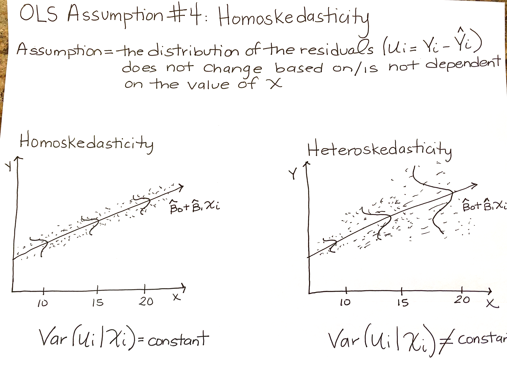

# Where are we going....

- This Lecture
  - Other OLS assumptions
  - Creating publication quality tables
  - Review:
    - Cabrera, N. L., Milem, J. F., Jaquette, O., & Marx, R. (2014). Missing the (student achievement) forest for all the (political) trees: Empiricism and the Mexican American Studies controversy in Tucson. American Educational Research Journal, 51(6), 1084-1118.

- Next Lecture
  - Introduction to non-linear relationships between X and Y
  - Mini lesson on what each section of manuscrupt should accomplish!
  - Review:
    - Powers, J. M. (2004). High-Stakes Accountability and Equity: Using Evidence From California’s Public Schools Accountability Act to Address the Issues in Williams v. State of California. American Educational Research Journal, 41(4), 763–795.
  

# Final Projects

## Final Projects are optional

- __Final projects are optional__
- You can decide to not move forward with your final project:
  - Don't feel "guilty" for not being able to complete this project
  - I already know you are all brilliant scholars, practitioners, educators!
  - Prioritize your health (physical & mental), loved ones...
- You can decide to move forward with your final project:
  - If you have the time/ability to do it and do it for your own professional development!
  - Send me an email to set up our first Zoom meeting to discuss RQ, topic, and data
  - We will set up a timeline
  - I will help you clean the data!

# OLS Assumptions

## OLS Assumptions

1. The conditional assumption of $u_i$ given $X_i$ has a mean a zero
2. ($X_i$, $Y_i$), $i=1, ...n$ are independently and identically distributed (i.i.d)
3. Large outliers are unlikely
4. Homoskedasticity

\medskip

- If these assumptions hold:
  - Then our OLS estimators, $\hat{\beta_0}$ and $\hat{\beta_1}$ have normal distributions in large samples
  - And because they have normal distributions, we can use $\hat{\beta_0}$ and $\hat{\beta_1}$ to test hypothesess about the population parameters $\beta_0$ and $\beta_1$
- If these assumptions are violated:
  - We produced inefficeint and biased estimates, $\hat{\beta_0}$ and $\hat{\beta_1}$, of the population parameters $\beta_0$ and $\beta_1$
  
## First OLS Assumption

1. __The conditional assumption of $u_i$ given $X_i$ has a mean a zero__
- What does this mean?
  - The independent variable $X_i$ is unrelated to all variables that were not included in the model (i.e., $u_i$)
  - If we violate this assumption, we produce a biased estimate!
  - What's a biased estimate? Consistenly overestimating or underestimating population parameter! [remember Lec 9?]
  - If $u_i$ given $X_i$ has a mean a zero = our predictions do not systematically over or underestimate, thus balance out to zero = no bias! 
- Thus far we have learned "simple regression" (i.e., one independent variable of interest) with a major flaw:
  - We ignore other "determinants" (i.e., control variables) of the dependent variable that correlate with our one independent variable of interest
  - Remember that  other "determinants" or "other variables that impact the dependent" variable that are not in our model are collected in the residual term $u_i$, which we have thus far *assumed* to be unrelated with the independent variable of interest
  - If we exclude these other determinants that are related to our independent variable of interest; we introduce estimation bias via an omitted variable!
- __Omitted Variable Bias__
    - Why does omitted variable bias violate OLS Assumption 1?
    - What happens when you omit a "Z" variable from your model? It is absorbed by the residual term!
    - We know that the "Z" variable omitted from the model is correlated to our independent variable of interest, which now means that our X is not uncorrelated to the residual = violation of OLS 1!

- Practical Example: What is the effect number of years of schooling on income?

- Practical Example: What is the effect number of years of schooling on income?
- $Y_i = \beta_0 + \beta_1X_i +u_1$
- There are lots of other factors that would influence income besides years of schooling!
  -  If we don't include them in the regression as control variables, they are thus relegated to the $u_1$ and we assume they are not systematically related to years of schooling.
  - If this excluded variable meets both conditions of omitted variable bias (Z affects Y and Z is related to X); then there is a systematic relationship and should not be in the residual! 
  - __By keeping it in the residual (i.e., excluding it from the model), we violate OLS Assumption 1 and produce a biased estimate!__
  
\medskip
In practice, OLS Assumption 1 is the most difficult to prove and the most important for program evaluation research!

- We can draw on the conditional independence assumption:
  - Once we include relevant control variables; there are no omitted variables that affect Y and have a systematic relationship with X
  - Meaning, if we satisfy the conditional independent assumption through control variables, then multiple regression is just as good as random assignment experiment (the gold standard of program evaluation!)
    
## Second OLS Assumption

2. __($X_i$, $Y_i$), $i=1, ...n$ are independently and identically distributed (i.i.d)__
- What does this mean?
  - This is about sampling!

\medskip

_($X_i$, $Y_i$), $i=1, ...n$ are independently distributed_

- Knowing that observation i takes on particular values for X and Y tells you nothing about the probability of the next observation taking on particular values for X and Y
- When is assumption of independently distributed violated? 
  - Longitudinal data: knowing a data point in one time period tells you something about a data point in another time period
    - Ex: Amount of \$ student received via a Federal Pell Grant freshman year at UA probably tells you something about how much \$ student received via a Federal Pell Grant sophmore year at UA
  - Hierarchical data: 
    - Ex: Students are nested within classrooms. Knowing the reading test score of one student in a classroom is probably correlated with reading test score for another student in the same classroom.  

_($X_i$, $Y_i$), $i=1, ...n$ are identically distributed_

- Prior to choosing sample of observations for the population, the probability distribution (i.e., the likelihood that $Y_i$ takes on certain values) is the same for all observation
- This is always true if you take a random sample!
  - One randomly selected observation has the same probability of taking on a certain value of $Y_i$ as another randomly selected observation 
- When is the assumption of identically distributed violated?
  - Sampling bias:
    - Ex: You want to investigate probability of being tardy to college lectures and take a sample of students living on campus. Sampling bias: you did not include commuter students. If you were to randomly select a student living on campus, they are not likely to have the same probability of being tardy to lecture than a randomly selected commuter student. 

## Third OLS Assumption

3. Large outliers are unlikely

- Outliers: observations with values of $X_i$ and $Y_i$ that are outside the "usual" range of the data
- Outliers will affect your regression coefficients! 
- Stock and Watson have a very technical, mathematical definition of when this likely; but in practice this is about really investigating/knowing your data
- In practice, if you do find outliers:
  - Be sure the data is entered correctly and cleaned
    - Ex: Survey data codes missing data as very unusual values (-99, -99, 99, 98)
  - Sometimes outliers can belong in the data! 
  - If they belong; use natural log of the variable
    - Ex: All money variables are usually converted to their natural log in econometrics or education research (e.g., state appropriations, tuition revenue, household income)

- OLS can be sensitive to an outlier; it will shift our OLS regression line!

## Fourth OLS Assumption

- The distribution of the residuals has constant variance (homoscedasticity)
- Homoskedasticity 
  - The distribution (the variance!) of the residuals, $u_i = Y_i - \hat{Y_i}$, is constant for all observations. That is, it does not change for different values of X
  - Homo-skedasticity = "equal" or "same" variances
- Heteroskedasticity
  - The distribution (the variance!) of the residuals, $u_i = Y_i - \hat{Y_i}$, is not constant for all observations. That is, it does change/differs for different values of X
  - Homo-skedasticity = "unequal" or "different" variances

  

- Homoskedasticity and Heteroskedasticity shown graphically....

- Practical example: What is the effect of student-teacher ratio on test scores? [Stock and Watson Example]

- Practical example: What is the effect of years of education on hourly wages? [Stock and Watson Example]

- Why is homoskedasticity/heteroskedasticity important?
  - Because our formula for calculating SE($\hat{\beta_1}$) changes based on homoskedastic or heteroskedastic residuals!
- In other statistics classes (non program evaluation/econometrics), homoskedasticity is the fourth core assumption
  - Stock and Watson only discuss the first three assumptions we have discussed as core "OLS Assumptions"
- Stock and Watson
  - It is NEARLY IMPOSSIBLE to assume homoskedasticity; we almost always violate this assumption!
  - But the solution to overcome this assumption is easy!
    - We calculate heteroskedastic standard errors; or in other words, standard errors that are __robust__ to violations of homoskedasticity
- __SOLUTION__
  - Rather than make homoskedasticity a core OLS Assumption and always violate it;
  - ALWAYS CALCULATE ROBUST STANDARD ERRORS AND DO NOT MAKE HOMOSKEDASTICITY A CORE OLS ASSUMPTION

# Creating (nearly!) Publication Quality Regression Tables

## Stargazer Library

- Need to install first via `install.packages("stargazer")`
- Package used to create publication ready tables
- Some resourses
  - [CRAN Package Documentation](https://cran.r-project.org/web/packages/stargazer/stargazer.pdf)
  - [CRAN Package Vignettes](https://cran.r-project.org/web/packages/stargazer/vignettes/stargazer.pdf)
  - [Helpful Presentation & Summary](https://www.princeton.edu/~otorres/NiceOutputR.pdf)
  - Google! Google! Google!

# Interpreting Regression Results in Journals

## Cabrera, Milem, Jaquette, and Marx (2014)

- __RQ__: What is the effect, if any, of Mexican American Studies participation in TUSD on student academic achievement?
- __Empirical Strategy Used__
  - Evaluate impact via meeting the conditional independent assumption
  - Conditional independence assumption: once all relevant control variables are included in the model (all those that meet the two conditions of omitted variable bias), regression can be just as good as random assignment experiment
  - They warn us, they don't have all the data they would need to control for, but it's the best effort that has been done!
- __Data__: TUSD Administrative Data, student-level
  - Dependent variable(s): AIMS math, reading, writing, all subjects passing rates; high school graduation
  - Independent varibale of interest: MAS participation
    - Non-participants = all students attending schools offering MAS classes but never took a course
    - Participants: students who enrolled in one or more MAS classes (try to identify "sweet" spot of # of courses)
- __Model__: Logistic Regression
  - Non-linear model because the dependent variables are not continuous
  - We will learn a "related" model in the next few weeks where we can run a linear regression on a 0/1 dummy variable: "linear probability model"

- Table 3: Marginal Effect of Participating in MAS, pg. 1103
  - Example of another "standard way" to format regression results
  - Common approach when you are showing lots of models!
  - Common approach when you only care about $\hat{\beta_1}$; you don't show coefficients for controls

\medskip

- How "to read" Table 3
  - Each "cell" is one regression model's $\hat{\beta_1}$ coefficient 
  - "Variables" on the rows are the dependent variable for each regression model:  Graduation & AIMS tests
  - Columns are the sample each regression model was run on: all cohorts, 2008-09, 2009-10, etc.
  - The coefficients are "marginal effects" not "log odd ratios"
    - Don't need to know this; you will learn this in HED 613 if you take it!
    - "Marginal effects" allow us to interpret similar to a linear regression!
    - Coefficient interpretation: Being in the non-reference group [MAS participant] as opposed to the reference group [Non-MAS Participant] is associated with a $\hat{\beta_1}$*100 percentage point change in the probability of going from 0 to 1 on the dependent variable (for example, 0=don't graduate high school, 1= graduate high school)

- How to interpret Table 3 for "schools offering MAS classes" and column "All Cohorts"
  - Graduation $\hat{\beta_1}$ Coefficient: 0.095*** Robust SE= 0.008
    - Interpretation: "On average, participating in MAS as opposed to not participating in MAS increased the probability of graduating high school by 9.5%, holding all covariates constant"
  - AIMS Reading $\hat{\beta_1}$ Coefficient: 0.093*** Robust SE= 0.017
    - Interpretation: "For students who initially failed the AIMS reading test, on average, participating in MAS as opposed to not participating in MAS increased the probability of subsequently passing the exam by 9.3%, holding all covariates constant"
  - AIMS Writing $\hat{\beta_1}$ Coefficient: 0.086*** Robust SE= 0.030
    - Interpretation: "For students who initially failed the AIMS writing test, on average, participating in MAS as opposed to not participating in MAS increased the probability of subsequently passing the exam by 8.6%, holding all covariates constant"
  - AIMS Math $\hat{\beta_1}$ Coefficient: 0.087*** Robust SE= 0.010
    - Interpretation: "For students who initially failed the AIMS math test, on average, participating in MAS as opposed to not participating in MAS increased the probability of subsequently passing the exam by 8.7%, holding all covariates constant"
  - AIMS All Tests $\hat{\beta_1}$ Coefficient: 0.068*** Robust SE= 0.011
    - Interpretation: "For students who initially failed one of AIMS tests, on average, participating in MAS as opposed to not participating in MAS increased the probability of subsequently passing all subject exams by 6.8%, holding all covariates constant"
    

- This is one of my favorite pieces of scholarship! Why? 
- This could easily be a student paper that is started in one of these statistics class!
  - Simple question: What is the effect of MAS participation on high school graduation?
- It's a topic that was so politically charged that policymakers were missing the "achievement" trees for the "political" forest!
  - But the approach was simple. Does the program help students academically? 
- Quantitative work is critiqued for "not being critical"
  - Yes, much is problematic!
    - Quantitative approaches to education research can reinforce privileged systems of knowing/learning/teaching 
    - Can use majoritarian assumptions to make blanket statements about students, uses race without acknowledging racism, attempts to "control" these characteristics/experiences
- But quantitative work can also contribute to a more just system of education!
  - Cabrera, Milem, Jaquette, and Marx (2014) is a great example of this!
- Also great example of public scholarship!
  - This is local scholarship! With real implications for our surrounding communities!
  - This research played a critical role in a federal judge deciding that the state of Arizona acted with discriminatory intent in banning the TUSD MAS Program
  - Banning the program violated student's First and Fourteenth Amendment rights..
