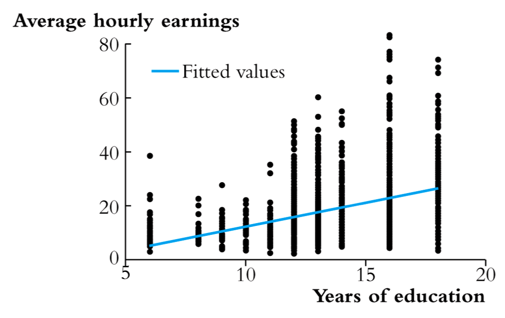

### Prepare for class

We'll be using the California Schools Data today; no need to re-download!

\medskip

1. Download the Lecture 11 PDF and R files for this week
    - Place all files in HED612_SP21 >>> lectures >>> lecture11
1. Open the RProject  (should be in your main HED612_SP21 folder)
1. Once the RStudio window opens, open the Lecture 11 R script by clicking on:
    - file >>> open file... >>> [navigate to lecture 11 folder] >>> lecture11.R
1. __Install the "RCurl" package in Lecture11.R__ 
    - If R prompts you to install `RCurl` and "its dependencies", go ahead and click install
    - If R doesn't prompt you, install via line 9 `install.packages("RCurl")`

### Where are we going....

- Last Two Weeks:
  - Moved from bivariate to multivariate regression!
  - How to avoid violating OLS Assumption 1 
    - Include variables that would result in omitted variable bias

\medskip

- This Week:
  - Other OLS assumptions
  - Some more multivariate regression practice
  - Reading Empirical Work:
    - Powers, J. M. (2004). High-Stakes Accountability and Equity: Using Evidence From California’s Public Schools Accountability Act to Address the Issues in Williams v. State of California. American Educational Research Journal, 41(4), 763–795.

### No Class Next Week: Final Project Meetings

- Next Week 4/7: No Class!
  - We're going to use the extra time to get started on final projects!
  - Instead of meeting for class: schedule at least a 30 min meeting with me!
    - Formulating RQ 
    - Operationalizing and cleaning variables
  - Link to sign up: [https://calendly.com/ksalazar_az/30min](https://calendly.com/ksalazar_az/30min) 
  - Submit PS11 after you have met with me!

\medskip

- Following Week 4/14:

  - Introduction to data transformations
    - Logs and Polynomials
  - Introduction to non-linear relationships between X and Y
  - Mini lesson on what each section of final project (Intro, Lit Review, Conceptual Framework, etc.) should accomplish!
  - Tutorial on automatic publication ready regression tables in R
   

# OLS Assumptions

### OLS Assumptions

1. The conditional assumption of $u_i$ given $X_i$ has a mean of zero
2. ($X_i$, $Y_i$), $i=1, ...n$ are independently and identically distributed (i.i.d)
3. Large outliers are unlikely
4. Homoskedasticity

\medskip

- If these assumptions hold:
  - Then our OLS estimators, $\hat{\beta_0}$, $\hat{\beta_1}$...$\hat{\beta_k}$, have normal distributions in large samples
  - And because they have normal distributions, we can use $\hat{\beta_0}$, $\hat{\beta_1}$...$\hat{\beta_k}$, to test hypothesess about the population parameters $\beta_0$,  $\beta_1$...$\beta_k$
- If these assumptions are violated:
  - We produced inefficeint and biased estimates, $\hat{\beta_0}$ and $\hat{\beta_1}$, of the population parameters $\beta_0$ and $\beta_1$
  
<!-- ### First OLS Assumption (Review) -->

<!-- 1. __The conditional assumption of $u_i$ given $X_i$ has a mean a zero__ -->
<!-- - What does this mean? -->
<!--   - The independent variable $X_i$ is unrelated to all variables that were not included in the model (i.e., $u_i$) -->
<!--   - If we violate this assumption, we produce a biased estimate! -->
<!--   - What's a biased estimate? Consistenly overestimating or underestimating population parameter! [remember Lec 9?] -->
<!--   - If $u_i$ given $X_i$ has a mean a zero = our predictions do not systematically over- or under-estimate, thus balance out to zero = no bias!  -->
<!-- - We learned "simple regression" (i.e., one independent variable of interest) has a major flaw: -->
<!--   - We ignore other "determinants" (i.e., control variables) of the dependent variable that correlate with our one independent variable of interest -->
<!--   - Remember that  other "determinants" or "other variables that impact the dependent" variable that are not in our model are collected in the residual term $u_i$, which we have thus far *assumed* to be unrelated with the independent variable of interest -->
<!--   - If we exclude these other determinants that are related to our independent variable of interest; we introduce estimation bias via an omitted variable! -->
<!-- - For __omitted variable bias__ to occur, the omitted variable “Z” must satisfy two conditions: -->
<!--     - (1) Z affects value of Y (i.e. Z is part of $u_i$); (2) *and* Z has a relationship with $X$ -->
<!--     - What happens when you omit a "Z" variable from your model? It is absorbed by the residual term! -->
<!--     - We know that the "Z" variable omitted from the model is correlated to our independent variable of interest, which now means that our _X is not uncorrelated to the residual = violation of OLS 1!_ -->

<!-- ### First OLS Assumption Graphically. -->

<!-- - Practical Example: What is the effect number of years of schooling on income? -->
<!-- - Show Graphically on doc camera -->

<!-- ### First OLS Assumption cont -->
<!-- - Practical Example: What is the effect number of years of schooling on income? -->
<!-- - $Y_i = \beta_0 + \beta_1X_i +u_1$ -->
<!-- - There are lots of other factors that would influence income besides years of schooling! -->
<!--   -  If we don't include them in the regression as control variables, they are thus relegated to the $u_1$ and we assume they are not systematically related to years of schooling. -->
<!--   - If this excluded variable meets both conditions of omitted variable bias (Z affects Y and Z is related to X); then there is a systematic relationship and should not be in the residual!  -->
<!--   - __By keeping it in the residual (i.e., excluding it from the model), we violate OLS Assumption 1 and produce a biased estimate!__ -->

<!-- \medskip -->
<!-- __In practice, OLS Assumption 1 is the most difficult to prove and the most important for econometrics research!__ -->

<!-- - We can draw on the conditional independence assumption: -->
<!--   - Once we include relevant control variables; there are no omitted variables that affect Y and have a systematic relationship with X -->
<!--   - Meaning, if we satisfy the conditional independent assumption through control variables, then multiple regression is just as good as random assignment experiment (the gold standard of program evaluation!) -->
<!--   - But remember this is hard to do "in practice" via observational data; so we get "as close as possible" and acknowledge limitations! -->

### Second OLS Assumption

2. __($X_i$, $Y_i$), $i=1, ...n$ are independently and identically distributed (i.i.d)__
- What does this mean?
  - This is about sampling!

\medskip

_($X_i$, $Y_i$), $i=1, ...n$ are independently distributed_

- In words: Knowing that observation i takes on particular values for X and Y tells you nothing about the probability of the next observation taking on particular values for X and Y
- When is assumption of independently distributed violated? 
  - Longitudinal data: knowing a data point in one time period tells you something about a data point in another time period. 
    - Ex: Amount of \$ student received via a Federal Pell Grant freshman year at UA probably tells you something about how much \$ student received via a Federal Pell Grant sophmore year at UA. Why? because Pell status is not likely to dramatically change from one year to another!
  - Hierarchical data: 
    - Ex: Students are nested within classrooms. Knowing the reading test score of one student in a classroom is probably correlated with reading test score for another student in the same classroom.
- Our course focuses on cross-sectional data (i.e., at one point in time); using OLS linear regression for cross-sectional data does not violate OLS Assumption #2
- Time Series and Hierarchical regression modeling is just one additional step from regression modeling you have learned in this course!
  - May create a survey course next academic year that applies what we have learned in this course to learning some of these more "complex" linear models!

### Second OLS Assumption cont. 

_($X_i$, $Y_i$), $i=1, ...n$ are identically distributed_

- Prior to choosing sample of observations for the population, the probability distribution (i.e., the likelihood that $Y_i$ takes on certain values) is the same for all observations
- This is always true if you take a random sample!
  - One randomly selected observation has the same probability of taking on a certain value of $Y_i$ as another randomly selected observation 
- When is the assumption of identically distributed violated?
  - Sampling bias:
    - Ex: You want to investigate probability of being tardy to college lectures and take a sample of students living on campus. Sampling bias: you did not include commuter students. If you were to randomly select a student living on campus, they are not likely to have the same probability of being tardy to lecture than a randomly selected commuter student. 

### Third OLS Assumption

3. Large outliers are unlikely

- Outliers: observations with values of $X_i$ and $Y_i$ that are outside the "usual" range of the data
- Outliers will affect your regression coefficients! 
- Why? Because outliers will shift our OLS regression line!

{width=85%}

### Third OLS Assumption cont.

- Stock and Watson have a very technical, mathematical definition of when this likely; but in practice this is about really investigating/knowing your data
- In practice, if you do find outliers:
  - Be sure the data is entered correctly and cleaned
    - Ex: Survey data codes missing data as very unusual values (-99, -99, 99, 98)
  - Sometimes outliers can belong in the data! 
  - If they belong; use natural log of the variable [we'll learn more about this next week via data transformations!]
    - Ex: All money variables are usually converted to their natural log in econometrics or education research (e.g., state appropriations, tuition revenue, household income)

### Fourth OLS Assumption [Not in Stock & Watson]

4. Homoskedasticity

- There is "generally" a fourth OLS assumption, but Stock and Watson do not list it in our textbook
  - I'll tell you why after we understand what it generally assumes...
- OLS Assumption #4: The distribution of the residuals has constant variance (homoscedasticity)
- Homoskedasticity 
  - The distribution (the variance!) of the residuals, $u_i = Y_i - \hat{Y_i}$, is constant for all observations. That is, it does not change for different values of X
  - Homo-skedasticity = "equal" or "same" variances
- Heteroskedasticity
  - The distribution (the variance!) of the residuals, $u_i = Y_i - \hat{Y_i}$, is not constant for all observations. That is, it does change/differs for different values of X
  - Hetero-skedasticity = "unequal" or "different" variances

  
### Fourth OLS Assumption cont.

- Homoskedasticity and Heteroskedasticity shown graphically

### Fourth OLS Assumption cont.

- Practical example: What is the effect of student-teacher ratio on test scores? [Stock and Watson Example]

<!-- ### Fourth OLS Assumption cont. -->

<!-- - Practical example: What is the effect of years of education on hourly wages? [Stock and Watson Example] -->

<!--  -->

### Fourth OLS Assumption cont.

- Why is homoskedasticity/heteroskedasticity important?
  - Because our formula for calculating SE($\hat{\beta_1}$) changes based on homoskedastic or heteroskedastic residuals!
  - Our standard error measures how far our $\hat{\beta_1}$ is likely to be from $\beta_1$. In other words, it is used to calculate our t-value in hypothesis testing to determine statistical significance!
- In other statistics classes (non-econometrics), homoskedasticity is the fourth core assumption
  - Stock and Watson only discuss the first three assumptions as core "OLS Assumptions"
- Why? Stock and Watson say:
  - It is NEARLY IMPOSSIBLE to assume homoskedasticity; we almost always violate this assumption!
  - But the solution to overcome this assumption is easy!
    - We can just calculate heteroskedastic standard errors
    - In other words, standard errors that are __robust__ to violations of homoskedasticity
- Stock and Watson say: 
  - Rather than make homoskedasticity a core OLS Assumption and nearly always violate it;
  - ALWAYS CALCULATE ROBUST STANDARD ERRORS AND DO NOT MAKE HOMOSKEDASTICITY A CORE OLS ASSUMPTION
  - Show in R

<!-- # Creating (nearly!) Publication Quality Regression Tables -->

<!-- ### Stargazer Library -->

<!-- - Need to install first via `install.packages("stargazer")` -->
<!-- - Package used to create publication ready tables -->
<!-- - Some resourses -->
<!--   - [CRAN Package Documentation](https://cran.r-project.org/web/packages/stargazer/stargazer.pdf) -->
<!--   - [CRAN Package Vignettes](https://cran.r-project.org/web/packages/stargazer/vignettes/stargazer.pdf) -->
<!--   - [Helpful Presentation & Summary](https://www.princeton.edu/~otorres/NiceOutputR.pdf) -->
<!--   - Google! Google! Google! -->

# Multivariate regression (Homework Review)

### Multivariate Regression Example

RQ: What is the effect of student-teacher ratio on reading test scores?

\medskip
Population Regression Model:

- $Y_i = \beta_0 + \beta_1X_{1i} + \mu_i$
  - Where:
  - $Y$ = average district reading scores
  - $X_{1}$ = average district student teacher ratio
- Let's add a categorical ELL variable
  - OVB: (1) ELL students are likley to score at lower reading levels than native english speakers; (2) **and** Greater proportion of ELL students require smaller class sizes
  - Categories: Low ELL District (0-20%); Moderate ELL District (21-50%); High ELL District (51%+)
- Let's also add continuous expenditures per student
  - OVB: (1) Districts with greater expenditures per student likely to have higher test scores (2) **and** Greater expenditures per student greater spending on teacher salaries and smaller class sizes
  
### Multivariate Regression Example
 
RQ: What is the effect of student-teacher ratio on reading test scores?

\medskip
Population Regression Model:

- $Y_i = \beta_0 + \beta_1X_{1i} + + \beta_2X_{2i} + + \beta_3X_{3i} + \beta_4X_{4i}  + \mu_i$
  - $Y$ = average district reading scores
  - $X_{1}$ = average district student teacher ratio
  - $X_{2}$ = 0/1 Moderate ELL District (21-50%); reference group is Low ELL District (0-20%)
  - $X_{3}$ = 0/1 High ELL District (51%+); reference group is Low ELL District (0-20%)
  - $X_{4}$ = average district expenditures per student ($000s)
- Create variables and run regression in R!

### Multivariate Regression Example
 
RQ: What is the effect of student-teacher ratio on reading test scores?

- OLS Line without estimates
  - $\hat{Y_i} = \hat{\beta_0} + \hat{\beta_1}X_{1i} + + \hat{\beta_2}X_{2i} + + \hat{\beta_3}X_{3i} + \hat{\beta_4}X_{4i}$
  - $\hat{Y_i} = \hat{\beta_0} + \hat{\beta_1}STR + \hat{\beta_2}ModerateELL + \hat{\beta_3}HighELL + \hat{\beta_4}Expend000$
- OLS Line with estimates
  - $\hat{Y_i} = 649.03 - (0.68*STR) - (22.31*ModerateELL) - (37.57*HighELL) +  (4.94*Expend000)$
- Interpreting Student-Teacher-Ratio as our IV of interest:
  - On average, one additional student per teacher ("one unit increase") in district average student-teacher-ratio is associated with 0.68 point decrease in average district reading scores, holding the values of covariates constant. However, our coefficient is not significant at the 0.05 level.
- Interpreting ELL as our IV of interest:
  - On average, being a "Moderate ELL district" as opposed to a "Low ELL district" is associated with 22.31 point decrease in reading scores (p<0.001), holding the values of covariates constant.
  - On average, being a "High ELL district" as opposed to a "Low ELL district" is associated with 37.57 point decrease in reading scores (p<0.001), holding the values of covariates constant.
- Interpreting Expenditures Per Student as our IV of interest:
  - On average, a \$1000 increase ("one unit increase") in expenditures per student is associated with 4.95 point increase in average district reading scores (p<0.01), holding the values of covariates constant.

# 10 Minute Break!
  

# Learning to Read Quantitative Empirical Work

### Powers (2004): Overall RQ, Analytical and Writting Approach!

- __Williams v. State of California__
  - Class action lawsuit against the State of California in 2000; public school students represented by a coalition of law firms, civil rights organizations
  - Argued that if schools and students are judged on the basis of their test scores (high stakes accountability policies), then students and schools should be provided with equal access to school-related resources needed for academic success
  - Specifically addressed need for qualified teachers, sufficient/up-to-date textbooks, and adequate/safe facilities
 - __Old legal approach to school financing__: focused on levels and formulas of spending
    - Didn't work because the state has minimal oversight of local educational control/"property taxes"; caps were eliminated via voter overrides; and the small proportion of state funding was given "equally"
  - __New legal approach to school financing__: _Williams v. State of California_ reframed the issue of school financing around the *conditions* of education rather than funding formulas!
    - Worked because the state is responsible for ensuring resources are used to produce desirable outcomes
- State of California argued that there was little empirical support that increased spending on resources identified in the case would increase student achievement
    - __RQ__: What is the relationship(s) between school and district characteristics on school's academic performance?
 
    
    
### Powers (2004): Overall RQ, Analytical and Writting Approach!
    
    
- __Empirical Strategy__
  - Powers is not trying to establish a causal effect of school/resource characteristics on API score explicitly (impossible given the observational data)
  - But she is trying to isolate the Williams Case variables "relationship" on schools' academic performance by controlling for other factors that may be driving variation in schools' academic performance!
    - See on See pg.766 for rationale in including control variables
    - "To ensure the findings related to Williams variables are robust, that is, they are not systematically related to student, school, and district characteristics"
  - But still analyzing "descriptive relationships", not "causal relationships"
- __Literature Review Strategy__
  - HOW you format your literature review depends on your RQ and what is substantively important
  (1) Focus on reviewing scholarship about your X (most econometrics studies do this)
      - Ex: What is the effect of receiving a Pell Grant on achievement?; review scholarship on the effect of Pell grants on all student outcomes (GPA, graduation, labor market, etc.)
  (2) Focus on reviewing scholarship about your Y (many prediction/descriptive studies do this)
      - EX: What is the (predicted) probability of a student persisting into their 2nd year of college?; review scholarship on what we know about persistence (more likely to persist if you're involved on campus, live on campus, etc.)
  (3) Focus on reviewing scholarship that specifically speaks to the _relationship_ between X and Y
      - Ex: POWERS (2004,  p.772): What do we know about the relationship between school resources and academic achievement 
  
  
### Powers (2004)
  
- __Data__: California DOE Data, school-level; Census Data; Federal School Data
  - Dependent variable(s): ? 
  - Independent variable(s) of interest: ?
    - Hint there are three groupings and they are related to the Williams Case
  - Control Variables: ?
    - Hint there are two groupings!
    - Some control variables left out due to "collinearity"
    - __Collinearity__: When two or more of your independent variables are highly correlated; so correlated that adding just one of them explains both of their "effect" on the dependent variable. In other words including BOTH independent variables that are highly correlated is redundant and takes up statistical power
    - R will automatically drop variables if there is collinearity!
    
- __Model__: OLS Linear Regression 
  - Powers doesn't write out the equation for the study!
  - Let's write it ourselves! [at least for the three groups of variables for Williams Case]
  

### Powers (2004)

- Table 2:  Nested Regression Models Using 1999 API Index as DV, pg. 781
  - The most "standard way" to format regression results
  - You show the "progression" towards your final regression model via multiple models
    - Intercept-only model (no independent variables) [Powers didnt show this]
    - Model 1 can have your independent variable of interest (standard for program eval) or some variables (Powers did student characteristics)
    - Models 2+... shows the addition of control variables 
  - Shows beta coefficients, standard errors, and significant levels!
- Does show model fit statistics!
  - Powers is not writing from a program evaluation standpoint
  - Rather she's trying to show how variables from Williams Case explain (predict!) API scores
  - In this case, measures of model fit are important
  - $R^2$ increases from Model 1 to Model 2
    - Change in $R^2$ doesn't mean that Williams case IVs add "little" explanation; see pg 782!
  - In text, she mentions overall F-test is significant from Model 1 to Model 2
  - F-test is related to $R^2$
    - $H_0$: model with no independent variables (or limited IVs) fits the data just as well as model with full variables
    - $H_a$: model with more variables fits the data better than model with no IVs

### Powers (2004)

- Interpretation for Table 2 for Williams Case Variables
- In text, she hardly interprets beta coefficients beyond "significance and direction" 
  - Only sometimes mentions the magnitude of the coefficient 
  - This approach is common in "descriptive research" 

- __Teacher training__ (reference group is fully credentialed teachers)
  - __Emergency Credentialed $\hat{\beta}$ Coefficient: -1.12*** SE= 0.09__
    - Interpretation: "On average, one-percentage-point increase in a school teaching staff’s proportion of emergency credentialed teachers (as opposed to fully credentialed teachers) is associated with a 1.12 point decrease in API score, holding all covariates constant"
- __Teacher Experience__ 
  - __Years teaching $\hat{\beta}$ Coefficient: .80** SE= 0.26__
    - Interpretation: "A one year increase in a school teaching staff's average years of experience, on average, is associated with a 0.80 point increase in API score, holding all covariates constant"  
- __Teacher Education__ (reference group is less than M.A)
  - __Greater than MA $\hat{\beta}$ Coefficient: .42*** SE= 0.06__
    - Interpretation: "On average, a one-percentage-point increase in a school teaching staff’s proportion of teachers with greater than MA degree (as opposed to lower than MA teachers) is associated with a 0.42 point increase in API score, holding all covariates constant"
- __School Calendar__ (reference group is traditional year)
  - __Concept 6 $\hat{\beta}$ Coefficient: -34.46*** SE= 4.52__
    - Interpretation: "On average, being a school with a Concept 6 Calendar as opposed to a Traditional Calendar is associated with a 34.46 point decrease in API score, holding all covariates constant"

- __Textbooks__
  - __Per-pupil textbook expenditures $\hat{\beta}$ Coefficient: .11*** SE=0.003__
    - Interpretation: "A \$1 increase in per-pupil expenditures for textbooks is associated with a 0.1 point increase in API score, holding all covariates constant"  
    - Interpretation: "A \$10 increase in per-pupil expenditures for textbooks, on average, is associated with a 1 point increase in API score, holding all covariates constant"  
    - Interpretation: "A \$100 increase in per-pupil expenditures for textbooks, on average, is associated with a 10 point increase in API score, holding all covariates constant"  

### Powers (2004)

Why do I like this piece of scholarship?

- The methods are simple!
  - Impactful research does not need to have complex methods!
  - Study does not use any analyses/methods beyond what we have learned so far in an introductory regression class; yet it is published in the AERA flagship journal 
- Example of how to deal with "metrics" that I fundamentally disagree with but are part of our educational reality
  -  Metrics like SAT/ACT scores, standardized K-12 test, are "firmly entrenched part of the political landscape" that schools and students must navigate 
  - In many cases, they are institutionalized within federal, state, and university/school policies
  - "Aim is to make a strong argument for equity by marshaling the very data that dominate the political discourse" (p. 765)
- Direct response to policies
- Cool understanding of legal logic when it comes to education finance!

<!-- ### Cabrera, Milem, Jaquette, and Marx (2014) -->
<!-- - __RQ__: What is the effect, if any, of Mexican American Studies participation -->
<!-- in TUSD on student academic achievement? - __Empirical Strategy Used__ - -->
<!-- Evaluate impact via meeting the conditional independent assumption - Conditional -->
<!-- independence assumption: once all relevant control variables are included in the -->
<!-- model (all those that meet the two conditions of omitted variable bias), -->
<!-- regression can be just as good as random assignment experiment - They warn us, -->
<!-- they don't have all the data they would need to control for, but it's the best -->
<!-- effort that has been done! - __Data__: TUSD Administrative Data, student-level - -->
<!-- Dependent variable(s): AIMS math, reading, writing, all subjects passing rates; -->
<!-- high school graduation - Independent varibale of interest: MAS participation - -->
<!-- Non-participants = all students attending schools offering MAS classes but never -->
<!-- took a course - Participants: students who enrolled in one or more MAS classes -->
<!-- (try to identify "sweet" spot of # of courses) - __Model__: Logistic Regression -->
<!-- - Non-linear model because the dependent variables are not continuous - We will -->
<!-- learn a "related" model in the next few weeks where we can run a linear -->
<!-- regression on a 0/1 dummy variable: "linear probability model" -->
<!-- ### Cabrera, Milem, Jaquette, and Marx (2014) -->
<!-- - Table 3: Marginal Effect of Participating in MAS, pg. 1103 - Example of -->
<!-- another "standard way" to format regression results - Common approach when you -->
<!-- are showing lots of models! - Common approach when you only care about -->
<!-- $\hat{\beta_1}$; you don't show coefficients for controls -->
<!-- \medskip -->
<!-- - How "to read" Table 3 - Each "cell" is one regression model's $\hat{\beta_1}$ -->
<!-- coefficient - "Variables" on the rows are the dependent variable for each -->
<!-- regression model:  Graduation & AIMS tests - Columns are the sample each -->
<!-- regression model was run on: all cohorts, 2008-09, 2009-10, etc. - The -->
<!-- coefficients are "marginal effects" not "log odd ratios" - Don't need to know -->
<!-- this; you will learn this in HED 613 if you take it! - "Marginal effects" allow -->
<!-- us to interpret similar to a linear regression! - Coefficient interpretation: -->
<!-- Being in the non-reference group [MAS participant] as opposed to the reference -->
<!-- group [Non-MAS Participant] is associated with a $\hat{\beta_1}$*100 percentage -->
<!-- point change in the probability of going from 0 to 1 on the dependent variable -->
<!-- (for example, 0=don't graduate high school, 1= graduate high school) -->
<!-- ### Cabrera, Milem, Jaquette, and Marx (2014) -->
<!-- - How to interpret Table 3 for "schools offering MAS classes" and column "All -->
<!-- Cohorts" - Graduation $\hat{\beta_1}$ Coefficient: 0.095*** Robust SE= 0.008 - -->
<!-- Interpretation: "On average, participating in MAS as opposed to not -->
<!-- participating in MAS increased the probability of graduating high school by -->
<!-- 9.5%, holding all covariates constant" - AIMS Reading $\hat{\beta_1}$ -->
<!-- Coefficient: 0.093*** Robust SE= 0.017 - Interpretation: "For students who -->
<!-- initially failed the AIMS reading test, on average, participating in MAS as -->
<!-- opposed to not participating in MAS increased the probability of subsequently -->
<!-- passing the exam by 9.3%, holding all covariates constant" - AIMS Writing -->
<!-- $\hat{\beta_1}$ Coefficient: 0.086*** Robust SE= 0.030 - Interpretation: "For -->
<!-- students who initially failed the AIMS writing test, on average, participating -->
<!-- in MAS as opposed to not participating in MAS increased the probability of -->
<!-- subsequently passing the exam by 8.6%, holding all covariates constant" - AIMS -->
<!-- Math $\hat{\beta_1}$ Coefficient: 0.087*** Robust SE= 0.010 - Interpretation: -->
<!-- "For students who initially failed the AIMS math test, on average, participating -->
<!-- in MAS as opposed to not participating in MAS increased the probability of -->
<!-- subsequently passing the exam by 8.7%, holding all covariates constant" - AIMS -->
<!-- All Tests $\hat{\beta_1}$ Coefficient: 0.068*** Robust SE= 0.011 - -->
<!-- Interpretation: "For students who initially failed one of AIMS tests, on -->
<!-- average, participating in MAS as opposed to not participating in MAS increased -->
<!-- the probability of subsequently passing all subject exams by 6.8%, holding all -->
<!-- covariates constant" -->
<!-- ### Cabrera, Milem, Jaquette, and Marx (2014) -->
<!-- - This is one of my favorite pieces of scholarship! Why? - This could easily be -->
<!-- a student paper that is started in one of these statistics class! - Simple -->
<!-- question: What is the effect of MAS participation on high school graduation? - -->
<!-- It's a topic that was so politically charged that policymakers were missing the -->
<!-- "achievement" trees for the "political" forest! - But the approach was simple. -->
<!-- Does the program help students academically? - Quantitative work is critiqued -->
<!-- for "not being critical" - Yes, much is problematic! - Quantitative approaches -->
<!-- to education research can reinforce privileged systems of -->
<!-- knowing/learning/teaching - Can use majoritarian assumptions to make blanket -->
<!-- statements about students, uses race without acknowledging racism, attempts to -->
<!-- "control" these characteristics/experiences - But quantitative work can also -->
<!-- contribute to a more just system of education! - Cabrera, Milem, Jaquette, and -->
<!-- Marx (2014) is a great example of this! - Also great example of public -->
<!-- scholarship! - This is local scholarship! With real implications for our -->
<!-- surrounding communities! - This research played a critical role in a federal -->
<!-- judge deciding that the state of Arizona acted with discriminatory intent in -->
<!-- banning the TUSD MAS Program - Banning the program violated student's First and -->
<!-- Fourteenth Amendment rights.. -->
