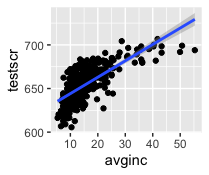
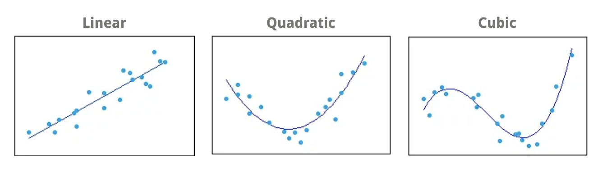
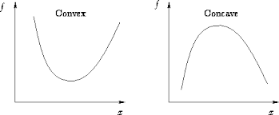

### Classes for Fall 2020

- HED 696C 005: Data management/manipulation in R
  - Thursdays 4:15-6:45PM
  
- HED 696C 003: Finance, enrollment management, and recruiting
  - Wednesdays 4:15-6:45PM

### Where are we going....

- This Lecture
  - Introduction to non-linear functions
    - Polynomials
  - Review:
    - Powers, J. M. (2004). High-Stakes Accountability and Equity: Using Evidence From California’s Public Schools Accountability Act to Address the Issues in Williams v. State of California. American Educational Research Journal, 41(4), 763–795.

- Next Lecture
  - Non-linear functions cont. 
    - Logs
    - intro to interaction effects
  - Mini lesson on what each section of manuscrupt should accomplish!

# Introduction to non-linear functions: Polynomials

### Linear vs Non-Linear Models
- Non-linear relationships can be confusing and difficult to understand!
  - So far we have learned **linear** multiple regression model via OLS estimation
    - $Y_i = \beta_0 + \beta_1X_{1i} + \beta_2X_{2i} + ... \beta_kX_{ki}$
  - But OLS linear regression equation/model doesn't only produce straight lines; it can fit curves to your data!
- Two ways to think of "non-linearity":
  - Regression model that is a nonlinear function of the independent variables $X_{1i}, X_{2i}... X_{ki}$
    - This can be estimated by OLS regression model!
  - Regression model that is a nonlinear function of the coefficients $\beta_1, \beta_2... \beta_k$
    - This can't be estimated by OLS!
- The way I think about this
  - Is Y continous? If so, then use linear regression model estimated via OLS and model curvitures in the data using nonlinear functions of the independent variables
  - Is Y is categorical? Is so, then you need a different estimation method (e.g., logistic regression via Maximum Likelihood estimation) that will model nonlinear functions in the coefficients!
    - Exception if Y is a dummy variable (i.e., binary) then you can run a linear probability model

### Nonlinear functions of the IVs, $X_{1i}, X_{2i}... X_{ki}$

- OLS linear regression can model nonlinear function of the independent variables $X_{1i}, X_{2i}... X_{ki}$ in two different ways!
- __1. The effect of $X_{1i}$ on Y depends on $X_{1i}$__
  - Ex: The effect of class size (x) on student test scores (Y) is bigger when initial class size is small
  - In other words, the negative effect of increasing class size on test scores is much larger when class size increases from 15 to 16 than when class size increases from 25 to 26
- __2. The effect of $X_{1i}$ on Y depends on $X_{2i}$__
  - Ex: The effect of class size (x) on student test scores (Y) depend on the number of ELL students in the class
  - Ex: The effect of class size (x) on student test scores (Y) depends on the teachers' years of experience

### The effect of $X_{1i}$ on Y depends on $X_{1i}$

- Let's investigate the effect of district average income (in per capita) on student test scores...
- Do we think there's a positive or negative linear relationship? 
- Does the linear model fit the data well?
  - Lets plot it and check!
- Doesn't look like a linear model fits the data! 
  - In other words, the linear model _overestimates_ the relationship between Avg Income and Test Scores when income is really high or very low; and it _underestimates_ the relationship for the middle income districts 
- __Problem: the effect of $X_{1i}$ on Y depends on $X_{1i}$__

### Polynomials

RQ: What is the effect of district income on average student test scores?

- __Problem__: the effect of $X_{1i}$ on Y depends on $X_{1i}$
- __Solution__: use a polynomial in X

\medskip
__Polynomials__

- Polynomials are independent variables that you raise to a power (e.g., squared or cubed terms)
  - In practice: to determine the correct polynomial term to include, count the number of "curves" or "bends" in your data!
  - "Quadratic" or $X^2$ = one bend or one curve
  - "Cubic" or $X^3$ = two bends or two curves
- We usually only model a qudratic! Cubics are rare! I have never used or seen a quartic term +
  - Why? Because polynomials are difficult to interpret the higher term you use
  - If you have so many "bends" then in practice, convert your continous X into a categorical X!
  

### Polynomials: Equation

RQ: What is the effect of district income on average student test scores?

- __Problem__: the effect of $X_{1i}$ on Y depends on $X_{1i}$
- __Solution__: use a quadratic in X

Population regression model

- Without quadratic:
  - $Y_i = \beta_0 + \beta_1X_{1i} +u_i$
  - Where $Y_i$ = district average test scores; $X_1$= district income
- With quadratic:
  - $Y_i = \beta_0 + \beta_1X_{1i} + \beta_2{X_1i}^2 + u_i$
  - Where $Y_i$ = district average test scores; $X_1$= district income, ${X_1}^2$ = district income squared
  - ${X_1}^2$ or $income^2$ is treated as an additional explanatory variable!
- Run regressions in R
  - To run a _quadratic regression model in R_, we still use `lm()` but use two addtional functions `I()` + `^` to add the quadratic term
  - Why `I()`? 
    - Because R is an object-oriented programming language and operators `+, -, *, ^` have non-arithmetic functions too. 
    - Using `I()` tells R that we are using them arithmetically and that the operator should be passed "arithmetically" to the `formula` class object creaated via `lm()`

### Polynomials: Interpretation

- RQ: What is the effect of district income on average student test scores?
- $Y_i = \beta_0 + \beta_1X_{1i} + \beta_2{X_1i}^2 + u_i$
  - Where $Y_i$ = district average test scores; $X_1$= district income, ${X_1}^2$ = district income squared
- $\hat{Y_i} = \hat{\beta_0} + \hat{\beta_1}X_{1i} + \hat{\beta_2}{X_1i}^2$
- $\hat{Y_i} = 607.30 + 3.85X_{1i} - 0.04{X_1i}^2$
- Test whether the relationship between test scores and district income is linear against the alternative that it is quadratic
  - $H_0$: $\beta_2 = 0$ (e.g., relationship is linear)
  - $H_a$: $\beta_2 \ne 0$ (e.g., relationship is quadratic)
  - You could use the t-score and draw the sampling distribution just as we have been doing regarding $\beta_1$
  - But R will give you the associated p-value for a two-sided hypothesis
  - If our p-value is below the alpha level ($\alpha= .05$); we reject the null!
- $\beta_2$ p-value = 0.00000; reject the null in favor of the alternative. In other words, there is a significant, quadratic relationship between test scores and district income! 

### Polynomials: Interpretation of $\hat{\beta_1}$

- Plot data with a linear and quadratic line in R
- How do we interpret our beta coefficients?

\medskip
__$\hat{\beta_1}$__

- Gives the rate of change in Y when X=0; but we don't have any districts with \$0k income
- Calculate $\hat{Y}$ to see rates of change at different values of X!
  - Will show you how to do this by hand
  - Use `predict()` in R

### Polynomials: Interpretation $\hat{\beta_1}$

__Example 1: What is the change in average student test scores for change in \$10k to \$11k income__

  - Rate of change = the difference in predicted test scores ($\hat{Y}$) of the two X values
    - OLS Prediction Line: $\hat{Y_i} = 607.30 + 3.85X_{1i} - 0.04{X_1i}^2$
    - ($\Delta{Y}$|X=10 to 11): ($607.30 + 3.85*11 - 0.04*11^2$) - ($607.30 + 3.85*10 - 0.04*10^2$)
    - ($\Delta{Y}$|X=10 to 11): (644.5432) - (641.5807)
    - ($\Delta{Y}$|X=10 to 11 = 2.9625
  - A change from \$10k to \$11k in average district income per capita is associated with a 2.9625 increase in average student test scores
  
__Example 2: What is the change in average student test scores for change in \$40k to \$41k income__

  - Rate of change = the difference in predicted test scores ($\hat{Y}$) of the two X values
    - OLS Prediction Line: $\hat{Y_i} = 607.30 + 3.85X_{1i} - 0.04{X_1i}^2$
    - ($\Delta{Y}$|X=40 to 41): ($607.30 + 3.85*41 - 0.04*41^2$) - ($607.30 + 3.85*40 - 0.04*40^2$)
    - ($\Delta{Y}$|X=40 to 41): (694.0696) - (693.6457)
    - ($\Delta{Y}$|X=40 to 41) = 0.4239
  - A change from \$40k to \$41k in average district income per capita is associated with a 0.4239 increase in average student test scores

### Polynomials: Interpretation $\hat{\beta_2}$

- How do we interpret our beta coefficients?

\medskip
__$\hat{\beta_2}$__

- Gives us the the direction and steepness of the curve
- Direction = positive or negative coefficient
  - If the sign of the coefficient is negative = curve is concave (apex at the top, curve opens down)
  - If the sign of the coefficient is positive = curve is convex (apex at the bottom, curve opens up)
- Steepness = magnitude of the value of the coefficient
  - The greater the value the steeper the curve!

# Interpreting Regression Results in Journals

### Powers (2004)

- __RQ__: What is the relationship(s) between school and district characteristics on school's Academic Performance Index?
  - Old legal approach to school financing: focused on levels and patterns of spending
    - Didn't work because the state has minimal oversight of local educational control/"property taxes"; caps were eliminated via voter overrides; and what the small proportion of state funding was given "equally"
  - New legal approach to school financing: _Williams v. State of California_ reframed the issue of school financing around the *conditions* of education rather than funding!
    - Worked because the state is responsible for ensuring resources are used to produce desirable outcomes
- __Empirical Strategy Used__
  - She's not trying to establish a causal effect of school/resource characteristics on API score; rather she's trying to show that API score can be predicted by William's case variables!
  - See pg.766 for rationale in including control variables
    - "To ensure the findings related to Williams variables are robust, that is, they are not systematically related to student, school, and district characteristics"
  - But still analyzing "descriptive relationships", not "causal relationships"
- __Data__: California DOE Data, school-level
  - Dependent variable(s): Academic Performance Index 
  - Independent variable(s) of interest: variables related to main issues of Williams case
    - Teacher quality
    - Condition of facilities
    - Quality/Supply of textbooks
  - Control Variables: 
    - Variables related to students' socioeconomic backgrounds
    - School and district control variables (student teacher ratio, school size, district locale, expenditures, etc)
- __Model__: OLS Linear Regression 

### Powers (2004)

- Table 2:  Nested Regression Models Using 1999 API Index as DV, pg. 781
  - The most "standard way" to format regression results
  - You show the "progression" towards your final regression model via multiple models
    - Intercept-only model (no independent variables) [Powers didnt show this]
    - Model 1 can have your independent variable of interest (standard for program eval) or some variables (Powers did student characteristics)
    - Models 2+... shows the addition of control variables 
  - Shows beta coefficients, standard errors, and significant levels!
- Does show model fit statistics!
  - Powers is not writing from a program evaluation standpoint
  - Rather she's trying to show how variables from Williams Case explain (predict!) API scores
  - In this case, measures of model fit are important
  - $R^2$ increases from Model 1 to Model 2
    - Variable for Williams case and school/district characterstics explain additional 3% (81% total)
    - Change in $R^2$ doesn't mean that Williams case IVs add "little" explanation; see pg 782!
  - In text, she mentions overall F-test is significant from Model 1 to Model 2
  - F-test is related to $R^2$
    - $H_0$: model with no independent variables (or limited IVs) fits the data just as well as model with full variables
    - $H_a$: model with more variables fits the data better than model with no IVs

### Powers (2004)

- Interpretation for Table 2 for Williams Case Variables
- In text, she doesn't interpret them much beyond "significance and direction" 
  - Only sometimes mentions the magnitude of the coefficient by large vs. small
  - This approach is common in "descriptive research" 

- Teacher training (reference group is fully credentialed teachers)
  - __Emergency Credentialed $\hat{\beta_1}$ Coefficient: -1.12*** SE= 0.09__
    - Interpretation: "On average, one-percentage-point increase in a school teaching staff’s proportion of emergency credentialed teachers (as opposed to fully credentialed teachers) is associated with a 1.12 point decrease in API score, holding all covariates constant"

- Teacher Education (reference group is less than M.A)
  - __Greater than MA $\hat{\beta_1}$ Coefficient: .42*** SE= 0.06__
    - Interpretation: "On average, a one-percentage-point increase in a school teaching staff’s proportion of teachers with greater than MA degree (as opposed to lower than MA teachers) is associated with a 0.42 point increase in API score, holding all covariates constant"

- Teacher Experience 
  - __Years teaching $\hat{\beta_1}$ Coefficient: .80** SE= 0.26__
    - Interpretation: "A one year increase in a school teaching staff's average years of experience, on average, is associated with a 0.80 point increase in API score, holding all covariates constant"  
  
- Textbooks
  - __Per-pupil textbook expenditures $\hat{\beta_1}$ Coefficient: .11*** SE=0.003__
    - Interpretation: "A \$1 increase in per-pupil expenditures for textbooks is associated with a 0.1 point increase in API score, holding all covariates constant"  
    - Interpretation: "A \$10 increase in per-pupil expenditures for textbooks, on average, is associated with a 1 point increase in API score, holding all covariates constant"  
    - Interpretation: "A \$100 increase in per-pupil expenditures for textbooks, on average, is associated with a 10 point increase in API score, holding all covariates constant"  

### Powers (2004)

- Why do I like this piece of scholarship?
- Example of how to deal with "metrics" that I fundamentally disagree with but are part of our educational reality
  -  Metrics like SAT/ACT scores, standardized K-12 test, are "firmly entrenched part of the political landscape" that schools and students must navigate 
  - In many cases, they are institutionalized within federal, state, and university/school policies
  - "Aim is to make a strong argument for equity by marshaling the very data that dominate the political discourse" (p. 765)
- Direct response to policies
- Cool understanding of legal logic when it comes to education finance!