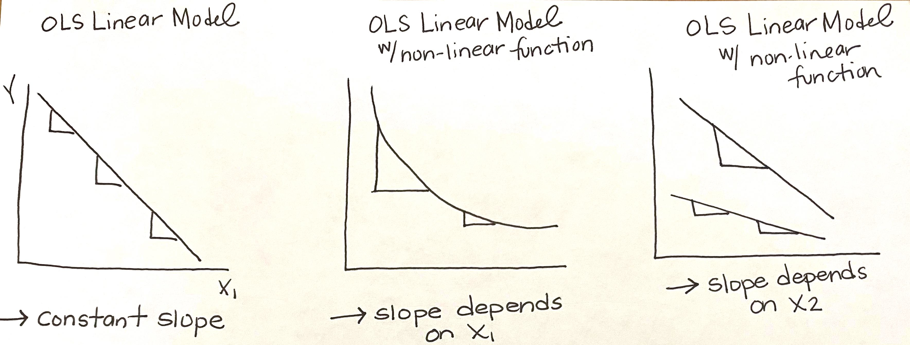

# Logistics

## Where are we going....
We have 3 lectures left! 

- This Lecture [4/16/2020]
  - Non-linear functions cont. 
    - Logs
  - Linear Probability Model 
    - Using a 0/1 dummy dependent vairable 
  - Reading:
    - Klasik, D., Blagg, K., & Pekor, Z. (2018). Out of the Education Desert: How Limited Local College Options are Associated with Inequity in Postsecondary Opportunities. Social Sciences, 7(9), 2018.
  - Homework Assignment #13 will be posted soon!
  
\medskip

- Next Lecture [4/23/2020]
  - Intro to interactions
    - Continuous by Categorical interactions 
  - Review Klasik et al (2018)

\medskip

- Next Next Lecture [4/30/2020, originally canceled on syllabus]
  - Categorical by Categorical interactions 
  - Continuous by Continuous interactions

\medskip

- Reading Day, "No Class" [5/7/2020]

## New R Package and Data! 

We're going to try out a textbook I'm considering for HED 613 that comes with an accopanying R package

- Applied Econometrics with R, Christian Kleiber & Achim Zeileis 
- [`AER` Package](https://rdrr.io/cran/AER/f/inst/doc/AER.pdf)
  - Comes with different functions and datasets!

\medskip

Federal Reserve Bank of Boston under Home Mortgage Disclosure Act (HDMA)

- `HDMA` is a sample of mortgage applications filed in Boston in the 1990s

  
  
# Non-linear functions Continued: Logarithms

## Linear vs Non-Linear Models
Two ways to think of "non-linearity":...

- __Regression model that is a nonlinear function of the independent variables $X_{1i}, X_{2i}... X_{ki}$__
  - _This can be estimated by OLS regression model via:
    - Polynomials
    - Logarithms
    - Interactions 

\medskip

- Regression model that is a nonlinear function of the coefficients $\beta_1, \beta_2... \beta_k$
  - This can't be estimated by OLS!
  - Only exception is __linear probability model__
    

## Nonlinear functions of the IVs, $X_{1i}, X_{2i}... X_{ki}$

- OLS linear regression can model nonlinear function of the independent variables $X_{1i}, X_{2i}... X_{ki}$ in two different ways!
- __1. The effect of $X_{1i}$ on Y depends on $X_{1i}$__
  - Ex: The negative effect of increasaing class size (x) on student test scores (Y) is "bigger" when initial class size is small
  - Solution: polynomials and logged versions of X
- __2. The effect of $X_{1i}$ on Y depends on $X_{2i}$__
  - Ex: The effect of class size (x) on student test scores (Y) depends on the teachers' years of experience
  - Solution: interaction effects

## Logarithms
- Besides polynomials, another way to specify a nonlinear function using OLS regression is to use the natural logarithm of Y and/or X.
- Logarithms allow changes in variables to be interpreted in terms of percentages
  - Ex: What is the effect of district income on test scores? 
  - A 1% change in district income (as opposed to for instance a $\$1000$ change) is associated with a $\hat{\beta_1}$ change in test scores
- Regression only uses Natural Logarithm, $ln(X)$
  - $ln(X)$ is the inverse of exponential function ($e^x$)
  - We dont use $log_{10}$
- We can use $ln(X)$ to interpret percent changes because:
  - $ln(X + \Delta X) - ln(X) \approx \frac{\Delta X}{X}$ when $\frac{\Delta X}{X}$ is small
  - In words: When the change in X is small, the difference between the log of X plus the change in X and the log of X is approxiately the percentage change in X
- Ex: $X=100, \Delta X = 1$
  - $\frac{\Delta X}{X}$ = $\frac{1}{100}$ = 0.01 (or 1%)
  - $ln(X + \Delta X) - ln(X)$ = $ln(100 + 1) - ln(100)$
  - plug into R console: `log(101) - log(100)` = 0.009950331 (or 1%)

Three cases where logarithms might be used...

1) __Linear-Log Model__: When X is transformed by taking its logarithm but Y is not
  - $Yi = \beta_0 + \beta_1$ $ln(X_{1i}) + ui$
  - We will cover this as the log transformation is on X! 
  - Remember OLS can model nonlinear functions of the independent variables

2) __Log-Linear Model__: When Y is transformed by taking its logarithm but X is not
  - $ln(Yi) = \beta_0 + \beta_1X_{1i} + ui$
  - There is substantial overlap between Log Linear Models and Logistic Models (non-linear model rather than non-linear function of X)
  - Will cover this in HED 613
  
3) __Log-Log Model__: When both X and Y are transformed by taking their logarithm 
  - $ln(Yi) = \beta_0 + \beta_1$ $ln(X_{1i}) + ui$
  - Will cover this in HED 613

## Linear-Log Model

__Linear-Log Model__: When X is transformed by taking its logarithm but Y is not

- RQ: What is the effect of district income on student test scores?
- __Pop Reg Model: $Yi = \beta_0 + \beta_1$ $ln(X_{1i}) + ui$__
  - Where Y= test scores, ln(X)= log of district income
- Run in R
- __OLS Prediction Line__
  - w/o estimates: $Yi = \hat{\beta_0} + \hat{\beta_1}$ $ln(X_{1i})$
  - w estimates: $Yi = 557.832 + 36.42*ln(X_{1i})$
- __Interpretation of $\hat{\beta_1}$__
  - General: a 1% increase in X is associated with a 0.01*$\hat{\beta_1}$ change in Y
  - a 1% increase in district average income per capita is associated with a 0.36 point increase (0.01*36.42) in district average test scores. 
- __Prediction__
  - Last week's example: what is the change in average student test scores for change in \$10k to \$11k income?
  - Still the same as last week, rate of change = the difference in predicted test scores ($\hat{Y}$) of the two X values
  - ($Yi = 557.832 + 36.42*ln(11)$) - ($Yi = 557.832 + 36.42*ln(11)$)
  - (645.1633) - (641.6921) = 3.4712

## Conceptual Approach to Modeling Nonlinearities using Multivariate Regression

__When the effect of $X_{1i}$ on Y depends on $X_{1i}$__

\medskip

1. Identify possible nonlinear relationship
    - Use theory and previous literature
    - Ask yourself if the slope of the regression line relationship between Y and X might reasonbly depend on the value of X or another independent variable
2. Plot the X and Y relationship; visually inspect the data!
3. Specify the nonlinear function that makes the most sense
    - Sometimes this is more practical than technical
    - How do you want to interpret the effect of X on Y? By % change (Log) or by different rates of change based on starting value of X (Polynomial)
    - Most time our control variables are the non-linear functions, not our independent variable of interest
    - In prediction, adding the non-linear term should increase model git
4. Determine whether the nonlinear model improves upon the linear model
    - Use the t-statistic on your nonlinear coefficient!
5. Replot the data using the nonlinear model; visually inspect the data again!

# Linear Probability Model

## Linear Probability Model

- Binary Variables (i.e., dummies, indicators) as dependent variables are very common in education research!
  - Y = Retention (0=dropped out, 1= persisted)
  - Y = Graduation (0= did not graduate, 1= graduated)
  - Y = Pass/Fail (0=Failed, Passed=1)
- Regression models with a binary dependent variable attempt to interpret the effect of X on the _probability_ of "success" (Y=1)
  - Or in some cases the probability of "failure" 
- Most social science disciplines model binary dependent variables via non-linear regression models
  - logistic regression [will cover in HED 613]
  - but interpretation can be difficult because of odds ratios
- Econometrics models binary dependent variables via _linear probability model_
  - Population parameters can be estimated via OLS!
  - Simple to estimate and interpret!
  - Only "tool" that doesn't carry over? $R^2$; but program evaluation is less concerned with model fit than hypothesis testing about the population parameter $\beta_1$

  
  
## Linear Probability Model, with Continuous X

- RQ: What is the effect of debt payment-to-income ratio on the probabibility of being denied a mortgage loan?
- __Pop Reg Model: $Yi = \beta_0 + \beta_1X_{1i} + ui$__
  - Y = `deny`(1= mortgage loan denied, 0= mortgage loan approved)
  - X = debt payment-to-income ratio (higher proportion = more debt, lower-proportion = less debt)
- Run in R
- __OLS Prediction Line__
  - w/o estimates: $Yi = \hat{\beta_0} + \hat{\beta_1}X_{1i}$
  - w estimates: $Yi = -0.07991 + 0.604*X_{1i}$
- __Interpretation of $\hat{\beta_1}$__
  - General: On average, a n-unit increase in X is associated with a (n-unit$*\hat{\beta_1})*100$ percentage point change in the probability of Y=1
  - On average, a 0.01 increase in payment-to-income ratio is associated with a 0.6 percentage-point increase $((0.01*0.604)*100)$ in the probability of being denied a mortgage loan. 
  - On average, a 0.25 increase in payment-to-income ratio is associated with a 15 percentage-point increase $((0.25 *0.604)*100)$ in the probability of being denied a mortgage loan.

## Linear Probability Model, with Categorical X

- RQ: What is the effect of an applicant's race on the probabibility of being denied a mortgage loan, holding debt payment-to-income ratio constant?
- __Pop Reg Model: $Yi = \beta_0 + \beta_1X_{1i} + \beta_2X_{2i} + ui$__
  - Y = `deny`(1= mortgage loan denied, 0= mortgage loan approved)
  - X1 = `afam`(1= African American applicant, 0= White applicant [reference group])
  - X2 = debt payment-to-income ratio
- Run in R
- __OLS Prediction Line__
  - w/o estimates: $Yi = \hat{\beta_0} + \hat{\beta_1}X_{1i} + \hat{\beta_2}X_{2i}$
  - w estimates: $Yi = -0.091 + 0.177*X_{1i} + 0.56*X_{2i}$
- __Interpretation of $\hat{\beta_1}$__
  - General: On average, being in the "non-reference group" as opposed to the "reference group" is associated with  a 100*$\hat{\beta_1}$ percentage point change in the probability of Y=1
  - On average, an African-American applicant as opposed to white applicant is associated with a 17.7 (100*0.177) percentage point increase in the probability of being denied a mortgage loan, holding debt payment-to-income ratio constant 
  

