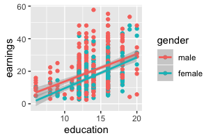

### Where are we going....

- Today's Lecture [4/23/2020]
  - Intro to interactions
    - Continuous by Categorical interactions 
  - Review Klasik et al (2018)

\medskip

- Next Lecture [4/30/2020, originally canceled on syllabus]
  - Categorical by Categorical interactions 
  - Continuous by Continuous interactions

\medskip

- Reading Day, "No Class" [5/7/2020]

### New R Package and Data! 

We're going to try out a textbook I'm considering for HED 613 that comes with an accopanying R package

- Applied Econometrics with R, Christian Kleiber & Achim Zeileis 
- [`AER` Package](https://rdrr.io/cran/AER/f/inst/doc/AER.pdf)
  - Comes with different functions and datasets!

\medskip

Current Population Survey

- The Current Population Survey (CPS), sponsored jointly by the U.S. Census Bureau and the U.S. Bureau of Labor Statistics (BLS), is the primary source of labor force statistics for the population of the United States

  
  
# Non-linear functions (Review)

### Linear vs Non-Linear Models
Two ways to think of "non-linearity":...

- __Regression model that is a nonlinear function of the independent variables $X_{1i}, X_{2i}... X_{ki}$__
  - _This can be estimated by OLS regression model via:
    - Polynomials
    - Logarithms
    - Interactions 

\medskip

- Regression model that is a nonlinear function of the coefficients $\beta_1, \beta_2... \beta_k$
  - This can't be estimated by OLS!
  - Only exception is __linear probability model__
    

### Nonlinear functions of the IVs, $X_{1i}, X_{2i}... X_{ki}$

- OLS linear regression can model nonlinear function of the independent variables $X_{1i}, X_{2i}... X_{ki}$ in two different ways!
- __1. The effect of $X_{1i}$ on Y depends on $X_{1i}$__
  - Ex: The negative effect of increasaing class size (x) on student test scores (Y) is "bigger" when initial class size is small
  - Solution: polynomials and logged versions of X
- __2. The effect of $X_{1i}$ on Y depends on $X_{2i}$__
  - Ex: The effect of class size (x) on student test scores (Y) depends on the teachers' years of experience
  - Solution: interaction effects

# Introduction to Interaction Effects

### What are interaction effects?

- Simple hypothesis
  - X has an effect on Y
  - Ex: Participation in MAS (X) has an effect on graduation (Y)
  
- Interactions = Conditional Hypothesis
  - The effect of X on Y depends on a third variable
  - Ex: the effect of MAS participation (X) on graduation (Y) differs by race (Z)
  
- What is an interaction effect? (i.e., "moderators")
  - An interaction effect is when the relationship between two variables (X and Y) depends on the value of a third variable Z

### Interaction Effects 

- Interaction Effects are difficult!
  - It takes a while (and lots of practice!) to get comfortable thinking about and interpreting interaction effects
- I will provide an "introduction" to interaction effects!
  - We will continue to learn interaction effects in HED 613
  - If you don't take HED 613, seek out more opportunities to learn interaction effects!
  - Read empirical pieces that use/interpret interaction effects!

### Three cases of interaction effects

__1. Interaction between a categorical and continous variable__ [today]
  
   - Example: the effect of years of schooling (X) on earnings (Y) differs by gender (Z)
  
__2. Interaction between two categorical variables__ [next week]

 - Example: the effect of highest degree attained (X) on earnings (Y) differs by gender (Z)

__3. Interaction between two continuous variables__ [next week]

 - Example: the effect of years of schooling (X) on earnings (Y) differs by age (Z)

# Interactions between a categorical and continous variable
 
### Interaction between a categorical and continous variable

__RQ: Does the effect of years of schooling (X) on earnings (Y) differ by gender (Z)?__

- Continuous by Categorical Interaction
  - Y = earnings
  - X = years of schooling
  - Z (interaction variable) = gender (1=women, 0=men)
- Simple hypothesis
  - Years of schooling affects earnings
- Conditional hypothesis (interaction effect)
  - The effect of years of schooling (X) on earnings (Y) depends on gender 
  - In other words:
    - Is the effect of years of schooling on earnings lower for women than men? 
    
### Simple Regression (no interaction effect)

- Simple Regression 
  - What is the effect of years of schooling on earnings?
  - Population regression model:
    - $Y_i = \beta_0 + \beta_1X_{1i} + u_i$
    - where Y= earnings, $X_{1}$ = years of schooling 
- Run model in R
- $earnings = \beta_0 + \beta_1*schooling_{i} + u_i$
  - $\hat{earnings} = \hat{\beta_0} + \hat{\beta_1}*schooling_{i}$
  - $\hat{earnings} = -5.37626 + 1.74515*schooling_{i}$
- $\hat{\beta_1}$ = 1.74515
  - On average, a one-unit (i.e., one year) increase in schooling is associated with a \$1745.15 (1.74515*1000) increase in earnings
  - $\hat{\beta_1}$ is significant at the 0.000 level 

### Multivariate Regression (no interaction effect)

- Multivariate Regression 
  - What is the effect of years of schooling on earnings controlling for gender?
  - Population regression model:
    - $Y_i = \beta_0 + \beta_1X_{1i} + \beta_2X_{2i} + u_i$
    - where Y= earnings, $X_{1}$ = years of schooling, $X_{2}$ = 0/1 women
- Run model in R
- $\hat{Y_i} = \hat{\beta_0} + \hat{\beta_1}X_{1i} + \hat{\beta_2}X_{2i}$
  - $\hat{Y_i} = -4.10405 + 1.78714*X_{1i} + -4.18848*X_{2i}$ 
- $\hat{\beta_1}$ = 1.78714
  - On average, a one-unit (i.e., one year) increase in schooling is associated with a \$1787.14 (1.78714*1000) increase in earnings, controlling for gender
  - $\hat{\beta_1}$ is significant at the 0.000 level 
- $\hat{\beta_2}$ = -4.18848
  - On average, identifying as a woman as opposed to a man, is associated with a \$4188.48 (4.18848*1000) decrease in earnings, controlling for years of schooling 
  - $\hat{\beta_2}$ is significant at the 0.000 level 
  
### Simple and Multivariate Regression (no interaction effects)

- Simple hypotheses on the multivariate model that controls for gender forces __the effect of years of schooling__ to be the same for men and women
  - They have the same slope!
- But we want to investigate whether the effect of schooling differs for men and women!
- Let's plot in R to see why we think men and women have different effects (i.e., different slopes!)
  - Seems like women get greater returns on college education, despite earning less. 
  - Lot of research seeks to answer why...
- For continuous by categorical interactions, an alternative is to just run the regular OLS model (without interactions) for each group of Z!
  - This is pretty simple for binary variable, but more time consuming for 2+ categories

### Seperate Models for each group of Z

- What is the effect of years of schooling on earnings for women?
    - Run model in R
    - $\hat{Y_i} = -9.4450 + 1.8950*X_{1i}$
    - $\hat{\beta_0}$: predicted earnings when years of schooling is zero for women
      - Non-sensical but some substantive meaning relative to men model
    - $\hat{\beta_1}$: On average, a one-unit (i.e., one year) increase in schooling is associated with a \$1895.00 (1.8950*1000) increase in earnings _for women_

- What is the effect of years of schooling on earnings for men?
    - Run model in R
    - $\hat{Y_i} = -3.2368 + 1.6948*X_{1i}$
    - $\hat{\beta_0}$: predicted earnings when years of schooling is zero for men
      - Men are predicted to have greater earnings than women when years of schooling is zero
    - $\hat{\beta_1}$: On average, a one-unit (i.e., one year) increase in schooling is associated with a \$1694.80 (1.6948*1000) increase in earnings _for men_

### Seperate Models for each group of Z

- Plot matches results for seperate models
  - Our lines have different slopes
    - Women have slightly steeper line
  - Womens intercept is below mens 

  

### Interaction Model for Continuous by Categorical Variables

- Let's run an interaction effect between years of schooling and gender
  - This will allow the effect of years of schooling on earnings to differ by gender
- Population regression model
  - $Y_i = \beta_0 + \beta_1X_{1i} + \beta_2Z_{i} + \beta_3(X_{1i}*Z_{i}) + u_i$
    - where Y= earnings, $X_{1}$ = years of schooling, $Z_{i}$ = 0/1 women
    - $X_{1i}*Z_{i}$ = interaction for years of schooling and gender
    
\medskip

- OLS Prediction line without estimates
  - $\hat{Y_i} = \hat{\beta_0} + \hat{\beta_1}X_{1i} + \hat{\beta_2}Z_{i} + \hat{\beta_3}(X_{1i}*Z_{i})$

\medskip

- __$\hat{\beta_0}$ = $\hat{Y_i}$ when X1=0 and Z=0__
  - Predicted earnings for men (Z=0) with zero years of schooling (X1=0)
- __$\hat{\beta_1}$ = change in $\hat{Y_i}$ for a one-unit increase in X1, when Z=0__
  - change in earnings for a one-year increase in years of schooling for men (Z=0)
- __$\hat{\beta_2}$ = change in $\hat{Y_i}$ for a one-unit incease in Z, when X1=0__
  - change in earnings for women as opposed to men with zero years of schooling
- __$\hat{\beta_3}$ = interaction term: how much the effect of X1 on $\hat{Y_i}$ changes when Z increases by one unit__
  - change in the effect of years of schooling on earnings for a one-unit increase in Z

### Interaction Model for Continuous by Categorical Variables

- Let's run an interaction effect between years of schooling and gender
  - This will allow the effect of years of schooling on earnings to differ by gender
- We can create the interaction variable!
  - Generally: Multiply the X var by Z var
  - in R: `df$int_xz <- df$x*df$z`
  - creating variables may take a bit more "R knowledge"
- Or just use R shortcut!
 - `lm(Y ~ X + Z + X:Z, data = df)`
- __NOTE__: _always_ include X, Z, and X*Z

\medskip
- $\hat{Y_i} = \hat{\beta_0} + \hat{\beta_1}X_{1i} + \hat{\beta_2}Z_{i} + \hat{\beta_3}(X_{1i}*Z_{i})$
$\hat{Y_i} = -3.2368 + 1.6948*X_{1i} - 6.2082*Z_{i} + 0.2002*(X_{1i}*Z_{i})$

### What do we want to know from interactions?

1. Is there an interaction effect?

2.  What is the predicted value of Y for Z=0 and Z=1 at different values of X?

3.  What is the effect of X on Y for different values of Z?

### Is there an interaction effect?

- Is the effect of years of schooling on earnings significantly different for women vs men?
  - $Y_i = \beta_0 + \beta_1X_{1i} + \beta_2Z_{i} + \beta_3(X_{1i}*Z_{i}) + u_i$
- Hypothesis test
  - $H_0: \beta_3 =0$ vs $H_0: \beta_3 \ne 0$
  - In other words, test whether the beta coefficient for the interaction term is significantly different from zero. If so, then there is an interaction! 
- $\hat{\beta_3}$ = 0.2002 , p-value of 0.494
  - We cannot reject $H_0$ at $\alpha$ of 0.05
- Magnitude
  - If $\hat{\beta_3}$ is greater than zero (and statistically significant!) the effect of X on Y is larger when Z=1 than when Z=0
  - If $\hat{\beta_3}$ is less than zero (and statistically significant!) the effect of X on Y is smaller when Z=1 than when Z=0
  
### What is the predicted value of Y for Z=0 and Z=1 at different values of X

- What is the predicted earnings (Y) for men (Z=0) with 12 years of schooling?
  - $\hat{Y_i} = \hat{\beta_0} + \hat{\beta_1}X_{1i} + \hat{\beta_2}Z_i + \hat{\beta_3}(X_{1i}*Z_i)$
  - Z=0 & X=12: $\hat{Y_i} = -3.2368 + (1.6948*12) - (6.2082*0) + (0.2002*(12*0))$
  - $\hat{Y_i} = -3.2368 + (1.6948*12)$
  - $\$17.1k = -3.2368 + (20.3376)$

\medskip

- What is the predicted earnings (Y) for women (Z=1) with 12 years of schooling?
  - $\hat{Y_i} = \hat{\beta_0} + \hat{\beta_1}X_{1i} + \hat{\beta_2}Z_i + \hat{\beta_3}(X_{1i}*Z_i)$
  - Z=1 & X=12: $\hat{Y_i} = -3.2368 + (1.6948*12) - (6.2082*1) + (0.2002*(12*1))$
  - $\hat{Y_i} = -3.2368 + (1.6948*12) - (6.2082*1) + (0.2002*12)$
  - $\$13.3k = -3.2368 + (20.3376) - (6.2082) + (2.4024)$

\medskip

- Same result as when we ran model seperately by sample!
  - Men: $\hat{Y_i}$ = -3.2368 + (1.6948*12) = 17.1008
  - Women: $\hat{Y_i}$ = -9.4450 + (1.8950*12) = 13.295
- But running seperately by sample does not test whether there is a statistically significant interaction! 

### What is the effect of X on Y for different values of Z

- $\hat{Y_i} = \hat{\beta_0} + \hat{\beta_1}X_{1i} + \hat{\beta_2}Z_i + \hat{\beta_3}(X_{1i}*Z_i)$
  - Remember that: 
  - $\hat{\beta_1}$ = change in $\hat{Y_i}$ for a one-unit increase in X1, when Z=0
  – $\hat{\beta_1}$ = how much effect of X1 on Y changes when Z increases by one unit

\medskip

- Predicted outcome if Z=0
  - $\hat{Y_i} = \hat{\beta_0} + \hat{\beta_1}X_{1i} + \hat{\beta_2}*0 + \hat{\beta_3}(X_{1i}*0)$
  - $\hat{Y_i} = \hat{\beta_0} + \hat{\beta_1}X_{1i}$
  - __$\hat{\beta_1}$: Average effect of X on Y when Z=0__ 
  
\medskip

- Predicted outcome if Z=1
  - $\hat{Y_i} = \hat{\beta_0} + \hat{\beta_1}X_{1i} + \hat{\beta_2}*1 + \hat{\beta_3}(X_{1i}*1)$
  - $\hat{Y_i} = \hat{\beta_0} + \hat{\beta_1}X_{1i} + \hat{\beta_2} + \hat{\beta_3}X_{1i}$
  - $\hat{Y_i} = \hat{\beta_0} + \hat{\beta_2} + (\hat{\beta_1} + \hat{\beta_3})X_{1i}$
  - __$(\hat{\beta_1} + \hat{\beta_3})$: Average effect of X on Y when Z=1__ 
  
  
### What is the effect of X on Y for different values of Z
- $\hat{Y_i} = \hat{\beta_0} + \hat{\beta_1}X_{1i} + \hat{\beta_2}*1 + \hat{\beta_3}(X_{1i}*1)$
- $\hat{Y_i} = -3.2368 + 1.6948*X_{1i} - 6.2082*Z_i + 0.2002(X_{1i}*Z_i)$
  - Remember that: 
  - $\hat{\beta_1}$ = change in $\hat{Y_i}$ for a one-unit increase in X1, when Z=0
  – $\hat{\beta_1}$ = how much effect of X1 on Y changes when Z increases by one unit

\medskip
- __$\hat{\beta_1}$: Average effect of X on Y when Z=0__ 
  - $\hat{\beta_1}$ = 1.6948
  - On average, a one-year increase in years of schooling (X) is associated with $1,694.80 (1.6948*1000) increase in earnings for men (Z=0)

\medskip

- __$(\hat{\beta_1} + \hat{\beta_3})$: Average effect of X on Y when Z=1__
  - $\hat{\beta_1}$ = 1.6948; $\hat{\beta_3}$ = 0.2002
  - 1.6948 + 0.2002 = 1.895
  - On average, a one-year increase in years of schooling (X) is associated with $1,895.00 (1.895*1000) increase in earnings for women (Z=1)
  
\medskip
- Same result as when we ran model seperately by sample!

# Klasik, Blagg, Pekor (2018)

### Klasik, Blagg, Pekor (2018)

- __RQs__: What is the relationship between living in a higher education desert and where a student applies to?
  - Education deserts: areas with very few higher education institutions or areas with where limited higher education instituions are 2-year colleges
  - We know there are disparities in who lives in education deserts
  - How what is "the effect" of living in an education desert on college application and enrollment decisions
    - They use "related" because it's not a program evaluation empirical strategy!
- __Empirical Strategy Used__
  - Descriptive and relational; not program evaluation work!
- __Data: Educational Longitudinal Survey of 2002__
  - Dependent Variable(s): college application and enrollment behavior
    - Y1 = 0/1 applied to college outside their CZ
    - Y2 = 0/1 enrolled in college outside their CZ
    - Y3 = 0/1 applied to a matched college
    - Y4 = 0/1 emrolled in a matched college
  - Independent variables of interest: variables related to education deserts
    - X1 = 0/1 lives in an access desert. (access deserts: students overall have few higher education institutions in close proximity to where they live)
    - X1 = 0/1 lives in a match desert. (match deserts: students have few higher education institutions that *match* their academic prepration in close proximity to where they live)
- __Linear Probability Model__
  - $Y_i = \beta_0 + \beta_1Desert_i + Xi\beta_2 + u_i$
  - Where X_i is a vector of control variables:
    - race/ethnicity, family income, GPA, special education qualifications, AP work, single parent household, first-gen, etc.
    
    
### Klasik, Blagg, Pekor (2018)
- Table 3: Relationship between living in access desert and applying to college outside of home commuting zone
  - Dependent variable is applied to college outside of CZ (Y1)
  - Independent variable of interest is lives in an Access Desert
  - Columns are different models; progression from intercept model to adding controls
  - Rows indicate independent variable of interest and controls
  - Good example of a program evaluation regression table!
    - We don't care about the coefficients on controls
    - We only care about interpreting $\hat{\beta_1}$
    
\medskip

- Table 4: Dependent variable is enrolling in college outside of CZ (Y2) and independent variable is lives in an access desert (X1)
- Table 5: Dependent variable is applying in a match college (Y3) and independent variable is lives in a match desert (X1)
- Table 5: Dependent variable is enrolling in a match college (Y3) and independent variable is lives in a match desert (X1)

### Klasik, Blagg, Pekor (2018)
- From lecture 13, Linear Probability Model
  - When X = categorical
  - $\hat{\beta_1}$: On average, being in the “non-reference group” as opposed to the “reference group” is associated with a 100*$\hat{\beta_1}$ percentage point change in the probability of Y=1
  
__Klasik, Blagg, Pekor (2018)__

- Table 3: Column 6 (all controls included)

  - $\hat{\beta_1}$ = 0.189**
  - On average, living in an access desert as opposed to not living in an access desert is associated with a 18.9 (100*0.189) percentage point increase in the probability of applying to a college outside their commuting zones, holding all covariates constant
  - From authors pg 11: "The students who live in an access desert are 19 percentage points more likely to apply out of their commuting zone, relative to those who do not live in access deserts, even after controlling for the student’s race, family background, coursework, and SAT score"
  
- Table 4: Column 6 (all controls included)

  - $\hat{\beta_1}$ = 0.255**
  - On average, living in an access desert as opposed to not living in an access desert is associated with a 25.5 (100*0.255) percentage point increase in the probability of enrolling in a college outside their commuting zones, holding all covariates constant
  - From authors pg 11: "Similarly, as shown in Table 4, the students in an access desert are roughly 26 percentage points more likely to enroll in a college outside of their commuting zone, even after controlling for a full set of demographic characteristics"
    