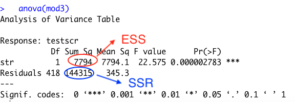
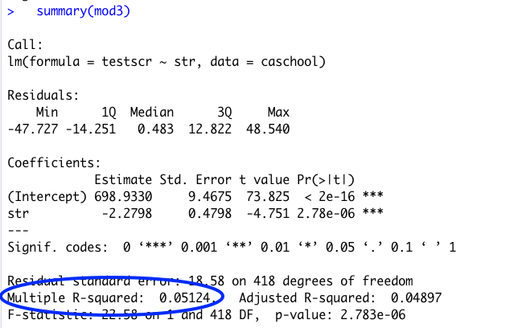
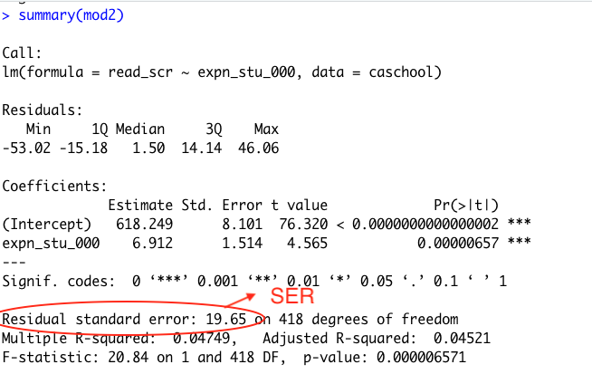

```{r, echo=FALSE}
knitr::opts_chunk$set(collapse = TRUE, comment = "#>", highlight = TRUE)
```


# Prep

## Open R Script; Install new Package!


We'll be using the California Schools Data today; no need to re-download!

\medskip

1. Download the Lecture 5 PDF and R files for this week
    - Place all files in HED612_SP21 >>> lectures >>> lecture5
1. Open the RProject  (should be in your main HED612_SP21 folder)
1. Once the RStudio window opens, open the Lecture 5 R script by clicking on:
    - file >>> open file... >>> [navigate to lecture 5 folder] >>> lecture5.R
1. __Install the "Margins" package in Lecture5.R__ 
    - If R prompts you to install margins and "its dependencies", go ahead and click install
    - If R doesn't prompt you, install via line 5 `install.packages("margins")`
    

## Homework Questions

- Problem Set #4
  - Questions or Concerns?
- General R Issues?
  - Be careful of < / > and <= / =>


## Class Overview

Last week:

- Introduced population linear regression model
- Estimating $\beta_0$ and $\beta_1$ via OLS Estimates $\hat{\beta_0}$ and $\hat{\beta_1}$

\medskip

Today:

- Prediction
- Measures of Model Fit
  - $R^2$
  - Standard Error of the Regression (SER)
  
\medskip

Homework:

- HW#5 posted on D2L
- Stock and Watson Chapter 5


\medskip

Next week:

- Using $\hat{\beta_1}$ for hypothesis testing about $\beta_1$

  
  
# Prediction

## General things we do in regression analysis

1. __Estimation__ [Last Week]
  - How do we choose estimates of $\beta_0$ and $\beta_1$ using sample data?
  - OLS Estimates $\hat{\beta_0}$ and $\hat{\beta_1}$ that minimize the sum of squared errors

\medskip

2. __Prediction__ [Today]
  - What is the predicted value of Y for someone with a particular value of X?
  - Example: What is the predicted income for a college graduate with an engineering degree?

\medskip
  
3. __Hypothesis testing__ [focus of the rest of the semester]
  - Hypothesis testing and confidence intervals about $\beta_1$
  - This is estimating causal effects!
  
  
## General steps in prediction

1. Write out population linear regression model
    - $Y_i = \beta_0 + \beta_1X_i + u_i$
    - Where Y= Annual Income; X= hours worked per week
  
2. Write out OLS prediction line without estimate values
    - $\hat{Y_i} = \hat{\beta_0} + \hat{\beta_1}X_i$ 
    
3. Write out OLS prediction line with estimates [last week's example]
    - $\hat{Y_i} = \$7,477 + \$503*X_i$ 
 
4. If it's helpful, sketch out the OLS prediction line

5. Calculate predicted values of Y ($\hat{Y_i}$) for selected values of $X_i$
 


## Common Examples of Prediction

__Early warning system for academic probation__

- Using data from last year, run regression for relationship between number of class absences and semester GPA
  - $Y_i = \beta_0 + \beta_1X_i + u_i$
  - Where Y= GPA; X= number of absences 
  
  - $\hat{Y_i} = \hat{\beta_0} + \hat{\beta_1}X_i$
  - $\hat{Y_i} = 3.5 + (-0.5)*X_i$
  
\medskip

- If a student has 4 class absences?
  - $\hat{Y_i} = 3.5 + (-0.5)*4$ = $\hat{Y_i} = 3.5 + (-2)$ = 1.5

\medskip

- Track attendance of current year students
  - Student receives academic probation warning if predicted to have a GPA less than 2.0


__Obama Administration College Rating System__

- Rates colleges based on student outcomes to predict the "best value" 

  - graduation rates
  - labor market participation and return rates
  - loan repayment/default rates 
  - attendance cost
  
\medskip

- Penalties for colleges with low performance

  - Less maximimum pell grants 
  - Shared "risk" for loan default 
  - Lose Title IV funding altogether 
  
\medskip

- Any red flags with *only* using the above student outcomes to rate colleges?  

  - Different student populations: UA students vs Harvard students?
  - Different labor market participation: Liberal arts college vs technical school?
  - Obama Administration opted out of ratings system; opted instead for providing students with more information via College Score Cards for them to compare institutions themselves 
  - Some accountability kept via gainful employment regulations for for-profits 
  


## Prediction Example: California School Data

RQ: What is the relationship between district-wide math test scores (Y) and district expenditures per student (X)?

- Do you think this relationship is positive? Negative? Why?


\medskip 
- Practical problem: our X is in dollars. 
  - $\hat{\beta_1}$ will be the change in Y for a one-unit change ($1 change) in X
  - District wide test scores are not likely to change much for a $1 increase in per student spending
- Let's make our X in thousands of dollars
  - $\hat{\beta_1}$ will be the change in Y for a one-unit change ($1,000 change) in X
  
\medskip
1. Write out the population regression model
2. OLS line without estimates
3. OLS line with estimates
    - Run regression in R
    - `mod1 <-  lm(math_scr ~ expn_stu_000, data=caschool)`
    - `summary(mod1)`
4. Interpret the values of $\hat{\beta_0}$ and $\hat{\beta_1}$
5. Draw OLS regression line on graph
6. Calculate predicted district-wide math test score for X=5 ($5,000 expenditures per student)


## Student Exercise #1 

RQ: What is the relationship between district-wide reading test scores (Y) and district expenditures per student (X)?

- Y= `read_scr`
- X= `expn_stu_000`

\medskip
1. Write out the population regression model
2. OLS line without estimates
3. OLS line with estimates
    - Run regression in R
    - Assign this regression as `mod2`
4. Interpret the values of $\hat{\beta_0}$ and $\hat{\beta_1}$
5. Draw OLS regression line on graph (if it is helpful to you)
6. Calculate predicted district-wide reading score for X=11 ($11,000 expenditures per student)


## `margins` and `prediction` packages in R

- These packages do a lot of useful things; we'll learn how to use functionality little by little

\medskip

- For today:
  - general introduction
  - use them to calculate predicted values

\medskip
- We need to run a regression and save it as an "object"
- Then we can run `margins` and `prediction` functions on our regression model!


# Measures of Model Fit: $R^2$

## $R^2$

__What does $R^2$ measure?__

- $R^2$, "the coefficient of determination", measures the fraction of the variance in Y that is explained by X (and is not already explained by sample mean, $\bar{Y}$)
  - In other words, how much better is the regression model in predicting values of Y than $\bar{Y}$
  - Draw scatterplot

\medskip

__Interpreting $R^2$__

- $R^2$ ranges from 0 to 1
  - $R^2=0$: the model does not explain any variation in Y 
  - $R^2=1$: the model explains 100% of the variation in Y 
  - $R^2=0.135$: the model explains 13.5% of the variation in Y 
  
## Components of $R^2$

- $\hat{Y_i} = \hat{\beta_0} + \hat{\beta_1}X_i$

- $\hat{u_i} = Y_i - \hat{Y_i}$

\medskip
- Total Sum of Squares (TSS) = $\sum_{i=1}^{n}$ $(Y_i-\bar{Y})^2$
  - A measure of the total variance in Y, relative to $\bar{Y}$
  
- Explained Sum of Squares (ESS) = $\sum_{i=1}^{n}$ $(\hat{Y_i}-\bar{Y})^2$
  - Difference between predicted values $\hat{Y_i}$ and sample mean $\bar{Y}$
  - Measures amount of variation in Y explained by X
  
- Sum of Squared Residuals (SSR) = $\sum_{i=1}^{n}$ $(Y_i- \hat{Y_i})^2$
  - Difference between actual value observed and predicted value by our regression line
  - Measures amount of variation in Y not explained by X
  
\medskip
- Show in scatter plot: What is the effect of student teacher ratio (X) on district test scores?
  - TSS = ESS + SSR
  - Total variation in Y (TSS) equals variation explained by the model (ESS) plus variation not explained by model (SSR)


## $R^2$ in R

- __$R^2$ = $\frac{\text{variance in Y that is explained by X}}{\text{total variance in Y}} = \frac{ESS}{TSS}$__

- Note that in R:

  - `summary(MODEL)` will only give you the $R^2$
  - `anova(MODEL)` will give you ESS and SSR
  


\medskip
- `mod3 <- lm(testscr ~ str, data=caschool)`
- `anova(mod3)`
  - ESS= 7794
  - SSR = 144315
  - TSS = 7794 + 144315 =152109
  - $R^2$ = 7794/152109 = 0.051
  - Student teacher ratio explains 5.1% of the variation in district test scores (not already explained by $\bar{Y}$) 
  
  
## $R^2$ in R via `summary(MODEL)`



  
## Student Exercise #2
RQ1: What is the relationship between district-wide math test scores (Y) and district expenditures per student (X)?

- Y= `math_scr`
- X= `expn_stu_000`


1. Run regression in R (did this already in exercise #1; `mod1`)
2. Using `summary(mod1)`: 
      - What is $R^2$? Interpret $R^2$.
3. Using `anova(mod1)`:
      - Show that $R^2$ = ESS/TSS

\medskip
RQ2: What is the relationship between district-wide math test scores (Y) and student-teacher ratio (X)?

- Y= `math_scr`
- X= `str`

\medskip
1. Run regression in R (need to do this as `mod4`)
2. Using `summary(mod4)`: 
      - What is $R^2$? Interpret $R^2$.
3. Using `anova(mod4)`:
      - Show that $R^2$ = ESS/TSS
      
      
      
      
      
      
## Student Exercise #2 [SOLUTIONS]
RQ1: What is the relationship between district-wide math test scores (Y) and district expenditures per student (X)?

1. Run regression in R (did this already in exercise #1; `mod1`)
2. Using `summary(mod1)`: 
      - What is $R^2$? _Measures the fraction of the variance in Y that is explained by X (and is not already explained by sample mean)_
      - $R^2$ = 0.02402; _District expenditures per student explains 2.4% of the variation in district math test scores_ 
3. Using `anova(mod1)`:
      - ESS= 3540
      - SSR = 143831
      - TSS = 3540 + 143831 =147371
      - $R^2$ = 3540/147371 = 0.024

\medskip
RQ2: What is the relationship between district-wide math test scores (Y) and student-teacher ratio (X)?

1. Run regression in R (need to do this as `mod4`)
2. Using `summary(mod4)`: 
      - Interpret $R^2$ = 0.03824; _District student-teacher ratio explains 3.8% of the variation in district math test scores_
3. Using `anova(mod4)`:
      - ESS= 5636
      - SSR = 141735
      - TSS = 5636 + 141735 =147371
      - $R^2$ = 5636/147371 = 0.03824
      
      
## Student Exercise #2

Based on the $R^2$ of Model 1 vs $R^2$ of Model 4:

 - Does district expenditures per student or student teacher ratio do a better job at predicting math test scores?
 
 
# Measures of Model Fit: Standard Error of the Regression

## Standard Error of the Regression (SER)

__Standard Error of the Regression (SER)__: an estimator of the standard deviation of the residuals $\hat{u_i}$

- In other words, SER is, on average, how far away an actual observed value of Y is from the predicted value of Y for a random observation 


\medskip

- Sample standard deviation, $s_{Y}= \hat{\sigma_{Y}}$
  - Average distance between a random observation $Y_i$ an the sample mean $\bar{Y}$
  - $s_{Y}= \hat{\sigma_{Y}} =  \sqrt{ \frac {\sum_{i=1}^{n} ({Y_{i} -\overline{Y})^2}} {n-1} }$
  
\medskip
- Standard error of the regression (SER or $s_{\hat{u}}$ or $\hat{\sigma_{u_{i}}}$)
  - Average distance between a random observation $Y_i$ and the value predicted by the OLS regression $\hat{Y_i}$
  
  - SER = $\sqrt{\frac{SSR}{n-2}}$ = $\sqrt{ \frac {\sum_{i=1}^{n} ({Y_{i} -\hat{Y})^2}} {n-2} }$ = $\sqrt{ \frac {\sum_{i=1}^{n} (\hat{u_{i}})^2} {n-2} }$
  
  - SSR = sum of squared residuals
  - Why (n-2)? Because we lose one degree of freedom for calculating sample mean $\bar{Y}$ and another for the independent variable X
  

RQ: What is the relationship between district-wide reading test scores (Y) and district expenditures per student (X)?

- In R, SER is "Residual Standard Error"




RQ: What is the relationship between district-wide math test scores (Y) and district expenditures per student (X)?


-  SER = $\sqrt{\frac{SSR}{n-2}}$
- `anova(mod1)`
  - SSR= 161369  
  - n = 420 (there's 420 observations/districts in the California School Data)
  
SER = $\sqrt{\frac{161369}{420-2}}$ = $\sqrt{\frac{161369}{428}}$ =$\sqrt{377.0303}$ = 19.648


## Standard Error of the Regression (SER) cont.

__SER__ = 19.648

- Average distance between reading test score of a random district and the reading test score predicted by the OLS regression is 19.65
- SER is always in the same unit as the dependent variable
- A "higher" SER means that our predicted OLS line is often wrong by a lot!


\medskip
SER vs Standard Deviation

- Standard Deviation of `read_scr` = 20.1
  - Average distance between reading test score of a random district and the sample mean of reading test scores is 20.1


\medskip

Does predicting reading test scores based on district expenditures per student result in dramatic improvements in predictions in comparison to just taking the sample mean of math test scores? 

## Comments on SER and $R^2$

$R^2$

- Low $R^2$ tell us that the model does not explain much of the variation in the dependent variable; there are other factors (not included in the model) that explain most of the variation in the dependent variable
- Low $R^2$ is not necessarily bad and a high $R^2$ is not necessarily good (e.g., predicting provery from having a cell phone has a very high $R^2$)

\medskip
SER

- High SER tells us  that our predictions will often be wrong by a lot; but that does not necessarily mean our model is bad given some things are hard to predict and we often are interested in "averages"!

\medskip

Econometrics Research & Model Fit

- Usually we're most concerned with estimating $\beta_1$, which is the "causal effect" of X on Y
- Models with high $R^2$ and low SER may still be wrong about $\beta_1$ 


## Student Exercise #3
RQ1: What is the relationship between district-wide math test scores (Y) and district expenditures per student (X)?

- Y= `math_scr`
- X= `expn_stu_000`


1. Run regression in R (did this already in exercise #1 & 2; `mod1`)
2. Using `summary(mod1)`: 
      - What is SER? Interpret SER.
3. Using `anova(mod1)`:
      - Show that SER = $\sqrt{\frac{SSR}{n-2}}$

\medskip
RQ2: What is the relationship between district-wide math test scores (Y) and student-teacher ratio (X)?

- Y= `math_scr`
- X= `str`

\medskip
1. Run regression in R (already did this; `mod4`)
2. Using `summary(mod4)`: 
      - Interpret SER.
3. Using `anova(mod4)`:
      - Show that SER = $\sqrt{\frac{SSR}{n-2}}$
      
  
## Student Exercise #3 [SOLUTIONS]
RQ1: What is the relationship between district-wide math test scores (Y) and district expenditures per student (X)?

2. Using `summary(mod1)`: 
      - What is SER? __SER is on average how far away an actual observed value of Y is from the predicted value of Y for a random observation__
      - Interpret SER. __18.55; Average distance between math test score of a random district and the math test score predicted by the OLS regression is 18.55__
3. Using `anova(mod1)`:
      - Show that SER = $\sqrt{\frac{SSR}{n-2}}$ = $\sqrt{\frac{143831}{418}}$ = $\sqrt{344.0933}$ =18.549

\medskip
RQ2: What is the relationship between district-wide math test scores (Y) and student-teacher ratio (X)?

\medskip

2. Using `summary(mod4)`: 
      - Interpret SER __18.41; Average distance between math test score of a random district and the math test score predicted by the OLS regression is 18.41__
3. Using `anova(mod4)`:
      - Show that SER = $\sqrt{\frac{SSR}{n-2}}$ = $\sqrt{\frac{141735}{418}}$ = $\sqrt{339.0789}$ = 18.414
