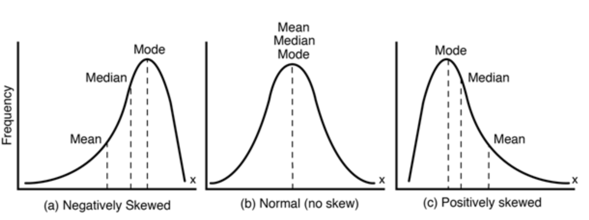
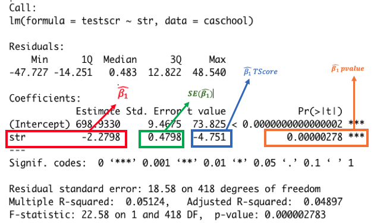

```{r, echo=FALSE}
knitr::opts_chunk$set(collapse = TRUE, comment = "#>", highlight = TRUE)
```


# Prep

## Download Data and Open R Script


We'll be using the California Schools and GSS data today; no need to re-download!

\medskip

1. Download the Lecture 6 PDF and R files for this week
    - Place all files in HED612_S21 >>> lectures >>> lecture6
1. Open the RProject  (should be in your main HED612_S21 folder)
1. Once the RStudio window opens, open the Lecture 6 R script by clicking on:
    - file >>> open file... >>> [navigate to lecture 6 folder] >>> lecture6.R


## General Comments on Problem Sets and "Learning Statistics"

- It's perfectly okay to feel "confused" or feel like you're "still not getting it" under "normal circumstances"
  - We are in the middle of global health pandemic working under extenuating circumstances... give yourself a break!
  - You don't become a knowledgeable, confident, experienced quantitative researcher after one lecture, one class, one year...
  - But you can make a lot of progress by learning the foundations of regression well (what we're doing in this class)
- It's like learning/earning each piece of a puzzle when you don't always know what the complete puzzle looks like
  - Puzzle pieces seem to "click" down the road when you are actually working on a project/dissertation or thesis 
  - We have to learn the "dense" stuff of statistics to get to the important, critical fun part of quantitative research!
- I still struggle with this too...
  - After taking statistics classes in Education, Public Policy, Sociology, and Economics for 8 years!
  - I learned the most when I sought out opportunities to apply my statistics and data skills (although it was a scary process!)
  - The "clicking" of things I learned in classes as a student has often happened now as an assistant professor (it takes time!)
  - I push myself to keep learning... when I read empirical articles, I never skip the methods section! 
    - I take the time to look up things I am confused about
    - I reach out to folks that know statistics more than I do


## Class Overview

Last week:

- Prediction
- Measures of Model Fit
  - $R^2$
  - Standard Error of the Regression (SER)
  
\medskip

This Week:

- Using $\hat{\beta_1}$ for hypothesis testing about $\beta_1$
  - Review on hypothesis testing about population mean
- Homework:
  - HW#6 posted on D2L
  - Stock and Watson Chapter 5 [finish if you haven't already]
  
  
# Hypothesis Testing 

- Stock & Watson example: Superintendent needs to assess a claim that smaller class sizes do not improve student learning

- RQ: What is the effect of student-teacher ratio (X) on district average test scores (Y)?
  - $Y_i = \beta_0 + \beta_1X_i + u_i$
  - Goal of causal inference: estimate $\beta_1$, which shows the average effect of one additional student per teacher on district average test score
  - We don't know $\beta_1$; so we get an estimate of it ($\hat{\beta_1}$)
  - We use $\hat{\beta_1}$ to test hypotheses about $\beta_1$

- __We always test the same hypothesis about $\beta_1$__
  - $H_0: \beta_1 =0$
  - $H_a: \beta_1 \ne 0$
  - Why this hypothesis? 
  
  
\medskip

- We are going to first review hypothesis testing about the population mean ($u_Y$)
- Then cover hypothesis testing about $\beta_1$
- Both use same concepts!


# Hypothesis Testing about Population Mean

## Approaches to Hypothesis Testing about Population Mean

- "Classical" approach
  - Testing a claim of the population mean $\mu$ when the population standard deviation is known $\sigma$
  - Based on standard deviations; compares the test statistic (Z-score) to a critical value from the standard normal table/distribution
  - If the test statistic falls under the rejection zone (using the critical value), you reject the null
  - Not used very often because it requires you to know the population standard deviation (we hardly ever know this!)

\medskip

- "P-value" approach
  - Tests the probability of observing our sample mean under the assumption that the null is true
  - Compares the area associated with the test statistic (T statistic) to the $\alpha$ level of significance (using a normal curve)
  - If the probability of observing such a sample mean is very small (p-value is less than the alpha), you reject the null


## Normal Distribution

- Special distribution used in statistics!

\medskip
- Definition: a symmetric, bell-shaped distribution
  - Not left-skewed (or negatively skewed or "longer left tail" )
  - Not right-skewed (or positively skewed or "longer right tail")

\medskip




## Z-Score

Z-score ("standard score"): how many standard deviations away from the mean

\medskip

The Z-score $z_i$ of an observation $y_i$ is the number of standard deviations that observation is from the mean Y

  - $z_i = \frac{y_i - Y}{\sigma_Y}$
  - numerator: deviations from the mean (i.e., difference from the mean)
  - denominator: standard deviation (i.e., standardized or "scaled" in terms of standard deviation)

\medskip

Example: We believe that taking 3+ remedial classes (instead of less than 3) will extend time to graduation. Average time to baccalaureate graduation for all college students in the U.S. is 5 years. 

  - $H_0: \mu = 5 ; H_a: \mu \ne 5$
  - $y_i = 8$, $Y=5$, $\sigma_Y = 1.3$
  - $z_i = \frac{y_i - Y}{\sigma_Y} = \frac{8 - 5}{1.3} = 2.31$

\medskip

Note: 

- Z-score requires us to know population parameters [which we often don't know!] 
- So we usually use t-score instead [more on this later!]
  - When sample size is large (1000+ z-distribution and t-distribution is the same!)
  
## Standard Normal Distribution

- A special case of the normal distribution

\medskip

- A normal distribution (i.e., bell-shaped) that has a mean of zero and a standard deviation of one
  - draw picture

\medskip

- The value of each observation is already in terms of z-scores (or t-scores)!
  - each observation shows how many standard deviations from the mean

\medskip
Questions:

- What value would an observation have on a standard normal distribution if it's equal to the mean?
- How likely are we to see an observation with a value of 3 on a standard normal distribution?

## Empirical Rule (i.e., 68-95-99 Rule)

_If a variable has an approximately normal distribution, then:_

\medskip  

- About 68% of observations fall within one standard deviation $\sigma_Y$ of the mean $\bar{Y}$
  - in other words: between $\bar{Y} - \sigma_Y$ and $\bar{Y} + \sigma_Y$

\medskip  

- About 95% of observations fall within two standard deviations  $\sigma_Y$ of the mean $\bar{Y}$
  - in other words: between $\bar{Y} - 2\sigma_Y$ and $\bar{Y} + 2\sigma_Y$

\medskip  

- About 99% of observations fall within three standard deviations $\sigma_Y$ of the mean $\bar{Y}$
  - in other words: between $\bar{Y} - 3\sigma_Y$ and $\bar{Y} + 3\sigma_Y$


# P-value approach: Sampling Distributions

## Sampling Distributions

Fundamental Statistics Goal:

- Use sample data to make a statement about the value of a population parameter!
- Use an estimate of the population parameter and a sense of how likely our estimate is close to the population parameter
  - example: estimate the population mean $Y$ via the sample mean $\bar{Y}$


\medskip
- __Problem__: Even with random sampling, our sample mean is likely to be different from the population mean and likely to be different from one sample to another
- __Solution__: Repeated random sampling helps us understand this variation from sample to sample!

\medskip
The "three distributions" [draw pictures of mean]:

- Population distribution
- One random sample
- Sampling distribution
  - Shows how point estimates (e.g., sample mean and sample regression coefficient) vary from sample to sample!
  
  
## Standard Error of Sampling Distribution

- Sample standard deviation of Y
  - Sample standard deviation of Y, $\hat{\sigma_Y}$, is the average distance of an observation from the sample mean, $\bar{Y}$

\medskip

- Standard error of $\bar{Y}$, $SE(\bar{Y})$
  - Standard error of $\bar{Y}$ is the average distance of a single sample mean $\bar{Y}$ from the mean of sample means $\bar{Y}_Y$
  - In other words: $SE(\bar{Y})$ is the standard deviation of the sampling distribution!

\medskip

- Show "three distributions" for $SE(\bar{Y})$


\medskip


  
## Properties of Sample Standard Error

- Standard error decreases when sample size increases!
  - Conceptually: why would this be the case? 
  - Imagine the sample mean income in US. Sample size of 10 vs sample size of 1000
  - The bigger the sample the closer we get to estimating the true population mean! (i.e., sample means cluster more and more around the true population mean)
  - Draw picture!

\medskip

- Standard error increases when sample standard deviation increases!
  - Why? 
  - $SE(\bar{Y}) = \frac{\hat{\sigma_Y}}{\sqrt{n}}$; where $\hat{\sigma_Y}$ is sample standard deviation
  - $SE(\bar{Y}) = \frac{\hat{\sigma_Y}}{\sqrt{n}}$
  - greater variation (i.e., spread) of data will give us a bigger numerator!
  
  
## Hypothesis Testing about the Sample Mean 

RQ: Is the population mean hours worked per week equal to 40?

- Test a two-sided hypothesis

\medskip

__Five parts of a hypothesis test:__

1. Assumptions
1. Specify null and alternative hypotheses
1. Test statistic
1. P-value
1. Conclusion
  
\medskip

Components of Hypothesis Test we need (get from R):

  - __Sample size__
    - 2,348 is the total obs in `gss`, but we dropped missing observation in `hrs1`
    - Missing observations in R are categorized as `NA`
    - `summary(gss$hrs1)` shows there are 967 obs with missing `hrs1`
    - We used `na.rm = TRUE` which dropped all missing obs
    - So sample size is 2,348 - 967 = 1,381
  - __Sample Mean__: 41.28
  - __Sample Standard Deviation__: 14.48
  

## Step 1: Assumptions

1. Quantitative Variable
  - Random sample from the population
  - Variable has a normal population distribution 
    - Central Limit Theorem: No matter the distribution of our population parameter,
given a sufficiently large sample size, the sampling distribution of the estimate (e.g., mean) for a variable will approximate a normal distribution.
    - We have a big enough sample! 
    
    
## Step 2: Hypotheses

- You generate hypotheses from your research question!
  - RQ: Is the population mean number of hours worked per week equal to 40?
  
\medskip

- Null hypothesis
  - $H_0: \mu = 40$
- Two-sided alternative hypothesis
  - $H_a: \mu \ne 40$
  
\medskip
__Conceptual strategy for testing these hypotheses:__

- Goal: Assuming the null hypothesis is true, how unlikely would it be to observe the sample mean, $\bar{Y} = 41.28$, we observed?

  1. Draw sampling distribution under assumption that null hypothesis is true
  1. Calculate distance from sample estimate to population mean associated with null hypothesis
  1. Convert that distance to standard errors
  1. If distance (in standard errors) is large, null hypothesis is probably false. We reject the null in favor of the alternative. 
  1. If distance (in standard errors) is small, null hypothesis is probably true. We cannot reject the null hypothesis.
  
  
## Step 3: Test Statistic

- Conduct a test to see whether we should reject the null hypothesis
  - Test Statistic
    - If the null hypothesis is true, how unlikely would it be to randomly draw a sample mean equal to our observed sample mean of 41.28
    
\medskip

t = $\frac {\text{(estimate) - (value associated with }H_{0})} {\text{standard error of estimate}}$

\medskip

- Measures how far away an "estimate" is from "value associated with $H_0$, measured in terms of standard errors

- T-test is based on measuring the distane between the value asosciated with $H_0$ and our observed sample mean $\bar{Y}$ and converts the distance in terms of standard errors!

\medskip

t = $\frac {\text{(estimate) - (value associated with }H_{0})} {\text{standard error of estimate}}$

Same as...

t = $\frac {\bar{Y} - \mu_0} {SE(\bar{Y})}$

- Where $SE(\bar{Y})$ = $\frac{\text{sample std dev}}{\sqrt{n}}$

\medskip

Hours worked example:

- n = 1381, $\bar{Y}=41.28$, $\hat{\sigma_Y}=14.48$
- $SE(\bar{Y})$ = $\frac{\hat{\sigma_Y}}{\sqrt{n}}$ = $\frac{14.48}{\sqrt{1381}}$ = 0.3896
- t = $\frac {\bar{Y} - \mu_0} {SE(\bar{Y})}$ = $\frac {41.28 - 40} {0.3896}$ = $\frac {1.28} {0.3896}$ = 3.29

## Step 4: P-Value

P-Value:

- Under the assumption that $H_0$ is true, the p-value is the probability that test statistic equals the observed value or a value even more extreme than $H_a$
- A small p-value means that it would be unusual to find the observed data if $H_0$ were true

\medskip
Two-sided hypothesis ($H_a: \mu \ne \mu_0$)

- Pr(obs>t) + Pr(obs< -t)
- You can use a z-score table (should have done this in intro course), we'll use R!
- Interpretation: Under the assumption that $H_0$ is true, the probability of observing a test statistic even more extreme than 3.28 (i.e., greater than 3.28 or less than -3.28) is equal to 0.001
- Run t-test in R
- Draw picture of this!

\medskip
Rejection region:

- $\alpha$ level (alpha level) is a value such that we reject $H_0$ if the observed p-value is **less than or equal to** the alpha level.
- Most common alpha level is .05
- So given our observed p-value is .001 (.001<$\alpha$=.05); we reject $H_0$
- There is less than a 0.1% probability (.001*100) of having observed our sample mean of 41.28 if the population mean is 40 ($H_0$). 

# Hypothesis Testing about Population Regression Coefficient

## Hypothesis testing about Population Regression Coefficient, $\beta_1$

We follow the same five steps!

1. Assumptions
1. Specify null and alternative hypotheses
1. Test statistic
1. P-value
1. Conclusion

## Hypotheses about Population Regression Coefficient

RQ: What is the effect of student-teacher ratio (X) on student test scores (Y)

- Null hypothesis: student-teacher ratio has no effect on student test scores
  - $H_0: \beta_1 = 0$ or $H_0: \beta_1 = \beta_1,0$
  
- Alternative hypothesis: student-teacher ratio has an effect on student test scores
  - $H_a: \beta_1 \ne 0$ or $H_a: \beta_1 \ne \beta_1,0$
  
\medskip
- Note: We almost always test two-sided hypotheses about regression coefficients!

  - Why? Because we can be wrong about the direction of $\beta_1$!
  - E.g., some policies can cause more harm than good! 
  
## Using $\hat{\beta_1}$ to test hypothesis about $\beta_1$

Same steps as population mean!

1. Assumptions:
- Draw random sample; sample size is large enough to assume that sampling distribution of $\hat{\beta_1}$ is normally distributed

2. Hypotheses
- $H_0: \beta_1 = 0$
- $H_a: \beta_1 \ne 0$


3. Compute t-test for regression coefficient
- t = $\frac {\text{(estimate) - (value associated with }H_{0})} {\text{standard error of estimate}}$
- Run regression in R
  - $H_0: \beta_1 = 0$, $\hat{\beta_1}=-2.2798$, $SE(\hat{\beta_1})$ = 0.4798
  - t = $\frac{(-2.2798) - (0)}{0.4798}$ = -4.751
  - p-value= 0.00000278





  
4. Set rejection region for p-value ($\alpha$=.05); decide whether to reject $H_0$
  - Note that R will give you the associated p-value for a two-sided hypothesis
  - So in sampling distribution we add the probability to the right and probability to the left!

\medskip
Draw sampling distribution of $\hat{\beta_1}$ assuming $H_0$ is true


## A deeper understanding of $SE(\hat{\beta_1})$

- Anytime we talk about hypothesis testing, we are using estimates from one random sample to make statements about population parameters 

- But our estimates differ from population parameters due to random sampling

- Standard error (SE) tells us how far away (on average) an estimate is likely to be from population parameter

- The lower our SE, the closer we are to the population parameter! 


- When is SE($\hat{\beta_1}$) likely to be low?
    - When standard error of the regression (SER) is also low (i.e., our predictions are good!)
    - When sample size is big [estimates become more precise as sample size increases]
    - When the variance of X is high
    
{width=250px}

The number of black and blue dots is the same. Using which sample would you get a more accurate regression line?


## Student Exercise [if we have time!]

RQ: What is the effect of district expenditures-per-student (X) on student test scores (Y)?


1. Write out the null and alternative hypotheses for $\beta_1$

2. Run regression in R
    - X = `expn_stu_000`
    - Y = `testscr` 
  
3. Based on regression output in Q2 and t-statistic formula, show why t=3.984 for $\hat{\beta_1}$

4. Draw sampling distribution of $\hat{\beta_1}$ assuming $H_0$ is true. Label the following:
    - Population regression coefficient associated with $H_0$
    - $\hat{\beta_1}$ and observed t-value
    - Shade in regions for Pr(t<-3.984) and Pr(t>3.984)
    - P-values for regions Pr(t<-3.984) and Pr(t>3.984)


## Student Exercise [Solutions]

1. Write out the null and alternative hypotheses for $\beta_1$
    - $H_0: \beta_1 = 0$
    - $H_a: \beta_1 \ne 0$

\medskip

2. `mod1 <- lm(testscr ~ expn_stu_000, data=caschool)`
   `summary(mod1)`

\medskip   
    
3. t = $\frac {\hat{\beta_1}- \beta_1,0} {SE(\hat{\beta_1})}$ =$\frac {5.749 - 0} {1.443}$ = 3.984

4.


