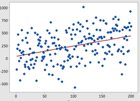
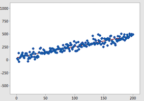

```{r, echo=FALSE}
knitr::opts_chunk$set(collapse = TRUE, comment = "#>", highlight = TRUE)
```

# Logistics

### Download Data and Open R Script

We're going to use GSS and ELS data today. We'll also explore HSLS later on but we will load the dataset together!

\medskip

1. Download the Lecture 8 PDF and R files for this week
    - Place all files in HED612_S21 >>> lectures >>> lecture8
1. Open the RProject  (should be in your main HED612_S21 folder)
1. Once the RStudio window opens, open the Lecture 8 R script by clicking on:
    - file >>> open file... >>> [navigate to lecture 8 folder] >>> lecture8.R

### Outline of next couple weeks

Today, 3/5/2020:

- Review SER vs SE of $\hat{\beta_1}$
- More practice in interpreting Categorical X
- More practice in creating variables in R
- Review requirements for final project
- National Datasets you can use for final project!

\medskip
Homework and Reading for 3/17/2021: 

- PS#8 Posted on D2L due 3/17/2020
- Reading:
  - TBD

\medskip

3/10/2020: Spring Break/Reading Day No Class!

\medskip
03/19/2020:

- OLS Assumptions 
- Introduction to Omitted Variable Bias
- Introduction to Multivariate Regression


# Difference between Standard Error of $\hat{\beta_1}$ and SER

### Standard Error of $\hat{\beta_1}$

- Standard error of $\hat{\beta_1}$ is the *estimated standard deviation* of the *error* in measuring it

- We generate Standard error of $\hat{\beta_1}$ via hypothesis testing!
  - Hypothesis testing is our attempt to identify variation in a point estimate that could be due to sampling (variation that occurs by chance from one sample to another) in order to confirm that our estimate is "true" and did not occur just by random chance! (i.e., statistically significant!)
  - Think of the "three pictures":
   - Hypothesis testing about population mean: $SE(\bar{Y})$ is the average distance of a single sample mean $\bar{Y}$ from the mean of sample means $\bar{Y}_Y$ (mean of sample means = true population mean)
  - Hypothesis testing about $\hat{\beta_1}$: $SE(\hat{\beta_1})$ is the average distance of our sample estimate of the effect of X on Y ($\hat{\beta_1}$) from the mean of sample estimates of $\beta_1$ (mean of sample estimates = true population $\beta_1$)
  
- Our null hypothesis is always $H_0: \beta_1 = 0$
  - Meaning: the effect of X on Y is really zero once we we take into account sampling variability. In other words, any non-zero effect we find is because of sampling variability! 
  - In causal inference research the null hypothesis is a "straw man"; we want to disprove it.
  - Disproving it would mean that our non-zero effect of X on Y is not due to random sampling variability, but is indicative of a real, causal relationship!
  - The p-value is the probability that the test statistic for $\hat{\beta_1}$ equals the observed value or a value even more extreme than $\hat{\beta_1}$ if $H_0$ is true
  - A small p-value disproves the null because it would be so unlikely (less than 5% probability) to find the observed data if $H_0$ were true
  


### Standard Error of $\hat{\beta_1}$

RQ: What is the effect of hours worked per week (X) on annual income (Y)?

- If we run `mod1 <- lm(realrinc ~ hrs1, data=gss)`; we get a $\hat{\beta_1}$=$455
- Every one hour increase in hours worked per week is associated with a $455 increase in annual income
  - Our slope of relationship between hours worked per week (X) and annual income (Y) is $455
  - How do we determine "how far" this slope of $455 estimated from one random sample of 2,348 people is from the true population estimate for all people in the US?
  - The standard error of $\hat{\beta_1}$ is the standard deviation of the sampling distribution!


SE($\hat{\beta_1}$) 

- Needed to construct Confidence Intervals 
- Needed to rule out how much of our estimate is likely attributed to random sampling variability and how likely it is that we're generating a statistically significant estimate of the true population effect of X on Y. 
- So, it is really key to allow you to interpret and evaluate your regression model.


### SER
__Standard Error of the Regression (SER)__: A measure of "model-fit", in other words the standard deviation of the residuals $\hat{u_i}$

- On average, how far away an actual observed value of Y is from the predicted value of Y for a random observation 


- Which would have a better SER?





### SER vs SE($\hat{\beta_1}$) 

- **Standard error of the regression**
  - It's completely determined by your sample data 
  - Says nothing about how "far" our slope estimates based on our one random sample likely are from true population parameters!
  - That's why it's a **measure of model fit or "goodness of fit measure"**! It tells us how good our line is fitting our ONE random sample! 
  - High SER tells us that our predictions will often be wrong by a lot; but in causal inference research that does not necessarily mean our model is bad given some things are hard to predict and we often are interested in "averages"!

\medskip

- **Standard error of  $\hat{\beta_1}$**
  - Is key to determining **statistical significance** of the relationship between X and Y; statistical significance is the likelihood that a relationship between two or more variables is caused by something other than random chance
  - Requires simulating lots of random samples of $\hat{\beta_1}$ to generate a sampling distribution in which the mean of the sampling distribution = true population $\beta_1$
  
# More Practice on Interpreting Categorical X

### Interpretation of $\hat{\beta_1}$

- Generic interpretation for $\hat{\beta_1}$ when X=continuous
  - The average effect of a one-unit increase in X is associated with a $\hat{\beta_1}$ change in the value of Y
- Generic interpretation for $\hat{\beta_1}$ when X= categorical
  - the average effect of being [specific non-reference category] as opposed to [reference category] is associated with a $\hat{\beta_1}$ change in the value of Y

\medskip

- General Steps for regression with categorical X  
  - Identify the categories of X and choose a reference group
  - Create the variable(s) by either
    - Creating dummy variables for each group (and leave out the reference group dummy); *OR*
    - Use the R shortcut: code all groups into one categorical variable; code the reference group as the lowest value (which will be left out of the regression automatically by R) OR explicitly tell R what the reference category is
  - Write out population regression 
  - Write out OLS prediction line with estimates
  - Interpret estimates
  - Predict $\hat{Y}$ for groups of interest!


### Example on Interpreting Categorical X

RQ: What is the effect of socioeconomic status quartile (X) on reading score (Y)?

Let's go through each step of the process using the above example! 


### First step: investigate categories of X and choosing a reference group 

The first steps are investigating categories of X and choosing a reference group and then creating the variable(s) in R

\medskip

"Conceptual" Process for Creating "analysis" variables in R

1. Investigating values and patterns of variables from “input data”
2. Identifying and cleaning errors or values that need to be changed
3. Creating "analysis" variables
4. Checking values of analysis variables against values of input variables

\medskip

How to investigate values and patterns of variable from "input data" when X=Categorical

- use `var_label()` + `val_labels()` to check variable and value labels (not all variables have labels!)
- use `count()` to get a frequency count of each category
- use `count()` + `is.na()` to explicitly check if there are any missing observations


### Creating "different" categorical variables and R code

- What if we want to create a dummy variable?
  - high_ses = 1 for respondents in top two quartiles [non-reference group]
  - high_ses = 0 for respondents in bottom two quartiles [reference group]
  - And true missing observations should be `NA`
  - always code your reference group as the lowest value! 

\medskip
Create dummy vars via `mutate()` + `ifelse()` [My general process]

  - Create two **new variables** 
  - First new variable will be a "version 2" of the input variable that codes "true missing" (`NA`) for values -8 in the original variable (`f1ses1qu_v2`)
  - Then, I create my analysis variable that is coded via dummy values according to reference and non-reference categories above (`ses_high`)

Where general syntax is:
```{r, eval=FALSE}
 df <- df %>% 
  mutate(NEWVAR= 
           ifelse(OLDVAR+CONDITION, value if TRUE, value if FALSE))
```

See R script for example of this process!


### Creating "different" categorical variables and R code

- What if we want to create a multi-categorical variable that is very similar to the original?
  - We'll keep quartiles as they are; highest quartile=4 and lowest quartile=1
  - Respondents in top quartiles (2,3,4) [non-reference groups]
  - Respondents in lowest quartile (1) [reference group]
  - And true missing observations should be `NA`
  - always code your reference group as the lowest value! 


\medskip
When creating a new variable that is "simple" (only one input variable), create it via `mutate()` + `recode()`

  - You're creating a **new variable**, not changing the original!

Where general syntax is:
```{r, eval=FALSE}
df <- df %>% 
  mutate(NEWVARIABLE = recode(OLDVAR,
                               `old_value` = new_value,
                               `old_value` = new_value,
                               `old_value` = new_value,
                               `old_value` = new_value) )
```

See R script for example of this process!


### Creating "different" categorical variables and R code

- What if we want to create a multi-categorical variable that incorporates SES and Race/ethnicity? 
  - POC respondents in high and low SES quartiles, White respondents in High SES quartiles [non-reference groups]
  - White respondents in low SES quartiles [reference group]
  - And true missing observations should be `NA`
  - always code your reference group as the lowest value! 


\medskip
When creating a new variable that is "complex" (multiple input variables), create it via `mutate()` + `case_when()`

  - We're creating a **new variable**, not changing the original!

Where general syntax is:
```{r, eval=FALSE}
df <- df %>% mutate(NEWVARIABLE=case_when(
             OLDVAR CONDTION(S)  ~ NEWVALUE, 
             OLDVAR CONDTION(S)  ~ NEWVALUE, 
             OLDVAR CONDTION(S)  ~ NEWVALUE, 
             OLDVAR CONDTION(S)  ~ NEWVALUE )) 
```

See R script for example of this process!


### Example on Interpreting Categorical X

RQ: What is the effect of socioeconomic status quartile (X) on reading score (Y)?

\medskip

- Identify the categories of X and choose a reference group
  - Let's use the cleaned up version of the 4-category SES quartile variable
  - Lowest quartile = reference group
  - Second, Third, and Highest Quartile = non-reference groups

\medskip

- Create variables
  - already done via shortcut (`sesquart`)

- Write out population regression model
- Write out OLS prediction line with estimates
- Interpret estimates
- Predict $\hat{Y}$ for each quartile!

  
  
# Final Research Projects, Picking a Research Question

### You can **BEGIN** thinking about final projects; general requirements
- Paper must focus on analyzing the effect of one independent variable of interest on some outcome variable
- You can work on your own or in groups of two
- Required sections: introduction, literature review, conceptual framework, methods (data, sample, analysis), results, discussion
- This is the first draft of a paper; does not need to be perfect in any sense!
- Goal is to give you practice with thinking through purpose of each section of a paper and developing sections for a particular research question
- Students will give conference style presentation of their paper on last day of class!

### Do's and Dont's for final project

**Some cautionary "don'ts"**:

- Don't freak out! Goal is to get some experience/practice! :)
- Don't pick a dataset or research question that is going to require substantial effort/time in building an analysis dataset!
  - Unless you will be using these data for something other than this 
- Do not pick a research question where you attempt to asses an intervention using outcome before the intervention in comparison to outcome after the intervention (i.e., pre and post tests)
  - This requires additional longitudinal modeling methods that we will not cover in this course!
  - Start with analyzing the effect of an intervention on an outcome that occurs *after* the intervention 
  - Need to pick a research question where you have variation in your independent variable of interest (e.g., TRIO participants and non-TRIO participants) and outcome data across that variation (i.e., GPAs for both participants/non-participants)

\medskip

**Do:**

- Think of this as a pilot study using "preliminary data"
  - I don't care if you get significant results or not
  - I care more that you are learning how to craft the different sections of the paper given your research question and getting some practice with data management/interpreting results
- Control Variables [haven't covered yet!]
  - Your paper must discuss what variables should be included to avoid omitted variable bias (we'll cover this in the next few weeks); but your model does not have to actually have ALL OF THEM
  - I don't expect you to have the time to clean and create all these and your dataset might not have them
  

### Research questions that work and don't work

- Fundamental requirements:
  - Must be feasible for your independent variable to be randomly assigned in a random experiment
  - Your dependent variable (Y) needs to be continuous or 0/1
  - Your dependent variable (Y) must be measured at a time after your independent variable (X) occurs
  
\medskip  
- Easiest independent variables that meet this requirement: participation in a program/intervention
  - Federal programs: TRIO, Head Start
  - Interventions: dropout prevention program, college prep, financial literary programs, using "services" like Think Tank, Cultural Centers, etc.
  - Others: Student Teacher Ratio, type of sanction  (diversion vs community service)
  
\medskip
Avoid:

- Independent variables that can't be randomly assigned or are hard to measure
  - Attitudes or ideologies
  - Culture
  - Leadership Style
  - Personal demographics 


### Exception to using personal demographics as X

Generally OK to use personal demographics as X when Y variable is determined by someone else

- Effect of racial identity (X) on the probability of receiving a reply to an admissions inquiry (Y)?
- Effect of racial identity (X) on probability of receiving a call back job interview (Y)?
- Effect of gender (X) on teacher course evaluations (Y)?
  

\medskip
But these types of questions require really strong control variables! 

- Will cover this more once we cover omitted variable bias


### As an aside: choosing "good" research questions

Many different ways to determine "good" research questions:

- Importance in regards to informing policy and practice:
  - What is the effect of offering max pell grant on college completion?
- "Interesting" research
  - Sometimes "good" research questions are of interest to particular audiences (researchers, practitioners, etc)
  - EX: Do public universities recruit students in low-income, Communities of Color
  - This example doesn't inform policy explicitly; but shows insights into the enrollment priorities of admissions offices

\medskip
Choosing your research question is hard!

- You can start with your X
- You can start with your Y

# Final Research Projects, Possible Data

### Educational Longitudinal Survey (ELS)

- Nationally representative, longitudinal study of 10th graders in 2002 and 12th graders in 2004
- Students followed throughout secondary and post secondary years
- Surveys of students, their parents, math and English teachers, and school administrators
- Student assessments in math (10th & 12th grades) and English (10th grade)
- High school transcripts available for research on course taking

\medskip

Possible research questions:

- What is the effect of taking Advanced Algebra in high school on taking a remedial math class in college?
- What is the effect of participation in sports in college on timely college graduation?


### Early Childhood Longitudinal Study (ECLS)

- Longitudinal study that examines child development, school readiness, and early school experiences
- Actually 4 longitudinal data collections:
  - Children born in 2001 followed from birth through kindergarten entry [ECLS-B]
  - Kindergarten class of 1998-99 cohort followed from kindergarten through the eighth grade [ECLS-K]
  - Kindergarten class of 2010-11 cohort followed from kindergarten through the fifth grade [ECLS-K2011]
  - [Future]  Kindergarten- class of 2022-23 will be followed from kindergarten through eight grade  [ECLS-K2023]


\medskip
Possible research questions:

- What is the effect of participating in Head Start on Reading Mastery?
- What is the effect of race on being placed in Special Education (IEP)?

### High School Longitudinal Study of 2009 (HSLS)

- Nationally representative, longitudinal study of 23,000+ 9th graders from 944 schools in 2009, with a first follow-up in 2012 and a second follow-up in 2016
- Students followed throughout secondary and post secondary years
- Surveys of students, their parents, math and science teachers, school administrators, and school counselors
- Assessment in algebraic skills, reasoning, and problem solving for 9th and 11th grades

\medskip

Possible research questions:

- What is the effect of school having suspension for truancy policy on school dropout rates for males?
- What is the effect of participating in Upward Bound on the level of college attended?


### FYI about NCES Datasets

- These datasets have tons of variables! 
  - It can get overwhelming to try to manage these datasets
  - I will be helping you all through most of this
- These are "public use" datasets
  - Many variables are removed in order to protect student identity
  - Be sure you're picking variables that "public use"
- What I will do....
  - I will create R datasets for these surveys
  - But I won't be cleaning individual variables
  - You need to "clean"/"create analysis" variables for your particular research question

\medskip

- You can use primary data or other secondary data sources at your own risk!
  - Often primary data is more work to manage, so unless this is relevant to your dissertation, it may not be worth the effort!
  - I may not be familiar with other secondary datasets; I'll try to be as useful as I can!