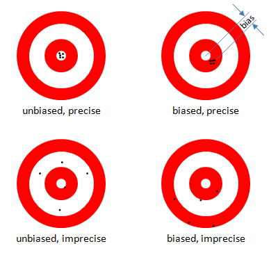
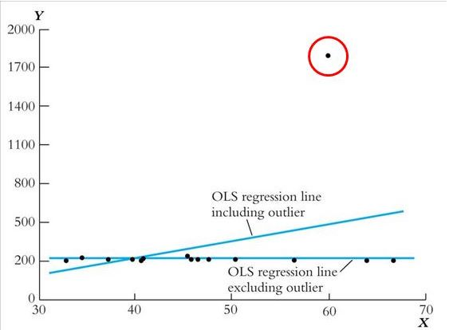
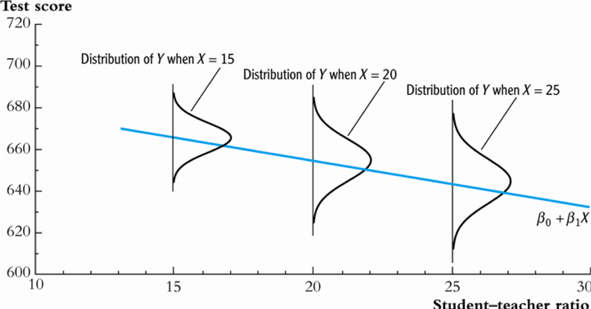
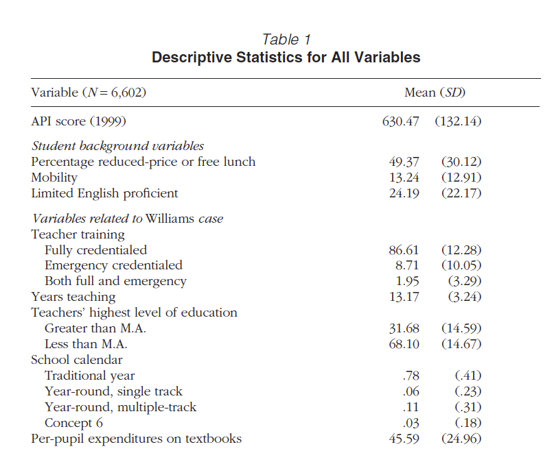

<!-- Code to enable scroll right for printing of data frames -->
<style>
pre code, pre, code {
  white-space: pre !important;
  overflow-x: auto !important;
  word-break: keep-all !important;
  word-wrap: initial !important;
}
</style>


```{r, echo=FALSE, include=FALSE}
knitr::opts_chunk$set(collapse = TRUE, comment = "#>", highlight = TRUE, warning = FALSE, message = FALSE)
  #comment = "#>" makes it so results from a code chunk start with "#>"; default is "##"
#options(scipen=999)
options(tibble.width = Inf, width = 10000) # Code necessary to enable scroll right for printing of data frames

# remove scientific notation
options(scipen=999)

# add commas to big numbers
#knitr::kable(d, digits = 3, format.args = list(big.mark = ",", scientific = FALSE))
```

# Introduction

"Bivariate regression" refers to regression models with two variables, a $Y$ variable ("dependent variable" or "outcome") and a single $X$ variable ("independent variable")

<br>

"Multivariate regression" refers to regression models with a $Y$ variable and two or more $X$ variables

<br>

This lecture introduces multivariate regression, building on concepts we learned from lecture on bivariate regression. In particular, this lecture will focus on:

- Assumptions required to make inferences based on regression analysis
- Using multivariate regression to estimate causal effects
- Interpreting results from multivariate regresssion
  - interpreting regression output from *R*
  - interpreting results from publications that use regresion


## Libraries, data, functions


This lecture will utilize data from two sources: 

- Tennessee Student Teacher Achievement Ratio (STAR) experiment, which we have worked with before
- The Educational Longitudinal Study (ELS) of 2002


```{r}
# uncomment below line to remove all objects
  #rm(list = ls())

# Libraries

  # install packages if you haven't already
    #install.packages('tidyverse')
    #install.packages('labelled')
    #install.packages('haven')
    #install.packages('patchwork')
    #install.packages("RCurl") #we'll use this to calculate robust standard errors

  library(tidyverse)
  library(labelled)
  library(haven)
  #library(RCurl)
  #library(patchwork)

    
##########
########## TENNESSEE STAR DATA
##########

# load star data
load(file = url('https://github.com/anyone-can-cook/educ152/raw/main/data/star/star_panel_data.RData'))

#df_star_panel %>% glimpse()

# create data frame for STAR experiment, keeping only kindergarten
df_stark <- df_star_panel %>% 
  # keep only kindergarten year
  filter(grade ==1) %>% 
  # keep only observations with non-missing value for reading score
  filter(!is.na(read)) %>%
  # keep only observations with non-missing values for treatment assignment
  filter(!is.na(star)) %>%
  # drop observations where treatment status is regular+aide
  filter(star !=3) %>%
  # keep selected variables
  select(id,grade,star,read,gender,ethnicity,lunch,school,degree,experience) %>%
  # create a variable "treatment" that equals 1 if student receives treatment (small class) and equals 0 otherwise
  mutate(
    treatment = if_else(star==2,1,0)
  )

df_stark %>% glimpse()

rm(df_star_panel) # comment this line out if you want to keep data frame df_star_panel


##########
########## RUN SCRIPT THAT CREATES USER DEFINED FUNCTIONS
##########

# source(file = url('https://github.com/anyone-can-cook/educ152/raw/main/scripts/user_defined_functions/create_inference_functions.R'))
  

##########
########## IPEDS
##########

# Load ipeds dataset from course website url
load(file = url('https://github.com/anyone-can-cook/educ152/raw/main/data/ipeds/output_data/panel_data.RData'))

# Create ipeds data frame with fewer variables/observations
df_ipeds_pop <- panel_data %>%
  # keep IPEDS tuition data from fall of which year (e.g., fall 2016 is price for programs in 2016-17 academic year)
  filter(year == 2016) %>%
  # which universities to keep:
    # 2015 carnegie classification: keep research universities (15,16,17) and master's universities (18,19,20)
  filter(c15basic %in% c(15,16,17,18,19,20)) %>%
  # which variables to keep
  select(instnm,unitid,opeid6,opeid,control,c15basic,stabbr,city,zip,locale,obereg, # basic institutional characteristics
         tuition6,fee6,tuition7,fee7, # avg tuition and fees for full-time grad, in-state and out-of-state
         isprof3,ispfee3,osprof3,ospfee3, # avg tuition and fees for MD, in-state and out-of-state
         isprof9,ispfee9,osprof9,ospfee9, # avg tuition and fees for Law, in-state and out-of-state
         chg4ay3,chg7ay3,chg8ay3) %>% # [undergraduate] books+supplies; off-campus (not with family) room and board; off-campus (not with family) other expenses
  # rename variables; syntax <new_name> = <old_name>
  rename(region = obereg, # revion
         tuit_grad_res = tuition6, fee_grad_res = fee6, tuit_grad_nres = tuition7, fee_grad_nres = fee7, # grad
         tuit_md_res = isprof3, fee_md_res = ispfee3, tuit_md_nres = osprof3, fee_md_nres = ospfee3, # md
         tuit_law_res = isprof9, fee_law_res = ispfee9, tuit_law_nres = osprof9, fee_law_nres = ospfee9, # law
         books_supplies = chg4ay3, roomboard_off = chg7ay3, oth_expense_off = chg8ay3) %>% # [undergraduate] expenses
  # create measures of tuition+fees
  mutate(
    tuitfee_grad_res = tuit_grad_res + fee_grad_res, # graduate, state resident
    tuitfee_grad_nres = tuit_grad_nres + fee_grad_nres, # graduate, non-resident
    tuitfee_md_res = tuit_md_res + fee_md_res, # MD, state resident
    tuitfee_md_nres = tuit_md_nres + fee_md_nres, # MD, non-resident
    tuitfee_law_res = tuit_law_res + fee_law_res, # Law, state resident
    tuitfee_law_nres = tuit_law_nres + fee_law_nres) %>% # Law, non-resident  
  # create measures of cost-of-attendance (COA) as the sum of tuition, fees, book, living expenses
  mutate(
    coa_grad_res = tuit_grad_res + fee_grad_res + books_supplies + roomboard_off + oth_expense_off, # graduate, state resident
    coa_grad_nres = tuit_grad_nres + fee_grad_nres + books_supplies + roomboard_off + oth_expense_off, # graduate, non-resident
    coa_md_res = tuit_md_res + fee_md_res + books_supplies + roomboard_off + oth_expense_off, # MD, state resident
    coa_md_nres = tuit_md_nres + fee_md_nres + books_supplies + roomboard_off + oth_expense_off, # MD, non-resident
    coa_law_res = tuit_law_res + fee_law_res + books_supplies + roomboard_off + oth_expense_off, # Law, state resident
    coa_law_nres = tuit_law_nres + fee_law_nres + books_supplies + roomboard_off + oth_expense_off) # %>% # Law, non-resident    
  # [COMMENTED THIS OUT] keep only observations that have non-missing values for the variable coa_grad_res
    # this does cause us to lose some interesting universities, but doing this will eliminate some needless complications with respect to learning core concepts about statistical inference
  #filter(!is.na(coa_grad_res))

# Add variable labels to the tuit+fees variables and coa variables
  # tuition + fees variables
    var_label(df_ipeds_pop[['tuitfee_grad_res']]) <- 'graduate, full-time, resident; avg tuition + required fees'
    var_label(df_ipeds_pop[['tuitfee_grad_nres']]) <- 'graduate, full-time, non-resident; avg tuition + required fees'
    var_label(df_ipeds_pop[['tuitfee_md_res']]) <- 'MD, full-time, state resident; avg tuition + required fees'
    var_label(df_ipeds_pop[['tuitfee_md_nres']]) <- 'MD, full-time, non-resident; avg tuition + required fees'
    var_label(df_ipeds_pop[['tuitfee_law_res']]) <- 'Law, full-time, state resident; avg tuition + required fees'
    var_label(df_ipeds_pop[['tuitfee_law_nres']]) <- 'Law, full-time, non-resident; avg tuition + required fees'
    
  # COA variables
    var_label(df_ipeds_pop[['coa_grad_res']]) <- 'graduate, full-time, state resident COA; == tuition + fees + (ug) books/supplies + (ug) off-campus room and board + (ug) off-campus other expenses'
    var_label(df_ipeds_pop[['coa_grad_nres']]) <- 'graduate, full-time, non-resident COA; == tuition + fees + (ug) books/supplies + (ug) off-campus room and board + (ug) off-campus other expenses'
    var_label(df_ipeds_pop[['coa_md_res']]) <- 'MD, full-time, state resident COA; == tuition + fees + (ug) books/supplies + (ug) off-campus room and board + (ug) off-campus other expenses'
    var_label(df_ipeds_pop[['coa_md_nres']]) <- 'MD, full-time, non-resident COA; == tuition + fees + (ug) books/supplies + (ug) off-campus room and board + (ug) off-campus other expenses'
    var_label(df_ipeds_pop[['coa_law_res']]) <- 'Law, full-time, state resident COA; == tuition + fees + (ug) books/supplies + (ug) off-campus room and board + (ug) off-campus other expenses'
    var_label(df_ipeds_pop[['coa_law_nres']]) <- 'Law, full-time, non-resident COA; == tuition + fees + (ug) books/supplies + (ug) off-campus room and board + (ug) off-campus other expenses'

  #df_ipeds_pop %>% glimpse()

rm(panel_data) # comment this line out if you want to keep data frame panel_data

##########
########## SCORECARD DATA ON DEBT AND EARNINGS
##########

# load scorecard dataset from course website url

load(file = url('https://github.com/anyone-can-cook/educ152/raw/main/data/college_scorecard/output_data/df_debt_earn_panel_labelled.RData'))

df_scorecard <- df_debt_earn_panel_labelled %>%
    # keep most recent year of data
    filter(field_ay == '2017-18') %>%
    # keep master's degrees
    filter(credlev == 5) %>%
    # carnegie categories to keep: 15 = Doctoral Universities: Very High Research Activity; 16 = Doctoral Universities: High Research Activity
      # note: variable ccbasic from scorecard data is 2015 carnegie classification
    filter(ccbasic %in% c(15,16,17,18,19,20)) %>%
    # drop "parent plus" loan variables and other vars we won't use in this lecture
    select(-contains('_pp'),-contains('_any'),-field_ay,-st_fips,-zip,-longitude,-latitude,-locale2,-highdeg,-accredagency,-relaffil,-hbcu,-annhi,-tribal,-aanapii,-hsi,-nanti,-main,-numbranch,-control) %>%
    # create variable for broad field of degree (e.g., education, business)
    mutate(cipdig2 = str_sub(string = cipcode, start = 1, end = 2)) %>%
    # shorten variable cipdesc to make it more suitable for printing
    mutate(cipdesc = str_sub(string = cipdesc, start = 1, end = 50)) %>%
    # re-order variables
    relocate(opeid6,unitid,instnm,ccbasic,stabbr,city,cipdig2)

  #df_scorecard %>% glimpse()

# For debt and earnings variables, convert from character to numeric variables (which replaces "PrivacySuppressed" values with NA values)
df_scorecard <- df_scorecard %>%
  mutate(
    debt_all_stgp_eval_n = as.numeric(debt_all_stgp_eval_n),
    debt_all_stgp_eval_mean = as.numeric(debt_all_stgp_eval_mean),
    debt_all_stgp_eval_mdn = as.numeric(debt_all_stgp_eval_mdn),
    debt_all_stgp_eval_mdn10yrpay = as.numeric(debt_all_stgp_eval_mdn10yrpay),
    earn_count_wne_hi_1yr = as.numeric(earn_count_wne_hi_1yr),
    earn_mdn_hi_1yr = as.numeric(earn_mdn_hi_1yr),
    earn_count_wne_hi_2yr = as.numeric(earn_count_wne_hi_2yr),
    earn_mdn_hi_2yr = as.numeric(earn_mdn_hi_2yr),
    ipedscount1 = as.numeric(ipedscount1),
    ipedscount2 = as.numeric(ipedscount2)
  ) 

# add variable label to variable cipdig2
  attr(df_scorecard[['cipdig2']], which = 'label') <- 'broad degree field code = 2-digit classification of instructional programs (CIP) degree code'

# add variable label attribute back to debt and earnings variables
  for(v in c('debt_all_stgp_eval_n','debt_all_stgp_eval_mean','debt_all_stgp_eval_mdn','debt_all_stgp_eval_mdn10yrpay','earn_count_wne_hi_1yr','earn_mdn_hi_1yr','earn_count_wne_hi_2yr','earn_mdn_hi_2yr','cipdesc','ipedscount1','ipedscount2')) {
    
    #writeLines(str_c('object v=', v))
    #writeLines(attr(df_debt_earn_panel_labelled[[v]], which = 'label'))
    
    attr(df_scorecard[[v]], which = 'label') <- attr(df_debt_earn_panel_labelled[[v]], which = 'label')
  }

#df_scorecard %>% glimpse()

rm(df_debt_earn_panel_labelled) # comment this line out if you want to keep data frame df_debt_earn_panel_labelled
#earn_mdn_hi_2yr

##########
########## LEFT JOIN SCORECARD AND IPEDS DATA
##########

# investigate data structure

  # df_scorecard; these vars uniquely identify observations
    df_scorecard %>% group_by(opeid6,cipcode) %>% summarise(n_per_key=n()) %>% ungroup() %>% count(n_per_key)

  # df_ipeds_pop: these vars uniquely identify observations
    df_ipeds_pop %>% group_by(unitid) %>% summarise(n_per_key=n()) %>% ungroup() %>% count(n_per_key)
    
# join
  # start with df_ipeds_pop, keep selected variables; then do do a right_join (i.e., keep obs in y table)
    
  df_score_ipeds <- df_ipeds_pop %>% 
    select(-instnm,-opeid6,-opeid,-c15basic,-region,-locale,-city,-stabbr,-zip) %>% mutate(one=1) %>%
    right_join(y=df_scorecard, by = 'unitid')
     #df_score_ipeds %>% glimpse()
  
  # 52 unitids from scorecard that don't have a match in ipeds
    # could be due to differences in year; decision: drop thiese
    df_score_ipeds %>% filter(is.na(one)) %>% count(unitid) # 52 unitids from scorecard data with missing IPEDS data
    df_score_ipeds %>% filter(is.na(one)) %>% count(instnm) # 52 unitids from scorecard data with missing IPEDS data
  

  df_score_ipeds <- df_score_ipeds %>% 
    # drop unitids from scorecard that don't merge to ipeds data (on tuition)
    filter(!is.na(one)) %>% 
    # drop observations that don't have mean debt data
    filter(!is.na(debt_all_stgp_eval_mean)) %>% 
    # drop for-profits
    filter(control !=3) %>%
    # drop tuition/coa vars for law and md
    select(-one,-contains('law'),-contains('md_')) %>% 
    # create measure of urbanization from locale
    mutate(
      urban = case_when(
        locale %in% c(11) ~ 1, # city
        locale %in% c(12,13) ~ 2, # city
        locale %in% c(21,22,23) ~ 3, # suburb
        locale %in% c(31,32,33,41,42,43) ~ 4 # town/rural
        )
      ) %>% 
    # create value labels for level of urbanization
    set_value_labels(
      urban = c(
        'large city (250k+)' = 1,
        'med/small city' = 2,
        'suburb' = 3,
        'town/rural' = 4
        )
      ) %>%
    # change variable order
    relocate(opeid6,unitid,instnm,control,ccbasic,stabbr,region,city,locale,urban,cipdig2,cipcode,cipdesc,credlev,creddesc,
      contains('ipeds'),starts_with('debt'),starts_with('earn'))

# create variable label 
var_label(df_score_ipeds[['urban']]) <- 'four-category variable of level of urbanization (large city, small/med city, suburb, town/rural) created from locale'
# %>% count(urban, locale) # crosscheck

      
  df_score_ipeds %>% glimpse()

rm(df_ipeds_pop) # comment this line out if you want to keep ipeds data frame
rm(df_scorecard) # comment this line out if you want to keep scorecard data frame

# Investigate analysis data frame `df_score_ipeds`  

  # data structure: variables that uniquely identify obs
    df_score_ipeds %>% group_by(opeid6,cipcode) %>% summarise(n_per_key=n()) %>% ungroup() %>% count(n_per_key)
  
  # number of observations (universities) for each 4-digit cip code (degree code)
    #df_score_ipeds %>% count(cipcode)
    df_score_ipeds %>% filter(cipcode=='4407') %>% count(cipcode) # social work
  
##### create data frame that only contains observations for MAs in social work;     
    #filter(cipcode=='4407')
    
  df_socialwork <- df_score_ipeds %>% 
    filter(cipcode=='4407') %>%
    # remove observations with missing values of cost of attendance (better for teaching concepts)
    filter(!is.na(coa_grad_res))

  df_socialwork %>% glimpse()

  # investigate data structure  
    # one observation per opeid6
    df_socialwork %>% group_by(opeid6) %>% summarise(n_per_key=n()) %>% ungroup() %>% count(n_per_key)
    
    # also, one observation per unitid
    df_socialwork %>% group_by(unitid) %>% summarise(n_per_key=n()) %>% ungroup() %>% count(n_per_key)

    
##### create data frame that only contains observations for MAs in business
  
  #particularly the degree "Business Administration, Management and Operations", which is associated with general MBA programs
    
#df_score_ipeds %>% filter(cipdig2=="52") %>% count(cipcode)
#df_score_ipeds %>% filter(cipdig2=="52") %>% count(cipdesc)

  df_mba <- df_score_ipeds %>% 
    filter(cipcode=='5202') %>%
    # remove observations with missing values of cost of attendance (better for teaching concepts)
    filter(!is.na(coa_grad_res))    

df_mba %>% glimpse()

# create version of data frame df_mba that turns class=labelled variables to factor variables
  df_mba_fac <- as_factor(df_mba, only_labelled = TRUE)

# save as RDS
  #save(df_mba_fac, file = "../../data/college_scorecard/output_data/df_debt_earn_mba.Rdata")  
  
##########
########## ELS:2002 data
##########

# RUN SCRIPT THAT CREATES STUDENT-LEVEL DATA FRAME CONTAINING ALL VARIABLES AND CREATES DATA FRAME WITH A SUBSET OF VARIABLES

  #NOTE: this script will take 30 seconds to a minute to run because loading a dataset w/ about 16,000 observations and 4,000 variables from a website

  source(file = url('https://github.com/anyone-can-cook/educ152/raw/main/scripts/els/read_els_by_pets.R'))
    #source(file = file.path('.','..','..','scripts','els','read_els_by_pets.R'))
      #list.files(path = file.path('.','..','..','scripts','els'))

# Create a dataframe df_els_stu_fac that has categorical variables as factor class variables rather than labelled class variables
  df_els_stu_fac <- as_factor(df_els_stu, only_labelled = TRUE)
  # convert continuous variables we know we want numeric back to numeric
  for (v in c('bytxmstd','bytxrstd','f1txmstd','f3stloanamt','f3stloanpay','f3ern2011','f3tzrectrans','f3tzreqtrans','f3tzschtotal')) {
    df_els_stu_fac[[v]] <- df_els_stu[[v]]  
  }
```


## ELS:2002 data

<br>

The Educational Longitudinal Study (ELS) of 2002, referred to as ELS:2002

- Nationally representative, longitudinal survey of US 10th graders in 2002, followed them from 2002 to 2013
- Created by the National Center for Education Statistics, a branch of the U.S. Department of Education
- [LINK](https://nces.ed.gov/surveys/els2002/) to ELS:2002 website
- [LINK](https://nces.ed.gov/OnlineCodebook) to the NCES "Online Codebook"  website, which contains "public-use" versions of ELS datasets and detailed information about all variables
  - variables that could potentially be used to identify ELS survey respondents are "suppressed" from public-use datasets
  - these variables are present in "restricted" versions of ELS datasets

  
<br>  

ELS datasets we created

- student-level data frame `df_els_stu_all` has all variables (about 4,000) and all observations (about 16,200 observations); one observation for each student
- student-level data frame `df_els_stu` has a subset of variables and a subset of observations
  - sample is respondents who filled completed all waves of the survey; who attended postsecondary education at some point by 2012; and some other minor sample criteria around observations not being missing for certain variables
- for both `df_els_stu_all` and `df_els_stu`, most categorical variables are `labelled` class variables
- student-level data frame `df_els_stu_fac` is exact same as `df_els_stu` except categorical variables are `factor` class; categorical variables must be factor class when running regression models


<br>  
In the coming weeks, we want your help in identifying variables of interest and populations/samples of interest!
<br>  

Investigate `df_els_stu` (output not shown)
```{r, include = FALSE}
# variable names
df_els_stu %>% glimpse()

# variable labels
df_els_stu %>% var_label()
```

<br>  

Investigate `df_els_stu_fac` (output not shown)
```{r, include = FALSE}
# variable names
df_els_stu_fac %>% glimpse()

# variable labels
df_els_stu_fac %>% var_label()
```


<br>  

Can use the `lookfor()` function from the `labelled` package to query which variables and variable labels contain certain words

- syntax (with defaults):
  - `look_for(data, ..., labels = TRUE, ignore.case = TRUE, details = TRUE)`
  - where argument `...` contains "strings" (e.g., words) you are looking for, enclosed in quotation marks
- example syntax, looking for variable names and variable labels that contain the word "internship"
  - `lookfor(data=df_els_stu_all, 'internship',labels = TRUE, ignore.case = TRUE, details = TRUE)`


useful to use `lookfor()` to query the dataset `df_els_stu_all` because this dataset has so many variables (more than 4,000)
```{r}

# query data frame df_els_stu_all
  lookfor(data=df_els_stu_all, 'internship',labels = TRUE, ignore.case = TRUE, details = TRUE)


# query data frame df_els_stu
  lookfor(data=df_els_stu, 'debt',labels = TRUE, ignore.case = TRUE, details = TRUE)
  lookfor(data=df_els_stu, 'loan',labels = TRUE, ignore.case = TRUE, details = TRUE)
```

## Example research questions

For the multivariate regression lecture, we will focus on using multivariate regression to answer *causal* research questions that follow the form "what is the effect of $X$ on $Y$?"

<br>

We will answer one research question that uses experimental data from the Tennessee STAR Experiment and also research questions that use observational data from ELS:2002

1. [experimental design] What is the effect of being in a small class size ($X_i=1$) vs. regular class size ($X_i=0$) on reading achievement score ($Y_i$) for kindergarten students?
    - Using data from the Tennessee Student Teacher Achievement Ratio (STAR) experiment
    - Kindergarten students randomly assigned to "small" [treatment] vs. "regular" [control] class size based on flip of a coin
    - [LINK](https://dataverse.harvard.edu/dataset.xhtml?persistentId=hdl:1902.1/10766) to information and data on the Tennessee STAR project
    - $X$ var is `treatment`; $Y$ var is `read`

```{r}
df_stark %>% group_by(treatment) %>% summarize(
  mean_read = mean(read, na.rm = TRUE),
)
```

<br><br>

2. [observational design, categorical $X$] What is the effect of having an internship or co-op job ($X$) (in 2005-06) on 2011 earnings ($Y$)? [for students who were enrolled in postsecondary education in 2005-06]
    - $Y$ is `f3ern2011`
    - $X$ is `f2intern0506` (this would be sophomore year for students who graduated HS in spring 2004 and immediately entered postsecondary education)
      - `f2intern0506==0`: no co-op/internship
    - sample: `f2enroll0506=='yes'`
    

```{r}
df_els_stu_fac %>% filter(f2enroll0506=='yes') %>% 
  group_by(f2intern0506) %>% summarize(
  mean_earn = mean(f3ern2011, na.rm = TRUE),
  n_nonmissing = sum(!is.na(f3ern2011))
)

```
    

<br><br>

3. [observational design, categorical $X$] What is the effect of field of study ($X$) on earnings ($Y$)? [for respondents not currently enrolled in postsecondary education]
    - answer the RQ separately for: certificate degrees; associate's degrees; for bachelor's degrees? 
    - $Y$ is `f3ern2011`
    - for certificate degrees: $X$ is `f3tzcrt1cip2`
    - for associate's degrees: $X$ is `f3tzasc1cip2`
    - for bachelor's degrees: $X$ is `f3tzbch1cip2 `

```{r}
# certificate degrees
df_els_stu_fac %>% filter(!(f3tzcrt1cip2 %in% c('Missing','Item legitimate skip/NA')), f3a01d=='No') %>% 
  group_by(f3tzcrt1cip2) %>% summarize(
  mean_earn = mean(f3ern2011, na.rm = TRUE),
  n_nonmissing = sum(!is.na(f3ern2011))
)

# associates degreees
df_els_stu_fac %>% filter(!(f3tzasc1cip2 %in% c('Missing','Item legitimate skip/NA')), f3a01d=='No') %>% 
  group_by(f3tzasc1cip2) %>% summarize(
  mean_earn = mean(f3ern2011, na.rm = TRUE),
  n_nonmissing = sum(!is.na(f3ern2011))
)

# bachelor's degreees
df_els_stu_fac %>% filter(!(f3tzbch1cip2 %in% c('Missing','Item legitimate skip/NA')), f3a01d=='No') %>% 
  group_by(f3tzbch1cip2) %>% summarize(
  mean_earn = mean(f3ern2011, na.rm = TRUE),
  n_nonmissing = sum(!is.na(f3ern2011))
) %>% print(n=30)
```
<br><br>

4. [observational design, continuous $X$] What is the effect of amount borrowed in student loans ($X$) on earnings ($Y$) for respondents not currently enrolled in postsecondary education
    - $X$ var is `f3totloan`; $Y$ var is `f3ern2011`
    - sample: `f3a01d=='No'`


```{r}
df_els_stu_fac %>% filter(f3a01d=="No") %>%  ggplot(aes(x=f3totloan, y=f3ern2011)) + geom_point() + stat_smooth(method = 'lm')

summary(lm(formula = f3ern2011 ~ f3totloan, data = df_els_stu %>% filter(f3a01d==0)))
```

<br>
<br>
Why are we using test scores and earnings as dependent variables?

- Ordinary Least Squares (OLS) multivariate regression assumes continuous dependent variable; regression models with categorical dependent variables are a bit more difficult to interpret
- But in later weeks, we may introduce the "linear probability model," which will enable us to model dichotomous (two-category) dependent variables (e.g., 0/1 did student graduate)


# Bias and efficiency

Recall that the fundamental goal of inferential statistics is to make statements about **population parameters** by using **estimators** to calculate **point estimates** from sample data
<br>


- Desirable properties of our point estimates (e.g. $\hat{\beta}$ or $\bar{Y}$)
  - Efficient
  - Unbiased
  
  
__Efficiency__ (also called "precision")

- Definition: how close your point estimate(s) is to the population parameter
- Standard Error: on average, how far away is a point estimate from one random sample from the value of the population parameter
- _Therefore_, an efficient point estimate is one with a low standard error (in other words, the sampling distribution of $\beta_1$ has low variance or is "tight" around the population parameter)
  - often, the easiest way to increase efficiency (decrease standard errors) is to increase sample size
  


<br><br>

__Bias__

- __Bias__: consistently overestimates or underestimates population parameter in repeated random samples
  - There are many different types of bias!
- _Sampling Bias_:
  - Estimate of population parameter is biased because you fail to take a random sample
  - Example: goal is to estimate high school graduation rate; take a random sample of 10th graders and see if they graduate within three years.
- _Omitted variable bias_:
  - Bias in estimate of $\beta_1$ due to omitting necessary "control" variables in your regression model; we will discuss later in lecture

In the picture below: 

- imagine that vertical red line is the value of the population parameter
- the blue curve represents the sampling distribution from an unbiased estimator, which is centered at the value of the population parameter
- the red dotted curve is the sampling distribution from a biased estimator (e.g., if you used sample mode as the estimator for population mean)


<br><br>

Picture of Bias and Efficiency (or "Precision")




# OLS Assumptions

<br><br>

OLS assumptions

1. Conditional independence assumption
    - (necessary to make this assumption if we are trying to estimate causal effects)
2. ($X_i$, $Y_i$), $i=1, ...n$ are independently and identically distributed (i.i.d)
3. Large outliers are unlikely
4. Homoskedasticity

<br>

- If these assumptions hold:
  - Then our OLS estimators, $\hat{\beta_0}$, $\hat{\beta_1}$...$\hat{\beta_k}$, have normal distributions in large samples
  - And because they have normal distributions, we can use $\hat{\beta_0}$, $\hat{\beta_1}$...$\hat{\beta_k}$, to test hypothesess about the population parameters $\beta_0$,  $\beta_1$...$\beta_k$
- If these assumptions are violated:
  - We produced inefficeint and biased estimates, $\hat{\beta_0}$ and $\hat{\beta_1}$, of the population parameters $\beta_0$ and $\beta_1$
  
<!-- ### First OLS Assumption (Review) -->

<!-- 1. __The conditional assumption of $u_i$ given $X_i$ has a mean a zero__ -->
<!-- - What does this mean? -->
<!--   - The independent variable $X_i$ is unrelated to all variables that were not included in the model (i.e., $u_i$) -->
<!--   - If we violate this assumption, we produce a biased estimate! -->
<!--   - What's a biased estimate? Consistenly overestimating or underestimating population parameter! [remember Lec 9?] -->
<!--   - If $u_i$ given $X_i$ has a mean a zero = our predictions do not systematically over- or under-estimate, thus balance out to zero = no bias!  -->
<!-- - We learned "simple regression" (i.e., one independent variable of interest) has a major flaw: -->
<!--   - We ignore other "determinants" (i.e., control variables) of the dependent variable that correlate with our one independent variable of interest -->
<!--   - Remember that  other "determinants" or "other variables that impact the dependent" variable that are not in our model are collected in the residual term $u_i$, which we have thus far *assumed* to be unrelated with the independent variable of interest -->
<!--   - If we exclude these other determinants that are related to our independent variable of interest; we introduce estimation bias via an omitted variable! -->
<!-- - For __omitted variable bias__ to occur, the omitted variable “Z” must satisfy two conditions: -->
<!--     - (1) Z affects value of Y (i.e. Z is part of $u_i$); (2) *and* Z has a relationship with $X$ -->
<!--     - What happens when you omit a "Z" variable from your model? It is absorbed by the residual term! -->
<!--     - We know that the "Z" variable omitted from the model is correlated to our independent variable of interest, which now means that our _X is not uncorrelated to the residual = violation of OLS 1!_ -->

<!-- ### First OLS Assumption Graphically. -->

<!-- - Practical Example: What is the effect number of years of schooling on income? -->
<!-- - Show Graphically on doc camera -->


<!-- ### First OLS Assumption cont -->
<!-- - Practical Example: What is the effect number of years of schooling on income? -->
<!-- - $Y_i = \beta_0 + \beta_1X_i +u_1$ -->
<!-- - There are lots of other factors that would influence income besides years of schooling! -->
<!--   -  If we don't include them in the regression as control variables, they are thus relegated to the $u_1$ and we assume they are not systematically related to years of schooling. -->
<!--   - If this excluded variable meets both conditions of omitted variable bias (Z affects Y and Z is related to X); then there is a systematic relationship and should not be in the residual!  -->
<!--   - __By keeping it in the residual (i.e., excluding it from the model), we violate OLS Assumption 1 and produce a biased estimate!__ -->

<!-- <br> -->
<!-- __In practice, OLS Assumption 1 is the most difficult to prove and the most important for econometrics research!__ -->

<!-- - We can draw on the conditional independence assumption: -->
<!--   - Once we include relevant control variables; there are no omitted variables that affect Y and have a systematic relationship with X -->
<!--   - Meaning, if we satisfy the conditional independent assumption through control variables, then multiple regression is just as good as random assignment experiment (the gold standard of program evaluation!) -->
<!--   - But remember this is hard to do "in practice" via observational data; so we get "as close as possible" and acknowledge limitations! -->


## Assumption 2: i.i.d.

2. __($X_i$, $Y_i$), $i=1, ...n$ are independently and identically distributed (i.i.d)__

<br>

 What does this assumption mean?
 
 - This assumption is about sampling
 - This assumption has two parts:
   - _($X_i$, $Y_i$), $i=1, ...n$ are independently distributed_
  - _($X_i$, $Y_i$), $i=1, ...n$ are identically distributed_
- We will explain each part separately  
    

<br>

_($X_i$, $Y_i$), $i=1, ...n$ are independently distributed_

- In words: Knowing that observation i takes on particular values for X and Y tells you nothing about the probability of the next observation taking on particular values for X and Y
- When is assumption of independently distributed violated? 
  - Longitudinal data: knowing a data point in one time period tells you something about a data point in another time period. 
    - Ex: Amount of \$ student received via a Federal Pell Grant freshman year at UA probably tells you something about how much \$ student received via a Federal Pell Grant sophmore year at UA. Why? because Pell status is not likely to dramatically change from one year to another!
  - Hierarchical data: 
    - Ex: Students are nested within classrooms. Knowing the reading test score of one student in a classroom is probably correlated with reading test score for another student in the same classroom.
- This assumption is violated for both the Tennessee STAR and the ELS:2002 datasets we are working with for this lecture
  - Tennessee STAR: students are nested in classrooms
    - if students $i=1$ and $i=2$ are in the same classroom and we know the outcome for student $i=1$, then this information helps us predict outcome for student $i=2$ because scores within classrooms are likely to be positively correlated
  - ELS:2002 data
    - the sampling design was to randomly pick high schools, and then randomly sample about `30` students within each high school
- What happens if this assumption is violated?
  - Our standard errors are incorrect, likely to be too small (downward biase)
  - Since hypothesis testing about $\hat{\beta}_1$ is $\text{point_estimate}/SE(\text{point_estimate})$, standard errors that are smaller than they should be will cause us to reject $H_0: \hat{\beta}_1=0$ when we should not
- For this course, you do not need to worry about this assumption  
- How to overcome violations of this assumption:
  - "cluster" your standard errors to account for nested structure of data (e.g., standard errors clustered at the high-school level)
    - this approach calculates standard errors that are "robust" to violations of the assumption; that is, you can use these standard errors whether the assumption is violated or not
  - You don't need to take a separate course on "hierarchical linear regression"
    - this approach tries to model the structure of residuals, rather than calculating standard errors that are robust to violations of the assumption
    - modeling the structure of residuals makes assumptions about distribution of residuals; avoid making unnecessary assumptions whenever possible

  

<br>

_($X_i$, $Y_i$), $i=1, ...n$ are identically distributed_

- Prior to choosing sample of observations for the population, the probability distribution (i.e., the likelihood that $Y_i$ takes on certain values) is the same for all observations
- This is always true if you take a random sample!
  - One randomly selected observation has the same probability of taking on a certain value of $Y_i$ as another randomly selected observation 
- When is the assumption of identically distributed violated?
  - Sampling bias:
    - Ex: You want to investigate probability of being tardy to college lectures and take a sample of students living on campus. Sampling bias: you did not include commuter students. If you were to randomly select a student living on campus, they are not likely to have the same probability of being tardy to lecture than a randomly selected commuter student. 
- This assumption was badly violated in datasets where modeled the relationship between cost of attendance ($X$) and institution-level student debt ($Y$) or institution-level student earnings ($Y$)
  - Department of education provided debt data and earnings data only for programs with high enrollment (to protect student anonymity)
  - So we don't have a random sample of degree programs; we only have degree programs from high-enrollment programs; these programs are likely not representative of the population
- Why is sampling bias bad?
  - we our sample is not representative of the population, then point estimates of population parameters calculated from this sample is likely to be systematically wrong (biased)
- Don't need to worry about violations of this part of the assumption for this class


## Assumption 3: outliers

<br>

3. Large outliers are unlikely

- Outliers: observations with values of $X_i$ and $Y_i$ that are outside the "usual" range of the data
- Outliers will affect your regression coefficients! 
- Why? Because outliers will shift our OLS regression line!
- Outliers are more likely to substantively affect results if your sample size is small

<br>

{width=85%}
<br>

In the below graph of the relationship between cost of attendance ($X$) and institution-level student debt ($Y$) for MA programs in social work, we may be concerned that the high value of debt for the USC observation might affect or results
```{r}
df_socialwork %>%  ggplot(aes(x=coa_grad_res, y=debt_all_stgp_eval_mean)) + geom_point() + stat_smooth(method = 'lm')
```

<br><br>

- Stock and Watson have a very technical, mathematical definition of when this likely; but in practice this is about really investigating/knowing your data

- In practice, if you do find outliers:
  - Be sure the data is entered correctly and cleaned
    - Ex: Survey data codes missing data as very unusual values (-99, -99, 99, 98)
  - Sometimes outliers belong in the data!
    - I avoid removing observations just because they have a high value; this introduces sampling bias
  - If they belong; can use natural log of the variable [not covered in this class]
    - Ex: All money variables are usually converted to their natural log in econometrics or education research (e.g., state appropriations, tuition revenue, household income)


## Assumption 4: homoskedasticity


There is "generally" a fourth OLS assumption, but Stock and Watson do not list it in our textbook

- I'll tell you why after we understand what it generally assumes...
  
  
OLS Assumption #4: The distribution of the residuals has constant variance (homoscedasticity)

- Homoskedasticity 
  - The distribution (the variance!) of the residuals, $u_i = Y_i - \hat{Y_i}$, is constant for all observations. That is, it does not change for different values of X
  - Homo-skedasticity = "equal" or "same" variances
- Heteroskedasticity
  - The distribution (the variance!) of the residuals, $u_i = Y_i - \hat{Y_i}$, is not constant for all observations. That is, it does change/differs for different values of X
  - Hetero-skedasticity = "unequal" or "different" variances

<br>

Homoskedasticity and Heteroskedasticity shown graphically

- Practical example: What is the effect of student-teacher ratio on test scores? [Stock and Watson Example]



<br>

In the below graph of the relationship between cost of attendance ($X$) and institution-level student debt ($Y$) for MA programs in business (MBA), we may be concerned that the high value of debt for the USC observation might affect or results

- the black dots represent the actual values values of student debt ($Y_i$)
- Blue line represents predicted value of debt ($\hat{Y}_i$) for an institution with a particular value of cost of attendance ($X_i$)
- The residual $\hat{u}_i$ ($\hat{u}_i = Y_i - \hat{Y}_i$) represents how far off our prediction is for a particular observation $i$
- The "distribution" of the residual gets at how far off our predictions tend to be
- We could calculate this distribution separately for different values of $X$
- But visually, we can see that predicted value of debt ($\hat{Y}_i$) tend to be closer to actual values of debt $Y_i$ for lower values of cost of attendance
  - therefore, the distribution of residuals differs across values of $X$
  - therefore, these residuals are heteroskedastic rather than homoskedastic
```{r}
df_mba %>%  ggplot(aes(x=coa_grad_res, y=debt_all_stgp_eval_mean)) + geom_point() + stat_smooth(method = 'lm')
```

<!-- ### Fourth OLS Assumption cont. -->

<!-- - Practical example: What is the effect of years of education on hourly wages? [Stock and Watson Example] -->

<!--  -->

<br>

- Why is homoskedasticity/heteroskedasticity important?
  - Because our formula for calculating SE($\hat{\beta_1}$) changes based on homoskedastic or heteroskedastic residuals!
  - Our standard error measures how far our $\hat{\beta_1}$ is likely to be from $\beta_1$. In other words, it is used to calculate our t-value in hypothesis testing to determine statistical significance!
- In other statistics classes (non-econometrics), homoskedasticity is the fourth core assumption
  - Stock and Watson only discuss the first three assumptions as core "OLS Assumptions"
- Why? Stock and Watson say:
  - It is NEARLY IMPOSSIBLE to assume homoskedasticity; we almost always violate this assumption!
  - But the solution to overcome this assumption is easy!
    - We can just calculate heteroskedastic standard errors
    - In other words, standard errors that are __robust__ to violations of homoskedasticity
- Stock and Watson say: 
  - Rather than make homoskedasticity a core OLS Assumption and nearly always violate it;
  - ALWAYS CALCULATE ROBUST STANDARD ERRORS AND DO NOT MAKE HOMOSKEDASTICITY A CORE OLS ASSUMPTION
- In this class, we won't worry about calculating robust standard errors in *R*, but it's not a very hard thing to do

<br><br>
code to calculate robust standard errors (not run)
```{r, include=FALSE, eval=FALSE}
   # import the robust SE function 
   url_robust <- "https://raw.githubusercontent.com/IsidoreBeautrelet/economictheoryblog/master/robust_summary.R"
   eval(parse(text = getURL(url_robust, ssl.verifypeer = FALSE)),
        envir=.GlobalEnv) 

mod_loan_earn <- lm(formula = f3ern2011 ~ f3totloan, data = df_els_stu %>% filter(f3a01d==0))
summary(mod_loan_earn)

summary(mod_loan_earn, robust = TRUE)      
```

# Conditional independence assumption (CIA)

The __conditional independence assumption (CIA)__ is (the most important) assumption we need to satisfy when we are trying to answer *causal* research questions of the type "what is the effect of $X$ on $Y$?"

- The conditional independence assumption goes by many other names (e.g., "unconfoundedness", "ignorability", "exogenous selection", etc.)

<br>

To explain the conditional independence assumption, we will go back and forth between the following two research questions (RQ):

- What is the effect of being in a having an internship ($X_{1i}=1$) vs. not having an internship e ($X_{1i}=0$) on subsequent earnings ($Y_i$)?
  -  (we have observational data for this RQ)
- What is the effect of being in a small class size ($X_{1i}=1$) vs. regular class size ($X_{1i}=0$) on reading achievement score ($Y_i$) for kindergarten students?
  -  (we have experimental data for this RQ)

<br><br>

Population linear regression model

- $Y_i = \beta_0 + \beta_1 X_{1i}+ u_i$, where:
- $Y_i$: is earnings for student $i$ in 2011
- $X_{1i}$: is whether student $i$ had an internship in the 2005-06 academic year
  - $X_{1i}=0$: student $i$ did not have an internship ("untreated" or "control")
  - $X_{1i}=1$: student $i$ had an internship ("treated")
- $u_i$ is all variables that affect $Y_i$ but were not included in our model
  - these are usually called "omitted variable"
    - note that by definition an omitted variable is a variable that affects the outcome; doesn't include variables that were excluded from model but do not affect the outcome
  - let's pretend that $u_i$ consists of just one variable, parental income


<br><br>

__Conditional independence assumption (CIA)__

- CIA in words
  - the independent variable $X_i$ is unrelated to omitted variables, $u_i$, not included in the model
- CIA mathematically
  - $E(u_i|X_i)=0$; the expected value of $u_i$, given any value of $X_i$, equals zero
  - intuition:
    - if we pretend that $u_i$ consists of only one variable, the conditional independence assumption states that expected value of the omitted variable is equal to zero no matter the value of variable $X_i$
    
<br><br>

__Conditional independence assumption (CIA) is *always* satisfied in a random assignment experiment__

- $Y_i = \beta_0 + \beta_1 X_{1i}+ u_i$
- In a random assignment experiment, students are randomly assigned to receive an internship ($X_{1i}=1$) or not ($X_{1i}=0$)
- Because values of $X_{1i}$ are randomly assigned, values of $X_{1i}$ are *by construction* unrelated to other factors $u_i$ (parental income) that affect $Y_i$. so we have:
  - $E(u_i|X_i)=0$; or "independent variable $X_i$ is unrelated to omitted variables, $u_i$, not included in the model"
- we know that parental income $u_i$ affects earnings $Y_i$
  - students with rich parents have higher earnings than students with poor parents, because rich parents use connections to give their child job opportunities
- But we don't have to be concerned that students with rich parents are more likely to get internships, because in an experiment internships are randomly assigned  


<br><br>

__Conditional independence assumption (CIA) is rarely satisfied when the treatment is not randomly assigned (self-selction into treatment__

- $Y_i = \beta_0 + \beta_1 X_{1i}+ u_i$
- we know that parental income $u_i$ affects earnings $Y_i$
- why might parental income $u_i$ be related to whether a student receives an internship or not $X_{1i}$?
  - Some internships are unpaid or pay very little; only students with rich parents can afford to take an unpaid internship
  - rich parents directly or indirectly help their child obtain an internship
    - direct: parent asks professional contact to give internship to their child
    - indirect: e.g., grew up in an affluent community; got an internship from a friend's parent

<br><br>

__Why does violation of Conditional independence assumption cause estimate of causal effects to be biased?__

- Population linear model
  - $Y_i = \beta_0 + \beta_1 X_{1i}+ u_i$
  - $\beta_1$ is the "true" causal effect of having an internship ($X$) on earnings ($Y$)
- OLS prediction line (our point estimates for the population parameters)  
  - $Y_i = \hat{\beta_0} + \hat{\beta_1} X_{1i}$
  - $\hat{\beta_1}$ is our estimate of the true causal effect of having an internship ($X$) on earnings ($Y$)
- If parental income $u_i$ (omitted from the model) positively affects $Y$ and is positively related with receiving an internship ($X$) then:
  - Our estimate $\hat{\beta_1}$ is partly due to the relationship between income $Y$ and internship $X$ and partly due to the relationship between income $Y$ and parental income $u_i$
  - Therefore, $\hat{\beta_1}$ is a biased point estimate of $\beta_1$ (the "true" causal effect of internship on earnings) because it is picking up the relationship between income $Y$ and parental income $u_i$


<br><br>
In the ELS:2002 dataset `df_els_stu_fac`, students self-select into having an internship or co-op job. 

Let's run a regression model of the relationship between internship ($X$), measured by `f2intern0506`, and 2011 earnings ($Y$), measured by `f3ern2011`

- our sample is the subset of students who were enrolled in 2005-06 (`f2enroll0506=='yes'`) because the variable `f2intern0506` was defined for these students

```{r}
intern_mod1 <- lm(formula = f3ern2011 ~ f2intern0506, data = df_els_stu_fac %>% filter(f2enroll0506=='yes'))

summary(intern_mod1)
```


<br>
In above model, $\hat{\beta_1}=$ `r format(round(summary(intern_mod1)$coefficients[2,1], digits =0),big.mark = ',')`

- We estimate that having an internship in 2005-06 as opposed to not having an internship is, on average, associated with a `r format(round(summary(intern_mod1)$coefficients[2,1], digits =0),big.mark = ',')` dollar change in 2011 earnings

<br>

But we may concerned that parental income (measured by `parent_income`) : (a) has a positive relationship with earnings ($Y$) *AND* (b) is positively related with having an internship ($X$)

- we'll just assume parental income is positively related to having an internship
- graphically view relationship between parental income (X axis) and earnings (y axis)

```{r}
df_els_stu_fac %>% filter(f2enroll0506=='yes') %>%  ggplot(aes(x=parent_income, y=f3ern2011)) + geom_point() + stat_smooth(method = 'lm')
```

```{r, include=FALSE, eval = FALSE}
cor(df_els_stu_fac$parent_income, as.numeric(df_els_stu_fac$f2intern0506), use = 'complete.obs')
```

<br><br>
If we can include a measure of parental income in our model of the relationship between internship ($X$) and earnings ($Y$), then we no longer have to be concerned about whether the relationship between internship and parental income is biasing our results because we have "controlled" for this relationship
```{r}
intern_mod2 <- lm(formula = f3ern2011 ~ f2intern0506+ parent_income, data = df_els_stu_fac %>% filter(f2enroll0506=='yes'))

summary(intern_mod2)
```

# Omitted Variable Bias

Population linear regression model

- $Y_i = \beta_0 + \beta_1 X_{1i}+ u_i$, where:
- $Y_i$: is earnings for student $i$ in 2011
- $X_{1i}$: is whether student $i$ had an internship in the 2005-06 academic year
  - $X_{1i}=0$: student $i$ did not have an internship ("untreated" or "control")
  - $X_{1i}=1$: student $i$ had an internship ("treated")
- $u_i$ is all variables that affect $Y_i$ but were not included in our model


We want to estimate $\beta_1$, the "true" *causal effect* of X on Y

<br>

- Bias (general): when $\hat{\beta_1}$ consistently underestimates $\beta_1$ or overestimates $\beta_1$

<br>
- __Omitted Variable Bias__: bias in $\hat{\beta_1}$ due to variables being omitted from the model

<br>

__For omitted variable bias to occur, the omitted variable “Z” must satisfy two conditions__:

- (1) Z affects value of Y (i.e. Z is part of $u_i$)
- (2) *and* Z has a relationship with $X$

<br>
__Omitted variable bias is caused by violations of the conditional expectations assumption (CIA)__:

- Recall the conditional independence assumption
  - in words: the independent variable $X_{1i}$ is unrelated to omitted variables, $u_i$, not included in the model
- Omitted variable bias is caused by omitting a variable from your model that is related (e.g., correlated) to $X_i$ (and that also affects $Y_i$)

<br>

__Omitted variable bias is not a concern in a random assignment experiment__:

- If values of your independent variable of interest $X_{1i}$ are randomly asssigned, then the value of $X$ cannot have a systematic relationship with other variables that affect $Y$ that have been omitted from your model

<br><br>

let's consider Tenessee STAR experiment, where we are interested in the effect of class size ($X$) on reading achievement score ($Y_i$)

- values of class size are randomly assigned: small class size ($X_{1i}=1$) vs. regular class size ($X_{1i}=0$)
- below shows a regression of `treatment` ($X$) and `read` ($Y$)

```{r}

summary(lm(formula = read ~ as.factor(treatment), data = df_stark))
```
- The variable `lunch` (free-reduced lunch), a proxy for household income, also affects reading achievement

```{r}
summary(lm(formula = read ~ as.factor(lunch), data = df_stark))
```
- But we are not concerned about omitted variable bias due to excluding `lunch` from our model, because values of the class size treatment were randomly assigned


```{r}
# model without controlling for lunch
summary(lm(formula = read ~ as.factor(treatment), data = df_stark))


# model with controlling for lunch
summary(lm(formula = read ~ as.factor(treatment) + as.factor(lunch), data = df_stark))
```


```{r, eval=FALSE, include=FALSE}


df_els_stu_fac %>% count(as.integer(f3tzhighdeg))

df_els_stu_fac %>% filter(as.integer(f3tzhighdeg) %in% c(7,8,9))

df_els_stu_fac %>% filter(as.integer(f3tzhighdeg) %in% c(7,8,9)) %>% count(f2intern0506)

df_els_stu_fac %>% filter(f3tzhighdeg %in% c("Bachelor's degree or Post-bachelor's certificate","Master's degree or Post-master's certificate","Doctoral degree")) %>% count(f3tzhighdeg)

summary(lm(formula = f3ern2011 ~ f2intern0506+ parent_income, data = df_els_stu_fac %>% filter(f2enroll0506=='yes', as.integer(f3tzhighdeg) %in% c(7,8,9))))

summary(lm(formula = f3ern2011 ~ f2intern0506, data = df_els_stu_fac %>% filter(f2enroll0506=='yes',f2ps1lvl=="Four or more years")))

summary(lm(formula = f3ern2011 ~ f2intern0506+ parent_income, data = df_els_stu_fac %>% filter(f2enroll0506=='yes',f2ps1lvl=="Four or more years")))

summary(lm(formula = f3ern2011 ~ f1rgpp2, data = df_els_stu_fac %>% filter(f2enroll0506=='yes',f2ps1lvl=="Four or more years")))

```

<br><br>

What if values of "class size" were not randomly assigned?


- $Y_i = \beta_0 + \beta_1X_i + u_i$
  - Y= average class reading test score
  - X= class size
  - Z= % of ELL students (omitted from model)
- For omitted variable bias to occur, the omitted variable “Z” must satisfy two conditions:
  - (1) Z affects value of Y (i.e. Z is part of $u_i$); 
  - (2) **and** Z has a relationship with $X$ 
- How does % of ELL students satisfy criteria of omitted variable bias?
  - (1) % of ELL affects value of average reading test scores (ELL students are likley to score at lower reading levels than native english speakers); 
  - (2) **and** % of ELL students has a relationship with class size (policy: greater proportion of ELL students require smaller class sizes) 
- Would omitting Z = "time of test administered" result in omitted variable bias?
- Would omitting Z = "teacher's years of experience" result in omitted variable bias?

<br>

How to check for omitted variable bias

- Does Z affect Y?
  - Ask yourself if it is plausible that omitted variable Z affects Y
- Does Z have a relationship with X?
  - Ask yourself if it is plausible that omitted variable Z has some relationship with X
  - Logical argument or diagnostic tests (e.g., `df %>% summarise(cor(X, Z, use = "complete.obs"`)))
- In practice, diagnostic tests not used as much as logical arguments/literature review
  - Correlation only picks up linear relationships, omitted variable bias includes non-linear relationships
  - Relationship between X and Z is about “conditional relationship,” after controlling for other covariates
- Sometimes you don’t have a good measure of omitted variable Z


## Independent variables for causal effects

<br>

Research questions that work and don't work

- Fundamental requirements:
  - Must be feasible for your independent variable to be randomly assigned in a random experiment
  - Your dependent variable (Y) needs to be continuous or 0/1
  - Your dependent variable (Y) must be measured at a time after your independent variable (X) occurs
  
<br>  

Easiest independent variables that meet this requirement: participation in a program/intervention

- Federal programs: TRIO, Head Start
- Interventions: dropout prevention program, college prep, financial literary programs, using "services" like Think Tank, Cultural Centers, etc.
- Others: Student Teacher Ratio, type of sanction  (diversion vs community service)
  
<br>

Avoid:

- Independent variables that can't be randomly assigned or are hard to measure
  - Attitudes or ideologies
  - Culture
  - Leadership Style
  - Personal demographics 

<br>

Exception to using personal demographics as X

Generally OK to use personal demographics as X when Y variable is determined by someone else

- Effect of racial identity (X) on the probability of receiving a reply to an admissions inquiry (Y)?
- Effect of racial identity (X) on probability of receiving a call back job interview (Y)?
- Effect of gender (X) on teacher course evaluations (Y)?


<br>
But these types of questions require really strong control variables! 


# Intro multivariate regression

## Multivariate regression model

<br>

__Population Regression Model__

- Same as in "simple" (bivariate) regression; we just add more regressors (i.e., independent/control variables) into our model!

<br>
Population Regression Model

- $Y_i = \beta_0 + \beta_1X_{1i} + \beta_2X_{2i} +$ ... $\beta_kX_{ki} + u_i$
- Where:
  - $Y_i$ = observation i of dependent variable
  - $X_{1i}$ = observation i of the __first regressor__, $X_1$
  - $X_{2i}$ = observation i of the __second regressor__, $X_2$
  - $X_{ki}$ = observation i of the __Kth regressor__, $X_k$
  - $\beta_1$ = population average effect of Y for "change" in $X_1$
    - if $X_1$ is continuous: average effect of Y for one-unit increase/decrease in $X_1$
    - if $X_1$ is categorical: population average effect of being in the non-reference group as opposed to the reference group
  - $\beta_2$ = population average effect of Y for "change" in $X_2$
  - $\beta_k$ = population average effect of Y for "change" $X_k$
  - $\beta_0$ = average value of Y when the value of _all independent variables ($X_1, X_2 ...X_k$) are equal to zero_
  - $u_i$ = all other variables that affect the value of $Y_i$ but are not included in the model 

<br>

Writing out the population linear regression model

- Important to define which specific variable (e.g., "parental income") is associated with which $X_{ki}$ in the model
  - usually $X_{1i}$ would be your "independent variable of interest" (assuming it is a continuous variable or a two-category categorical variable)
  - but it doesn't really matter which specific variable is associated with which $X_{ki}$ as long as you make it clear to your reader (and yourself!!!)
- You don't need to define what $\beta_k$ means because that's just the population regression coefficient associated with a particular variable $X_{ki}$

<br>

__Things we do in regression; all work the same in multivariate!__

1. Estimation 
    - Choose estimates for $\beta_0, \beta_1, \beta_2, ... \beta_k$ by selecting those that minimize the sum of squared errors (i.e., make the best prediction of Y), yielding an OLS line
      - $\hat{Y_i} = \hat{\beta_0} + \hat{\beta_1} X_{1i} + \hat{\beta_2} X_{2i} + ... \hat{\beta_k} X_{ki}$ 

2. Measures of model fit (e.g., $R^2$, SER) 
    - But formulas change slightly to account for "degrees of freedom"
    - Once you introduce multiple independent variables, use adjusted R-squared
    - Adjusted R-squared
      - Adjusted for the number of predictors in the model
      - Every independent variable we add to the model will increase our "normal" R-squared; but doesn't necessarily mean it's a better fit
      - Adjusted R squared increases only if new variable improves the model more than would be expected by chance

3. Prediction 
    - Once you estimate OLS regression line, we can calculate predicted values for observations with particular values of all independent variables 
      - $\hat{Y_i} = \hat{\beta_0} + \hat{\beta_1} X_{1i} + \hat{\beta_2} X_{2i} + ... \hat{\beta_k} X_{ki}$ 
  
4. Hypothesis testing and confidence intervals about $\beta_1$
    - Same as before but formulas for $\hat{\beta_1}$ and $SE(\hat{\beta_1})$ change slightly, but R calculates this for us!

<br>

## Conditional independence assumption (CIA)

__OLS Assumption 1: Conditional Independence Assumption__

- OLS Assumption 1 (in words)
  - the independent variable $X_i$ is unrelated to the "other variables" not included in the model, $u_i$
- OLS Assumption 1 (mathematically)
  - $E(u_i|X_i)=0$; the expected value of $u_i$, given any value of $X_i$, equals zero

__Omitted variable bias__

- Omitted variable bias is bias in $\hat{\beta_1}$ due to variables being omitted from the model
- For omitted variable bias to occur, the omitted variable “Z” must satisfy two conditions
  - (1) $Z$ affects value of Y (i.e. Z is part of $u_i$)
  - (2) *and* $Z$ has a relationship with $X$

<br>

Multivariate regression helps us meet the conditional independence assumption by including variables in our model whose exclusion would result in omitted variable bias

- The modeling goal is that, after including "control variables" in our model (those that meet both conditions of omitted variable bias), "treated units" ($X_{1i}==1$ ) are on average the same as "untreated units" ($X_{1i}==0$ ) except for the value of variable $X_{1i}$


<br>

__Conditional Independence Assumption in evaluation of the Mexican American Studies (MAS) Program __

<br>

Cabrera, N. L., Milem, J. F., Jaquette, O., & Marx, R. (2014). Missing the (student achievement) forest for all the (political) trees: Empiricism and the Mexican American Studies controversy in Tucson. *American Educational Research Journal*, 51(6), 1084-1118.

<br>

- Research question
  - What is the effect of participating in Mexican American Studies program (MAS) on academic achievement (measured as score on high school exit exam)? 
- $Y_i = \beta_0 + \beta_1X_{1i} + \beta_2X_{2i} + \beta_3X_{3i} + u_i$, where:
  - Y= High school exit exam score
  - X1 = 0/1 MAS participation [non-reference group]; Did not participate in MAS [reference group] 
    - students can participate in MAS in 11th grade
  - X2= previous academic achievement
    - academic achievement prior to 11th grade
  - X3= socioeconomic status 
- The causal inference problem:
  - we want to know the causal effect of MAS on Y
  - But we have to account for the fact that students choose to participate in MAS (self-selection bias); they were not randomly assigned to participate versus not participate in MAS!
  - Goal is to recreate "experimental conditions" by adding "control variables" to our model; after including control variables MAS participants are (in theory) the same as non-participants, except for participation in MAS
- __Conditional independence assumption__:
  - Once we include control variables, there are no longer any omitted variables, Z, that satisfy *both* of these two conditions:
    (1) Z affects value of Y *and*
    (2) Z has a relationship with X
- so we try to include all "control variables" that satisfy both conditions of omitted variable bias; 
- If we satisfy the conditional independence assumption through control variables, then multivariate regression is just as good as randomized assignment experiment! 
  - if we fail to include important control variables (because we don't have access to them), our results suffer from omitted variable bias
  - Warning: But we often don't have every single control variable we need, so we get as close as possible!
  
<br>

__Multivariate regression in Econometrics vs traditional social science statistics__

- $Y_i = \beta_0 + \beta_1X_{1i} + \beta_2X_{2i} + \beta_3X_{3i} + u_i$
- Econometrics/causal inference
  - We are only interested in estimating $\beta_1$ [the causal effect of $X_{1i}$ on Y]
  - The **primary** reason we include other variables in the model besides X1 is to eliminate omitted variable bias
  - Therefore, we include all control variables that satisfy *both* conditions of omitted variable bias
  - Once we include control variables, and no other variables satisfy both conditions, then we satisfy the conditional independence assumption and we can estimate a causal effect!
- Traditional social science statistics [most of my research!]
  - Purpose of multiple regression is to add new variable to your model (e.g., $X_3$) to see the effect of $X_3$ on Y
  - Can lead to sloppy research if we take a "throw" everything and the kitchen sink into a model and see what's interesting!
  - We'll read example of this kind of research:
    - Powers (2004)

<br>

"Good" vs. "bad" research

- "Good" research
  - Goal is to estimate causal effects and you are thoughtful about including control variables to minimize omitted variable bias
  - Goal is to understand correlational/associational relationship between $X$ variables and $Y$, and when interpretating results, you are careful to talk about "association" rather than "causal effect"
- "Bad" research
  - Goal is to estimate causal effects but researcher isn't thoughtful about which control variables should be included in the model
  - Goal is to understand correlational/associational relationships but the author inteprets regression coefficients as if they represent causal relationships

## Interpretation

<br>

Research question we will use to practice interpretation of multivariate regression, using data frame `df_els_stu_fac`:

[observational design, categorical $X$] What is the effect of having an internship or co-op job ($X$) (in 2005-06) on subsequent earnings ($Y$) (in 2011)? 

- $X$ is `f3ern2011`
  - label: `r attr(df_els_stu_fac$f2intern0506, which = 'label')`
  - *Note*: 2005-06 would be sophomore year for students who graduated HS in spring 2004 and immediately entered postsecondary education
  - variable `df_els_stu_fac$f2intern0506` is a factor variable with factor levels `'no'` and `'yes'`
- $Y$ is `f3ern2011`
  - label: `r attr(df_els_stu_fac$f3ern2011, which = 'label')`
- sample: students who were enrolled in postsecondary education in 2005-06 (this is when question about internship was asked)
  - `filter(f2enroll0506=='yes')`

<br>
_Identify a couple of "control variables" (often referred to "covariates") to add to our model__ 

We want to recreate "experimental conditions" (students randomly assigned to internship)

- Our goal is: after controlling for covariates, students who participate in internships are, on average, the same as students who do not participate in internships with respect to 2011 earnings, exepct for participation in internship
- We include control variables that we think (based on logical argument, past research, descriptive stats) satisfy both conditions of omitted variable bias:
  - For omitted variable bias to occur, the omitted variable “Z” must satisfy two conditions
    - (1) $Z$ affects value of Y (i.e. Z is part of $u_i$)
    - (2) *and* $Z$ has a relationship with $X$
    
We'll add one continuous control variable and two categorical control variable

- [continuous] Let's pretend that `bytxrstd` (standardized reading test score) is a measure of high school student achievement
  - Does high school student achievement affect subsequent earnings? (omitted variable bias condition 1)
    - Yes!
  - Might high school student achievement have a relationship with whether a student has an internship in college? (omitted variable bias condition 1)
    - Seems possible. Maybe students with higher achievement are more likely to seek out internships (but it could be the opposite!); maybe employers are more likely to give internship opportunities to students with higher achievement
- [categorical control] sex (`f1race_v2`; with values "Male" and "Female")
  - Does sex affect subsequent earnings? (omitted variable bias condition 1)
    - Yes; well documented sex/gender discrimination in pay
  - Might sex have a relationship with whether a student has an internship in college? (omitted variable bias condition 1)
    - Seems possible that there is sex/gender discrimination in who gets access to internships
- [categorical control] race (`f1race_v2`)
  - Does race affect subsequent earnings? (omitted variable bias condition 1)
    - Yes; well documented racial discrimination in pay
  - Might race have a relationship with whether a student has an internship in college? (omitted variable bias condition 1)
    - Seems very plausible that there is racial discrimination in who gets access to internships
- Some brief descriptive statistics of these control variables for our analysis sample
  - note that for categorical "factor" class variables; the category with the lowest underlying integer value is automatically the "reference" group

```{r}
# reading test score
df_els_stu_fac %>% filter(f2enroll0506=='yes') %>% summarize(
  min_read = min(bytxrstd, na.rm = TRUE),
  mean_read = mean(bytxrstd, na.rm = TRUE),
  max_read = max(bytxrstd, na.rm = TRUE),
  sd_read = sd(bytxrstd, na.rm = TRUE)
)

# sex
df_els_stu_fac %>% filter(f2enroll0506=='yes') %>% count(f1sex)

# sex, show underlying integer values
df_els_stu_fac %>% filter(f2enroll0506=='yes') %>% count(as.integer(f1sex))

# race
df_els_stu_fac %>% filter(f2enroll0506=='yes') %>% count(f1race_v2)

# race, show underlying integer values
df_els_stu_fac %>% filter(f2enroll0506=='yes') %>% count(as.integer(f1race_v2))
```

<br>


__Review interpretation for Bivariate regression model__

- run bivariate regression
```{r}
intern_mod1 <- lm(formula = f3ern2011 ~ f2intern0506, data = df_els_stu_fac %>% filter(f2enroll0506=='yes'))
summary(intern_mod1)
```

<br>


- Population linear regression model (bivariate regression)
  - $Y_i = \beta_0 + \beta_1 X_{1i}+ u_i$, where:
    - $Y_i$: is earnings for student $i$ in 2011  
    - $X_{1i}$: is a dichotomous categorical variable indicating whether student $i$ had an internship in the 2005-06 academic year
    - $u_i$ is all variables that affect $Y_i$ but were not included in our model
- OLS prediction line
  - without estimates
    - $\hat{Y_i} = \hat{\beta_0} + \hat{\beta_1}X_i$
  - with estimates
    - $\hat{Y_i} =$  `r format(round(summary(intern_mod1)$coefficients[1,1], digits =0),big.mark = ',')` + `r format(round(summary(intern_mod1)$coefficients[2,1], digits =0),big.mark = ',')` $\times X_i$
- Interpretation of $\hat{\beta_1}$ for categorical $X_1$
  - Generic: 
    - "being [specific non-reference category] as opposed to [reference category] is, on average, associated with a $\hat{\beta_1}$ change in $Y$"
  - Specific interpretation of $\hat{\beta_1}=$ `r format(round(summary(intern_mod1)$coefficients[2,1], digits =0),big.mark = ',')`
    - having an internship as opposed to not having an internship is, on average, associated with a `r format(round(summary(intern_mod1)$coefficients[2,1], digits =0),big.mark = ',')` dollar change in annual earnings
- Interpretation of $\hat{\beta_0}$
  - Generic:
    - $\hat{\beta_0}$ is the estimated average value of the outcome, $\hat{Y_i}$, when all independent variables $X_{1i},X_{2i},\ldots X_{ki}$ equal `0`
    - *Note*: for categorical independent variables, "equals `0`" means being the category associated with the reference group
  - Specific interpretation of $\hat{\beta_0}=$ `r format(round(summary(intern_mod1)$coefficients[1,1], digits =0),big.mark = ',')`
    - The estimated average 2011 earnings for students who did not have an internship is `r format(round(summary(intern_mod1)$coefficients[1,1], digits =0),big.mark = ',')`


<br>


__Multivariate regression__

run multivariate regression model, adding control variables `bytxrstd` (reading achievement, continuous), `f1sex` (sex, categorical), and `f1race_v2` (race, categorical) to the model

- syntax for `lm` function: `lm(formula = yvar ~ xvar1 + xvar2 + xvar3, data = data_frame_name)`

```{r}
intern_mod2 <- lm(formula = f3ern2011 ~ f2intern0506 + bytxrstd  + f1sex + f1race_v2, data = df_els_stu_fac %>% filter(f2enroll0506=='yes'))
summary(intern_mod2)
```
<br>

- Population linear regression model (multivariate regression)
  - $Y_i = \beta_0 + \beta_1 X_{1i}+ \beta_2 X_{2i}+ \beta_3 X_{3i}+ \beta_4 X_{4i}+ \beta_5 X_{5i}+ \beta_6 X_{6i}+ \beta_7 X_{7i}+ \beta_8 X_{8i}+ u_i$, where:
    - $Y_i$: is earnings for student $i$ in 2011    
    - $X_{1i}$: is a dichotomous categorical variable indicating whether student $i$ had an internship in 2005-06
    - $X_{2i}$: (continuous) high school reading test score
    - $X_{3i}$: (dichotomous) student $i$ identifies as female
    - $X_{4i}$: (dichotomous) student $i$ identifies as Asian or Pacific Islander (API)
    - $X_{5i}$: (dichotomous) student $i$ identifies as Black 
    - $X_{6i}$: (dichotomous) student $i$ identifies as Latinx
    - $X_{7i}$: (dichotomous) student $i$ identifies as Native American
    - $X_{8i}$: (dichotomous) student $i$ identifies as two or more races 
    - $u_i$ is all variables that affect $Y_i$ but were not included in our model
- OLS prediction line
  - without estimates
    - $\hat{Y_i} = \hat{\beta_0} + \hat{\beta_1}X_i + \hat{\beta_2} X_{2i}+ \hat{\beta_3} X_{3i}+ \hat{\beta_4} X_{4i}+ \hat{\beta_5} X_{5i}+ \hat{\beta_6} X_{6i}+ \hat{\beta_7} X_{7i}+ \hat{\beta_8} X_{8i}$
  - with estimates
    - $\hat{Y_i} =$  `r format(round(summary(intern_mod2)$coefficients[1,1], digits =0),big.mark = ',')` + `r format(round(summary(intern_mod2)$coefficients[2,1], digits =0),big.mark = ',')` $\times X_{1i}$ + `r format(round(summary(intern_mod2)$coefficients[3,1], digits =0),big.mark = ',')` $\times X_{2i}$ + `r format(round(summary(intern_mod2)$coefficients[4,1], digits =0),big.mark = ',')` $\times X_{3i}$ +  `r format(round(summary(intern_mod2)$coefficients[5,1], digits =0),big.mark = ',')` $\times X_{4i}$ + `r format(round(summary(intern_mod2)$coefficients[6,1], digits =0),big.mark = ',')`  $\times X_{5i}$ +  `r format(round(summary(intern_mod2)$coefficients[7,1], digits =0),big.mark = ',')` $\times X_{6i}$ + `r format(round(summary(intern_mod2)$coefficients[8,1], digits =0),big.mark = ',')`  $\times X_{7i}$ +  `r format(round(summary(intern_mod2)$coefficients[9,1], digits =0),big.mark = ',')` $\times X_{8i}$
    
<br>

__Interpretation $\hat{\beta_k}$ __

<br>

Interpretation of $\hat{\beta_k}$ from multivariate regression is almost exactly the same as interpretation from bivariate regression

Interpretation of $\hat{\beta_k}$ (for continuous variable $X_k$)

- Generic: 
  - "a one-unit increase in $X_k$ is associated with a $\hat{\beta_k}$ change in Y, __holding the value of all other $X$ variables constant__"
- For high school reading test score $X_{2i}$, $\hat{\beta_2}=$ `r format(round(summary(intern_mod2)$coefficients[3,1], digits =0),big.mark = ',')`
  - a one-point increase in high school reading test score is associated with a `r format(round(summary(intern_mod2)$coefficients[3,1], digits =0),big.mark = ',')` change in 2011 earnings, holding the value of all other $X$ variables constant
  

Interpretation of $\hat{\beta_k}$ (for categorical variable $X_k$)

- Generic:
  - "being [specific non-reference category] as opposed to [reference category] is, on average, associated with a $\hat{\beta_k}$ change in $Y$,  __holding the of value all other $X$ variables constant__"
- For participation in internship $X_{1i}$, $\hat{\beta_1}=$ `r format(round(summary(intern_mod2)$coefficients[2,1], digits =0),big.mark = ',')`
  - having an internship as opposed to not having an internship is, on average, associated with a `r format(round(summary(intern_mod2)$coefficients[2,1], digits =0),big.mark = ',')` dollar change in annual earnings, holding the value of all other $X$ variables constant


<br>

__What does "holding constant" mean?__

- "Holding the value of all other $X$ variables constant" means to estimate the relationship between $X_1$ (internship) and $Y$ when we we don't allow the values of $X_2$ (high school reading test score) to vary (and we don't allow any other $X$ variables to vary)
- In other words, we analyze the relationship between having an internship $X_1$ and earnings ($Y$) for students who have the same value for high school reading test score ($X_2$), the same value for sex ($X_3$), the same value for "identify as API" ($X_4$), etc.
- Mathematically, "holding constant" is achieved through calculus (partial derivatives)

<br>

__Relationship between "holding constant" and attempting to recreate experimental conditions__

- We use multivariate regression to try to recreate experimental conditions (students randomly assigned to participate in internships)
- In a true experiment, both students randomly assigned to an internship and students randomly assigned to not have an internship would, on average, have the same values for other variables that affect earnings $Y$ (e.g,. gender, race, parental income)
- In multivariate regression, we add "control variables" (variables that satisfy both conditions of omitted variable bias) so that we can examine the relationship between having an internship ($X_1$) and earnings ($Y$) for students who have the same value for other variables thought to affect earnings

  - Means to estimate the relationship between $X_1$ and Y when we don't allow the value of $X_2$ to vary
  - In other words, we analyze the relationship between student teacher ration ($X_1$) and reading test scores (Y) for applicants that have the same value of percent ELL ($X_2$) [calculus: partial derivatives!]
  
<br>

__More practice interpreting $\hat{\beta_k}$ (for categorical $X$)__


- Population linear regression model (multivariate regression)
  - $Y_i = \beta_0 + \beta_1 X_{1i}+ \beta_2 X_{2i}+ \beta_3 X_{3i}+ \beta_4 X_{4i}+ \beta_5 X_{5i}+ \beta_6 X_{6i}+ \beta_7 X_{7i}+ \beta_8 X_{8i}+ u_i$, where:
    - $Y_i$: is earnings for student $i$ in 2011    
    - $X_{1i}$: is a dichotomous categorical variable indicating whether student $i$ had an internship in 2005-06
    - $X_{2i}$: (continuous) high school reading test score
    - $X_{3i}$: (dichotomous) student $i$ identifies as female
    - $X_{4i}$: (dichotomous) student $i$ identifies as Asian or Pacific Islander (API)
    - $X_{5i}$: (dichotomous) student $i$ identifies as Black 
    - $X_{6i}$: (dichotomous) student $i$ identifies as Latinx
    - $X_{7i}$: (dichotomous) student $i$ identifies as Native American
    - $X_{8i}$: (dichotomous) student $i$ identifies as two or more races 
    - $u_i$ is all variables that affect $Y_i$ but were not included in our model
- OLS prediction line
  - without estimates
    - $\hat{Y_i} = \hat{\beta_0} + \hat{\beta_1}X_i + \hat{\beta_2} X_{2i}+ \hat{\beta_3} X_{3i}+ \hat{\beta_4} X_{4i}+ \hat{\beta_5} X_{5i}+ \hat{\beta_6} X_{6i}+ \hat{\beta_7} X_{7i}+ \hat{\beta_8} X_{8i}$
  - with estimates
    - $\hat{Y_i} =$  `r format(round(summary(intern_mod2)$coefficients[1,1], digits =0),big.mark = ',')` + `r format(round(summary(intern_mod2)$coefficients[2,1], digits =0),big.mark = ',')` $\times X_{1i}$ + `r format(round(summary(intern_mod2)$coefficients[3,1], digits =0),big.mark = ',')` $\times X_{2i}$ + `r format(round(summary(intern_mod2)$coefficients[4,1], digits =0),big.mark = ',')` $\times X_{3i}$ +  `r format(round(summary(intern_mod2)$coefficients[5,1], digits =0),big.mark = ',')` $\times X_{4i}$ + `r format(round(summary(intern_mod2)$coefficients[6,1], digits =0),big.mark = ',')`  $\times X_{5i}$ +  `r format(round(summary(intern_mod2)$coefficients[7,1], digits =0),big.mark = ',')` $\times X_{6i}$ + `r format(round(summary(intern_mod2)$coefficients[8,1], digits =0),big.mark = ',')`  $\times X_{7i}$ +  `r format(round(summary(intern_mod2)$coefficients[9,1], digits =0),big.mark = ',')` $\times X_{8i}$


<br>

Interpretation of $\hat{\beta_k}$ (for categorical variable $X_k$)

- Generic:
  - "being [specific non-reference category] as opposed to [reference category] is, on average, associated with a $\hat{\beta_k}$ change in $Y$, holding the of value all other $X$ variables constant"
  - Conceptually, we have two categorical control variables in our model; the first is sex, where the reference group is "male"; the second is race, where the reference group is "white"
- $X_{3i}$ (identifies as female); $\hat{\beta_3}=$ `r format(round(summary(intern_mod2)$coefficients[4,1], digits =0),big.mark = ',')`
  - being female as opposed to male is associated with a `r format(round(summary(intern_mod2)$coefficients[4,1], digits =0),big.mark = ',')` change in 2011 earnings, holding the of value all other $X$ variables constant
- $X_{4i}$ (identifies as Asian or Pacific Islander (API)); $\hat{\beta_4}=$ `r format(round(summary(intern_mod2)$coefficients[5,1], digits =0),big.mark = ',')`
  - being API as opposed to white is associated with a `r format(round(summary(intern_mod2)$coefficients[5,1], digits =0),big.mark = ',')` change in 2011 earnings, holding the of value all other $X$ variables constant
- $X_{5i}$ (identifies as Black); $\hat{\beta_5}=$ `r format(round(summary(intern_mod2)$coefficients[6,1], digits =0),big.mark = ',')`
  - being Black as opposed to wrhite is associated with a `r format(round(summary(intern_mod2)$coefficients[6,1], digits =0),big.mark = ',')`, holding the of value all other $X$ variables constant
- $X_{6i}$ (identifies as Latinx); $\hat{\beta_6}=$ `r format(round(summary(intern_mod2)$coefficients[7,1], digits =0),big.mark = ',')`
  - You do the rest!
- $X_{7i}$ (identifies as Native American); $\hat{\beta_7}=$ `r format(round(summary(intern_mod2)$coefficients[8,1], digits =0),big.mark = ',')`
- $X_{8i}$ (identifies as two or more races;  $\hat{\beta_8}=$ `r format(round(summary(intern_mod2)$coefficients[9,1], digits =0),big.mark = ',')`


<br>

__Interpretation of $\hat{\beta_0}$ in multivariate regression__

- Conceptually, the same as interpretation for bivariate regression
- $\hat{\beta_0}$ is the estimated average value of the outcome, $\hat{Y_i}$, when all independent variables $X_{1i},X_{2i},\ldots X_{ki}$ equal `0`
  - *Note*: for categorical independent variables, "equals `0`" means being the category associated with the reference group
- Specific interpretation of $\hat{\beta_0}=$ `r format(round(summary(intern_mod2)$coefficients[1,1], digits =0),big.mark = ',')`
  - The estimated average 2011 earnings for white, male students who did not have an internship and who got a score of `0` on the high school reading test is `r format(round(summary(intern_mod2)$coefficients[1,1], digits =0),big.mark = ',')`


<br>

__Prediction (still works the same way!)__


- Population linear regression model (multivariate regression)
  - $Y_i = \beta_0 + \beta_1 X_{1i}+ \beta_2 X_{2i}+ \beta_3 X_{3i}+ \beta_4 X_{4i}+ \beta_5 X_{5i}+ \beta_6 X_{6i}+ \beta_7 X_{7i}+ \beta_8 X_{8i}+ u_i$, where:
    - $Y_i$: is earnings for student $i$ in 2011    
    - $X_{1i}$: is a dichotomous categorical variable indicating whether student $i$ had an internship in 2005-06
    - $X_{2i}$: (continuous) high school reading test score
    - $X_{3i}$: (dichotomous) student $i$ identifies as female
    - $X_{4i}$: (dichotomous) student $i$ identifies as Asian or Pacific Islander (API)
    - $X_{5i}$: (dichotomous) student $i$ identifies as Black 
    - $X_{6i}$: (dichotomous) student $i$ identifies as Latinx
    - $X_{7i}$: (dichotomous) student $i$ identifies as Native American
    - $X_{8i}$: (dichotomous) student $i$ identifies as two or more races 
    - $u_i$ is all variables that affect $Y_i$ but were not included in our model
- OLS prediction line
  - without estimates
    - $\hat{Y_i} = \hat{\beta_0} + \hat{\beta_1}X_i + \hat{\beta_2} X_{2i}+ \hat{\beta_3} X_{3i}+ \hat{\beta_4} X_{4i}+ \hat{\beta_5} X_{5i}+ \hat{\beta_6} X_{6i}+ \hat{\beta_7} X_{7i}+ \hat{\beta_8} X_{8i}$
  - with estimates
    - $\hat{Y_i} =$  `r format(round(summary(intern_mod2)$coefficients[1,1], digits =0),big.mark = ',')` + `r format(round(summary(intern_mod2)$coefficients[2,1], digits =0),big.mark = ',')` $\times X_{1i}$ + `r format(round(summary(intern_mod2)$coefficients[3,1], digits =0),big.mark = ',')` $\times X_{2i}$ + `r format(round(summary(intern_mod2)$coefficients[4,1], digits =0),big.mark = ',')` $\times X_{3i}$ +  `r format(round(summary(intern_mod2)$coefficients[5,1], digits =0),big.mark = ',')` $\times X_{4i}$ + `r format(round(summary(intern_mod2)$coefficients[6,1], digits =0),big.mark = ',')`  $\times X_{5i}$ +  `r format(round(summary(intern_mod2)$coefficients[7,1], digits =0),big.mark = ',')` $\times X_{6i}$ + `r format(round(summary(intern_mod2)$coefficients[8,1], digits =0),big.mark = ',')`  $\times X_{7i}$ +  `r format(round(summary(intern_mod2)$coefficients[9,1], digits =0),big.mark = ',')` $\times X_{8i}$

<br>
What is the predicted 2011 earnings for a student who participated in an internship ($X_{1i}=1$), who scored 65 on the high school reading test ($X_{2i}=65$), who identifies as female ($X_{3i}=1$), and who identifies as Latinx ($X_{6i=1}$)?

- $\hat{Y_i} = \hat{\beta_0} + \hat{\beta_1}\times 1 + \hat{\beta_2} \times 65 + \hat{\beta_3} \times 1 + \hat{\beta_4} \times 0+ \hat{\beta_5} \times 0+ \hat{\beta_6} \times 1 + \hat{\beta_7} \times 0 + \hat{\beta_8} \times 0$
- $\hat{Y_i} = \hat{\beta_0} + \hat{\beta_1}\times 1 + \hat{\beta_2} \times 65 + \hat{\beta_3} \times 1 + \hat{\beta_6} \times 1$
- $\hat{Y_i} =$ `r format(round(summary(intern_mod2)$coefficients[1,1], digits =0),big.mark = ',')` + `r format(round(summary(intern_mod2)$coefficients[2,1], digits =0),big.mark = ',')`$\times 1$ + `r format(round(summary(intern_mod2)$coefficients[3,1], digits =0),big.mark = ',')`$\times 65$ + `r format(round(summary(intern_mod2)$coefficients[4,1], digits =0),big.mark = ',')`$\times 1$ + `r format(round(summary(intern_mod2)$coefficients[7,1], digits =0),big.mark = ',')`$\times 1 = $ `r format(round(summary(intern_mod2)$coefficients[1,1] + summary(intern_mod2)$coefficients[2,1] + summary(intern_mod2)$coefficients[3,1]*65 + summary(intern_mod2)$coefficients[4,1] + summary(intern_mod2)$coefficients[7,1], digits =0),big.mark = ',')`


<br>
What is the predicted 2011 earnings for a student who participated in an internship ($X_{1i}=1$), who scored 45 on the high school reading test ($X_{2i}=65$) and who identifies as white, who identifies as male?

- $\hat{Y_i} = \hat{\beta_0} + \hat{\beta_1}\times 1 + \hat{\beta_2} \times 45 + \hat{\beta_3} \times 0 + \hat{\beta_4} \times 0+ \hat{\beta_5} \times 0+ \hat{\beta_6} \times 0 + \hat{\beta_7} \times 0 + \hat{\beta_8} \times 0$
- $\hat{Y_i} = \hat{\beta_0} + \hat{\beta_1}\times 1 + \hat{\beta_2} \times 45$
- $\hat{Y_i} =$ `r format(round(summary(intern_mod2)$coefficients[1,1], digits =0),big.mark = ',')` + `r format(round(summary(intern_mod2)$coefficients[2,1], digits =0),big.mark = ',')` $\times 1 +$ `r format(round(summary(intern_mod2)$coefficients[3,1], digits =0),big.mark = ',')` $\times 45 =$ `r format(round(summary(intern_mod2)$coefficients[1,1] + summary(intern_mod2)$coefficients[2,1] + summary(intern_mod2)$coefficients[3,1]*45, digits =0),big.mark = ',')`


# Reading Empirical Regression Results

<br>

__Our first example of empirical regression results__

Powers, J. M. (2004). High-Stakes Accountability and Equity: Using Evidence From California’s Public Schools Accountability Act to Address the Issues in Williams v. State of California. _American Educational Research Journal_, 41(4), 763–795.

<br>

  - RQ: What is relationship between school resource variables and school-level academic performance index (API)?
  - Does not frame article as "causal inference" but Powers is doing exactly what we have learned in this lecture/class!
    - Attempts to analyze the effect of school resources (X) on the academic achievement of schools (Y) by controlling for variables that would be "systematically related" to the independent variables of interest and have an effect on the dependent variable
    - Does not have all possible controls to get to a "causal effect" equivalent to what we would estimate if the study was designed as an randomized control experiment. 


<br>

__How to read a methods section...__

- The format of quantitative empirical research is pretty "standardized", which makes it easy to read as you get more experience...
- Methods section usually outlines the data used, sample, variables, and the methods used

<br>

For Powers (2004):

- Data: uses data similar to our `caschools` (ours is district level; Powers uses school-level!)
- Sample: All CA schools that were assigned an API score 
  - 97% of full population of CA schools
- Variables: provides details on all the variables in the model!
  - Pay attention to how variables are constructed! 
  - Note that sometimes we don't have a variable we need, so we use a "proxy." It's the authors' responsibility to convince readers why the variable used is a good enough proxy for the unavailable variable needed
  - Empirical studies use a lot of variables in the model which are difficult to keep track of; so they are often "grouped" into categories (e.g., student characteristics, school resources, etc)
- Methodology: This section varies depending on the sophistication of the method. 
  - Sometimes they write out the full population regression model, sometimes they don't 
  - Linear regression is considered simple so in most cases they don't
  
<br>

__How to read results (descriptives)...__
  
  
- Quantitative research studies __nearly always__ present the descriptive statistics of all variables used in a table
  - In most cases the mean and standard deviation is sufficient; if it's substantively important sometimes min and max (or can be covered within text of the variables sub-section of the methods section)
  - Sometimes authors dedicate space within text to explaining descriptive stats and sometimes they don't
    - Usually depends on how substantively important they are...
    - Most folks can read the table so authors will avoid spending too much limited space on descriptive statistics
    


  

<br>

__How to read results (regression models)...__

- The way in which regression results are presented is well standardized across all fields and journals! [some exceptions]
-  Regression tables usually show the beta coefficient and standard error (usually in parentheses) for each independent variable
- Columns are individual models
  - Tables usually start with a simple regression model in the first column that only includes the main independent variable(s) of interest: "model 1"
  - Then add control variables incrementally; sometimes done in groupings
  - This allows the author to show the "progression" in the models as variables are added in (particularly important for descriptive research to see changes in model fit statistics)
  - Although, sometimes models in separate columns can also indicate various samples; look at the headings/read the authors description of table
- Read the table notes
  - Provide the key for interpreting the significance levels of p-values as denoted by asterisks ( $*p\le 0.05$, $**p\le 0.01$,$***p\le 0.001$ )
  - Will also tell you what the reference category is for categorical variables!
  - Other useful information
- Table 2:  Nested Regression Models Using 1999 API Index as DV, pg. 781
  - The most "standard way" to format regression results
  - You show the "progression" towards your final regression model via multiple models
    - Intercept-only model (no independent variables) [Powers didnt show this]
    - Model 1 can have your independent variable of interest (standard for program eval) or some variables (Powers did student characteristics)
    - Models 2+... shows the addition of control variables 
  - Shows beta coefficients, standard errors, and significant levels!
  
<br>


<br>

Interpretation for Table 2 for Williams Case Variables

- In text, she hardly interprets beta coefficients beyond "significance and direction" 
  - Only sometimes mentions the magnitude of the coefficient 
  - This approach is common in "descriptive research" 
- Dependent variable, $Y_i$ is "Academic performance index" for school $i$
  - "dependent variable for all analyses is the state constructed API index. This summary score for each school was constructed by weighting student scores in each content area of the SAT-9 test by their national percentile ranking (NPR), and then weighting each content area to create an overall score (California Department of Education Office of Policy and Evaluation, 2000)..."
- __Teacher training__ (reference group is fully credentialed teachers)
  - __Emergency Credentialed $\hat{\beta}$ Coefficient: -1.12*** SE= 0.09__
    - Interpretation: "On average, one-percentage-point increase in a school teaching staff’s proportion of emergency credentialed teachers (as opposed to fully credentialed teachers) is associated with a 1.12 point decrease in API score, holding all covariates constant"
- __Teacher Experience__ 
  - __Years teaching $\hat{\beta}$ Coefficient: .80** SE= 0.26__
    - Interpretation: "A one year increase in a school teaching staff's average years of experience, on average, is associated with a 0.80 point increase in API score, holding all covariates constant"  
- __Teacher Education__ (reference group is less than M.A)
  - __Greater than MA $\hat{\beta}$ Coefficient: .42*** SE= 0.06__
    - Interpretation: "On average, a one-percentage-point increase in a school teaching staff’s proportion of teachers with greater than MA degree (as opposed to lower than MA teachers) is associated with a 0.42 point increase in API score, holding all covariates constant"
- __School Calendar__ (reference group is traditional year)
  - __Concept 6 $\hat{\beta}$ Coefficient: -34.46*** SE= 4.52__
    - Interpretation: "On average, being a school with a Concept 6 Calendar as opposed to a Traditional Calendar is associated with a 34.46 point decrease in API score, holding all covariates constant"

- __Textbooks__
  - __Per-pupil textbook expenditures $\hat{\beta}$ Coefficient: .11*** SE=0.003__
    - Interpretation: "A \$1 increase in per-pupil expenditures for textbooks is associated with a 0.1 point increase in API score, holding all covariates constant"  
    - Interpretation: "A \$10 increase in per-pupil expenditures for textbooks, on average, is associated with a 1 point increase in API score, holding all covariates constant"  
    - Interpretation: "A \$100 increase in per-pupil expenditures for textbooks, on average, is associated with a 10 point increase in API score, holding all covariates constant"  

- Table 2 shows model fit statistics!
  - Powers is not writing from a program evaluation standpoint
  - Rather she's trying to show how variables from Williams Case explain (predict!) API scores
  - In this case, measures of model fit are important
  - $R^2$ increases from Model 1 to Model 2
    - Change in $R^2$ doesn't mean that Williams case IVs add "little" explanation; see pg 782!
  - In text, she mentions overall F-test is significant from Model 1 to Model 2
  - F-test is related to $R^2$
    - $H_0$: model with no independent variables (or limited IVs) fits the data just as well as model with full variables
    - $H_a$: model with more variables fits the data better than model with no IVs


<br>

# References